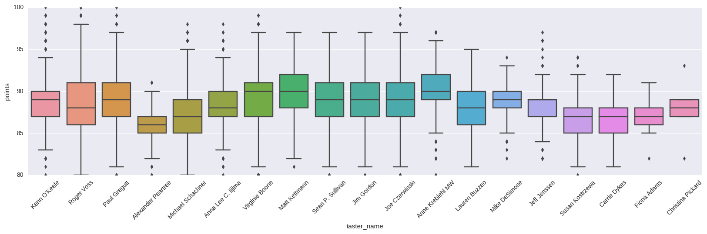
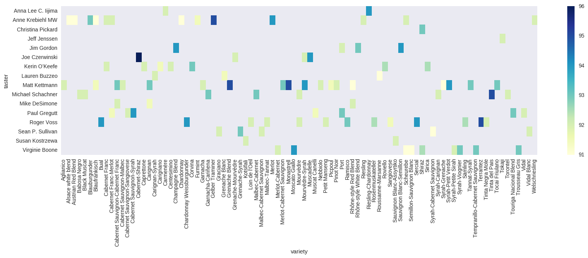

## NLP and The Art of Wine Tasting

#### In this notebook we will be exploring the Wine Reviews dataset consisting of ~130K wines from all over the globe that have been reviewed by some of the famous wine tasters. The dataset consists of some structured fields including the wine title,variety, winery, (region, province & country of produce), price, and points scored on Wine Enthusiast.  I have done some basic descriptive and EDA plots just to get a high level feel for dataset.  What really motivated me to go after this dataset is the wine reviews that appear as unstructured text. Now i can mostly figuretell the type of wine based on the taste, however I have never been able to really verbalize my feelings about the feeling of drinking a particular type of wine.  The reviews in this dataset are very detailed talking about different aromas, palate, nose, acidity, food pairings etc and this is what attracted me the most.

#### The dataset was obtained from Kaggle (https://www.kaggle.com/zynicide/wine-reviews/data). The uploader of dataset claims to have directly scraped it from Wine Enthusiast.

#### Ok, so without further delay lets get going


```python
import pandas as pd
from bokeh.palettes import viridis

import matplotlib.pylab as plt
import pandas as pd
import seaborn as sns
import numpy as np
import re
import nltk.tag as tag

from gensim.models import Phrases
from gensim.models.word2vec import LineSentence
from gensim.corpora import Dictionary, MmCorpus
from gensim.models.ldamulticore import LdaMulticore

import pyLDAvis
import pyLDAvis.gensim
import pickle 
import os
import codecs
import spacy
from spacy.lang.en import STOP_WORDS
import pandas as pd
import itertools as it
from sklearn.manifold import TSNE
```


```python
from nltk.corpus import stopwords
stop_words = stopwords.words('english')
import nltk
from nltk.tokenize import WordPunctTokenizer
import os
import string
translator = str.maketrans('', '', string.punctuation)
import nltk.tag as tag
from nltk.stem import WordNetLemmatizer
lemmatizer = WordNetLemmatizer
from nltk.tokenize import sent_tokenize, word_tokenize
from gensim.models import word2vec
```


```python
%matplotlib inline 
```


```python
# Download and unpack the file from https://www.kaggle.com/zynicide/wine-reviews/data
df = pd.read_csv('/data2/text_datasets/winedata.csv', index_col=0)
```


```python
df['year'] = df['title'].str.extract('(\d+)')
```

    /anaconda/envs/py35/lib/python3.5/site-packages/ipykernel/__main__.py:1: FutureWarning: currently extract(expand=None) means expand=False (return Index/Series/DataFrame) but in a future version of pandas this will be changed to expand=True (return DataFrame)
      if __name__ == '__main__':


### Check for missingness


```python
df.isnull().any()
```


    country                   True
    description              False
    designation               True
    points                   False
    price                     True
    province                  True
    region_1                  True
    region_2                  True
    taster_name               True
    taster_twitter_handle     True
    title                    False
    variety                   True
    winery                   False
    year                      True
    dtype: bool


```python
df.head(3)
```


<div>
<table border="1" class="dataframe">
  <thead>
    <tr style="text-align: right;">
      <th></th>
      <th>country</th>
      <th>description</th>
      <th>designation</th>
      <th>points</th>
      <th>price</th>
      <th>province</th>
      <th>region_1</th>
      <th>region_2</th>
      <th>taster_name</th>
      <th>taster_twitter_handle</th>
      <th>title</th>
      <th>variety</th>
      <th>winery</th>
      <th>year</th>
    </tr>
  </thead>
  <tbody>
    <tr>
      <th>0</th>
      <td>Italy</td>
      <td>Aromas include tropical fruit, broom, brimston...</td>
      <td>Vulkà Bianco</td>
      <td>87</td>
      <td>NaN</td>
      <td>Sicily &amp; Sardinia</td>
      <td>Etna</td>
      <td>NaN</td>
      <td>Kerin O’Keefe</td>
      <td>@kerinokeefe</td>
      <td>Nicosia 2013 Vulkà Bianco  (Etna)</td>
      <td>White Blend</td>
      <td>Nicosia</td>
      <td>2013</td>
    </tr>
    <tr>
      <th>1</th>
      <td>Portugal</td>
      <td>This is ripe and fruity, a wine that is smooth...</td>
      <td>Avidagos</td>
      <td>87</td>
      <td>15.0</td>
      <td>Douro</td>
      <td>NaN</td>
      <td>NaN</td>
      <td>Roger Voss</td>
      <td>@vossroger</td>
      <td>Quinta dos Avidagos 2011 Avidagos Red (Douro)</td>
      <td>Portuguese Red</td>
      <td>Quinta dos Avidagos</td>
      <td>2011</td>
    </tr>
    <tr>
      <th>2</th>
      <td>US</td>
      <td>Tart and snappy, the flavors of lime flesh and...</td>
      <td>NaN</td>
      <td>87</td>
      <td>14.0</td>
      <td>Oregon</td>
      <td>Willamette Valley</td>
      <td>Willamette Valley</td>
      <td>Paul Gregutt</td>
      <td>@paulgwine</td>
      <td>Rainstorm 2013 Pinot Gris (Willamette Valley)</td>
      <td>Pinot Gris</td>
      <td>Rainstorm</td>
      <td>2013</td>
    </tr>
  </tbody>
</table>
</div>


```python
# Let's see the top 15 Countries and varieties
#print(df.country.value_counts()[:15])
#print('\n')
#print(df.variety.value_counts()[:15])
#print('\n')
#print(df.taster_name.value_counts()[:15])
#print('\n')
print(df.year.value_counts()[:15])
```

    2013    15733
    2012    15622
    2014    15439
    2011    12468
    2010    12084
    2015     9994
    2009     9799
    2008     7388
    2007     7014
    2006     5746
    2016     3669
    2005     3600
    2004     1768
    2000      756
    2001      690
    Name: year, dtype: int64


### Exploratory Data Analysis

*The following set of plots will have a bar plot and box plot grouped by different categories. The bar plots have counts in descending order where as no ordering has been used in Box plots. As a result, the colors between the two plots do not correspond to the same value.*
 
*Also, when plotting the box plots, in some cases I am showing a smaller subset when the counts for some category values are very low.*

 
#### Top countries whose wines got reviewed


```python
tmp = pd.DataFrame(df.country.value_counts()[:30])
tmp.columns = ['Count']
plt.figure(figsize=(20,7))
# plot barh chart with index as x values
ax = sns.barplot(tmp.index, tmp.Count)
ax.get_yaxis().set_major_formatter(plt.FuncFormatter(lambda x, loc: "{:,}".format(int(x))))
ax.set(xlabel="Country", ylabel='Count')
# add proper Dim values as x labels

for item in ax.get_xticklabels(): item.set_rotation(90)
for i, v in enumerate(tmp["Count"].iteritems()):        
    ax.text(i ,v[1], "{:,}".format(v[1]), color='m', va ='bottom', rotation=45)
plt.tight_layout()
plt.show()
```


```python
plt.subplots(figsize=(20,5))
ax = sns.boxplot(x="country", y="points", data=df.loc[(df['country'].isin(list(df.country.value_counts()[:15].index)))])
plt.xticks(rotation=45)
```


    (array([ 0,  1,  2,  3,  4,  5,  6,  7,  8,  9, 10, 11, 12, 13, 14]),
     <a list of 15 Text xticklabel objects>)


#### German & Austrian wines seem to be at the top. Austrian wines have a more balanced distribution with a median at 90 where as the French have a slight left skew and the distribution is a bit tighter.

#### South American and Spanish wines fall at the bottom of the pack. Either the Vino no good or the raters too hard ! Lets figure out  next block where we see the heat map of tasters ~ country.

#### Most reviewed wineries and boxplots on the point received


```python
tmp = pd.DataFrame(df.winery.value_counts()[:30])
tmp.columns = ['Count']
plt.figure(figsize=(20,7))
# plot barh chart with index as x values
ax = sns.barplot(tmp.index, tmp.Count)
ax.get_yaxis().set_major_formatter(plt.FuncFormatter(lambda x, loc: "{:,}".format(int(x))))
ax.set(xlabel="Winery", ylabel='Count')
# add proper Dim values as x labels

for item in ax.get_xticklabels(): item.set_rotation(90)
for i, v in enumerate(tmp["Count"].iteritems()):        
    ax.text(i ,v[1], "{:,}".format(v[1]), color='m', va ='bottom', rotation=45)
plt.tight_layout()
plt.show()
```


```python
plt.subplots(figsize=(20,5))
ax = sns.boxplot(x="winery", y="points", data=df.loc[(df['winery'].isin(list(df.winery.value_counts()[:25].index)))])
plt.xticks(rotation=60)
```


    (array([ 0,  1,  2,  3,  4,  5,  6,  7,  8,  9, 10, 11, 12, 13, 14, 15, 16,
            17, 18, 19, 20, 21, 22, 23, 24]),
     <a list of 25 Text xticklabel objects>)


#### Most represented Wine Tasters and boxplots on the point scored by them


```python
tmp = pd.DataFrame(df.taster_name.value_counts()[:30])
tmp.columns = ['Count']
plt.figure(figsize=(20,7))
# plot barh chart with index as x values
ax = sns.barplot(tmp.index, tmp.Count)
ax.get_yaxis().set_major_formatter(plt.FuncFormatter(lambda x, loc: "{:,}".format(int(x))))
ax.set(xlabel="Taster Name", ylabel='Count')
# add proper Dim values as x labels

for item in ax.get_xticklabels(): item.set_rotation(90)
for i, v in enumerate(tmp["Count"].iteritems()):        
    ax.text(i ,v[1], "{:,}".format(v[1]), color='m', va ='bottom', rotation=45)
plt.tight_layout()
plt.show()
```


```python
plt.subplots(figsize=(20,5))
ax = sns.boxplot(x="taster_name", y="points", data=df.loc[(df['taster_name'].isin(list(df.taster_name.value_counts()[:30].index)))])
plt.xticks(rotation=45)
```


    (array([ 0,  1,  2,  3,  4,  5,  6,  7,  8,  9, 10, 11, 12, 13, 14, 15, 16,
            17, 18]), <a list of 19 Text xticklabel objects>)





#### Bivariate Analysis : Country ~ Wine Variety
  
  
#### The next two plots show the representation of different wine varieties by country. We look at the count as well as the median points scored by the wine. 


```python
tmp = df.groupby(['country','variety']).size().reset_index()
tmp.columns = ['country','variety','count']
tmp = tmp.sort_values(by=['count'], ascending=False)[:100]
tmp = tmp.dropna()
result = tmp.pivot(index='country', columns='variety', values='count')
plt.subplots(figsize=(20,5))
sns.heatmap(result, cmap="YlGnBu")
```


    <matplotlib.axes._subplots.AxesSubplot at 0x7f67a840eba8>


#### A lot of Pinot Noir followed by Cabernet Sauvignon from US in the dataset. Happens to be my favorite grapes as well !
#### US, France, & Italy are the Top 3 in terms of number of unique wine variety's represented in this dataset.


```python
tmp = df.groupby(['country','variety'])[['points']].median().reset_index()
tmp.columns = ['country','variety','points']
tmp = tmp.sort_values(by=['points'], ascending=False)[:100]

tmp = tmp.dropna()
result = tmp.pivot(index='country', columns='variety', values='points')
plt.subplots(figsize=(20,5))
sns.heatmap(result, cmap="YlGnBu")
```


    <matplotlib.axes._subplots.AxesSubplot at 0x7f67a63706a0>


#### Next we look taster and country on similat heat plots


```python
tmp = df.groupby(['taster_name','country'])[['points']].median().reset_index()
tmp.columns = ['taster','country','points']
tmp = tmp.sort_values(by=['points'], ascending=False)[:100]

tmp = tmp.dropna()
result = tmp.pivot(index='taster', columns='country', values='points')
plt.subplots(figsize=(20,5))
sns.heatmap(result, cmap="YlGnBu")
```

    /anaconda/envs/py35/lib/python3.5/site-packages/seaborn/matrix.py:143: DeprecationWarning: elementwise == comparison failed; this will raise an error in the future.
      if xticklabels == []:
    /anaconda/envs/py35/lib/python3.5/site-packages/seaborn/matrix.py:151: DeprecationWarning: elementwise == comparison failed; this will raise an error in the future.
      if yticklabels == []:


    <matplotlib.axes._subplots.AxesSubplot at 0x7fb8645288d0>


#### As seen from above, Argentinian wines have only been reviewed by a single taster ( Michael Schachner ), Chilean & Spanish wines have been reviewed by 3 tasters. Austrian and German wines have been reviewed by 2 tasters.

#### Next we look at the cross-section of taster and wine variety


```python
tmp = df.groupby(['taster_name','variety'])[['points']].median().reset_index()
tmp.columns = ['taster','variety','points']
tmp = tmp.sort_values(by=['points'], ascending=False)[:100]

tmp = tmp.dropna()
result = tmp.pivot(index='taster', columns='variety', values='points')
plt.subplots(figsize=(20,5))
sns.heatmap(result, cmap="YlGnBu")
```


    <matplotlib.axes._subplots.AxesSubplot at 0x7f67a4544080>





```python
tmp = df.groupby(['taster_name','country'])[['points']].median().reset_index()
tmp.columns = ['taster','country','points']
tmp = tmp.sort_values(by=['points'], ascending=False)[:100]

tmp = tmp.dropna()
result = tmp.pivot(index='taster', columns='country', values='points')
plt.subplots(figsize=(20,5))
sns.heatmap(result, cmap="YlGnBu")
```


    <matplotlib.axes._subplots.AxesSubplot at 0x7fdc0bf1c588>


```python
tmp = df.groupby(['taster_name','country']).size().reset_index()
tmp.columns = ['taster','country','count']
tmp = tmp.sort_values(by=['count'], ascending=False)[:100]

tmp = tmp.dropna()
result = tmp.pivot(index='taster', columns='country', values='count')
plt.subplots(figsize=(20,5))
sns.heatmap(result, cmap="YlGnBu")
```


    <matplotlib.axes._subplots.AxesSubplot at 0x7f679ffa6940>


#### Roger Voss tastes quiet a lot of French wine
#### Michael Schachner is into South American and Spanish wines
#### Kerin OKeefe is rocking the Italian vino


```python
tmp = df.groupby(['taster_name','winery'])[['points']].median().reset_index()
tmp.columns = ['taster','winery','points']
tmp = tmp.sort_values(by=['points'], ascending=False)[:100]

tmp = tmp.dropna()
result = tmp.pivot(index='taster', columns='winery', values='points')
plt.subplots(figsize=(20,5))
sns.heatmap(result, cmap="YlGnBu")
```


    <matplotlib.axes._subplots.AxesSubplot at 0x7fdc0b5d4eb8>


#### Let's do a quick plot to see the relation between price of the bottle and the points awarded. The continuous line curve fit is from a 3rd order polynomial. (1st and 2nd order were underfitting) Seems to be following very closely until the last point  (score = 100 points) where it misses the mark. Ohh well...We'll leave them to some other time.


```python
plt.subplots(figsize=(20,5))
sns.regplot(x="points", y="price", data=df,order=3, truncate = True,x_estimator=np.mean)
```


    <matplotlib.axes._subplots.AxesSubplot at 0x7fb85f7d0e10>


### Fun with Text !
 
#### Switching gears and moving away from basic descriptive plots. Next we will build a word2vec model using the Wine Reviews corpus. I will be using that model to show few different things including the fun with Word Vector algebra which some of you might already be familiar with.  However, before all that fun stuff, we need to do some pre-processing that includes tokenization, stop-word removal, punctuation removal and lemmatinaztion. Basic pre-processing tasks...


```python
stopArr =  [ "a", "about", "above", "after", "again", "against", "all", "am", "an", "and", "any", "are", "as", "at", "be", "because", "been", "before", "being", "below", "between", "both", "but", "by", "could", "did", "do", "does", "doing", "down", "during", "each", "few", "for", "from", "further", "had", "has", "have", "having", "he", "he'd", "he'll", "he's", "her", "here", "here's", "hers", "herself", "him", "himself", "his", "how", "how's", "i", "i'd", "i'll", "i'm", "i've", "if", "in", "into", "is", "it", "it's", "its", "itself", "let's", "me", "more", "most", "my", "myself", "nor", "of", "on", "once", "only", "or", "other", "ought", "our", "ours", "ourselves", "out", "over", "own", "same", "she", "she'd", "she'll", "she's", "should", "so", "some", "such", "than", "that", "that's", "the", "their", "theirs", "them", "themselves", "then", "there", "there's", "these", "they", "they'd", "they'll", "they're", "they've", "this", "those", "through", "to", "too", "under", "until", "up", "very", "was", "we", "we'd", "we'll", "we're", "we've", "were", "what", "what's", "when", "when's", "where", "where's", "which", "while", "who", "who's", "whom", "why", "why's", "with", "would", "you", "you'd", "you'll", "you're", "you've", "your", "yours", "yourself", "yourselves" ]
stoplist = ' '.join(map(str, stopArr))
```

#### Function to lowercase, tokenize, remove stopwords, and lemmatize the reviews.  In this function block, I am leveraging sent_tokenize and word_tokenize from NLTK. Later in this notebook, we will do somilar tasks using spaCY


```python
def token_lemmatize(text):
    text = text.translate(translator)
    #print(text)
    review = sent_tokenize(text.lower())
    out = []
    for sent in review:
        new_sent = []
        for word in tag.pos_tag(word_tokenize(sent)):
            if word[0] not in stoplist:
                new_sent.append(lemmatizer.lemmatize(word[1], word[0].lower()))
        if len(new_sent) > 0:
            out.append(new_sent)
    return out
```


```python
df['description_token'] = df['description'].apply(token_lemmatize)
df.to_pickle('/data2/text_datasets/winedata.p')
```


```python
#Read from previously saved dataframe
#df = pd.read_pickle('/data2/text_datasets/winedata.p')
```


```python
df.head(3)
```


<div>
<table border="1" class="dataframe">
  <thead>
    <tr style="text-align: right;">
      <th></th>
      <th>country</th>
      <th>description</th>
      <th>designation</th>
      <th>points</th>
      <th>price</th>
      <th>province</th>
      <th>region_1</th>
      <th>region_2</th>
      <th>taster_name</th>
      <th>taster_twitter_handle</th>
      <th>title</th>
      <th>variety</th>
      <th>winery</th>
      <th>year</th>
      <th>description_token</th>
    </tr>
  </thead>
  <tbody>
    <tr>
      <th>0</th>
      <td>Italy</td>
      <td>Aromas include tropical fruit, broom, brimston...</td>
      <td>Vulkà Bianco</td>
      <td>87</td>
      <td>NaN</td>
      <td>Sicily &amp; Sardinia</td>
      <td>Etna</td>
      <td>NaN</td>
      <td>Kerin O’Keefe</td>
      <td>@kerinokeefe</td>
      <td>Nicosia 2013 Vulkà Bianco  (Etna)</td>
      <td>White Blend</td>
      <td>Nicosia</td>
      <td>2013</td>
      <td>[[aroma, include, tropical, fruit, broom, brim...</td>
    </tr>
    <tr>
      <th>1</th>
      <td>Portugal</td>
      <td>This is ripe and fruity, a wine that is smooth...</td>
      <td>Avidagos</td>
      <td>87</td>
      <td>15.0</td>
      <td>Douro</td>
      <td>NaN</td>
      <td>NaN</td>
      <td>Roger Voss</td>
      <td>@vossroger</td>
      <td>Quinta dos Avidagos 2011 Avidagos Red (Douro)</td>
      <td>Portuguese Red</td>
      <td>Quinta dos Avidagos</td>
      <td>2011</td>
      <td>[[ripe, fruity, wine, smooth, still, structure...</td>
    </tr>
    <tr>
      <th>2</th>
      <td>US</td>
      <td>Tart and snappy, the flavors of lime flesh and...</td>
      <td>NaN</td>
      <td>87</td>
      <td>14.0</td>
      <td>Oregon</td>
      <td>Willamette Valley</td>
      <td>Willamette Valley</td>
      <td>Paul Gregutt</td>
      <td>@paulgwine</td>
      <td>Rainstorm 2013 Pinot Gris (Willamette Valley)</td>
      <td>Pinot Gris</td>
      <td>Rainstorm</td>
      <td>2013</td>
      <td>[[tart, snappy, flavor, lime, flesh, rind, dom...</td>
    </tr>
  </tbody>
</table>
</div>


#### Now that the description column has gone through the pre-processing steps and saved as a new column called description_token, let us pack that entire column we just created into list object. I could have short circuited the creation of new column and directly created a list, but doing it for the purpose of demo.


```python
sents = []
for sent in df['description_token']:
    sents += sent
    
# saving for later use
with open('/data2/text_datasets/winedescriptiontokens.p', 'wb') as f:
    pickle.dump(sents, f)
```

#### Here we build the Word2Vec model using gensim. Its an awesome Text modeling library that you should check out if you work in this space. Here is a quick demo for getting started with Word2Vec using gensim. https://rare-technologies.com/word2vec-tutorial/

#### I am also creating a couple of helper functions that I will be using regularly in the word algebra demo section that follows next.


```python
model = word2vec.Word2Vec(sents, size=300, window=5, min_count=5)
model.save('/data2/text_models/word2vec/gensim/winedemo/model')
```


```python
#Load previously saved model
#model = word2vec.Word2Vec.load('/data2/text_models/word2vec/gensim/winedemo/model')  # you can continue training with the loaded model!
```


```python
def get_related_terms(token, topn=10):
    """
    look up the topN most similar terms to token
    and print them as a formatted list
    """

    for word, similarity in model.wv.most_similar(positive=[token], topn=topn):

        print(u'{:20} {}'.format(word, round(similarity, 3)))
```


```python
def word_algebra(add=[], subtract=[], topn=1):
    """
    combine the vectors associated with the words provided
    in add= and subtract=, look up the topn most similar
    terms to the combined vector, and print the result(s)
    """
    answers = model.wv.most_similar(positive=add, negative=subtract, topn=topn)
    
    for term, similarity in answers:
        print(term)
```

#### Length of model vocabulary


```python
len(model.wv.vocab)
```


    13051


#### Word Similarity. Here I will show 10 closest words to the word of my choice in the vector space.  I will go through names of fruits, nose/smell of wine, geographic places/locations. 

#### Fruits


```python
get_related_terms(u'cherry')
```

    blackcherry          0.649
    licorice             0.642
    blueberry            0.603
    boysenberry          0.578
    mocha                0.565
    cranberry            0.555
    clove                0.549
    currant              0.548
    mulberry             0.531
    pomegranate          0.527


```python
get_related_terms(u'apple')
```

    greenapple           0.665
    nectarine            0.638
    cantaloupe           0.598
    honeydew             0.596
    quince               0.596
    banana               0.593
    redapple             0.593
    apricot              0.592
    papaya               0.577
    melon                0.574


#### Nose


```python
get_related_terms(u'peat')
```

    nori                 0.792
    ash                  0.776
    moss                 0.774
    tapenade             0.73
    frond                0.72
    ember                0.703
    caper                0.698
    damp                 0.698
    seaweed              0.685
    dust                 0.677


```python
get_related_terms(u'earthy')
```

    earth                0.715
    woodsy               0.702
    leathery             0.656
    meaty                0.64
    gamy                 0.606
    leafy                0.59
    brambly              0.585
    mossy                0.573
    compost              0.559
    feral                0.558


#### Places


```python
get_related_terms(u'napa')
```

    alexander            0.834
    oakville             0.816
    livermore            0.723
    sonoma               0.723
    cult                 0.717
    rutherford           0.709
    anderson             0.706
    yarra                0.676
    columbia             0.671
    edna                 0.669


```python
get_related_terms(u'burgundy')
```

    portugal             0.875
    aube                 0.833
    chalonnaise          0.829
    chablis              0.828
    village              0.826
    meursault            0.825
    france               0.824
    lisbon               0.808
    cooperative          0.804
    lisboa               0.804


### W2Vec algebra fun

#### food pairings with wine


```python
word_algebra(add=[u'seafood', u'cabernet'], subtract=[u'merlot'])
```

    shellfish


#### time of day & food

    * if you add steak to night and subtract day from it, it becomes lamb
    * if you add fish to night and subtract day from it, it becomes chicken


```python
word_algebra(add=[u'steak', u'night'], subtract=[u'day'])
```

    lamb


```python
word_algebra(add=[u'fish', u'night'], subtract=[u'day'])
```

    chicken


#### wine and flavors

    * If you take acidity out from a oak barrel merlot, it tastes like a verdot :)


```python
word_algebra(add=[u'oak', u'merlot'], subtract=[u'acidic'])
```

    verdot


#### Voila !!!! Pretty daarn close and we did not have to feed any hard rules to tell which words are similar to each other. Thats the beauty of Word2Vec.  The language taught the model to understand word similarity.

#### A more formal definition from the paper "Efficient Estimation of Word Representations in Vector Space" (https://arxiv.org/abs/1301.3781) by the authors Mikolov; et al. 

*"Word2vec takes as its input a large corpus of text and produces a vector space, typically of several hundred dimensions, with each unique word in the corpus being assigned a corresponding vector in the space. Word vectors are positioned in the vector space such that words that share common contexts in the corpus are located in close proximity to one another in the space.*


#### Lastly, any demo would be incomplete without interacting with the word vector space in 2D using tSNE

### Visialize the word embeddings in vector space using tSNE

#### Perform the following steps:
 
    * Build a list of the terms, integer indices,and term counts from the model vocabulary
    * Sort by the term counts, so the most common terms appear first
    * Unzip the terms, integer indices, and counts into separate lists
    * Create a DataFrame with the vectors as data,and the terms as row labels
    * Take a subset of this to include only the Top 5000 terms. This is called as tsne_input
    * Initiate TSNE object
    * Perform the fit_transform function using the values of dataframe tsne_input. This will return tnse_vectors that is converted to dataframe
    * Create a new column called word in tsne_vectors that has the index values
    * save dataframe tsne_vectors for later use


```python
ordered_vocab = [(term, voc.index, voc.count) for term, voc in model.wv.vocab.items()]
ordered_vocab = sorted(ordered_vocab, key=lambda k: -k[2])
ordered_terms, term_indices, term_counts = zip(*ordered_vocab)
word_vectors = pd.DataFrame(model.wv.syn0[term_indices, :], index=ordered_terms)

tsne_input = word_vectors
tsne_input = tsne_input.head(5000)
tsne = TSNE()
tsne_vectors = tsne.fit_transform(tsne_input.values)

    

tsne_vectors = pd.DataFrame(tsne_vectors,
                            index=pd.Index(tsne_input.index),
                            columns=[u'x_coord', u'y_coord'])

tsne_vectors[u'word'] = tsne_vectors.index
tsne_vectors.to_pickle('/data2/text_datasets/winedata.p')
```

#### Read previously created TSNE dataframe


```python
#tsne_vectors = pd.read_pickle('/data2/text_datasets/tsne_vectors.p')
```


```python
tsne_vectors.head()
```


<div>
<table border="1" class="dataframe">
  <thead>
    <tr style="text-align: right;">
      <th></th>
      <th>x_coord</th>
      <th>y_coord</th>
      <th>word</th>
    </tr>
  </thead>
  <tbody>
    <tr>
      <th>wine</th>
      <td>-5.811999</td>
      <td>-1.312554</td>
      <td>wine</td>
    </tr>
    <tr>
      <th>flavor</th>
      <td>-3.374783</td>
      <td>-4.183389</td>
      <td>flavor</td>
    </tr>
    <tr>
      <th>fruit</th>
      <td>-3.784425</td>
      <td>-3.456304</td>
      <td>fruit</td>
    </tr>
    <tr>
      <th>aroma</th>
      <td>4.859846</td>
      <td>-1.785426</td>
      <td>aroma</td>
    </tr>
    <tr>
      <th>finish</th>
      <td>-3.284261</td>
      <td>-1.860267</td>
      <td>finish</td>
    </tr>
  </tbody>
</table>
</div>


```python
from bokeh.plotting import figure, show, output_notebook
from bokeh.models import HoverTool, ColumnDataSource, value
```


```python
output_notebook()
```


    <div class="bk-root">
        <a href="http://bokeh.pydata.org" target="_blank" class="bk-logo bk-logo-small bk-logo-notebook"></a>
        <span id="ac597d7d-af67-47da-a0af-4d874eb026a2">Loading BokehJS ...</span>
    </div>


```python
# add our DataFrame as a ColumnDataSource for Bokeh
plot_data = ColumnDataSource(tsne_vectors)

# create the plot and configure the
# title, dimensions, and tools
tsne_plot = figure(title=u't-SNE Word Embeddings',
                   plot_width = 800,
                   plot_height = 800,
                   tools= (u'pan, wheel_zoom, box_zoom,'
                           u'box_select, reset'),
                   active_scroll=u'wheel_zoom')

# add a hover tool to display words on roll-over
tsne_plot.add_tools( HoverTool(tooltips = u'@word') )

# draw the words as circles on the plot
tsne_plot.circle(u'x_coord', u'y_coord', source=plot_data,
                 color=u'blue', line_alpha=0.2, fill_alpha=0.1,
                 size=10, hover_line_color=u'black')

# configure visual elements of the plot
tsne_plot.title.text_font_size = value(u'16pt')
tsne_plot.xaxis.visible = False
tsne_plot.yaxis.visible = False
tsne_plot.grid.grid_line_color = None
tsne_plot.outline_line_color = None

# engage!
show(tsne_plot);
```


    <div class="bk-root">
        <div class="plotdiv" id="599afb54-8d83-441f-b96b-845dfe13d142"></div>
    </div>
<script type="text/javascript">
  
  (function(global) {
    function now() {
      return new Date();
    }
  
    var force = "";
  
    if (typeof (window._bokeh_onload_callbacks) === "undefined" || force !== "") {
      window._bokeh_onload_callbacks = [];
      window._bokeh_is_loading = undefined;
    }
  
  
    
    if (typeof (window._bokeh_timeout) === "undefined" || force !== "") {
      window._bokeh_timeout = Date.now() + 0;
      window._bokeh_failed_load = false;
    }
  
    var NB_LOAD_WARNING = {'data': {'text/html':
       "<div style='background-color: #fdd'>\n"+
       "<p>\n"+
       "BokehJS does not appear to have successfully loaded. If loading BokehJS from CDN, this \n"+
       "may be due to a slow or bad network connection. Possible fixes:\n"+
       "</p>\n"+
       "<ul>\n"+
       "<li>re-rerun `output_notebook()` to attempt to load from CDN again, or</li>\n"+
       "<li>use INLINE resources instead, as so:</li>\n"+
       "</ul>\n"+
       "<code>\n"+
       "from bokeh.resources import INLINE\n"+
       "output_notebook(resources=INLINE)\n"+
       "</code>\n"+
       "</div>"}};
  
    function display_loaded() {
      if (window.Bokeh !== undefined) {
        Bokeh.$("#599afb54-8d83-441f-b96b-845dfe13d142").text("BokehJS successfully loaded.");
      } else if (Date.now() < window._bokeh_timeout) {
        setTimeout(display_loaded, 100)
      }
    }
  
    function run_callbacks() {
      window._bokeh_onload_callbacks.forEach(function(callback) { callback() });
      delete window._bokeh_onload_callbacks
      console.info("Bokeh: all callbacks have finished");
    }
  
    function load_libs(js_urls, callback) {
      window._bokeh_onload_callbacks.push(callback);
      if (window._bokeh_is_loading > 0) {
        console.log("Bokeh: BokehJS is being loaded, scheduling callback at", now());
        return null;
      }
      if (js_urls == null || js_urls.length === 0) {
        run_callbacks();
        return null;
      }
      console.log("Bokeh: BokehJS not loaded, scheduling load and callback at", now());
      window._bokeh_is_loading = js_urls.length;
      for (var i = 0; i < js_urls.length; i++) {
        var url = js_urls[i];
        var s = document.createElement('script');
        s.src = url;
        s.async = false;
        s.onreadystatechange = s.onload = function() {
          window._bokeh_is_loading--;
          if (window._bokeh_is_loading === 0) {
            console.log("Bokeh: all BokehJS libraries loaded");
            run_callbacks()
          }
        };
        s.onerror = function() {
          console.warn("failed to load library " + url);
        };
        console.log("Bokeh: injecting script tag for BokehJS library: ", url);
        document.getElementsByTagName("head")[0].appendChild(s);
      }
    };var element = document.getElementById("599afb54-8d83-441f-b96b-845dfe13d142");
    if (element == null) {
      console.log("Bokeh: ERROR: autoload.js configured with elementid '599afb54-8d83-441f-b96b-845dfe13d142' but no matching script tag was found. ")
      return false;
    }
  
    var js_urls = [];
  
    var inline_js = [
      function(Bokeh) {
        Bokeh.$(function() {
            var docs_json = {"321f0c66-4226-4431-83f2-b96cd5ae4fbf":{"roots":{"references":[{"attributes":{},"id":"9313015a-bdd6-4599-a49c-332c38523b85","type":"ToolEvents"},{"attributes":{"fill_alpha":{"value":0.1},"fill_color":{"value":"#1f77b4"},"line_alpha":{"value":0.1},"line_color":{"value":"#1f77b4"},"size":{"units":"screen","value":10},"x":{"field":"x_coord"},"y":{"field":"y_coord"}},"id":"4394bb35-754d-4cd1-a170-b724725bba4f","type":"Circle"},{"attributes":{"bottom_units":"screen","fill_alpha":{"value":0.5},"fill_color":{"value":"lightgrey"},"left_units":"screen","level":"overlay","line_alpha":{"value":1.0},"line_color":{"value":"black"},"line_dash":[4,4],"line_width":{"value":2},"plot":null,"render_mode":"css","right_units":"screen","top_units":"screen"},"id":"b9a3e90b-cc82-4f53-b15c-e7f9c2ac8e0c","type":"BoxAnnotation"},{"attributes":{"plot":null,"text":"t-SNE Word Embeddings","text_font_size":{"value":"16pt"}},"id":"c6d1a561-429e-449c-9a33-983344e8a8e2","type":"Title"},{"attributes":{"callback":null,"column_names":["index","word","x_coord","y_coord"],"data":{"index":["wine","flavor","fruit","aroma","finish","palate","acidity","tannin","cherry","drink","ripe","black","note","spice","red","berry","rich","fresh","nose","oak","plum","dry","now","show","blackberry","apple","blend","soft","offer","crisp","texture","white","sweet","light","citrus","dark","hint","bright","raspberry","herb","cabernet","vanilla","well","full","touch","pepper","juicy","year","good","fruity","peach","firm","green","give","lemon","pear","character","feel","chocolate","will","not","dried","balanced","currant","structure","sauvignon","open","vineyard","spicy","pinot","smooth","come","made","mineral","concentrated","tannic","also","just","herbal","tart","balance","like","wood","lead","licorice","fine","bit","long","still","make","mouth","merlot","age","orange","taste","creamy","clean","there","toast","grape","alongside","dense","lime","style","along","leather","fullbodied","syrah","aging","flower","savory","structured","delicious","earthy","tobacco","tight","slightly","great","elegant","ready","one","chardonnay","yet","mouthfeel","complex","strawberry","vintage","richness","cassis","new","freshness","time","lively","smoky","apricot","young","melon","color","pineapple","delivers","cola","grapefruit","coffee","yellow","clove","edge","honey","wild","big","barrel","scent","almost","little","round","attractive","simple","intense","easy","floral","solid","earth","core","refreshing","thats","best","complexity","tropical","bottling","stone","showing","need","add","cinnamon","lightly","blueberry","minerality","generous","plenty","weight","cranberry","tangy","layer","tone","alcohol","baked","almond","bitter","pretty","quite","glass","noir","body","crushed","toasty","zest","blanc","2018","whiff","lot","cedar","end","concentration","smoke","toasted","strong","meat","much","franc","perfumed","medium","silky","mocha","powerful","mix","aftertaste","bottle","oaky","mature","delicate","zesty","acid","rounded","accent","jammy","followed","bodied","violet","nice","way","rose","variety","aromatic","roasted","mediumbodied","offering","anise","enough","although","close","riesling","off","depth","subtle","high","bold","deep","vibrant","mint","lush","warm","textured","lean","dusty","pair","candied","peel","sweetness","fruitiness","2017","power","together","peppery","baking","pure","carry","right","brings","malbec","espresso","caramel","even","hard","tangerine","exotic","thick","first","jam","rather","estate","element","quality","winery","leaf","cut","aged","next","bouquet","side","heavy","lingering","seems","french","velvety","lovely","can","polished","valley","vine","layered","brisk","grenache","sour","skin","2020","forward","drinking","grilled","blossom","keep","take","chewy","100","price","varietal","giving","nicely","already","supple","petit","enjoy","intensity","prune","sangiovese","fragrant","ros\u00e9","develop","packed","verdot","elegance","expression","food","sugar","olive","sharp","around","impressive","nectarine","classic","month","tea","go","raisin","cab","sense","cellar","streak","sage","provide","10","2016","blue","two","start","2019","smell","cocoa","get","though","ripeness","overall","better","accented","pleasant","integrated","set","sip","hold","producer","soon","beautiful","finishing","straightforward","juice","produced","wet","potential","midpalate","forest","many","plump","cool","acidic","doesnt","despite","back","combine","backed","lift","mild","length","racy","without","tomato","beautifully","tightly","pie","pink","somewhat","old","mango","front","soil","ample","astringent","raw","fleshy","chunky","find","rustic","here","buttered","appellation","least","pomegranate","another","honeysuckle","mark","citrusy","lemony","interesting","plush","graphite","focused","underbrush","opulent","short","making","support","approachable","winemaker","fig","purple","boysenberry","appealing","hot","suggest","turn","viognier","framed","nut","bean","finegrained","across","meaty","nuance","heat","mushroom","beef","menthol","20","excellent","feature","honeyed","spiced","petite","grip","part","region","extra","steely","candy","offdry","boast","dominate","lack","petal","gentle","coconut","smoked","robust","zinfandel","leathery","top","fairly","nutmeg","refined","cream","really","density","blackfruit","perfect","family","play","taut","small","mourv\u00e8dre","fully","sirah","appeal","thyme","minty","rind","broad","restrained","lend","drying","background","amount","intensely","tar","salty","star","slight","butter","may","highlight","woody","given","linger","ground","rubbery","2015","seem","soften","mouthwatering","chalky","brown","charred","richly","dole","easygoing","yeasty","present","bordeaux","tasty","youll","floor","luscious","bacon","mountain","entirely","suggests","serious","golden","bracing","inviting","sandalwood","frame","modest","provides","succulent","dish","site","easydrinking","value","california","stage","throughout","pressed","fermented","typical","balsamic","backbone","sourced","intriguing","basic","thin","firmly","going","hit","banana","15","buttery","lifted","coming","blended","game","wrapped","certainly","le","toward","minerally","sauce","2022","profile","thing","display","softly","grass","bitterness","finely","austere","immediately","tough","linear","grown","result","quickly","moderate","case","30","meet","bring","marked","drinkable","residual","final","extracted","stalky","effort","mellow","cake","sparkling","subdued","five","remains","chopped","milk","dont","line","selection","cheese","example","napa","burst","unusual","lingers","screwcap","suggesting","gritty","burnt","youthful","summer","redberry","briny","butterscotch","brooding","promise","leafy","perfume","loaded","assertive","crispness","lychee","impression","dominated","ginger","natural","friendly","grippy","5","accessible","run","zin","shine","three","point","work","personality","lightbodied","flat","wave","dessert","bite","chocolaty","late","pencil","hill","several","characteristic","redfruit","spring","strongly","sparkler","help","relatively","grassy","wound","40","neutral","lasting","deliciously","freshly","overripe","asian","hearty","six","steak","component","lavender","last","emerge","enjoyable","form","always","enticing","stewed","fill","compact","pleasing","rock","sensation","warmth","might","try","especially","suggestion","extremely","focus","char","interest","tasting","mostly","planted","everyday","rubber","passion","elegantly","away","brambly","pine","center","pithy","wait","stand","herbaceous","slate","purity","level","peppercorn","release","yeast","whole","persistent","lee","tempranillo","term","bone","flavorful","likely","rhubarb","2021","hightoned","singlevineyard","pale","eucalyptus","modern","recall","lighter","pith","range","dryness","perfectly","cru","adding","ap\u00e9ritif","finesse","reveals","produce","generic","bread","citric","gorgeous","easily","include","steel","blackcurrant","50","papaya","grabby","oily","surprisingly","want","satisfying","otherwise","deeply","italy","tang","feeling","heady","lemonlime","richer","load","blackcherry","mousse","developing","nutty","gooseberry","flavored","behind","truffle","gris","jasmine","laced","something","syrup","fragrance","isnt","honeydew","resiny","bubble","sophisticated","mediterranean","mixed","slowly","leading","60","name","plus","additional","slender","expressive","opening","thanks","wellbalanced","25","southern","everything","supported","bell","champagne","hazelnut","snappy","cured","2010","bramble","improve","real","wonderful","shiraz","label","four","sugary","stony","root","fennel","moderately","flesh","medicinal","mouthfilling","drunk","influence","named","kick","however","shy","closed","compelling","standard","syrupy","leave","vivid","combination","mildly","softness","lends","true","future","meyer","wonderfully","astringency","river","drop","barbecue","benefit","stainless","riper","half","funky","kiwi","dominates","appetizing","equal","decade","far","includes","mingle","reserve","nero","known","substantial","within","caramelized","table","salt","tilled","direct","oregano","put","aromatics","penetrating","sample","sea","brightened","fat","overly","second","considerable","match","pleasure","different","orchard","2014","pasta","hay","decent","tension","shape","worth","huge","pleasantly","leaving","underlying","delicately","beyond","cigar","raisiny","vegetal","saturated","nothing","liqueur","upfront","edgy","complete","fermentation","definitely","never","including","blackskinned","fade","dill","smelling","pairing","follow","framework","2011","rest","distinctive","rare","bringing","lengthy","totally","touriga","chard","inky","early","resin","continue","fun","2012","continues","unique","nature","evident","county","70","prominent","fare","initially","densely","stylish","nuanced","stonefruit","built","version","reminiscent","80","expect","bay","contrast","dominant","added","grigio","perhaps","clone","pungent","american","meld","brunello","guava","woodaged","based","providing","life","oaked","asphalt","preserve","roussanne","reveal","2025","sticky","tongue","alluring","oregon","offset","rise","primary","due","keeping","2009","probably","notion","allow","santa","equally","pipe","heart","italian","oil","seductive","experience","12","sleek","pastry","chicken","coolclimate","2023","weighty","waxy","touched","pork","single","northern","earthiness","settle","world","block","entry","flint","waft","onto","cardamom","cr\u00e8me","addition","place","create","briary","kind","fall","traditional","lamb","see","plummy","cuv\u00e9e","balancing","scratchy","extract","past","barbera","sunny","watermelon","healthy","nacional","attractively","day","tartness","near","scorched","rosemary","fruitforward","brawny","nearly","bursting","backdrop","vein","area","grand","barolo","elderberry","appear","cellaring","ch\u00e2teau","quince","unfold","enjoyment","wide","underripe","s\u00e9millon","muscular","douro","charm","punch","onedimensional","central","iron","bordeauxstyle","choppy","maturity","aromatically","powder","washington","nebbiolo","middle","every","often","textural","brut","similar","box","chalk","coastal","juiciness","pristine","filling","pack","wellintegrated","acacia","grainy","among","zippy","base","organically","begin","superripe","exuberant","nervy","luminous","mediumweight","tiny","particularly","tense","carmen\u00e8re","air","faint","aggressive","wellmade","grace","capture","overtone","creek","la","used","sturdy","maple","mean","coast","call","saline","poised","prosecco","lithe","property","blast","production","garnacha","18","energy","fruitdriven","molasses","2007","seafood","detail","airing","heavily","massive","parcel","shot","reserved","2\u20133","pop","decant","estategrown","defined","soy","drive","immediate","sonoma","enhanced","sheer","native","roast","harmonious","done","spent","streamlined","supporting","brightness","source","potent","winemaking","longer","conveys","cooked","distinct","wrap","stem","lemongrass","become","remaining","ageworthy","dust","crust","moist","2008","simply","popcorn","beginning","beer","creaminess","gently","clear","found","regular","salad","gold","walnut","marmalade","compote","rugged","darkskinned","ride","rh\u00f4ne","initial","2013","attention","dash","lightness","custard","cutting","rioja","allspice","toffee","fan","evolved","barnyard","foodfriendly","maybe","aspect","barely","gew\u00fcrztraminer","turned","swirl","dimension","refreshingly","underneath","south","ending","look","14","organic","abundant","port","follows","accompanied","ideal","leesy","lacking","starting","love","cracker","pronounced","perlage","filled","mulberry","colored","deal","flinty","informal","say","fish","botrytis","welcome","crisply","juniper","whose","enjoyed","saucy","oakdriven","verve","sort","moment","voluptuous","spanish","tree","ever","blackplum","redolent","cloying","hour","stay","gamy","redcurrant","flashy","array","retains","heft","showcase","narrow","proportion","key","extraction","push","crunchy","completely","remain","darker","highly","crafted","impressively","couple","decadent","riserva","smoothly","salmon","integrate","4","essence","8","composed","bubbly","blending","delightful","finished","package","sure","soda","2024","davola","atop","animal","extreme","redcherry","choice","cinsault","petrol","dance","popular","bonedry","shading","swathe","instead","tasted","complement","brand","polish","allowing","abound","north","carob","pick","restraint","exhibit","difficult","splash","softer","cracked","build","youth","decanting","shaving","cooking","fleeting","framing","delivering","viscous","sign","shade","now\u20132020","imported","3","coat","evolve","impress","ruby","grapy","tad","upon","cold","hinting","fair","percentage","peachy","dinner","beeswax","home","approach","granite","reduced","iris","state","quaffable","special","house","large","loamy","ton","sipper","refreshment","90","hand","presence","rooty","owned","ager","brioche","roundness","since","spiciness","lipsmacking","characterize","quick","tarry","held","limited","classy","affordable","luxurious","punchy","apparent","sagebrush","chenin","undertone","proper","tonic","stunning","paso","unctuous","appearance","2","job","precise","bottlings","pizza","woodspice","spirit","lightweight","buy","consistent","softened","peak","oxidized","br\u00fbl\u00e9e","driven","3\u20134","field","tannat","muted","whitefruit","gravel","serve","superb","powerfully","fact","slope","steady","unoaked","chamomile","date","versatile","dilute","promising","woodland","premier","funk","mouthful","marzipan","barrelfermented","seamless","unripe","lilac","priced","charming","frothy","powdered","closegrained","wiry","nonetheless","darkfruit","35","coating","yield","exceptional","scented","beauty","burn","signal","textbook","bark","malvasia","local","pull","6","lie","noticeable","brilliant","obvious","blocky","sb","dr","velvet","longterm","main","potpourri","sprightly","layering","chilean","stemmy","walla","foot","harsh","blackened","incredibly","11","bittersweet","unwind","farmed","warmer","dull","develops","jelly","village","cantaloupe","angular","2005","ultimately","seven","strength","melted","surface","lusty","water","wont","dusting","75","foamy","curd","alicante","fudge","expensive","intrigue","terrific","super","mandarin","gr\u00fcner","2006","fascinating","carignan","anything","partner","later","road","amarone","certain","9","stiff","toastiness","terroir","eventually","85","sweetly","indian","hibiscus","persist","russian","opulence","13","chianti","sipping","phenolic","flood","score","16","spritzy","muscat","knit","generously","twist","harmony","semisweet","trace","appears","eight","clay","stewy","lick","paste","historic","towards","proving","creates","series","watery","classico","lake","sipped","combining","ethereal","hickory","surprising","marsanne","invigorating","needing","dominating","flabby","contains","revealing","subtlety","brightens","compost","spritz","styled","chilled","smaller","usual","zingy","cider","define","majority","surrounded","bartlett","lavish","climate","cooler","reflects","got","manages","muddled","course","snap","wash","absolutely","labeled","class","enormously","stick","morello","companion","outstanding","widely","bear","secondary","seemingly","drier","strike","resulting","sliced","exciting","seamlessly","yielding","smith","think","bland","roll","solidly","4\u20135","piercing","7","prickly","gripping","hallmark","entrylevel","effect","corn","burgundy","spot","dusted","higher","expansive","drawing","woven","pit","graham","meal","mind","sweeter","slightest","45","maintains","garrigue","holding","straight","chile","burger","reduction","appetizer","common","dramatic","thoroughly","incense","party","dose","hefty","mainly","available","poise","shellfish","surprise","youthfully","pickled","mediumsweet","moscato","amidst","bolstered","17","familiar","melony","tinged","persimmon","beaujolais","exceptionally","wealth","tuscan","extended","cheerful","using","highlighted","know","deliver","sizable","beet","fit","asparagus","damp","defines","clearly","remarkably","ham","alpine","generosity","prior","honest","sultry","stuff","provence","blow","prime","becomes","running","lending","size","marshmallow","successful","youre","vineyarddesignate","word","overdone","cocktail","vinho","ranch","mirabelle","hue","pea","chablis","balsam","needle","5050","precision","ahead","loam","delicacy","verde","cement","pollen","gracefully","famous","correct","previous","flush","dosage","matched","express","varietally","tuscany","honeycomb","spry","eastern","22","unusually","tremendous","weedy","longlasting","c\u00f4te","introduce","sappy","important","owner","consistency","check","lightfooted","hollow","pinch","saffron","sound","burly","cleansing","veer","reasonably","now\u20132018","broom","lactic","amid","vegetable","enormous","detailed","ridge","spectrum","success","cheesy","reward","fresher","tinge","quaffer","paired","mouthcoating","stew","san","classically","joined","older","definition","kirsch","producing","edged","kept","ageability","turning","granny","roble","sweaty","surround","oldest","mineraldriven","lover","mealy","utterly","sumptuous","distinctly","24","persistence","nettle","draw","pulpy","brine","smoothness","third","celery","room","montepulciano","harvest","expected","seeming","noirs","rosso","awkward","echo","cant","sharpness","graceful","control","bouschet","brimming","greenapple","buoyant","moreish","role","sanguine","2030","properly","cherryberry","seasoned","apart","topped","effervescence","nonvintage","gum","squeezed","campfire","now\u20132025","yes","please","raspy","rh\u00f4nestyle","whats","33","announce","cookie","fiery","tarragon","force","wax","garnet","5\u20136","vivacious","possible","reach","wildflower","creating","vermentino","obviously","energetic","acre","uncomplicated","signature","odd","readytodrink","project","hide","shell","left","remarkable","ava","boasting","sits","bottled","hail","highacid","consumed","lineup","taking","particular","rocky","bad","smokiness","released","vital","malolactic","jumpy","spearmint","carneros","growing","alcoholic","powered","abrasive","memorable","currently","feminine","buoyed","actually","hugely","tire","volume","ripened","albari\u00f1o","indigenous","salted","clarity","picture","redplum","jerky","canaiolo","seriously","bianco","sawdust","direction","deeper","kiss","spray","number","crisper","controlled","marjoram","cedary","team","overt","thread","breathing","playful","understated","change","largely","theyre","developed","now\u20132015","vibrancy","complemented","oldvine","canned","brim","sometimes","abundance","grain","slice","straw","others","gorgeously","except","alive","bubblegum","firmness","volatile","chop","deliciousness","youd","persists","brightly","spine","overpowering","tawny","now\u20132016","squeeze","flamboyant","immense","toned","disjointed","aglianico","bready","6\u20138","ash","lusciously","greater","1","crowd","combined","fizz","fast","measured","boost","florals","it\u2019s","calm","lost","losing","marlborough","iodine","subtly","confectionary","barbaresco","missing","jump","likeable","masculine","imparts","flash","average","major","contribute","oyster","vintner","zestiness","sophistication","struck","creamed","truly","overtly","origin","accompany","underscore","bargain","join","lightest","century","confected","usually","represents","blush","becoming","tempered","murky","hedonistic","fantastic","recent","exudes","cava","65","precede","itll","nail","muscle","chocolatecovered","musky","joy","preserved","bing","ice","sooner","amazing","staying","seed","risotto","share","damson","kabinett","earthier","maturing","marasca","quiet","looking","sprinkled","brush","substance","thai","wellpriced","21","bristling","sunbaked","feral","interpretation","exquisite","stuffing","delightfully","pushing","charcoal","wellstructured","lanolin","arinto","step","notable","delight","herbaceousness","55","exuberance","night","fading","tempting","scour","development","domaine","lushness","explosive","definite","biodynamic","theme","impeccable","miss","plastic","meaning","severe","breadth","soapy","anjou","explodes","weave","located","garden","else","study","dynamic","woodsy","waiting","rum","syrahs","veers","grapey","featuring","emphasis","measure","ease","allows","sniff","onethird","verdejo","bouncy","typically","rib","supportive","welcoming","float","m\u00e9lange","deft","cushioned","evolves","foundation","alvarinho","strange","driving","2004","sicily","darkly","mixture","retaining","brick","teriyaki","picnic","rim","mediumlength","similarly","poultry","oakbased","characterized","portugal","zing","reductive","tell","28","irresistible","accenting","various","overlay","counoise","type","move","ocean","soupy","softens","following","tinta","freshcut","smoothed","hang","loud","marinated","grab","current","gingerbread","crus","basil","standout","monastrell","jalape\u00f1o","country","evolution","effortlessly","displaying","bulky","market","minute","compared","19","satisfy","whisper","sausage","overwhelming","seared","meant","extend","act","primitivo","briskly","picked","challenging","blood","succulence","2026","mossy","poached","thickness","served","finest","impact","unbalanced","consistently","category","either","indeed","mediumterm","chinese","generally","extends","suit","grating","fierce","piquant","arise","diluted","unfolds","beefy","del","lower","woodaging","bar","explosion","forceful","loses","boldly","umami","scouring","horse","alentejo","breathe","quaff","pulling","fullflavored","likable","planting","nectar","pinched","created","intricate","meunier","pour","hailing","fried","lushly","striking","beneath","anywhere","tame","puckering","valpolicella","gl","dainty","steeped","glide","pointed","monterey","people","demand","comprised","willamette","impeccably","counterpoint","carignane","fancy","eye","flowery","aeration","2018\u20132028","clampy","columbia","leap","quinta","said","nervous","appreciate","baby","island","carrying","viura","23","sp\u00e4tlese","porcini","inexpensive","emphasizes","pommard","fuller","saddle","tingling","fruited","foam","mushroomy","elevated","drinkability","foxy","posse","longtime","mixing","ageable","possibly","prof","nerello","bigger","adequate","airy","evolving","dollop","now\u20132017","2018\u20132025","ability","dancing","showy","track","burgundian","canyon","occasion","vitality","worthy","breathes","ros\u00e9s","lurking","lodi","hardly","needed","latest","meringue","boosted","tradition","valuepriced","countered","vigorous","wall","dazzling","energizing","jagged","34","maintain","called","cotton","thus","consumption","quantity","speaks","welldefined","montalcino","fashion","finger","suggestive","sizzle","dough","enriched","naturally","rendering","recalling","twothirds","favor","rewarding","fullness","stop","speak","structural","cucumber","patience","powdery","flow","interplay","money","clumsy","sulfur","rendition","arent","bomb","de","western","foresty","austerity","foothill","d\u00e3o","ripely","allied","greet","reserva","firmer","tease","gravelly","handle","finding","portlike","packaged","getting","tank","tired","elaborate","backing","complicated","france","concrete","east","sit","handful","struggle","anisette","semidry","ago","somehow","savoriness","curious","immensely","loire","spread","integrity","electric","seen","deftly","head","anchored","vibrantly","seasoning","savor","latex","flair","zealand","sweettart","reedy","feed","neatly","aciddriven","sancerre","superiore","group","silk","smallproduction","break","trebbiano","district","flourish","emerging","leaner","playing","friulano","describe","mendocino","elusive","mount","boisterous","32","grow","buttercream","favorite","mask","camphor","veteran","dolcetto","abrupt","dazzle","considering","grit","lateharvest","wind","akin","etched","emerges","sprinkling","slick","entire","cofermented","bill","cough","ultraripe","unabashedly","bosc","notice","fabulous","tropicalfruit","oakaged","gradually","record","olallieberry","excessive","portuguese","liveliness","undercurrent","softening","highest","colorino","today","thickly","ripasso","soothing","mesquite","sinewy","27","drinker","transition","alexander","flagship","chaparral","pedigree","expertly","shock","indicates","distant","auslese","ranging","sexy","justripe","soave","vinegar","cling","underscored","moving","clos","cask","silkiness","limestone","neither","larger","spunky","chateau","volatility","beguiling","warming","opaque","extraordinarily","christmas","tuna","selected","mesh","exactly","liquid","reason","fold","cover","significant","tartaric","sicilian","west","glimpse","predominantly","copper","38","appropriate","sport","42","stainlesssteel","metallic","scene","95","rarely","vie","alternative","factor","multiple","territory","iconic","2020\u20132030","associated","winner","peppered","gamay","31","sugared","ciel","searing","zins","opened","prove","persistency","designate","bakingspice","zip","roughly","prickle","barbecued","bud","barbara","2003","bergamot","spain","peanut","cheval","happy","grower","forced","rutherford","grows","26","original","cellared","segue","wellcrafted","steve","vineyarddesignated","05","portion","tomatoey","37","general","problem","porty","rusty","sassafras","limit","3\u20135","toro","jolt","invite","manner","broadly","rounder","darkberry","curry","appropriately","elevation","reflect","dijon","must","condensed","stout","consumer","wholecluster","nuttiness","horsey","cooky","stellar","sierra","comfortable","partially","\u2014sh","biting","leaning","everyone","casual","spin","cashew","integration","prominently","chance","tantalizing","window","laden","inaugural","chiseled","scrub","06","sweetened","situated","instantly","crystalline","fortunately","gap","pleasurable","decanter","border","reticent","bigboned","palatecoating","vinified","scoury","condition","picking","passionfruit","zweigelt","anderson","saut\u00e9ed","corner","manseng","crusty","noble","torront\u00e9s","brother","superior","fruitier","australian","via","frankly","staunch","throw","talc","cahors","accompaniment","gaseous","indication","abv","bearing","overwhelm","lifting","principally","nearterm","roriz","reflecting","sens","blockbuster","bank","powerhouse","indicate","refreshed","genuine","finally","chewing","brighter","ribera","mass","distinguished","stretch","leftover","let","sings","kumquat","outside","verbena","sharply","enveloping","ancient","introduction","normally","matchstick","considerably","managed","inside","characterizes","presented","matures","clipped","sorbet","edna","fluid","improvement","underpinning","albeit","broaden","bluefruit","accentuates","oxidation","fatty","forth","nofuss","c\u00f4tes","marries","designed","resemble","pioneer","sun","generation","australia","weak","coarse","chemical","dasti","borderline","evokes","quenching","29","klipsun","saltiness","laid","reservelevel","shrimp","mascalese","cuisine","inherent","nine","dryfarmed","radiant","taken","rounding","list","wisp","lettuce","twice","effusive","volcanic","streaked","simultaneously","former","basically","conference","lasagna","designation","shaped","shoe","plumskin","cushion","reliable","carried","tender","convincing","buried","oakville","upright","highend","mingles","resolve","cork","specific","succeeds","contact","sizzling","judicious","36","regional","los","huckleberry","positive","helped","order","watch","pushy","viscosity","lemonade","seam","constructed","piefilling","extraordinary","blackpepper","penetrate","gala","deserves","foaming","technically","superrich","demonstrates","edition","yeastiness","import","sourcherry","cap","normal","candle","lobster","moss","recently","tapenade","9092","question","reflection","veering","treatment","mulchy","reasonable","endowed","portfolio","onion","sweettasting","rubycolored","terribly","brighten","cloudy","crab","spectacular","howell","muscadet","cult","darkness","captivating","comprise","contributes","blossomy","plentiful","treat","grounded","sagrantino","confirms","exquisitely","rosato","cooperative","greenfruit","medley","coiled","product","winter","brandied","company","sustained","warms","trying","2027","serving","david","blaufr\u00e4nkisch","lay","working","highlighting","wear","issue","fizzy","rusticity","upscale","sourdough","celebrated","northeast","certified","win","43","aragonez","charge","maria","chill","unfiltered","town","detect","decidedly","dotted","mustard","pinotage","clover","creamytextured","lavishly","pulse","tamed","freshest","surely","heaviness","corvina","maximum","incredible","trail","achieve","breeze","introduces","ordinary","blanket","breezy","mellowed","okay","cleancut","redapple","quintessential","stillyoung","potentially","emphasizing","total","lose","alert","return","overripeness","soap","international","tightness","grind","negroamaro","evidence","cidery","gravenstein","robustly","fullfruited","chestnut","counter","heavier","render","resist","mere","sur","proportioned","merest","veltliner","boushey","undeniably","view","entice","biscuit","importer","stuffed","sherry","2018\u20132030","locked","punctuated","engaging","brilliantly","dramatically","content","alone","section","rosewater","land","momentum","cluster","ripest","9193","now\u20132012","tip","pulp","able","jumbled","oxidative","tail","wisteria","now\u20132014","medicine","massively","elderflower","58","moscatel","enduring","brought","warmclimate","argentina","grillo","combo","shaved","amazingly","hiding","tends","harvested","rita","lunch","9294","smashed","barossa","revitalizing","proportionate","pulled","partly","cobbler","expand","margaux","goodness","settling","fortified","maraschino","challenge","hillside","2028","demure","goat","comfortably","atlas","bath","ribolla","nevertheless","luxuriously","showcasing","mouthpuckering","salinity","kitchen","sheen","figure","supremely","plain","require","gewurztraminer","unyielding","goto","venture","feline","hovers","heaven","unfocused","veal","48","44","pervades","hidden","strained","yakima","related","capable","saw","mediumlong","liquorous","listed","doubt","carefully","caf\u00e9","grey","drawn","ruddy","pile","sunshine","imagine","fire","altogether","monster","wonder","approaching","restaurant","enhance","egg","convey","contrasted","candidate","gialla","brief","leg","unlikely","styling","demanding","delivery","dog","taster","stream","tier","quietly","process","arugula","2018\u20132023","mexican","vast","increasingly","approachability","beaune","unlike","register","art","mile","satisfyingly","greenplum","integrating","rarity","easytodrink","bound","veggie","putting","effervescent","oddly","cost","castel\u00e3o","acceptable","preserving","sculpted","lifesaver","62","melding","expressed","hungarian","exception","puckery","enlivened","duck","rank","buck","gardenia","ch\u00e2teauneufdupape","hence","accompanies","lowalcohol","rule","save","bridge","4\u20136","2017\u20132022","52","somewhere","fringe","weightless","crianza","wintergreen","nod","clairette","dalba","none","gaining","notch","helping","39","satiny","scallion","scream","specialist","sourness","perky","surrounding","peek","amber","esteemed","biggest","berrycherry","beach","capped","minimal","applied","imprint","quaffing","friend","peppermint","bandaid","pillowy","pliable","beat","pliant","brittle","glorious","evocative","michael","aniseed","history","attack","sight","exceedingly","mace","bowl","faintest","riding","magnificent","oldfashioned","context","cumin","chilly","followup","offputting","ooze","celebration","refinement","founded","biodynamically","exuberantly","decadence","enveloped","baga","shimmer","malbecs","smack","plateau","shame","discloses","pecorino","sandy","lucia","steep","57","refreshes","plate","lemberger","sublime","longevity","came","maintaining","authentic","bullish","vietnamese","seeking","barrelaged","attribute","greenleaning","51","highoctane","walk","earns","intriguingly","menc\u00eda","da","famed","adam","exposure","trend","lacy","earl","wanting","reputation","alsace","brimstone","overoaked","clonal","orangepeel","fullthrottle","now\u20132013","profound","us","contrasting","defining","reims","pleaser","rising","begs","unexpected","happily","graciano","highelevation","quarter","statement","yellowfruit","impossible","fynbos","stride","charcuterie","overbearing","careful","steam","2017\u20132025","livermore","percent","amply","bruised","mountainous","exhibiting","embrace","harmoniously","whether","braised","belies","tropicality","superbly","coupled","fullerbodied","met","sunkissed","fern\u00e3o","heritage","compete","calling","pires","presenting","helena","essential","greenherb","care","knoll","nera","whitepeach","largest","8991","there\u2019s","46","wrong","tighter","piedmont","ynez","led","unripeness","highland","possibility","popping","talcum","hamburger","rust","feathery","pay","expands","slow","yogurt","reaching","crowdpleasing","now\u20132019","john","aperitif","etna","deceptively","infused","unfolding","ten","tingle","excess","disappointing","hardedged","fullforce","stark","gummy","sing","suited","wellrounded","anyone","chipped","sauv","willow","southwest","shining","greatest","creep","decadently","2002","dryish","thrown","fault","scale","season","splendid","williams","pioneering","nougat","lava","cinnamonspice","took","briar","cabinet","enlivening","proprietary","undeniable","2000","setting","faintly","hope","refers","sushi","austrian","clementine","accentuated","wrapping","sediment","practically","achieves","greenness","allpurpose","pool","rendered","relative","anchor","autolytic","hip","glazed","city","freshened","impenetrable","saint\u00e9milion","furry","2018\u20132024","jacket","king","soup","tend","botanical","crush","courtesy","125","baguette","mingling","pickle","meatiness","pervade","letting","went","scallop","bristle","sufficient","browned","detracts","07","wayward","suave","freshsqueezed","usa","04","fiano","applesauce","darkcolored","squarely","texturally","shadow","coolness","wellknown","castle","thrilling","sarsaparilla","minor","translucent","tertiary","benchmark","catarratto","described","immature","shower","befits","dirt","lighthearted","pruny","matured","foliage","amplified","folk","vitamin","option","sweat","ownership","gran","foursquare","consultant","official","gather","svelte","verdelho","priorat","son","dialed","trio","dimensional","aside","steal","whistle","broader","augmented","09","pacific","5\u201310","veneer","awash","forefront","autolysis","seductively","41","lipsmackingly","diamond","67","54","citrusdriven","testament","53","bruiser","converge","drily","lisboa","shaded","path","cigarbox","owns","scattered","originally","swirling","afternoon","executed","straddle","sap","winning","substantive","wildly","irresistibly","hasnt","whiteflower","tag","confectionery","marc","glycerine","champoux","dominance","ring","viogniers","simplicity","montagne","gigantic","bead","monte","nacido","grained","artificial","appley","pepperiness","littleknown","weather","gathering","greco","shown","mighty","uncommon","concord","vibe","hangtime","petaluma","leveled","bien","awesome","thirstquenching","giant","56","fantastically","bonarda","marry","taco","cooling","allowed","delivered","pruney","spare","mouthdrying","liberally","distraction","argentine","veil","daughter","metal","mar","sauvignonbased","avoids","overwhelmed","64","spiky","forestfloor","impart","hair","braced","drizzled","immaculate","accentuate","emphasize","squirt","atypical","verdicchio","chip","proven\u00e7al","sassy","tremendously","mushy","grassiness","arguably","exemplary","familyowned","reflective","face","partnership","shoot","chalkiness","split","pecan","select","uniquely","underbelly","westside","paul","stillwater","midway","ambitious","recognize","redfruited","plushness","2018\u20132026","coax","marrying","blazing","downright","overriding","soul","intermingle","voluminous","opposite","lemonzest","cross","monotone","glimmer","partial","olsen","thought","schist","richest","method","stopper","pudding","denying","abounds","granular","equivalent","now\u20132022","1\u20132","traction","distracting","bourbon","smacking","enticingly","explode","covered","european","master","haul","sunripened","pyrazines","consider","nofrills","semillon","lily","considered","intensify","undergrowth","freshpressed","primarily","legendary","sensuous","pur\u00e9e","degree","pinkgrapefruit","distance","judge","stunner","aim","spark","obscure","excels","latter","traminer","enlivens","buttressed","disappoint","pauillac","uplifting","height","cloud","swallow","accompanying","max","kalamata","colombard","threaded","tightens","potato","rosepetal","appleskin","finessed","buoy","inland","sharper","quinine","merit","2001","virtually","duero","separate","virtue","building","ponderous","resembles","mosel","5\u20137","welloaked","player","announces","continuing","enjoying","undertow","interwoven","spoton","marriage","merlotbased","flake","lemondrop","mashed","denser","gone","bounce","bacchus","oakderived","voluptuously","evoking","pushed","excellence","piece","fino","garganega","toughness","dundee","gros","nondescript","meursault","masked","melt","retain","weird","bubbling","m\u00e9doc","grounding","peat","designated","thirst","autumn","unpleasant","robert","farmyard","lip","spiked","requires","\u2014jc","individual","mellowing","admirable","andor","thorough","merlotdominated","loose","sail","brightening","orangezest","sweetandsour","blanca","paint","modestly","almostsweet","61","louis","location","housing","47","onequarter","chili","wildberry","disappointment","adorned","nib","tingly","translates","endless","bench","pinpoint","yummy","annotated","granola","essentially","decorate","fruitcake","gun","bumpy","idea","reminder","sauvignons","brawn","cleanly","frontloaded","luxury","endlessly","button","2017\u20132027","veeder","macerated","sum","northwest","german","resonant","sweetsmelling","monolithic","tuberose","eccentric","wellmanaged","n\u00e9gociant","flavorwise","nowhere","steeliness","space","oodles","cry","fullon","hull","sulfuric","honor","macabeo","ciliegiolo","hover","expressing","gew\u00fcrz","diesel","michel","mediumdry","patch","enters","lilting","justice","elevate","darkchocolate","spinetingling","heavyweight","2016\u20132020","arroyo","clunky","meanwhile","packaging","soaked","beam","jicama","penetrates","purpose","mission","wafer","determined","clacky","salinic","freesia","per","verge","catch","smoother","par","purest","endnotes","villa","coolest","cacao","anniversary","bob","wow","chocolatey","countrystyle","grill","innocuous","puglia","started","2016\u20132021","offered","juxtapose","attempt","glyceriney","sensual","pace","coated","agile","dive","memory","rosa","exotically","fivegrape","concentrate","aggressively","greek","woodgrilled","intoxicating","keen","blowsy","whatever","difference","unite","absolute","interestingly","assortment","complementing","magic","mold","pert","oakiness","freshener","ensures","cherrypie","exploration","havent","serf","cast","pleasingly","63","chock","155","trincadeira","calistoga","stock","speckled","carnation","heavyhanded","lane","salmoncolored","noticeably","wake","beetroot","geranium","upandcoming","sensibility","wente","newly","bolder","ensemble","highalcohol","40yearold","shop","49","66","clifton","franca","brandy","vino","completes","representation","wellbuilt","curiously","fruitfilled","stubbornly","pungency","conner","traditionally","abruptly","gate","bigtime","brash","masking","improves","bresaola","bakedapple","greener","resolved","macadamia","dos","transparent","silken","tanninacid","nearby","bloom","story","directly","breakfast","intended","fails","complementary","shouldnt","orangepink","farm","debut","fog","charles","sustain","78","designates","smoothtextured","falling","8890","distracts","greeting","sultana","falanghina","clench","sends","credit","attraction","rear","counterpart","08","ripen","wellripened","aube","pasty","llc","worn","satisfies","pas","overpower","stalk","palpable","shearing","brian","lusciousness","musk","crafting","shimmering","eraser","whitepepper","foil","unintegrated","african","formerly","pomelo","bed","vinous","mike","permeates","useful","midterm","burned","glint","evening","grapefruity","thins","coombsville","feather","bought","ensure","rdd","chiffon","fern","sweetseeming","marcona","sourcing","cheeseburger","entredeuxmers","energizes","pounding","unsweetened","boot","creamsicle","collection","hoisin","heightened","leyda","stagecoach","overthetop","grechetto","theyve","represented","leafiness","sherbet","provided","rondinella","crowdpleaser","temecula","pistachio","spotlight","joyful","funkiness","spoil","stronger","unobtrusive","hedgerow","summit","oakinspired","wheat","pouilly","turkey","imparting","ok","status","evenly","godello","door","dot","mineraltextured","2016\u20132022","matter","shiitake","fullfigured","perceptible","lait","permeate","hanging","ashy","creosote","craft","notably","doughy","representative","disappear","lady","derived","68","reverberates","lazy","rate","stag","heartier","relies","included","influenced","superclean","confection","string","salina","casablanca","throwing","canteloupe","knockout","younger","closing","outdoor","solo","terroirdriven","frond","lagrein","trick","inspired","george","sommelier","bountiful","sandpapery","counterbalance","saint","unfortunately","roman","pointy","sketchy","stimulating","protein","2019\u20132029","drinkmenow","laurent","outright","annual","harddriving","shrill","technique","mute","contributing","barriques","sangiovesebased","faded","sesame","embedded","exclusively","featherlight","boutique","uplifted","buoyantly","\u2014mm","6040","vertical","map","rein","confirmed","herbes","newwood","lowacid","progress","seal","lined","overlooking","perennial","honed","growth","hole","riot","frappato","gunmetal","velvettextured","unfurl","sister","fum\u00e9","altitude","wahluke","unfussy","candylike","sitting","76","jolly","diffuse","prestige","slip","dineen","threequarters","turkish","authority","59","didnt","sold","inzolia","\u201cthe","stately","furmint","prosciutto","72","upper","amador","roughness","tribute","satin","lambrusco","stacked","prevalent","picpoul","instant","norm","spicing","kissed","reprise","murmur","phase","cherimoya","confident","recommended","pippin","achievement","acidtannin","mulled","finale","nuits","reverberate","garlic","muscadelle","justpicked","now\u20132030","sonorous","penetration","calamari","smoothes","strikingly","dissipate","vividly","chief","felt","sta","till","glory","oozing","gem","nearperfect","cabernetbased","energized","subregion","gary","glossy","shake","mouthwateringly","zero","mysterious","fitting","encased","\u2014pg","necessary","destined","steadily","purplefruit","commercial","parsley","utter","schisty","fermenting","grazia","blind","comfort","2017\u20132030","openknit","judged","wooded","resulted","culinary","sodalike","york","difficulty","consume","chervil","assorted","bloody","chehalem","71","myriad","celebrates","oomph","anytime","swing","mellows","2019\u20132025","redskinned","mid","band","pricey","astonishing","ripped","balm","envelope","believe","allure","sauterne","tried","greets","broadens","mountaingrown","squash","relaxed","exact","distract","saved","clare","handsome","changed","terre","earlier","peer","shortterm","happens","cruz","watercress","proof","bbq","baker","previously","recommend","account","oldschool","extending","decently","marvelous","gaillac","underline","9395","campania","dustiness","fuel","relax","cactus","search","atlantic","bolster","suppleness","blacktea","summertime","successfully","sharpedged","rosehip","rancher","reflected","exterior","precisely","crystal","chive","hopefully","fir","30yearold","describes","merge","garnetcolored","ask","devoid","action","flight","bolgheri","flecked","midweek","poking","aussie","citrusflavored","unmistakable","spends","married","swathed","stocky","wish","palecolored","elevates","meandering","bulb","sauvage","explore","limitedproduction","card","mediumfull","pervaded","pyrazinic","entrance","insolia","poke","stirring","suitable","sprinkle","slide","lisbon","spell","briney","bundled","established","freshfaced","neighbor","severely","1999","tealike","wheaty","spicebox","spaghetti","consulting","ultraclean","buttercup","reverberating","intact","homage","umbria","telltale","lurton","sink","delineated","consists","rating","10\u201315","freshbaked","multifaceted","dewy","vaguely","grenadine","culminating","mention","145","epitome","achieved","flurry","highquality","reference","acquired","thatll","tastebud","spade","saintest\u00e8phe","stalkiness","warrant","distinguish","screw","tautness","strapping","2015\u20132020","integrates","detract","hybrid","church","advantage","cuv\u00e9es","bulgarian","flirt","razor","cellarworthy","jamminess","tocai","don","girth","whack","palatecleansing","yielded","namely","castello","joint","braucol","2015\u20132025","prepare","drum","chris","echoing","serviceable","ignore","fizzing","tread","amphora","puncheons","typicity","underlined","weighs","harder","stonetree","grosso","crispest","rigid","collines","unresolved","rolle","rolling","jim","manage","straightahead","farming","fail","j","reinforced","eastside","dappled","necessarily","drinknow","stable","sparkle","expert","midweight","alfrocheiro","malic","maderized","ripple","tacky","crystallized","pinching","contained","dura","detectable","shortage","poggio","frank","untamed","avoid","meritage","driedfruit","precedes","trailing","stunningly","maipo","highaltitude","authoritative","creamier","pencillead","subside","bag","topend","quit","sneak","silkysmooth","clingy","belongs","centered","terra","commendable","exuding","skill","fulsome","matching","underlay","harshness","discover","mt","miso","decanted","worked","greece","fringed","austria","tanned","horseradish","specimen","alto","xarello","tug","tilt","saintemilion","n\u00e9grette","melded","tint","bird","unfined","teroldego","comforting","partnered","james","morellino","gravitas","gsm","salami","rush","73","gascony","sundried","ball","silkytextured","respect","syrahbased","2023\u20132033","sticking","compromised","crushedstone","grigios","sandpaper","draped","seduces","purpleflower","regarded","reign","thrust","ravioli","begun","dig","oakinfused","bottom","mediumintense","unleashes","judiciously","lesser","expectation","hedonism","march","smidgen","josh","cordial","cherryflavored","florality","nearing","limelike","purchased","burning","drystyle","gooey","encruzado","optimal","coolvintage","pitch","carmel","singing","thicker","finetuned","peony","intertwine","plumpness","greenish","hardness","stash","taurasi","sebastopol","significantly","interspersed","unctuously","barreldriven","roero","oriental","alder","disposition","roasting","linearity","father","macaroon","milky","live","showed","celebrate","whistleclean","enter","eden","sensational","fruitflavored","arises","grated","2016\u20132026","coppery","landmark","vaz","steer","enologist","kevin","lightcolored","packing","excessively","seco","caper","carbonic","pervasive","oakier","crown","cr\u00e9mant","carricante","compensate","avas","otago","obtuse","fruitless","sandwich","\u2013","slenderness","application","autumnal","sundrenched","quibble","oldvines","loureiro","portstyle","yellowapple","increase","gamey","seek","cohesive","mendoza","fabulously","zone","overextracted","overtaken","greg","undoubtedly","ode","pomerol","knight","overwhelms","enliven","spicedriven","overcome","shocking","supply","91\u201393","thrill","hawthorn","shift","wondrous","watering","rippling","saintjulien","tune","135","nobile","weinbau","merely","easytolike","displayed","brushy","fullfeeling","earn","sulfites","sibling","escape","hunter","seasalt","wetstone","tightgrained","purist","verging","hyde","loin","lagars","bordering","compensates","margaret","approachably","stylishly","dionysus","generate","glaze","weve","proprietor","presentation","concludes","ant\u00e3o","rudimentary","raise","remainder","guarantee","kudos","nori","revel","ultra","razorsharp","vidal","boldness","juxtaposed","fowl","lock","notoriously","pierced","appleflavored","amped","eric","ebullient","2020\u20132025","who","palatepleasing","limepith","bricking","slatedriven","84","olallieberries","vanillin","revealed","speaking","enhances","park","heel","advanced","briskness","thorny","malty","mouthcleansing","shed","smoothing","cherryvanilla","lowyielding","86","pinkcolored","according","2020\u20132028","intent","vernaccia","curve","1970s","wellaged","keylime","national","sagemoor","chai","raisined","laser","vanillalaced","rack","america","smothered","fist","target","read","russet","clamp","chardonnaybased","brunch","folded","remover","mainstream","hinted","boundary","count","admirably","83","competent","floating","limezest","pouring","sell","evocation","respectable","intrusive","limejuice","ryan","mirror","jellied","elsewhere","kaffir","guess","cappuccio","excitement","backup","bang","deftness","tealeaf","neighboring","newoak","underlies","foreground","africa","repay","flank","determination","88","exaggerated","swath","woodsmoke","yountville","leanness","luis","lewis","filter","alain","tartly","nicolas","morgan","residue","pierre","variation","basis","underpinned","disgorged","oakinfluenced","composition","forested","palest","broadened","standing","now\u20132023","smother","acrid","cloaked","warmvintage","forever","richard","improving","vale","viticulture","varied","8\u201310","coveted","troia","gamble","underpinnings","upland","botrytized","sporting","1997","rouge","6\u20137","bee","tartare","inyourface","tanginess","fruitladen","spicier","bacony","doug","imposing","ultimate","mistaking","levity","freshens","amalfi","sync","material","ultrarich","mill","barest","curiosity","turmeric","edginess","preferably","liven","incorporates","invitingly","wholly","longlived","begging","dripping","meander","bush","brix","hermitage","throat","casa","abbreviated","struggling","oatmeal","man","stoniness","cusp","kiona","rockhard","entertain","fleshed","2019\u20132031","rainy","90\u201392","buoyancy","getgo","landscape","rewarded","tendency","looseknit","rocksolid","mineralladen","child","maturation","peter","summery","strawberryflavored"],"word":["wine","flavor","fruit","aroma","finish","palate","acidity","tannin","cherry","drink","ripe","black","note","spice","red","berry","rich","fresh","nose","oak","plum","dry","now","show","blackberry","apple","blend","soft","offer","crisp","texture","white","sweet","light","citrus","dark","hint","bright","raspberry","herb","cabernet","vanilla","well","full","touch","pepper","juicy","year","good","fruity","peach","firm","green","give","lemon","pear","character","feel","chocolate","will","not","dried","balanced","currant","structure","sauvignon","open","vineyard","spicy","pinot","smooth","come","made","mineral","concentrated","tannic","also","just","herbal","tart","balance","like","wood","lead","licorice","fine","bit","long","still","make","mouth","merlot","age","orange","taste","creamy","clean","there","toast","grape","alongside","dense","lime","style","along","leather","fullbodied","syrah","aging","flower","savory","structured","delicious","earthy","tobacco","tight","slightly","great","elegant","ready","one","chardonnay","yet","mouthfeel","complex","strawberry","vintage","richness","cassis","new","freshness","time","lively","smoky","apricot","young","melon","color","pineapple","delivers","cola","grapefruit","coffee","yellow","clove","edge","honey","wild","big","barrel","scent","almost","little","round","attractive","simple","intense","easy","floral","solid","earth","core","refreshing","thats","best","complexity","tropical","bottling","stone","showing","need","add","cinnamon","lightly","blueberry","minerality","generous","plenty","weight","cranberry","tangy","layer","tone","alcohol","baked","almond","bitter","pretty","quite","glass","noir","body","crushed","toasty","zest","blanc","2018","whiff","lot","cedar","end","concentration","smoke","toasted","strong","meat","much","franc","perfumed","medium","silky","mocha","powerful","mix","aftertaste","bottle","oaky","mature","delicate","zesty","acid","rounded","accent","jammy","followed","bodied","violet","nice","way","rose","variety","aromatic","roasted","mediumbodied","offering","anise","enough","although","close","riesling","off","depth","subtle","high","bold","deep","vibrant","mint","lush","warm","textured","lean","dusty","pair","candied","peel","sweetness","fruitiness","2017","power","together","peppery","baking","pure","carry","right","brings","malbec","espresso","caramel","even","hard","tangerine","exotic","thick","first","jam","rather","estate","element","quality","winery","leaf","cut","aged","next","bouquet","side","heavy","lingering","seems","french","velvety","lovely","can","polished","valley","vine","layered","brisk","grenache","sour","skin","2020","forward","drinking","grilled","blossom","keep","take","chewy","100","price","varietal","giving","nicely","already","supple","petit","enjoy","intensity","prune","sangiovese","fragrant","ros\u00e9","develop","packed","verdot","elegance","expression","food","sugar","olive","sharp","around","impressive","nectarine","classic","month","tea","go","raisin","cab","sense","cellar","streak","sage","provide","10","2016","blue","two","start","2019","smell","cocoa","get","though","ripeness","overall","better","accented","pleasant","integrated","set","sip","hold","producer","soon","beautiful","finishing","straightforward","juice","produced","wet","potential","midpalate","forest","many","plump","cool","acidic","doesnt","despite","back","combine","backed","lift","mild","length","racy","without","tomato","beautifully","tightly","pie","pink","somewhat","old","mango","front","soil","ample","astringent","raw","fleshy","chunky","find","rustic","here","buttered","appellation","least","pomegranate","another","honeysuckle","mark","citrusy","lemony","interesting","plush","graphite","focused","underbrush","opulent","short","making","support","approachable","winemaker","fig","purple","boysenberry","appealing","hot","suggest","turn","viognier","framed","nut","bean","finegrained","across","meaty","nuance","heat","mushroom","beef","menthol","20","excellent","feature","honeyed","spiced","petite","grip","part","region","extra","steely","candy","offdry","boast","dominate","lack","petal","gentle","coconut","smoked","robust","zinfandel","leathery","top","fairly","nutmeg","refined","cream","really","density","blackfruit","perfect","family","play","taut","small","mourv\u00e8dre","fully","sirah","appeal","thyme","minty","rind","broad","restrained","lend","drying","background","amount","intensely","tar","salty","star","slight","butter","may","highlight","woody","given","linger","ground","rubbery","2015","seem","soften","mouthwatering","chalky","brown","charred","richly","dole","easygoing","yeasty","present","bordeaux","tasty","youll","floor","luscious","bacon","mountain","entirely","suggests","serious","golden","bracing","inviting","sandalwood","frame","modest","provides","succulent","dish","site","easydrinking","value","california","stage","throughout","pressed","fermented","typical","balsamic","backbone","sourced","intriguing","basic","thin","firmly","going","hit","banana","15","buttery","lifted","coming","blended","game","wrapped","certainly","le","toward","minerally","sauce","2022","profile","thing","display","softly","grass","bitterness","finely","austere","immediately","tough","linear","grown","result","quickly","moderate","case","30","meet","bring","marked","drinkable","residual","final","extracted","stalky","effort","mellow","cake","sparkling","subdued","five","remains","chopped","milk","dont","line","selection","cheese","example","napa","burst","unusual","lingers","screwcap","suggesting","gritty","burnt","youthful","summer","redberry","briny","butterscotch","brooding","promise","leafy","perfume","loaded","assertive","crispness","lychee","impression","dominated","ginger","natural","friendly","grippy","5","accessible","run","zin","shine","three","point","work","personality","lightbodied","flat","wave","dessert","bite","chocolaty","late","pencil","hill","several","characteristic","redfruit","spring","strongly","sparkler","help","relatively","grassy","wound","40","neutral","lasting","deliciously","freshly","overripe","asian","hearty","six","steak","component","lavender","last","emerge","enjoyable","form","always","enticing","stewed","fill","compact","pleasing","rock","sensation","warmth","might","try","especially","suggestion","extremely","focus","char","interest","tasting","mostly","planted","everyday","rubber","passion","elegantly","away","brambly","pine","center","pithy","wait","stand","herbaceous","slate","purity","level","peppercorn","release","yeast","whole","persistent","lee","tempranillo","term","bone","flavorful","likely","rhubarb","2021","hightoned","singlevineyard","pale","eucalyptus","modern","recall","lighter","pith","range","dryness","perfectly","cru","adding","ap\u00e9ritif","finesse","reveals","produce","generic","bread","citric","gorgeous","easily","include","steel","blackcurrant","50","papaya","grabby","oily","surprisingly","want","satisfying","otherwise","deeply","italy","tang","feeling","heady","lemonlime","richer","load","blackcherry","mousse","developing","nutty","gooseberry","flavored","behind","truffle","gris","jasmine","laced","something","syrup","fragrance","isnt","honeydew","resiny","bubble","sophisticated","mediterranean","mixed","slowly","leading","60","name","plus","additional","slender","expressive","opening","thanks","wellbalanced","25","southern","everything","supported","bell","champagne","hazelnut","snappy","cured","2010","bramble","improve","real","wonderful","shiraz","label","four","sugary","stony","root","fennel","moderately","flesh","medicinal","mouthfilling","drunk","influence","named","kick","however","shy","closed","compelling","standard","syrupy","leave","vivid","combination","mildly","softness","lends","true","future","meyer","wonderfully","astringency","river","drop","barbecue","benefit","stainless","riper","half","funky","kiwi","dominates","appetizing","equal","decade","far","includes","mingle","reserve","nero","known","substantial","within","caramelized","table","salt","tilled","direct","oregano","put","aromatics","penetrating","sample","sea","brightened","fat","overly","second","considerable","match","pleasure","different","orchard","2014","pasta","hay","decent","tension","shape","worth","huge","pleasantly","leaving","underlying","delicately","beyond","cigar","raisiny","vegetal","saturated","nothing","liqueur","upfront","edgy","complete","fermentation","definitely","never","including","blackskinned","fade","dill","smelling","pairing","follow","framework","2011","rest","distinctive","rare","bringing","lengthy","totally","touriga","chard","inky","early","resin","continue","fun","2012","continues","unique","nature","evident","county","70","prominent","fare","initially","densely","stylish","nuanced","stonefruit","built","version","reminiscent","80","expect","bay","contrast","dominant","added","grigio","perhaps","clone","pungent","american","meld","brunello","guava","woodaged","based","providing","life","oaked","asphalt","preserve","roussanne","reveal","2025","sticky","tongue","alluring","oregon","offset","rise","primary","due","keeping","2009","probably","notion","allow","santa","equally","pipe","heart","italian","oil","seductive","experience","12","sleek","pastry","chicken","coolclimate","2023","weighty","waxy","touched","pork","single","northern","earthiness","settle","world","block","entry","flint","waft","onto","cardamom","cr\u00e8me","addition","place","create","briary","kind","fall","traditional","lamb","see","plummy","cuv\u00e9e","balancing","scratchy","extract","past","barbera","sunny","watermelon","healthy","nacional","attractively","day","tartness","near","scorched","rosemary","fruitforward","brawny","nearly","bursting","backdrop","vein","area","grand","barolo","elderberry","appear","cellaring","ch\u00e2teau","quince","unfold","enjoyment","wide","underripe","s\u00e9millon","muscular","douro","charm","punch","onedimensional","central","iron","bordeauxstyle","choppy","maturity","aromatically","powder","washington","nebbiolo","middle","every","often","textural","brut","similar","box","chalk","coastal","juiciness","pristine","filling","pack","wellintegrated","acacia","grainy","among","zippy","base","organically","begin","superripe","exuberant","nervy","luminous","mediumweight","tiny","particularly","tense","carmen\u00e8re","air","faint","aggressive","wellmade","grace","capture","overtone","creek","la","used","sturdy","maple","mean","coast","call","saline","poised","prosecco","lithe","property","blast","production","garnacha","18","energy","fruitdriven","molasses","2007","seafood","detail","airing","heavily","massive","parcel","shot","reserved","2\u20133","pop","decant","estategrown","defined","soy","drive","immediate","sonoma","enhanced","sheer","native","roast","harmonious","done","spent","streamlined","supporting","brightness","source","potent","winemaking","longer","conveys","cooked","distinct","wrap","stem","lemongrass","become","remaining","ageworthy","dust","crust","moist","2008","simply","popcorn","beginning","beer","creaminess","gently","clear","found","regular","salad","gold","walnut","marmalade","compote","rugged","darkskinned","ride","rh\u00f4ne","initial","2013","attention","dash","lightness","custard","cutting","rioja","allspice","toffee","fan","evolved","barnyard","foodfriendly","maybe","aspect","barely","gew\u00fcrztraminer","turned","swirl","dimension","refreshingly","underneath","south","ending","look","14","organic","abundant","port","follows","accompanied","ideal","leesy","lacking","starting","love","cracker","pronounced","perlage","filled","mulberry","colored","deal","flinty","informal","say","fish","botrytis","welcome","crisply","juniper","whose","enjoyed","saucy","oakdriven","verve","sort","moment","voluptuous","spanish","tree","ever","blackplum","redolent","cloying","hour","stay","gamy","redcurrant","flashy","array","retains","heft","showcase","narrow","proportion","key","extraction","push","crunchy","completely","remain","darker","highly","crafted","impressively","couple","decadent","riserva","smoothly","salmon","integrate","4","essence","8","composed","bubbly","blending","delightful","finished","package","sure","soda","2024","davola","atop","animal","extreme","redcherry","choice","cinsault","petrol","dance","popular","bonedry","shading","swathe","instead","tasted","complement","brand","polish","allowing","abound","north","carob","pick","restraint","exhibit","difficult","splash","softer","cracked","build","youth","decanting","shaving","cooking","fleeting","framing","delivering","viscous","sign","shade","now\u20132020","imported","3","coat","evolve","impress","ruby","grapy","tad","upon","cold","hinting","fair","percentage","peachy","dinner","beeswax","home","approach","granite","reduced","iris","state","quaffable","special","house","large","loamy","ton","sipper","refreshment","90","hand","presence","rooty","owned","ager","brioche","roundness","since","spiciness","lipsmacking","characterize","quick","tarry","held","limited","classy","affordable","luxurious","punchy","apparent","sagebrush","chenin","undertone","proper","tonic","stunning","paso","unctuous","appearance","2","job","precise","bottlings","pizza","woodspice","spirit","lightweight","buy","consistent","softened","peak","oxidized","br\u00fbl\u00e9e","driven","3\u20134","field","tannat","muted","whitefruit","gravel","serve","superb","powerfully","fact","slope","steady","unoaked","chamomile","date","versatile","dilute","promising","woodland","premier","funk","mouthful","marzipan","barrelfermented","seamless","unripe","lilac","priced","charming","frothy","powdered","closegrained","wiry","nonetheless","darkfruit","35","coating","yield","exceptional","scented","beauty","burn","signal","textbook","bark","malvasia","local","pull","6","lie","noticeable","brilliant","obvious","blocky","sb","dr","velvet","longterm","main","potpourri","sprightly","layering","chilean","stemmy","walla","foot","harsh","blackened","incredibly","11","bittersweet","unwind","farmed","warmer","dull","develops","jelly","village","cantaloupe","angular","2005","ultimately","seven","strength","melted","surface","lusty","water","wont","dusting","75","foamy","curd","alicante","fudge","expensive","intrigue","terrific","super","mandarin","gr\u00fcner","2006","fascinating","carignan","anything","partner","later","road","amarone","certain","9","stiff","toastiness","terroir","eventually","85","sweetly","indian","hibiscus","persist","russian","opulence","13","chianti","sipping","phenolic","flood","score","16","spritzy","muscat","knit","generously","twist","harmony","semisweet","trace","appears","eight","clay","stewy","lick","paste","historic","towards","proving","creates","series","watery","classico","lake","sipped","combining","ethereal","hickory","surprising","marsanne","invigorating","needing","dominating","flabby","contains","revealing","subtlety","brightens","compost","spritz","styled","chilled","smaller","usual","zingy","cider","define","majority","surrounded","bartlett","lavish","climate","cooler","reflects","got","manages","muddled","course","snap","wash","absolutely","labeled","class","enormously","stick","morello","companion","outstanding","widely","bear","secondary","seemingly","drier","strike","resulting","sliced","exciting","seamlessly","yielding","smith","think","bland","roll","solidly","4\u20135","piercing","7","prickly","gripping","hallmark","entrylevel","effect","corn","burgundy","spot","dusted","higher","expansive","drawing","woven","pit","graham","meal","mind","sweeter","slightest","45","maintains","garrigue","holding","straight","chile","burger","reduction","appetizer","common","dramatic","thoroughly","incense","party","dose","hefty","mainly","available","poise","shellfish","surprise","youthfully","pickled","mediumsweet","moscato","amidst","bolstered","17","familiar","melony","tinged","persimmon","beaujolais","exceptionally","wealth","tuscan","extended","cheerful","using","highlighted","know","deliver","sizable","beet","fit","asparagus","damp","defines","clearly","remarkably","ham","alpine","generosity","prior","honest","sultry","stuff","provence","blow","prime","becomes","running","lending","size","marshmallow","successful","youre","vineyarddesignate","word","overdone","cocktail","vinho","ranch","mirabelle","hue","pea","chablis","balsam","needle","5050","precision","ahead","loam","delicacy","verde","cement","pollen","gracefully","famous","correct","previous","flush","dosage","matched","express","varietally","tuscany","honeycomb","spry","eastern","22","unusually","tremendous","weedy","longlasting","c\u00f4te","introduce","sappy","important","owner","consistency","check","lightfooted","hollow","pinch","saffron","sound","burly","cleansing","veer","reasonably","now\u20132018","broom","lactic","amid","vegetable","enormous","detailed","ridge","spectrum","success","cheesy","reward","fresher","tinge","quaffer","paired","mouthcoating","stew","san","classically","joined","older","definition","kirsch","producing","edged","kept","ageability","turning","granny","roble","sweaty","surround","oldest","mineraldriven","lover","mealy","utterly","sumptuous","distinctly","24","persistence","nettle","draw","pulpy","brine","smoothness","third","celery","room","montepulciano","harvest","expected","seeming","noirs","rosso","awkward","echo","cant","sharpness","graceful","control","bouschet","brimming","greenapple","buoyant","moreish","role","sanguine","2030","properly","cherryberry","seasoned","apart","topped","effervescence","nonvintage","gum","squeezed","campfire","now\u20132025","yes","please","raspy","rh\u00f4nestyle","whats","33","announce","cookie","fiery","tarragon","force","wax","garnet","5\u20136","vivacious","possible","reach","wildflower","creating","vermentino","obviously","energetic","acre","uncomplicated","signature","odd","readytodrink","project","hide","shell","left","remarkable","ava","boasting","sits","bottled","hail","highacid","consumed","lineup","taking","particular","rocky","bad","smokiness","released","vital","malolactic","jumpy","spearmint","carneros","growing","alcoholic","powered","abrasive","memorable","currently","feminine","buoyed","actually","hugely","tire","volume","ripened","albari\u00f1o","indigenous","salted","clarity","picture","redplum","jerky","canaiolo","seriously","bianco","sawdust","direction","deeper","kiss","spray","number","crisper","controlled","marjoram","cedary","team","overt","thread","breathing","playful","understated","change","largely","theyre","developed","now\u20132015","vibrancy","complemented","oldvine","canned","brim","sometimes","abundance","grain","slice","straw","others","gorgeously","except","alive","bubblegum","firmness","volatile","chop","deliciousness","youd","persists","brightly","spine","overpowering","tawny","now\u20132016","squeeze","flamboyant","immense","toned","disjointed","aglianico","bready","6\u20138","ash","lusciously","greater","1","crowd","combined","fizz","fast","measured","boost","florals","it\u2019s","calm","lost","losing","marlborough","iodine","subtly","confectionary","barbaresco","missing","jump","likeable","masculine","imparts","flash","average","major","contribute","oyster","vintner","zestiness","sophistication","struck","creamed","truly","overtly","origin","accompany","underscore","bargain","join","lightest","century","confected","usually","represents","blush","becoming","tempered","murky","hedonistic","fantastic","recent","exudes","cava","65","precede","itll","nail","muscle","chocolatecovered","musky","joy","preserved","bing","ice","sooner","amazing","staying","seed","risotto","share","damson","kabinett","earthier","maturing","marasca","quiet","looking","sprinkled","brush","substance","thai","wellpriced","21","bristling","sunbaked","feral","interpretation","exquisite","stuffing","delightfully","pushing","charcoal","wellstructured","lanolin","arinto","step","notable","delight","herbaceousness","55","exuberance","night","fading","tempting","scour","development","domaine","lushness","explosive","definite","biodynamic","theme","impeccable","miss","plastic","meaning","severe","breadth","soapy","anjou","explodes","weave","located","garden","else","study","dynamic","woodsy","waiting","rum","syrahs","veers","grapey","featuring","emphasis","measure","ease","allows","sniff","onethird","verdejo","bouncy","typically","rib","supportive","welcoming","float","m\u00e9lange","deft","cushioned","evolves","foundation","alvarinho","strange","driving","2004","sicily","darkly","mixture","retaining","brick","teriyaki","picnic","rim","mediumlength","similarly","poultry","oakbased","characterized","portugal","zing","reductive","tell","28","irresistible","accenting","various","overlay","counoise","type","move","ocean","soupy","softens","following","tinta","freshcut","smoothed","hang","loud","marinated","grab","current","gingerbread","crus","basil","standout","monastrell","jalape\u00f1o","country","evolution","effortlessly","displaying","bulky","market","minute","compared","19","satisfy","whisper","sausage","overwhelming","seared","meant","extend","act","primitivo","briskly","picked","challenging","blood","succulence","2026","mossy","poached","thickness","served","finest","impact","unbalanced","consistently","category","either","indeed","mediumterm","chinese","generally","extends","suit","grating","fierce","piquant","arise","diluted","unfolds","beefy","del","lower","woodaging","bar","explosion","forceful","loses","boldly","umami","scouring","horse","alentejo","breathe","quaff","pulling","fullflavored","likable","planting","nectar","pinched","created","intricate","meunier","pour","hailing","fried","lushly","striking","beneath","anywhere","tame","puckering","valpolicella","gl","dainty","steeped","glide","pointed","monterey","people","demand","comprised","willamette","impeccably","counterpoint","carignane","fancy","eye","flowery","aeration","2018\u20132028","clampy","columbia","leap","quinta","said","nervous","appreciate","baby","island","carrying","viura","23","sp\u00e4tlese","porcini","inexpensive","emphasizes","pommard","fuller","saddle","tingling","fruited","foam","mushroomy","elevated","drinkability","foxy","posse","longtime","mixing","ageable","possibly","prof","nerello","bigger","adequate","airy","evolving","dollop","now\u20132017","2018\u20132025","ability","dancing","showy","track","burgundian","canyon","occasion","vitality","worthy","breathes","ros\u00e9s","lurking","lodi","hardly","needed","latest","meringue","boosted","tradition","valuepriced","countered","vigorous","wall","dazzling","energizing","jagged","34","maintain","called","cotton","thus","consumption","quantity","speaks","welldefined","montalcino","fashion","finger","suggestive","sizzle","dough","enriched","naturally","rendering","recalling","twothirds","favor","rewarding","fullness","stop","speak","structural","cucumber","patience","powdery","flow","interplay","money","clumsy","sulfur","rendition","arent","bomb","de","western","foresty","austerity","foothill","d\u00e3o","ripely","allied","greet","reserva","firmer","tease","gravelly","handle","finding","portlike","packaged","getting","tank","tired","elaborate","backing","complicated","france","concrete","east","sit","handful","struggle","anisette","semidry","ago","somehow","savoriness","curious","immensely","loire","spread","integrity","electric","seen","deftly","head","anchored","vibrantly","seasoning","savor","latex","flair","zealand","sweettart","reedy","feed","neatly","aciddriven","sancerre","superiore","group","silk","smallproduction","break","trebbiano","district","flourish","emerging","leaner","playing","friulano","describe","mendocino","elusive","mount","boisterous","32","grow","buttercream","favorite","mask","camphor","veteran","dolcetto","abrupt","dazzle","considering","grit","lateharvest","wind","akin","etched","emerges","sprinkling","slick","entire","cofermented","bill","cough","ultraripe","unabashedly","bosc","notice","fabulous","tropicalfruit","oakaged","gradually","record","olallieberry","excessive","portuguese","liveliness","undercurrent","softening","highest","colorino","today","thickly","ripasso","soothing","mesquite","sinewy","27","drinker","transition","alexander","flagship","chaparral","pedigree","expertly","shock","indicates","distant","auslese","ranging","sexy","justripe","soave","vinegar","cling","underscored","moving","clos","cask","silkiness","limestone","neither","larger","spunky","chateau","volatility","beguiling","warming","opaque","extraordinarily","christmas","tuna","selected","mesh","exactly","liquid","reason","fold","cover","significant","tartaric","sicilian","west","glimpse","predominantly","copper","38","appropriate","sport","42","stainlesssteel","metallic","scene","95","rarely","vie","alternative","factor","multiple","territory","iconic","2020\u20132030","associated","winner","peppered","gamay","31","sugared","ciel","searing","zins","opened","prove","persistency","designate","bakingspice","zip","roughly","prickle","barbecued","bud","barbara","2003","bergamot","spain","peanut","cheval","happy","grower","forced","rutherford","grows","26","original","cellared","segue","wellcrafted","steve","vineyarddesignated","05","portion","tomatoey","37","general","problem","porty","rusty","sassafras","limit","3\u20135","toro","jolt","invite","manner","broadly","rounder","darkberry","curry","appropriately","elevation","reflect","dijon","must","condensed","stout","consumer","wholecluster","nuttiness","horsey","cooky","stellar","sierra","comfortable","partially","\u2014sh","biting","leaning","everyone","casual","spin","cashew","integration","prominently","chance","tantalizing","window","laden","inaugural","chiseled","scrub","06","sweetened","situated","instantly","crystalline","fortunately","gap","pleasurable","decanter","border","reticent","bigboned","palatecoating","vinified","scoury","condition","picking","passionfruit","zweigelt","anderson","saut\u00e9ed","corner","manseng","crusty","noble","torront\u00e9s","brother","superior","fruitier","australian","via","frankly","staunch","throw","talc","cahors","accompaniment","gaseous","indication","abv","bearing","overwhelm","lifting","principally","nearterm","roriz","reflecting","sens","blockbuster","bank","powerhouse","indicate","refreshed","genuine","finally","chewing","brighter","ribera","mass","distinguished","stretch","leftover","let","sings","kumquat","outside","verbena","sharply","enveloping","ancient","introduction","normally","matchstick","considerably","managed","inside","characterizes","presented","matures","clipped","sorbet","edna","fluid","improvement","underpinning","albeit","broaden","bluefruit","accentuates","oxidation","fatty","forth","nofuss","c\u00f4tes","marries","designed","resemble","pioneer","sun","generation","australia","weak","coarse","chemical","dasti","borderline","evokes","quenching","29","klipsun","saltiness","laid","reservelevel","shrimp","mascalese","cuisine","inherent","nine","dryfarmed","radiant","taken","rounding","list","wisp","lettuce","twice","effusive","volcanic","streaked","simultaneously","former","basically","conference","lasagna","designation","shaped","shoe","plumskin","cushion","reliable","carried","tender","convincing","buried","oakville","upright","highend","mingles","resolve","cork","specific","succeeds","contact","sizzling","judicious","36","regional","los","huckleberry","positive","helped","order","watch","pushy","viscosity","lemonade","seam","constructed","piefilling","extraordinary","blackpepper","penetrate","gala","deserves","foaming","technically","superrich","demonstrates","edition","yeastiness","import","sourcherry","cap","normal","candle","lobster","moss","recently","tapenade","9092","question","reflection","veering","treatment","mulchy","reasonable","endowed","portfolio","onion","sweettasting","rubycolored","terribly","brighten","cloudy","crab","spectacular","howell","muscadet","cult","darkness","captivating","comprise","contributes","blossomy","plentiful","treat","grounded","sagrantino","confirms","exquisitely","rosato","cooperative","greenfruit","medley","coiled","product","winter","brandied","company","sustained","warms","trying","2027","serving","david","blaufr\u00e4nkisch","lay","working","highlighting","wear","issue","fizzy","rusticity","upscale","sourdough","celebrated","northeast","certified","win","43","aragonez","charge","maria","chill","unfiltered","town","detect","decidedly","dotted","mustard","pinotage","clover","creamytextured","lavishly","pulse","tamed","freshest","surely","heaviness","corvina","maximum","incredible","trail","achieve","breeze","introduces","ordinary","blanket","breezy","mellowed","okay","cleancut","redapple","quintessential","stillyoung","potentially","emphasizing","total","lose","alert","return","overripeness","soap","international","tightness","grind","negroamaro","evidence","cidery","gravenstein","robustly","fullfruited","chestnut","counter","heavier","render","resist","mere","sur","proportioned","merest","veltliner","boushey","undeniably","view","entice","biscuit","importer","stuffed","sherry","2018\u20132030","locked","punctuated","engaging","brilliantly","dramatically","content","alone","section","rosewater","land","momentum","cluster","ripest","9193","now\u20132012","tip","pulp","able","jumbled","oxidative","tail","wisteria","now\u20132014","medicine","massively","elderflower","58","moscatel","enduring","brought","warmclimate","argentina","grillo","combo","shaved","amazingly","hiding","tends","harvested","rita","lunch","9294","smashed","barossa","revitalizing","proportionate","pulled","partly","cobbler","expand","margaux","goodness","settling","fortified","maraschino","challenge","hillside","2028","demure","goat","comfortably","atlas","bath","ribolla","nevertheless","luxuriously","showcasing","mouthpuckering","salinity","kitchen","sheen","figure","supremely","plain","require","gewurztraminer","unyielding","goto","venture","feline","hovers","heaven","unfocused","veal","48","44","pervades","hidden","strained","yakima","related","capable","saw","mediumlong","liquorous","listed","doubt","carefully","caf\u00e9","grey","drawn","ruddy","pile","sunshine","imagine","fire","altogether","monster","wonder","approaching","restaurant","enhance","egg","convey","contrasted","candidate","gialla","brief","leg","unlikely","styling","demanding","delivery","dog","taster","stream","tier","quietly","process","arugula","2018\u20132023","mexican","vast","increasingly","approachability","beaune","unlike","register","art","mile","satisfyingly","greenplum","integrating","rarity","easytodrink","bound","veggie","putting","effervescent","oddly","cost","castel\u00e3o","acceptable","preserving","sculpted","lifesaver","62","melding","expressed","hungarian","exception","puckery","enlivened","duck","rank","buck","gardenia","ch\u00e2teauneufdupape","hence","accompanies","lowalcohol","rule","save","bridge","4\u20136","2017\u20132022","52","somewhere","fringe","weightless","crianza","wintergreen","nod","clairette","dalba","none","gaining","notch","helping","39","satiny","scallion","scream","specialist","sourness","perky","surrounding","peek","amber","esteemed","biggest","berrycherry","beach","capped","minimal","applied","imprint","quaffing","friend","peppermint","bandaid","pillowy","pliable","beat","pliant","brittle","glorious","evocative","michael","aniseed","history","attack","sight","exceedingly","mace","bowl","faintest","riding","magnificent","oldfashioned","context","cumin","chilly","followup","offputting","ooze","celebration","refinement","founded","biodynamically","exuberantly","decadence","enveloped","baga","shimmer","malbecs","smack","plateau","shame","discloses","pecorino","sandy","lucia","steep","57","refreshes","plate","lemberger","sublime","longevity","came","maintaining","authentic","bullish","vietnamese","seeking","barrelaged","attribute","greenleaning","51","highoctane","walk","earns","intriguingly","menc\u00eda","da","famed","adam","exposure","trend","lacy","earl","wanting","reputation","alsace","brimstone","overoaked","clonal","orangepeel","fullthrottle","now\u20132013","profound","us","contrasting","defining","reims","pleaser","rising","begs","unexpected","happily","graciano","highelevation","quarter","statement","yellowfruit","impossible","fynbos","stride","charcuterie","overbearing","careful","steam","2017\u20132025","livermore","percent","amply","bruised","mountainous","exhibiting","embrace","harmoniously","whether","braised","belies","tropicality","superbly","coupled","fullerbodied","met","sunkissed","fern\u00e3o","heritage","compete","calling","pires","presenting","helena","essential","greenherb","care","knoll","nera","whitepeach","largest","8991","there\u2019s","46","wrong","tighter","piedmont","ynez","led","unripeness","highland","possibility","popping","talcum","hamburger","rust","feathery","pay","expands","slow","yogurt","reaching","crowdpleasing","now\u20132019","john","aperitif","etna","deceptively","infused","unfolding","ten","tingle","excess","disappointing","hardedged","fullforce","stark","gummy","sing","suited","wellrounded","anyone","chipped","sauv","willow","southwest","shining","greatest","creep","decadently","2002","dryish","thrown","fault","scale","season","splendid","williams","pioneering","nougat","lava","cinnamonspice","took","briar","cabinet","enlivening","proprietary","undeniable","2000","setting","faintly","hope","refers","sushi","austrian","clementine","accentuated","wrapping","sediment","practically","achieves","greenness","allpurpose","pool","rendered","relative","anchor","autolytic","hip","glazed","city","freshened","impenetrable","saint\u00e9milion","furry","2018\u20132024","jacket","king","soup","tend","botanical","crush","courtesy","125","baguette","mingling","pickle","meatiness","pervade","letting","went","scallop","bristle","sufficient","browned","detracts","07","wayward","suave","freshsqueezed","usa","04","fiano","applesauce","darkcolored","squarely","texturally","shadow","coolness","wellknown","castle","thrilling","sarsaparilla","minor","translucent","tertiary","benchmark","catarratto","described","immature","shower","befits","dirt","lighthearted","pruny","matured","foliage","amplified","folk","vitamin","option","sweat","ownership","gran","foursquare","consultant","official","gather","svelte","verdelho","priorat","son","dialed","trio","dimensional","aside","steal","whistle","broader","augmented","09","pacific","5\u201310","veneer","awash","forefront","autolysis","seductively","41","lipsmackingly","diamond","67","54","citrusdriven","testament","53","bruiser","converge","drily","lisboa","shaded","path","cigarbox","owns","scattered","originally","swirling","afternoon","executed","straddle","sap","winning","substantive","wildly","irresistibly","hasnt","whiteflower","tag","confectionery","marc","glycerine","champoux","dominance","ring","viogniers","simplicity","montagne","gigantic","bead","monte","nacido","grained","artificial","appley","pepperiness","littleknown","weather","gathering","greco","shown","mighty","uncommon","concord","vibe","hangtime","petaluma","leveled","bien","awesome","thirstquenching","giant","56","fantastically","bonarda","marry","taco","cooling","allowed","delivered","pruney","spare","mouthdrying","liberally","distraction","argentine","veil","daughter","metal","mar","sauvignonbased","avoids","overwhelmed","64","spiky","forestfloor","impart","hair","braced","drizzled","immaculate","accentuate","emphasize","squirt","atypical","verdicchio","chip","proven\u00e7al","sassy","tremendously","mushy","grassiness","arguably","exemplary","familyowned","reflective","face","partnership","shoot","chalkiness","split","pecan","select","uniquely","underbelly","westside","paul","stillwater","midway","ambitious","recognize","redfruited","plushness","2018\u20132026","coax","marrying","blazing","downright","overriding","soul","intermingle","voluminous","opposite","lemonzest","cross","monotone","glimmer","partial","olsen","thought","schist","richest","method","stopper","pudding","denying","abounds","granular","equivalent","now\u20132022","1\u20132","traction","distracting","bourbon","smacking","enticingly","explode","covered","european","master","haul","sunripened","pyrazines","consider","nofrills","semillon","lily","considered","intensify","undergrowth","freshpressed","primarily","legendary","sensuous","pur\u00e9e","degree","pinkgrapefruit","distance","judge","stunner","aim","spark","obscure","excels","latter","traminer","enlivens","buttressed","disappoint","pauillac","uplifting","height","cloud","swallow","accompanying","max","kalamata","colombard","threaded","tightens","potato","rosepetal","appleskin","finessed","buoy","inland","sharper","quinine","merit","2001","virtually","duero","separate","virtue","building","ponderous","resembles","mosel","5\u20137","welloaked","player","announces","continuing","enjoying","undertow","interwoven","spoton","marriage","merlotbased","flake","lemondrop","mashed","denser","gone","bounce","bacchus","oakderived","voluptuously","evoking","pushed","excellence","piece","fino","garganega","toughness","dundee","gros","nondescript","meursault","masked","melt","retain","weird","bubbling","m\u00e9doc","grounding","peat","designated","thirst","autumn","unpleasant","robert","farmyard","lip","spiked","requires","\u2014jc","individual","mellowing","admirable","andor","thorough","merlotdominated","loose","sail","brightening","orangezest","sweetandsour","blanca","paint","modestly","almostsweet","61","louis","location","housing","47","onequarter","chili","wildberry","disappointment","adorned","nib","tingly","translates","endless","bench","pinpoint","yummy","annotated","granola","essentially","decorate","fruitcake","gun","bumpy","idea","reminder","sauvignons","brawn","cleanly","frontloaded","luxury","endlessly","button","2017\u20132027","veeder","macerated","sum","northwest","german","resonant","sweetsmelling","monolithic","tuberose","eccentric","wellmanaged","n\u00e9gociant","flavorwise","nowhere","steeliness","space","oodles","cry","fullon","hull","sulfuric","honor","macabeo","ciliegiolo","hover","expressing","gew\u00fcrz","diesel","michel","mediumdry","patch","enters","lilting","justice","elevate","darkchocolate","spinetingling","heavyweight","2016\u20132020","arroyo","clunky","meanwhile","packaging","soaked","beam","jicama","penetrates","purpose","mission","wafer","determined","clacky","salinic","freesia","per","verge","catch","smoother","par","purest","endnotes","villa","coolest","cacao","anniversary","bob","wow","chocolatey","countrystyle","grill","innocuous","puglia","started","2016\u20132021","offered","juxtapose","attempt","glyceriney","sensual","pace","coated","agile","dive","memory","rosa","exotically","fivegrape","concentrate","aggressively","greek","woodgrilled","intoxicating","keen","blowsy","whatever","difference","unite","absolute","interestingly","assortment","complementing","magic","mold","pert","oakiness","freshener","ensures","cherrypie","exploration","havent","serf","cast","pleasingly","63","chock","155","trincadeira","calistoga","stock","speckled","carnation","heavyhanded","lane","salmoncolored","noticeably","wake","beetroot","geranium","upandcoming","sensibility","wente","newly","bolder","ensemble","highalcohol","40yearold","shop","49","66","clifton","franca","brandy","vino","completes","representation","wellbuilt","curiously","fruitfilled","stubbornly","pungency","conner","traditionally","abruptly","gate","bigtime","brash","masking","improves","bresaola","bakedapple","greener","resolved","macadamia","dos","transparent","silken","tanninacid","nearby","bloom","story","directly","breakfast","intended","fails","complementary","shouldnt","orangepink","farm","debut","fog","charles","sustain","78","designates","smoothtextured","falling","8890","distracts","greeting","sultana","falanghina","clench","sends","credit","attraction","rear","counterpart","08","ripen","wellripened","aube","pasty","llc","worn","satisfies","pas","overpower","stalk","palpable","shearing","brian","lusciousness","musk","crafting","shimmering","eraser","whitepepper","foil","unintegrated","african","formerly","pomelo","bed","vinous","mike","permeates","useful","midterm","burned","glint","evening","grapefruity","thins","coombsville","feather","bought","ensure","rdd","chiffon","fern","sweetseeming","marcona","sourcing","cheeseburger","entredeuxmers","energizes","pounding","unsweetened","boot","creamsicle","collection","hoisin","heightened","leyda","stagecoach","overthetop","grechetto","theyve","represented","leafiness","sherbet","provided","rondinella","crowdpleaser","temecula","pistachio","spotlight","joyful","funkiness","spoil","stronger","unobtrusive","hedgerow","summit","oakinspired","wheat","pouilly","turkey","imparting","ok","status","evenly","godello","door","dot","mineraltextured","2016\u20132022","matter","shiitake","fullfigured","perceptible","lait","permeate","hanging","ashy","creosote","craft","notably","doughy","representative","disappear","lady","derived","68","reverberates","lazy","rate","stag","heartier","relies","included","influenced","superclean","confection","string","salina","casablanca","throwing","canteloupe","knockout","younger","closing","outdoor","solo","terroirdriven","frond","lagrein","trick","inspired","george","sommelier","bountiful","sandpapery","counterbalance","saint","unfortunately","roman","pointy","sketchy","stimulating","protein","2019\u20132029","drinkmenow","laurent","outright","annual","harddriving","shrill","technique","mute","contributing","barriques","sangiovesebased","faded","sesame","embedded","exclusively","featherlight","boutique","uplifted","buoyantly","\u2014mm","6040","vertical","map","rein","confirmed","herbes","newwood","lowacid","progress","seal","lined","overlooking","perennial","honed","growth","hole","riot","frappato","gunmetal","velvettextured","unfurl","sister","fum\u00e9","altitude","wahluke","unfussy","candylike","sitting","76","jolly","diffuse","prestige","slip","dineen","threequarters","turkish","authority","59","didnt","sold","inzolia","\u201cthe","stately","furmint","prosciutto","72","upper","amador","roughness","tribute","satin","lambrusco","stacked","prevalent","picpoul","instant","norm","spicing","kissed","reprise","murmur","phase","cherimoya","confident","recommended","pippin","achievement","acidtannin","mulled","finale","nuits","reverberate","garlic","muscadelle","justpicked","now\u20132030","sonorous","penetration","calamari","smoothes","strikingly","dissipate","vividly","chief","felt","sta","till","glory","oozing","gem","nearperfect","cabernetbased","energized","subregion","gary","glossy","shake","mouthwateringly","zero","mysterious","fitting","encased","\u2014pg","necessary","destined","steadily","purplefruit","commercial","parsley","utter","schisty","fermenting","grazia","blind","comfort","2017\u20132030","openknit","judged","wooded","resulted","culinary","sodalike","york","difficulty","consume","chervil","assorted","bloody","chehalem","71","myriad","celebrates","oomph","anytime","swing","mellows","2019\u20132025","redskinned","mid","band","pricey","astonishing","ripped","balm","envelope","believe","allure","sauterne","tried","greets","broadens","mountaingrown","squash","relaxed","exact","distract","saved","clare","handsome","changed","terre","earlier","peer","shortterm","happens","cruz","watercress","proof","bbq","baker","previously","recommend","account","oldschool","extending","decently","marvelous","gaillac","underline","9395","campania","dustiness","fuel","relax","cactus","search","atlantic","bolster","suppleness","blacktea","summertime","successfully","sharpedged","rosehip","rancher","reflected","exterior","precisely","crystal","chive","hopefully","fir","30yearold","describes","merge","garnetcolored","ask","devoid","action","flight","bolgheri","flecked","midweek","poking","aussie","citrusflavored","unmistakable","spends","married","swathed","stocky","wish","palecolored","elevates","meandering","bulb","sauvage","explore","limitedproduction","card","mediumfull","pervaded","pyrazinic","entrance","insolia","poke","stirring","suitable","sprinkle","slide","lisbon","spell","briney","bundled","established","freshfaced","neighbor","severely","1999","tealike","wheaty","spicebox","spaghetti","consulting","ultraclean","buttercup","reverberating","intact","homage","umbria","telltale","lurton","sink","delineated","consists","rating","10\u201315","freshbaked","multifaceted","dewy","vaguely","grenadine","culminating","mention","145","epitome","achieved","flurry","highquality","reference","acquired","thatll","tastebud","spade","saintest\u00e8phe","stalkiness","warrant","distinguish","screw","tautness","strapping","2015\u20132020","integrates","detract","hybrid","church","advantage","cuv\u00e9es","bulgarian","flirt","razor","cellarworthy","jamminess","tocai","don","girth","whack","palatecleansing","yielded","namely","castello","joint","braucol","2015\u20132025","prepare","drum","chris","echoing","serviceable","ignore","fizzing","tread","amphora","puncheons","typicity","underlined","weighs","harder","stonetree","grosso","crispest","rigid","collines","unresolved","rolle","rolling","jim","manage","straightahead","farming","fail","j","reinforced","eastside","dappled","necessarily","drinknow","stable","sparkle","expert","midweight","alfrocheiro","malic","maderized","ripple","tacky","crystallized","pinching","contained","dura","detectable","shortage","poggio","frank","untamed","avoid","meritage","driedfruit","precedes","trailing","stunningly","maipo","highaltitude","authoritative","creamier","pencillead","subside","bag","topend","quit","sneak","silkysmooth","clingy","belongs","centered","terra","commendable","exuding","skill","fulsome","matching","underlay","harshness","discover","mt","miso","decanted","worked","greece","fringed","austria","tanned","horseradish","specimen","alto","xarello","tug","tilt","saintemilion","n\u00e9grette","melded","tint","bird","unfined","teroldego","comforting","partnered","james","morellino","gravitas","gsm","salami","rush","73","gascony","sundried","ball","silkytextured","respect","syrahbased","2023\u20132033","sticking","compromised","crushedstone","grigios","sandpaper","draped","seduces","purpleflower","regarded","reign","thrust","ravioli","begun","dig","oakinfused","bottom","mediumintense","unleashes","judiciously","lesser","expectation","hedonism","march","smidgen","josh","cordial","cherryflavored","florality","nearing","limelike","purchased","burning","drystyle","gooey","encruzado","optimal","coolvintage","pitch","carmel","singing","thicker","finetuned","peony","intertwine","plumpness","greenish","hardness","stash","taurasi","sebastopol","significantly","interspersed","unctuously","barreldriven","roero","oriental","alder","disposition","roasting","linearity","father","macaroon","milky","live","showed","celebrate","whistleclean","enter","eden","sensational","fruitflavored","arises","grated","2016\u20132026","coppery","landmark","vaz","steer","enologist","kevin","lightcolored","packing","excessively","seco","caper","carbonic","pervasive","oakier","crown","cr\u00e9mant","carricante","compensate","avas","otago","obtuse","fruitless","sandwich","\u2013","slenderness","application","autumnal","sundrenched","quibble","oldvines","loureiro","portstyle","yellowapple","increase","gamey","seek","cohesive","mendoza","fabulously","zone","overextracted","overtaken","greg","undoubtedly","ode","pomerol","knight","overwhelms","enliven","spicedriven","overcome","shocking","supply","91\u201393","thrill","hawthorn","shift","wondrous","watering","rippling","saintjulien","tune","135","nobile","weinbau","merely","easytolike","displayed","brushy","fullfeeling","earn","sulfites","sibling","escape","hunter","seasalt","wetstone","tightgrained","purist","verging","hyde","loin","lagars","bordering","compensates","margaret","approachably","stylishly","dionysus","generate","glaze","weve","proprietor","presentation","concludes","ant\u00e3o","rudimentary","raise","remainder","guarantee","kudos","nori","revel","ultra","razorsharp","vidal","boldness","juxtaposed","fowl","lock","notoriously","pierced","appleflavored","amped","eric","ebullient","2020\u20132025","who","palatepleasing","limepith","bricking","slatedriven","84","olallieberries","vanillin","revealed","speaking","enhances","park","heel","advanced","briskness","thorny","malty","mouthcleansing","shed","smoothing","cherryvanilla","lowyielding","86","pinkcolored","according","2020\u20132028","intent","vernaccia","curve","1970s","wellaged","keylime","national","sagemoor","chai","raisined","laser","vanillalaced","rack","america","smothered","fist","target","read","russet","clamp","chardonnaybased","brunch","folded","remover","mainstream","hinted","boundary","count","admirably","83","competent","floating","limezest","pouring","sell","evocation","respectable","intrusive","limejuice","ryan","mirror","jellied","elsewhere","kaffir","guess","cappuccio","excitement","backup","bang","deftness","tealeaf","neighboring","newoak","underlies","foreground","africa","repay","flank","determination","88","exaggerated","swath","woodsmoke","yountville","leanness","luis","lewis","filter","alain","tartly","nicolas","morgan","residue","pierre","variation","basis","underpinned","disgorged","oakinfluenced","composition","forested","palest","broadened","standing","now\u20132023","smother","acrid","cloaked","warmvintage","forever","richard","improving","vale","viticulture","varied","8\u201310","coveted","troia","gamble","underpinnings","upland","botrytized","sporting","1997","rouge","6\u20137","bee","tartare","inyourface","tanginess","fruitladen","spicier","bacony","doug","imposing","ultimate","mistaking","levity","freshens","amalfi","sync","material","ultrarich","mill","barest","curiosity","turmeric","edginess","preferably","liven","incorporates","invitingly","wholly","longlived","begging","dripping","meander","bush","brix","hermitage","throat","casa","abbreviated","struggling","oatmeal","man","stoniness","cusp","kiona","rockhard","entertain","fleshed","2019\u20132031","rainy","90\u201392","buoyancy","getgo","landscape","rewarded","tendency","looseknit","rocksolid","mineralladen","child","maturation","peter","summery","strawberryflavored"],"x_coord":[-5.811999150960938,-3.3747833214468317,-3.784424581226271,4.859846492439084,-3.2842614888097716,-2.6378783684680935,1.887854452550665,4.831456601295745,0.9286052234498224,-0.6462960857646823,0.6823956137795605,1.3350778899451956,1.2771905818379572,4.480065608126971,2.026520888286346,2.0524763499397505,0.537729745341402,-1.686034152025517,1.6551674519122037,-6.106078212288508,0.5185618068925533,-2.632900571364849,-3.7950446241879603,0.0027889827443431403,1.369361722846572,2.2073339559677763,6.067776762820858,-3.1118978034912907,5.1979871388630245,-1.1823668680762869,-0.5253460967810963,1.846050976888991,-2.206151103018582,-1.1498488096041843,2.1759351070358868,-0.02993204448606103,1.9871476133241226,-2.0633866343244986,2.5009126749486383,0.6939261948918333,5.119234651946632,-0.8921448568567544,-8.632018067523601,-0.71900994395541,1.9956705786222473,0.49292624693987047,0.5238421220055803,2.235134134010879,4.245570695261563,-0.012939820714925816,2.2274542919333364,-4.520504156389743,1.627811547483564,-0.08247323504992699,2.2259109911332535,2.30909960962788,-0.136944847526507,-2.092290738683366,1.2405920550859022,-1.9679624772645992,-8.480482116584701,2.672727423053751,-1.3041594227857012,1.1916130739450495,-1.7569125844391644,4.517809274036754,-2.5595791424849463,-3.8549661293965736,4.494800887353817,3.607288836011934,-2.45811604414645,-1.5974521756483206,-2.433498639172349,1.0294497265027889,0.04777296020351987,4.725806030498363,-5.04003933297159,-0.83559807265368,-7.132330527236759,1.480777413163624,-1.4008201591155653,-0.875748801632459,0.8603393987332724,-1.2460425444037715,1.0582370007588362,-1.689056140916912,-4.633673784863637,-2.9259454162088305,-1.8977940636016484,-2.436221367521598,-1.920422725493736,3.8190271858421743,0.4885245028908171,2.1665990064046534,-9.41505684494884,-0.9383419356047076,-2.751512244257135,-1.0389729484816044,-0.7455597406487321,-4.551799395845229,-3.6358567805476376,0.2793926619218317,2.1475638587330597,-1.4748955048265453,-3.8789015308907078,2.417820944390351,-11.119799990376528,5.386781578267161,0.5564320060728682,3.8075002842152035,-1.3289179959414228,-0.27446763342928315,1.536869900608578,3.130771756926218,0.9671048626427526,0.841955489384523,-4.642903081906139,-1.766649419110524,-7.880446351990824,1.5776500454265119,-3.5025185202708413,-10.961991380225594,-2.2855844029082846,-1.9555076992872606,-2.0533887538204727,2.5907683937362815,0.06826898591026148,-3.1330215989258186,1.0002338717925454,-10.887244279631403,-2.190550916135214,1.6237923342551435,-1.2394964320368456,-5.401596602910607,2.519989387865001,-6.044739012325093,2.206446020393839,0.35584565111689315,2.3746532650088046,5.210085871619649,1.2813058498083727,2.0522735213875762,3.37282565744087,2.4238159005182482,0.6956032303660405,-0.3839327085136589,2.930837455652216,4.489261553927372,-11.540591808592309,-3.61350066127551,4.853014054156379,-10.925740035032028,-4.629940690080262,-2.4826324280675682,1.5610080793888867,-4.596772436316657,0.13080585890599705,0.591668347323485,3.7923078972801956,-7.494411094106904,2.825198975815227,-3.943879786912196,-2.0050966869768105,-8.716608008989281,-0.6094044717403306,-1.8868468980193769,2.313176523957794,-3.5783023196935786,3.258942230234724,-0.04024125438949669,-9.305143358698743,-0.9429884040884459,0.29560804708818444,-3.4768663549048062,0.6497090211045291,0.9226648173960861,0.6504542199902559,1.1560218416666586,-2.1572928949848325,2.5601124238237523,-1.1225119798552943,-3.5510224805527155,1.2126612904631686,3.12052286108311,4.231685344799666,-0.09775939950760532,-7.123373556814348,-5.798408976062845,-11.42642816161268,-1.0578107450951804,-1.057564778268992,-12.41913470985924,2.6938363164005046,-5.723008154626489,2.3988098481784577,-0.7437120976241645,-5.595454057450889,4.405219724841976,1.2072981108830139,0.9757956338434117,-1.8096729603359536,-2.4004283979403334,-0.1510303650299397,-0.9126212935807155,-6.754023282034008,4.292223144669682,-11.905605710688683,4.7918315993746265,4.053150421159631,-3.7542367536514574,-2.608814058844382,1.0965081597565718,0.15493756091235392,-3.435715110978058,-0.1162572798091087,1.4572858533128292,-6.652814707620686,-3.230069034405658,-1.923566772273643,-2.25438740686848,1.915176624893838,0.6388747238486112,1.1593539961937451,-6.4514099237139275,-0.4225582995628635,-12.412579485752635,3.934797303558462,4.218397877093921,-7.328286007306211,4.014994409141694,-6.110699666127363,-0.046201653760334395,-0.4941075754409619,-11.249709673119217,-2.557317674963063,0.9516989211453724,-3.7522902368620783,-1.9702867255445768,-1.5868605476449833,-1.7628988136332806,-11.628311046561587,-2.2427002828795395,-1.8436788213971707,3.4313968826604646,-10.887809549662393,-1.754972127577171,-2.37661457303166,0.4184092234201397,-2.3006985132343507,-5.087468495569377,-0.4038193073510158,-8.56299588269267,-4.743319708194327,3.8029788451862125,-0.9309303651258009,2.4068887462359836,-1.8561832693719271,-0.09546918414530377,-5.6619874418269225,-3.593289196269215,-2.2656306814822256,-6.673763351264024,-1.1975650218044458,-2.8347485168390882,-2.9689233078526396,-8.085729310238992,-0.5180895732385902,3.5447041533657693,3.3777783567383333,-0.6539731790817285,-7.1994584636684795,-7.5134354681402975,2.0637041834962435,0.2750742550080103,-6.204255940703494,-4.579832364605267,-2.3168577607825487,-4.627250388151093,-3.0128969330865325,1.0707691580757126,-4.73170266440786,-2.8324677001767835,0.39167743142362993,-3.3833382094533624,-11.257749968053005,-3.9986727879131028,-9.467992084686388,-4.549476641684452,-6.745096440751973,-2.7143483404269815,-10.734666798506424,-10.913536219941195,-2.5853147623923993,-1.7712114310283773,-3.414840210331571,-3.030389014106134,-5.070439775089484,-3.030586036556142,-3.8075484255796055,-2.428524033110477,5.679072495484096,1.5332163112343868,2.6898030964578115,-4.69134837321262,-5.922273533773142,-0.7484569342783507,2.949025981888111,3.368098208508607,-3.730034641704929,-9.092956699825457,-6.663162210752706,4.758764738793461,-2.995849803062156,-5.3611523124774605,-0.10384404147110057,-8.050754985491894,-8.535876352063042,-2.608649174442778,5.921783975884972,-0.6803938485948624,-2.466177323670211,5.164663369489368,-11.343943035335691,4.031949548355622,0.12717024512636,0.36911095638874303,-4.098620230127246,4.164897065442977,-3.92607828096061,-10.689122123111368,3.3073043351583884,2.7659313170894304,0.38193485913958947,-7.512497982750238,-4.426141665522258,-1.9765415625214982,2.1398025797273674,-6.860201597211408,2.2964812151482756,-0.16957472005590857,-4.583416437803966,5.17647480733321,5.12286238470438,-3.769205179311105,1.7367051746625424,-3.166566287478555,0.5136584346704403,-1.1868346245341421,6.26034597609102,-5.636865630423019,3.751390079356318,2.32788881508985,-2.7762812113376234,-5.372599542562828,-8.124359128007526,1.1240760402248982,-7.465610937939542,1.2356710794781836,-4.510821285134949,-7.590919319832591,-7.3720554565036664,-3.7892858910925784,-6.639123567197163,-1.230216225217937,-2.402229600623745,-1.4416583513494874,-1.9312842083614776,-3.182665017227108,-3.8442022814124797,-1.8676043656887182,-3.621361038306241,0.5868114641780091,1.9697781626744393,-3.0774202569134785,3.2399863739197086,-1.0961425640983626,-3.3703967465748006,1.1174850128366893,-0.29641376160285626,-2.504746958315062,-6.245564319434295,-7.59859326889044,-8.164920826490741,6.577249358210476,-9.477043738901306,-4.0110185634984425,-0.5098151692706194,-2.5560864779192354,-5.517796864936011,-4.025243803013446,-6.6560512873567665,-8.41413769546536,-6.763769051177274,-8.828814097852316,-4.622721634160399,-1.5936569562556409,0.4033489108774062,-4.649363337359717,-3.2775089563141013,2.303483159088983,-3.8690716519466446,2.7362017021690037,-3.945279726159661,-5.6428245454652615,-7.499992510640819,-2.451520742254301,-7.329206333514915,-7.9913112961499,-7.7481445849279424,-10.890835159949582,-0.3963643415229967,-3.2369539642717533,2.187254706969696,2.5343808336460287,2.3177285426421284,3.1804952179986925,-3.1452102157597257,-3.562521348843472,-2.326561060012677,-2.0401618857476223,-2.4223470549174713,0.09901713228175105,-2.8151599800458826,4.425393390720055,-2.8862709173278667,-8.660395646107085,-2.6845037785763735,-4.063846034619003,-9.196473951525748,-3.149165476122692,-1.2670395391815648,3.5750207092172936,0.5499034890099498,-8.826768683618948,-7.982065543633677,-2.459419938144413,-9.360405821971343,6.1662256305108745,-3.987002199385005,-0.1619078355065865,-0.4655414287799489,-4.549035596637961,-2.7309393806949678,3.363001527746479,1.0737496279158218,-6.067841813917635,0.6635878879117479,4.166556535613977,4.120219981854637,6.218131472613202,-2.131649768181158,-3.91135832312986,2.7453171466300526,4.4128447582274655,5.761330894363863,-2.4593246748745985,-6.165836093549712,-3.187464553191474,-12.473749572879829,0.7753869058835757,-1.4050772717659297,-1.4308353766075819,-3.3573915704430677,-4.236810879448366,-2.830833549377214,-0.172777465167771,-6.599359974887496,-2.0071323070517813,1.054257840455341,-10.777051087710548,5.6396227266069445,3.366185815182982,-4.711987472327533,-9.098650357354208,0.09751736495584162,-3.0956431693274133,-0.3712995634816701,-6.968827230532267,-2.4926411902582615,-5.030257776984712,2.6271835565010906,-3.011908163902929,-3.433461220333435,0.7474253104683941,4.939402937417474,5.563787755121278,-11.686613755209375,5.75604513316824,-1.2534940687934266,0.3113815381053906,-7.130258648921919,2.396567711224711,-3.4034370073512523,-4.957201709057515,-1.1747248867347817,-5.5744098671921956,-4.216844336449872,2.6234881041611637,-9.220103893222184,0.19115911528908613,-3.8532600699775674,5.39271988227255,-0.36353590284199316,-0.3987945686828101,-3.272781280885499,-3.369453163858875,-6.774682038715887,-0.1974526840162872,-2.7352048049778097,1.7594874562863927,-7.336978668692232,-5.5659516023702515,-10.691329765463731,-8.493440790758529,-2.785684491836617,-6.403264866248515,-1.1804065460022777,-0.6721758881760118,-9.246391704823909,5.219442810443604,0.5618496586542697,-0.08406618815928324,-3.1815263438435886,3.711972034277581,-8.82097253912909,-3.3535660394165694,0.4753000791566009,-2.268750152607592,1.8533872693235856,-6.095013879134509,-1.5832712045224433,-2.9680881872999545,-1.5023084506872817,3.266157832831824,-4.721048609913659,0.7968661293011627,1.2982788256304272,-4.110538303620612,-5.200979288771357,-1.373397691457407,-2.21113201382413,3.965011776044346,-4.415658109441141,0.5479073726568369,-3.2586278893384946,-3.598456036680049,-0.42054890347127033,-3.350101341216943,3.936358974347253,-11.42863638884339,-2.4567177091185375,4.147891144355477,-3.6548044219378806,-4.9340982863632386,1.9802566848756489,-6.080293422467657,-9.11278625533578,-9.548439854802572,-3.196484446735897,-2.389662562132874,2.1491764649748153,6.081843090766857,-0.18500917642733633,-3.85993433309763,-1.9438887677319492,5.829702275252242,0.46017924497264034,-4.394968037321461,-2.096312284306231,-0.8784681579518309,-9.202800336166362,-7.4958287736300875,3.859313560577543,-4.4997070449647945,-8.189866058820574,-3.6075879094302277,-3.7902858058057163,-8.30751518021944,1.7997268931785813,-7.4149842099643655,-8.94618715758513,-6.9489411499173315,-7.906756633771901,-7.531600440810034,-2.5526065391546413,-3.62092046348239,-4.481086550568485,-9.483658440665488,-4.106355408728017,-2.774459050843468,6.203812487838877,-0.26095985810518957,-0.5836390415602136,-3.8102786000295996,-9.186583089624083,5.561052540258823,-1.8495876634450579,-11.458199029995695,-7.614974611888092,-4.087457746971164,-8.960915263419135,-1.186097280068257,-10.703177328752716,-3.9662436317729144,2.331132407586347,-3.5209978793842778,2.8003053170779055,-2.725085393346319,-7.889858605168954,-4.026102234779258,-3.416616625384173,4.046994199319739,-3.465136516588225,-6.253123209114559,-3.7556526079100467,-9.180424962514577,-2.8027825539410474,2.359808804064804,-4.046011922779607,-7.518765330768553,-6.231367790721108,-6.10348727948912,2.648826818218869,0.7520353540604047,-3.8628848868800305,-0.5237270141310919,-2.529243189961607,-1.1427950429917682,-7.5904089689359875,-0.9687555381451934,-3.7079299591062194,-4.759222928913384,-1.5696151179896607,2.012375088329564,-2.512072131884145,-4.314527224032485,-0.2517600099979089,-4.389161588875468,-8.556581968672464,-6.623227172330954,6.150538951594764,-9.21894447498163,-7.506358779899478,5.638425383145898,-3.496460368799216,2.301180587062098,-3.578934256369401,-2.7508724287682096,-2.076258804618888,-2.628436440827059,-9.104811931341965,-3.4677500709437425,-10.78663163253923,-2.060704382153704,-6.294331332419507,-0.27457597622511054,0.210766665047935,-4.9040525730406666,2.3255313839825185,-7.6543438679755536,-7.603673798722532,3.791647346480349,0.7058799516225929,-10.73601270125263,-7.8265203411756294,-4.123206019285955,1.7276686077173402,-0.6842345217647418,6.163317865310534,-11.448477262227444,-2.608957909655955,1.5258268032734674,2.5778232454666825,-6.391933866608674,0.7870999607064046,-10.796120947616272,2.314577298025321,4.005187875788556,1.0213865860704228,-0.04588580277321032,-1.2136761936321923,0.17614701341115765,-9.165480349778806,-7.747516672778222,-1.058975652374352,3.9761496115874464,-0.6066212471100741,-0.6569371074955546,-2.602257380233419,-3.401122317469284,0.20121367095143564,-3.2152458464052973,1.013506791766614,-3.355968343261306,-0.8930519649456099,-2.9207508741093635,-2.9442840571313607,-8.25495236800904,-4.02008892173553,-0.8614998508888837,-1.6620880069280486,-9.494282889150465,-12.138260007406917,-4.042253430018632,2.3536825285858756,-1.7342098348533963,1.900248956458191,-8.749317296088956,-8.682329024015756,5.88645357393025,-0.32651257597981426,-0.43681038418500023,-3.7520797853443573,-0.038893019461603014,-8.015886563309051,1.7641167334233991,0.18838751339823284,-3.92038219665974,6.662695573094836,0.3110154614142342,-0.6412356441858366,3.425473289313701,-12.507523748570222,-3.253303788047611,-12.558656905410693,3.4920930095430935,6.52325244977647,-1.6153895277098822,-8.63686111767751,-2.046927461971265,2.5109822625675617,-4.413622413222206,-0.8366919056175729,-4.196221520594458,0.21940121466529047,0.20389288683367568,-2.5899002751322007,-2.493015630014146,-5.1182594495669775,2.41495760019148,-5.3998153963950575,-5.37228453876752,-7.726650781426115,-3.050746336272198,-1.0103341584601504,2.6874636472908184,-4.054290656552798,-2.7059447714050258,-3.7808383477388476,-6.110516918050545,-0.39964227897856675,-3.6111412205694924,-1.9333363223972322,-4.9238697318471,-2.892841556097437,-11.476448004806569,0.7395957005158855,6.073486596552934,2.0916862328986503,-7.351816737419629,-9.174931419340895,-4.334071929660122,-7.196270727392419,-8.575910346438715,-9.293583831273112,-9.359747173534776,-10.817331436647004,-1.502071903395822,-7.968231358497581,-2.305662020576064,1.7910459495943398,0.8417112327581745,-9.510726522177182,-2.3414304028889745,-1.7280263909635876,-4.522400615816618,-0.1353515617030392,1.5477397538229554,-4.654465787404351,-7.712212383546774,0.44339955179508295,-0.9581094770322859,3.409343704208774,-3.998692715117112,-7.185372196061694,-1.5799924922592137,4.1967328100658285,-8.149412286653684,1.9691001471782408,-7.188095636346836,-1.7005350205894276,-9.621300811626407,2.854538250018481,-5.785823880042219,-1.2174987310640473,-3.2908826793200414,6.059314177749888,-3.671533816192813,-4.250831541908577,-1.697551521226784,-2.5056132521052086,-3.1871394846226453,-9.593055408518158,-7.020741251659708,-7.67802286951546,6.115218518366447,-3.2014689535142944,-4.973315342616816,-4.342108964361624,1.684411659016892,-1.580970295406578,-0.2741011374732914,-7.501475285498517,1.0663809882474562,0.31644157411766954,-0.470364015719052,-1.2021714236603256,-2.1965268881546463,-2.1948759818945693,5.223127706751346,-3.395886578340352,2.3148572742042877,-9.250940844120553,-2.7763286506705698,0.5647975806063993,0.23102769065134846,-8.269444114421422,3.15027603943993,-7.4648288398688285,-7.855051881087764,-0.7188095800639674,-5.6454561022228,-3.2812049057520203,-3.2326113350194388,-10.768196614736869,-4.044398420264075,-4.015308664399193,-1.4248233590339783,-6.069672346420236,-6.604343509874349,-5.217776278481437,-3.722590509643493,-5.250436838455435,-7.592892379904995,-2.8250502209587616,-1.5686073880130353,-8.91907988214173,-7.447789434762098,2.2590981511381845,-2.698538445212629,-6.158857229504132,-6.965998962401428,2.198967153605306,3.9219390284023246,-7.892879340978335,-11.464534102037529,0.8734395102942616,5.550314335330971,-8.399933844360078,1.7382335303399876,-4.326916087169676,-2.784143852253085,5.3412531877409055,2.15044780019135,-7.164555709022013,5.54086962295533,-3.0334119663532957,-0.33704667255509413,-11.263422604301054,-4.920803090763469,-6.887314595673082,-4.552867683842231,-1.1677848957532273,2.765631581175655,3.6816376089793557,4.433931796331884,-8.110084205462242,0.26183298394725524,-2.690933595907092,-1.449659552580274,-3.306738829516071,-4.542623663121804,3.6945786472727162,-3.3114200774969733,-10.438169409126244,-11.742858146826219,-3.4348848592240753,-1.9055111814759265,2.9665180764365653,-1.206846721616402,-5.265238792633086,3.717568018018285,0.5657594567351752,3.9431877318282975,3.2564503285029214,-7.591123896754863,-2.7571185845568507,-9.118938896967226,-9.087695400200802,-11.714594800208143,-3.276834271171557,-8.042033819808081,-4.959089107837688,-8.747546622568443,-3.8564894221101467,-0.8045127360400727,-7.275143348848308,-8.353107059715011,-7.756035469969145,-11.11651191783748,-4.313460901800772,-5.880132625797315,-7.641738620727558,-7.559116139009728,-11.468046455878259,-3.2401598597494994,-8.010270766017985,-6.200095783826996,4.449582985018054,-9.436220806865661,0.13118191827452813,-8.008944872564609,3.7517663728377286,-3.0367917733325824,-4.59536744866024,0.35110216720577764,5.4337706773901555,-8.768467550543823,-5.858973462804588,-0.6683718196123459,-4.57759724717136,-2.7542469869617157,-13.269648381761918,-10.725057459868731,0.3082443428969144,-0.7790486296073165,-5.547443671467413,-1.3004982250870254,2.1689545812616102,0.38217913251274094,-3.36956630010681,-9.009142237062328,-4.692382542791663,1.3305827042468823,-5.01798674228373,6.020541485499819,-6.949837451096188,3.931682850379595,-9.312438657517369,-9.576719256576204,-0.8895013408348885,-2.2318000882214633,1.7316060510803541,-7.829692319447385,-4.521963713031936,-0.03480833131845123,6.001786409087631,-6.896425367567592,0.0774027549438129,-5.380212697164901,-4.481960823265446,-12.469066791826307,-0.9615873496979954,1.086530541345789,-5.040318192213914,-1.2841316364118398,-10.952149617554706,-3.042806604567159,-10.845007879296343,1.9165711980012394,1.461829687522486,-4.558092557904844,-1.4507675016160473,-7.141502901366046,-6.809856665989142,0.12551844895974798,-4.693755495267602,6.130980667486337,-2.458999268385957,-4.35980937042295,-6.7865203510538565,-3.8478287102266586,3.978629874311198,-3.701634264231934,-3.8193536697412154,0.11101237367862643,-7.99921899353075,-7.881568877304327,-4.389258681039634,0.0936635983946914,-3.8225706188545985,1.1958397936027336,-8.423485335916057,-4.8972276703508,-7.882387751648479,-2.1048173961547563,-5.604348078725373,-10.664383042403,2.314210158743015,-7.395402561528246,-6.223751751309313,5.892232495627844,-3.164865938867367,-0.8674970673015902,3.9772555115769186,-6.865764693675701,-4.334620719824653,-10.629904635218685,3.3580867227032023,-4.336972278987608,4.032762929964929,-5.479441385005303,-3.239975795032152,0.8237489424518972,-8.040222462183852,-4.592077638250819,-5.140493360920748,-5.8033316214820925,3.5008253350213034,0.1539956906778386,-4.718517504299447,-0.9173351376916535,-0.7472502812226883,5.344650000337567,-4.246548635338669,-5.20563745455387,5.898943099329782,-7.1702266043055305,-9.403867463270622,-10.731049688249445,3.9781769669983964,2.120442308047173,-6.130432366162032,-3.3761164965417465,-5.60248121526343,-7.459417313262292,-3.199465079051475,-0.13214329342801404,-11.125653635221948,-1.8340940785016595,0.05993556123695672,-7.995000346760428,-13.27093819044256,1.5338705697300605,2.46552119060314,-2.2998644960187895,-5.728710130975687,4.415859897882746,0.26203057661705986,-8.681749767980472,-10.647039395947289,-4.960260258310591,-8.411712621591722,-3.9091620167494385,-3.8208398064217963,-3.3716549095043864,-3.144228280014446,-10.860220350731026,0.15147750395137033,-2.7785373841352015,1.6521640858563447,-3.071507896911586,1.5248814440711103,0.17027998166420566,-1.2022417382802166,-8.528153733452287,1.2092996036035786,6.146165578298326,-8.494893194736088,-3.331127421195807,-4.513771651049422,-7.994260569815761,-10.345813771823703,-3.6190205510171687,-0.16346034269336232,4.626612425212316,-7.459273194371934,-1.9881801170892766,-3.999025898153816,0.4057410898971476,-4.554219361721403,-10.982467832624735,-10.12463613781277,-3.746405220335308,-6.139755025562512,-4.2159155965436454,-10.368890743600033,-9.978295531274041,-0.8595838212741737,2.837336812068227,-6.74303811117762,-5.610703443883197,-2.9706777896126435,-0.7121909041006081,-3.2970532197151945,-6.1969898156465435,3.7143162268930534,-5.728707909156836,-4.610110077509544,-2.742938089127313,-5.398628186805499,-4.443167010121194,-8.296749667488397,-10.75223320942631,-9.802107344153777,0.7691793054013008,-10.644867818944862,-7.302500133012776,-6.519291862619281,-11.799803548804595,0.7711971756891011,3.350663356796102,-8.625433303883721,-0.34420922228504897,-7.788355088614827,-8.506079970036275,-3.4933853081495303,-6.482386892660575,1.0008818686215917,-5.799264994366199,-3.4824520011357905,0.33433627593761645,-7.987664773553592,-1.2429872328927638,-3.5901051057873445,-5.208661726678239,-7.192227976999195,1.1672896935268766,-0.9066187124264304,-10.720902556704193,-3.169833638391973,-3.151924303212422,-8.324412415409654,-2.8212933607098205,3.4345826057701854,5.89445578796888,-3.0179439871757543,-8.503456242411643,-1.5069501306850521,0.0028797467580687288,3.9145020070777155,-3.8141830072738134,-7.995061349465718,-7.688134156948181,-11.700922142457657,-3.1306652613254826,-5.496707759682272,-5.376011195133576,2.3176899490407927,-1.865415073505188,1.6789912560058797,-5.670015322212676,-4.15111676678077,0.3390247282800878,-2.7343437688869576,-7.844016428427628,-5.133119510204189,-4.353103542553437,-4.4540535104141314,-11.343897113639164,3.937407146154782,-7.475563922021252,-2.749577674862612,6.001060265589202,-2.8669700978373984,-5.805902052947815,-3.8053921145016214,-5.248921575287848,-8.57385447928049,-3.684559406085334,-3.4364284456181693,-4.29658401420677,-1.7117309679907478,-1.6838705015435682,-5.00805009993557,-0.13282625480537003,1.4241865667553995,-8.03566610126323,-3.55377194741454,-6.762796389199609,-0.4559368088784279,-0.7710750294020623,0.14169957675163736,0.06300534431229157,-11.222751864731542,-0.613102302695781,-7.780074284490985,0.5583470119143752,-2.0456264206817485,-7.106032910992264,-0.3820889100104982,-6.335725787440257,-3.6196854060758636,3.864821039183422,0.14709389061365036,-0.38871683363394777,1.8185341717837475,-2.331302313299205,-7.673047749187622,4.423556026231395,-5.123887020615978,-3.235483746472645,-9.845171501651354,0.3990169928439204,-6.51044207348261,-3.1050750258270816,-3.4884579701837426,2.2510376002268453,-3.369325820188537,-11.549262739027196,-1.1146538221204412,-1.0714835346555898,-7.722411622133995,-10.415626069853895,-0.27403902313722556,2.209691549033368,1.1127638667319506,0.9370344109910299,-10.045862325656481,-1.6471191621129386,0.011120802200922963,-4.965507097448014,-1.9124311922461936,-2.3809895742977996,-5.1681934353001795,-3.39539152954488,-4.142808513426531,-3.880058918242497,5.835567327278328,-4.668927512710169,-3.851994417535792,-1.8326477935608858,-3.2620146015560807,-4.350953373791164,2.5814170287109994,-9.23853302599562,-2.875268216700947,-5.843427396639255,-7.7044491922158445,-0.9128396518293008,-6.737749759637992,-1.680981205272264,-8.084648649627217,-1.1914739954613465,0.2910894944073797,-8.491502943139533,-2.858603961564132,-10.342639624816508,-7.1752745890594465,3.9380662035949614,-1.1055532417849618,-5.82710502501285,-3.588996329532172,-0.0986621724208343,-4.668706742016815,-0.741972860599149,-7.552758684021932,-1.6894176809989159,-3.1649194446851037,-10.521117614103513,-2.1921715562254445,-7.794881573501259,3.829271929990191,-0.09124441351363159,-4.1123673519441875,-4.645873378983095,-2.8912957275036497,-9.257085429590056,1.6342260941289561,-3.794577624156965,-1.65284758915786,0.624318568731457,-3.9310842714011014,-2.955151239833389,-4.455556872417367,-5.952653551949374,-8.272822564435593,-7.651413123050318,-0.08792356018765056,1.6593634533950496,-10.954162090001264,-7.7288939115710455,-3.364932306133621,-11.565349661158484,-7.681516658191254,-2.0956274358873,-8.127769739827707,-2.700418496132754,-10.022992839136101,2.258900936004993,-7.849908332791639,-10.828678309638613,-8.260055240007848,3.802900293903606,-8.246654299471672,5.799110537514338,-9.304878179191691,5.756114693614943,-3.987709718106599,-0.18285848367389665,-6.571805345642321,-9.126893615939812,-4.727060556814242,-6.086889241436182,-6.703813338056047,2.027858668134944,-4.213631382951846,-11.207917321358275,-4.151719878085985,-1.8647934719324026,-2.6075389396950546,0.6267891556543447,2.7715100162421042,5.30002071852666,3.4287738756461206,-3.391729179867957,-4.370701604853543,-4.467645486903204,1.0424158833880872,-5.268902063201047,-11.739559534519628,-3.5886831587623456,-4.519197314172962,-3.5446033360210913,-4.9052439259950456,-6.663574671947293,-3.4951847898960327,-3.39085461525441,-6.59351681953468,-2.9951938066398376,-4.078994469044629,-2.7691290580058814,-0.17806934175197392,5.292552243864102,-9.08776529089768,1.6978082815516942,-5.671926444076865,-3.0376566578637845,1.6664822861997044,-1.6827105886852527,-1.3531772110606746,-5.551223751528389,-4.586605730233069,-3.452685531088247,-11.756369685936313,-2.142286268625068,0.3681188335634666,-3.7896111032606603,-2.294609006300955,5.742862243710015,-0.7134209411240858,-1.2963235034217835,-7.4471751103854835,0.23136177082799242,-8.092083970580886,-10.46162950081571,-8.860928980975013,-0.8014479201895066,-4.40526622335546,-8.678593332275195,5.50765933083229,-0.594570783741714,2.81109877073832,3.54574172225422,-5.466133524620867,-9.788559744633524,2.6669296931438473,-8.494637835956476,4.294729458891392,-4.734944814828502,-3.0524122164144827,-4.497520758985464,-5.457836927604975,-10.961114643905095,-6.9926478740362725,-9.547930176313244,2.429125277209544,-2.95296204274825,5.769960474216581,-3.919969127964198,-6.521345947197198,-7.047930405286815,-3.191932079642217,-11.913385399557184,-0.608711224986526,-2.096558480154061,-3.496096632697372,-5.27548112043362,-2.951492282914798,-3.1940264608255604,-8.441561986612337,-7.466022395806354,-2.0520345027618356,-3.9148379053620146,-6.356079163172236,-2.9714596948490213,-7.680669922811412,-7.921898293291694,-2.7363747124926245,-0.11113578056935802,3.6740113339245752,0.9806466982204968,-7.81687902762174,-1.6355609158642144,-5.42055999455961,-2.013290360292948,-11.818824643773175,-10.309716910142118,5.781297620092224,-3.5367894786471368,-3.214437694395188,-4.429426456861075,3.838914197436669,-3.6183325603296503,-3.073087451566107,-4.769565282709435,-3.308004397254582,-0.38515519342870175,-7.162912949789908,-5.111055999523625,-9.232097208509757,-0.7166636036152882,-4.234138274399849,2.3075759499442934,-12.46636110025652,-12.929549630830962,-8.828311693111077,-9.265709338390982,-0.01720591848639691,3.3251559352767157,-2.2833633055265565,-9.538406222298525,-3.8365859957329183,-3.5010036134623266,-9.070867494289113,-8.513424110512362,3.4068627986850397,-0.826035222124727,2.4237052750988712,-9.349673575975194,-8.83114342396929,4.361669782128579,-3.2260322448818224,-0.271567828028402,-8.181548157438462,-1.0091195015636256,-12.506360138646388,-7.189819800286772,1.212026379502435,-0.32293176470365353,-2.8955588476459,-8.192890444479039,-2.497544424839055,-0.7127635673417972,-4.883686247427439,-7.622394067968269,-4.274074937223536,-3.944222489424686,5.864619144183209,-5.665514079719343,-6.954414993519031,-2.230522807842165,-0.8022109039706252,-6.707642126396663,-10.909896668994147,-3.3944636245030693,-8.776437124747986,-0.10466214680885808,-11.318784792255103,-4.474917061199741,-2.234570455889952,5.788176990061754,-12.426448506081835,-8.54217878404612,-5.073474805390783,-11.5075872141011,-7.728034649388986,-12.385827651350132,1.723528283288079,-7.5305920807720845,-9.126700387375948,-2.4116589025527744,-0.7126732625906578,-2.3423146355601707,-5.010717593474756,-3.057503571427743,-8.006339700697646,-5.983600981558268,-6.454064435776446,-7.953730828864314,-6.718667053695103,-7.5484986590828775,5.742581894877084,-3.597759298359518,2.2084861220128866,-4.574931388666715,-6.132415879074704,-9.327221234171978,-8.352341746491737,-5.220009167719207,-3.389180877372657,0.8876290337758471,-7.928352855818831,-0.08840945698553825,-9.496122353059242,-5.608371511518952,-5.873692865234463,-1.8294057371987298,-8.1446467162406,-8.696061813177817,-0.7082846679539015,-3.5900226358935936,-3.1740339563425333,5.3612532334406096,-1.6109351497566473,2.2436579948613917,-13.18308287432579,-2.2731706186128267,-3.820796700858279,0.829233636420828,-2.3380677105900314,-9.715440814808284,1.749067007300892,-2.9938706815400145,-0.14972394128698707,-7.651138294623012,-12.867294725888655,-7.054392438373808,2.7140345507873267,-3.8197039557149473,-7.901240269453228,-10.750921472561291,-4.646808561348057,5.643596775963253,-7.273864804604051,-6.089743305923673,-7.374184172619298,-4.000581255157583,5.6875640510310035,-5.711284839057717,0.5415216568084389,-0.35329931507778056,-3.368959343521769,-7.186411682825087,-5.076879296111331,5.787754920046691,-10.830235840692502,2.5105169922832165,-3.1738025088069532,-0.6939873622086112,-3.514773869556538,5.789625486219583,-9.689082894087464,-12.3219900330132,-0.8172062143939051,-8.144785811369214,1.9665301059035671,-5.319455107059805,-1.4911353217288563,-3.0814505817097855,-2.772331501264797,2.2579456425298208,2.653147881166429,-7.583608254607965,-4.493386345164594,-1.0552420659106418,-5.128186083214715,-9.379498333090531,-1.5487986155143358,-2.7603610552376927,-5.146726745809111,-9.405867973851882,-10.79873585527369,-6.914258467073225,-1.5254008300102633,-2.9936456711939017,-2.670665959434592,-1.0758634665915943,-2.3607281417000454,6.072229546045254,-2.4545625729706892,-9.177234655382295,-7.940576673670407,-9.208537001400593,5.462291723979574,-2.587674398607989,-4.555352342811581,-3.598177888168513,-0.27671992164605685,-3.125598723261912,-6.924886191387003,2.9693474726838467,5.6002186251430075,-4.424548694263707,-4.064398027882357,1.2106252061225957,-8.603984817708286,5.0073221087703725,-5.170205103537893,3.561679275164967,-2.5539397419564236,-6.89892664080138,-6.11192878872539,-4.496970076928412,-10.475409669169398,-4.77327148077306,-8.514818313262596,2.4963726417335117,-1.320335127432118,-6.285380697507097,-1.7459019108935874,-4.394815575514923,-6.516981033398234,-3.923385878926593,-3.431319724944539,5.38384012392585,2.780617058847917,-2.3804468642809944,-3.842136279458496,-6.912366606969371,-3.7040494117952303,-10.785463304317934,-4.29199926830299,-3.4582554174519515,-5.837611954340481,1.505314298614098,-5.599944896486686,-6.968665064459505,-7.743406827363301,3.411340595273737,-6.931606573175264,-9.251180755588045,-6.338353406613868,-8.857278860253441,2.299596446470832,-7.79117372465714,5.670106184769907,-8.324049222903643,-6.921878590232401,-6.613258250575551,-5.165516548305586,-5.705854461661038,-0.607698054480742,-4.5906749412370385,-4.252863923084571,-2.902384550016092,3.3647781483604766,-7.806300268343581,-7.73469689797541,-0.8133978290825343,0.7821167025077457,-0.9379193878172808,2.962244108991013,-3.098233963816923,-9.205429405092326,-0.47469599500078696,5.323782855965978,-4.188164696290103,-0.475240287349575,-2.8519999288404376,-4.341609880713895,-3.5742882575523076,3.7447441348211883,-3.4650667210949853,3.821101760859463,-10.698223138279804,-7.457625598831086,-1.7202823164671504,-0.8729798819563408,2.6150267098807167,-7.202078776637186,6.751524378331632,4.453760243618417,-3.8317393924978864,-3.988087343516056,3.707304176307351,-5.279776361078279,-4.919332087039889,-9.126487602417516,-1.4173786040019918,-10.759092673152765,-3.7332279708807237,-4.741895693966808,5.6762850367936,-11.478283109234773,-9.254010132213068,-4.242263523215967,-5.35232806121222,-4.626932928087278,-7.5468751468985,-7.134199910452455,-10.707304336127363,-3.1002859605939865,-10.408943139062908,-5.310658462238151,-4.391303959873322,-7.154089690012257,-7.005550886092449,-6.917604364900714,-1.1372293006386203,-2.967254436891507,1.0828173576544617,-0.22069021701774064,-7.415910092154278,-4.6245805878478645,-3.6661794221292063,3.824246814500496,-0.09146009651279502,-5.125792330293685,-8.806855184602115,-10.924439610480219,-2.5917807578247443,-2.339519013860288,-5.036879049165881,-9.524849989972402,-4.52554499598507,-9.908903983787994,-2.6944531753176637,-4.343002969878439,6.572566115871887,-0.8319453067269564,-4.682504119311408,-6.922378248229202,-10.086840944497022,-4.774351334903924,-11.681398213766714,2.645492743577699,-1.5608270069413859,-5.466178338328896,1.1664580854133346,0.24428905856767869,1.009439034387961,-4.755641231815158,-2.3503499097523926,-0.7979505725800161,5.101769838402969,-4.417668832095322,-9.87647987999502,-0.34687395464205745,-4.635786769255147,-1.5525643966011875,0.8028326190552495,3.5348635952503,-3.1278921712783756,-5.8043531904923285,-11.874604445261628,-0.18929670701861567,-8.39069070396984,-12.454809073202572,-3.1760230983178444,-6.792087201079487,-12.032933905418354,-10.713174266600916,3.2522693333812134,-2.3046746554274775,-5.964845029683169,5.600659600060237,-6.965811907137234,-2.3572653206451246,-8.065643593946628,-5.2954903662125545,-2.9278686697016583,-4.815946693499341,-8.454283907614581,-5.19809298683517,-3.636725826309041,-6.821899020207724,-4.704138657699311,-2.266792445488324,-8.969549644851794,-3.2111615667703894,3.5384718026093047,-8.535487181469612,-10.36903642453379,-3.401934998057338,-9.247529670936407,-10.242310134345091,-3.7430841770980385,3.7278607372226267,-8.220807944796613,-5.0442613527480535,3.606846647423494,-5.877478720650392,-6.902526631058669,-5.380742797937729,-8.156957061600677,-4.549160337584318,-8.19261999210728,-7.772028255572141,-0.7343605591356143,-2.945254982554469,2.056258067226925,3.299330651506197,-7.543339379220085,3.7897584590758546,-4.2590155641506655,-8.418025550776022,-4.015712888817098,-4.441600188515055,-4.939265796529339,-2.032193909979306,-4.657138545822112,-4.809736986326588,-3.951369658422044,-3.936198207571203,-9.458751096851694,3.421248721260455,-1.9998208086906235,-8.48246647856773,-4.790673372775056,-5.426605035884137,-4.38141511317768,-7.28024886149297,-9.251891881129806,-2.8992359357558164,-7.438451902976178,-7.31365312218607,5.420638576554339,-4.857506989324004,1.0034352029004134,-3.732919396811362,-9.987671446412042,1.0825488178029303,-6.42156350604346,-2.2742658226286334,1.016213873358891,-8.852725357945802,-11.167238657867609,-5.008014301549406,-10.100507757550405,-10.465945250610746,-1.3503602968350614,-10.756738627393592,-10.175842705482882,-3.459820898273885,-3.845345818146964,-7.615074507728504,-6.952839999579943,-8.568899754334067,-13.193615922218957,-8.36997414555105,0.05844278014580493,-4.30111512400416,-2.9125231172704997,-5.360253432445564,-1.8234521411349771,-3.9312757130737332,-8.391491448438952,-7.646536594459088,1.677646272329701,-9.525076724057133,3.0768564306387973,-1.6724162710596964,-4.973846962590473,-1.3926180961939252,1.896634957001324,-1.1433624522492118,-3.770107631713767,-5.100145105084344,-7.8169319700641475,-5.5208587899527615,-13.26340923748959,-3.863803226723057,5.466852834326609,-2.501815644043866,-1.081556141472445,-7.945871513118595,0.23790656205593164,-4.188946661078106,3.3499870122236093,0.19979498458225992,2.268460623514802,-3.560538753336166,-6.750892092615712,-7.369377928948373,-0.6014799361775552,-4.98294820330077,-11.172549672484514,-8.874835307104956,-3.9160919309350555,-4.435454316802295,-8.367014449206968,-7.772765679878501,-9.55790521322582,-5.150176354689989,-3.8913968142149358,-7.7881903132719765,2.5097448567451166,-4.065718093341325,-2.350957729133734,-7.530300420672695,-3.5768686420215343,-9.142798146425006,-5.262349864693184,-5.704163601162405,-8.120264790861192,-0.8311032167167814,-4.973684018049637,-8.811952873735347,-4.513129582246522,0.3792794924946674,-11.800904158480519,-6.068224857082856,-0.45402662219991846,-4.636457464610991,-12.504555264061791,-7.870884658427831,-1.1882820498405064,-7.495493344676794,-6.426638718914433,-11.041533873132758,-5.863434868784882,-7.789484262880777,-6.513617089773664,-8.58814672764492,-9.813443018336292,-4.183224524787184,-4.682772704363661,-9.978841909680305,-1.2940362571745223,6.6859631203907295,-6.911024611328049,-12.324234754277617,-11.189148710739097,-0.8282014952496406,-4.829107139507186,-4.872830988844218,-8.068283843614731,2.4809444434699306,-11.212093339677212,-11.069380838955434,-1.01105228423444,-5.851230365189545,-4.156959492509618,-7.153480544409122,-4.9866443161628995,-3.4149824541563016,-6.01350380317884,-0.7353970814390205,-8.48170584232129,-0.30819515688710053,-6.687031545046346,-4.002132122750175,-8.903988404409043,-3.1727658520930495,-8.44110119381714,-1.5082977448435226,-6.7280708330772585,-4.279849070863228,-11.857278902783234,-9.625017780968864,-6.473300727382583,-3.729239013987155,-4.832287356626513,-4.571552176147255,-7.145330896611489,0.5982810961159362,-8.2482152898133,-3.886853486464547,-6.535548939518513,-5.530294013671524,1.8416832430312908,0.07147862862597758,-7.1049559260607635,-3.069699980256667,-10.30223405458422,-4.364875941978277,-0.03656528339174262,-6.134827335317169,-9.042131255332668,3.741384853240485,-4.755983678722245,-3.7276271528321376,-3.4252026908607838,-3.821160276202575,-4.4673905054461125,-11.633011692826779,0.010239639639429771,-3.737989267332618,1.6170246423650247,-3.9966580149613895,-4.596811141387207,-3.6649963566737824,-9.952974363932272,-11.047489151186298,-9.327617271196695,2.2415548164779806,-2.134858402839487,-7.855898650211749,-4.810441743497335,5.463700211803285,-6.4877973377604645,-6.0832524619979855,-3.259808285355929,-9.014637252907493,-7.399514609516458,-5.133453849063172,-0.7119040234533516,-11.206121386815184,-8.033382116747617,-2.3673233293150617,-2.3998647951568954,-4.8192975152369035,-1.7445563857664677,-7.010282617027887,-4.434500335911502,-10.694990381286743,-2.3625409460024516,0.11739130328186617,-8.059299671669567,-10.465591376584632,-7.214039700916557,-4.668781802959462,-4.295583598313565,-5.543761883757988,-6.498247585412315,3.6056120902087567,-4.115275042079904,-3.317910293565425,-5.462594278173932,3.418072990216909,1.3968518291413043,-6.710436015255594,-10.749336890805818,-7.520179695135766,2.1979302233191476,-4.584473129269381,-3.2965692393406267,-4.165117289242051,-5.7974506802977,-3.6688744554707253,-10.056926840403065,-5.999970738618001,-4.858240755440723,-0.16608099858121636,-9.778601785698374,-5.634276792353245,-8.149378305930371,-7.027094916055704,-7.692756578719697,-0.3311819668002939,-6.852090648109217,-12.29922715041452,5.197204852003358,-2.4902740837414123,2.6573765337838466,-4.939255812901401,-5.935148656765539,-4.913579795355406,-0.9774637159851989,-3.8335130015104903,2.060129251167963,-4.766792473863325,-1.0840643015218323,-3.8037709393229093,-5.707159306945004,-6.253209868967346,-0.5228751649496373,3.779481987780738,-9.190873900638799,-5.130153989736757,-2.072503496910029,-2.1445579074119876,-7.4310017978688085,5.385206291963033,-9.026685381367509,-6.843657438262384,-2.5255748544044545,0.9062902321046067,-5.785786163536876,3.7151548413609596,-10.118474373136287,5.375997434913812,-3.5636853482128585,-0.23605570597207112,-2.0353708234439223,-10.230477068509192,-3.9406991999263115,-4.265583855335263,-3.626246426622472,-7.69726263604472,-1.1868092974941509,-7.127466638270239,3.3495134833327804,-13.077871160408257,-5.0534830317466835,-5.382157343168688,-3.132599683135371,-7.206347007149416,5.186957753723104,-4.13070317773621,2.6625765249540057,-10.214759681425944,-7.959846841495445,-3.590767579524913,-6.913903664023668,-4.220500791268466,-6.265009349376048,-10.197190257650362,-7.659205798734711,-5.673682543659921,-4.175256313630668,-3.6812769065791158,-2.3876480848183244,-7.489702539020493,-10.570655770331383,-8.646923477075898,-5.9895674178527685,-10.108489840250524,3.5524128805214725,-8.211542008200848,-5.510724499918202,-5.722797994231237,-0.37541221422781573,-4.056454983126865,-7.5018974054275045,-1.702208705848873,-7.166582647515175,-7.682234016497266,-2.3503176499506178,-5.614822428721319,-8.644170820797179,-9.820635037657226,-5.449880239745953,-10.191407262619908,-5.959696017518655,-3.97272418180739,-6.08238185179205,-9.103616155038786,4.8429889709522635,-12.32666574287399,-8.133153050469835,-8.181050371474202,3.768951086726493,-6.17170655725815,-10.2378761728875,0.09846474393601111,-3.068586611394965,-5.930157423643073,-6.044395405435412,0.01817173416988411,-6.158179027711403,-13.055136810084816,-9.514026527488989,-8.136118639349254,-0.33673500270548723,-10.61088249079564,-9.644849760035108,-3.608444918156263,-5.866453801459114,-1.9385105275216523,2.393974384752995,2.668723706674057,0.07466954573774102,-4.982842622546617,-6.217084560141897,3.6551909986546414,-7.286721375678042,-7.16088190016745,-4.698876405489025,-4.220673020127849,-8.779503392079398,-7.379014860177402,5.389657513682413,-4.1761101415761335,-4.33943525045129,-6.700401892090593,-5.749878177247263,5.271008009551334,-3.5550980389533127,-7.535358813826795,-6.972837745215415,-8.014946787170377,-8.88378178305464,-9.502867864427339,-13.281199825136635,-0.2060642907081528,-7.078611271460371,-2.732511882859564,-8.499701251692809,-3.0648479211400237,-8.847326953531171,-5.714084607501621,-1.7100054142823946,-3.6968463853375577,0.18121719544625742,-5.830077078168539,-12.905532692249214,1.4434564805752224,-5.994683756122359,-6.668304161816833,-4.748330608780312,-5.489660637560954,-8.600894590625371,-4.820978461352466,-9.43119682086766,-5.466488563770606,5.489294367073783,-7.852065105647575,-3.1328949146880394,3.7594708494360227,-11.422695955790209,2.142696578208202,-4.064070448655524,-3.435240030063071,-5.746190546705723,-11.084683253664293,-3.4513993641538603,2.672985765704448,-4.48951536698768,1.6902300512023543,-6.4247287999528195,-3.72165383544224,-7.495811333126871,3.4583472316959165,-6.583465992056424,2.936384480289342,-4.778912113676942,-6.4842663845457125,-10.303961348200524,-4.835908247467559,-6.022041060310748,-3.921224472819454,-6.028862848852632,-9.055467853154388,3.5115964487858644,-4.0003229492678045,-3.433696134882084,-9.754926164778377,-7.866966869706393,-8.62655660335433,-1.7318063288883543,-1.8365997043729028,-10.26360377741781,-6.932140525720582,-8.618598366295943,-1.5478185438146703,3.453310444341542,-6.904288733752563,-1.8424604246979515,-7.945542247626373,-8.608825017215594,-10.12948063588557,-8.452961928774496,-1.8208854593927482,-8.017933273708818,-8.137288916954432,-5.028877124134485,-8.211926332775647,2.0046985935744672,-8.49665877852649,-7.785254515196526,-7.111694534666523,-5.532175826206542,-1.0895300356646738,-7.959583437162541,-5.014776848236391,-5.390937691226847,-1.216235780516321,2.5194633126738553,-5.907443208345495,3.770195043978189,-8.170034474715507,-3.7789606079749993,-7.665170169802854,-3.7634390186021847,-7.749095575343932,-6.600584457530037,-10.642194336321428,5.488018858754187,-2.8555567488376283,-3.261450919561174,-5.268132214523809,-7.992367747251566,-7.435385174980955,-7.048903046929046,-8.950506033215285,4.741132774351708,-7.711342285655312,-3.4637768207387776,-5.26223892990848,5.186780708520132,-3.8256744147310164,-10.09790345407776,-0.8523053961993277,-8.348143842191613,-3.696803496022337,-7.817106485139308,-7.6505169716633405,0.09019078349799002,-4.22529611084523,-4.704383108564335,-3.719515042975946,-10.735246602022627,-7.278199095451523,-5.203645958687224,-4.917702346030784,-12.693525810183774,5.275810267937417,-2.1001168438880113,1.7733253948657761,-6.667051963680023,-6.2025653607840425,-5.4044213473747424,-4.261598582127119,-2.3059795707520285,-3.7853799879698893,-8.114917145182687,-1.7068616673714505,-2.126577944882183,-8.087523192906458,-0.9841041096948691,-7.99534770651044,-5.254835625627451,-4.326656774347725,-5.017205426132836,-6.443459359335371,-3.9996924026634213,-5.460479896108755,-11.212126948941828,-4.358734234040246,-7.828006484244772,-4.428984642444847,-4.647785058360133,-5.6409952053877115,-3.7040435837554857,-3.6869241940460773,-8.878897219640326,-4.0362215547690115,-10.842279901810691,-3.9786829108916746,-6.384581946932492,-5.5337469765541405,2.5067321156154336,-5.441454726968913,-8.8151217586441,-9.244067732286473,-5.052174385847042,-5.882587346605569,-7.0626229399305815,-4.581707605991076,-5.537765946385206,-0.5758868400658703,2.18118007394815,-1.9583320284809087,-5.843087594177738,-6.231162624039095,-3.653259339780794,-6.17512146666212,-8.046207923784625,-6.009928553157546,-4.279253707358269,-7.93029676365707,5.293906768301485,-4.248529331893659,-6.348089594434409,-1.4879596850149057,-9.650133768202988,-0.8485134285725534,-5.976964509633765,-6.539515162014957,-6.080506391995461,-10.64431752864478,-4.994660480691559,-3.9544274695456916,-9.761817408391105,-3.527177982873312,-0.8974130240905965,-5.29958673625429,-9.230156332803107,-7.476572595889782,-4.578950731507552,5.121464658852307,-10.138305725646353,-7.47238372904025,-6.3897117342682845,-4.361796083246608,-6.810855840765149,-5.467058227832857,0.5087458734133343,-8.09972507645527,-10.094499763701336,-8.225162679407514,-5.137501408355011,-6.10536329402214,-10.05644241646235,-9.875910756388521,-10.08754642105733,-10.359139760491024,-11.59635947015109,-2.870887785414723,-5.965131173690727,-7.5541568515768605,-6.047114027284661,-7.096021259218706,-4.983632286160956,-7.819769908907434,-5.912130898698308,-1.8910905420093045,-1.61927511019788,-7.484634558716068,-5.927404058681939,-4.247771302553259,-3.742052336146616,-5.470736003816615,-10.737826928865141,-4.458624192849478,-4.5259780347992775,-12.414044856667573,-10.248689983254147,-5.515498345171763,-6.956328114253302,-11.673185312748718,-5.067008576003341,-12.438449522164374,-5.908635342660809,-6.624226999201596,-7.036255320652686,-9.802832023561624,-3.911044477761814,-1.584927101042763,-10.082970842348608,-5.208382314031949,0.797712942341507,-3.5997600702286174,-4.060693572834162,-7.032151420495505,-6.509556745539416,-5.571899368138359,-3.94522155937886,-4.490421614598136,-6.0785352311182965,-4.927809490196572,-4.058338673352069,-3.8125461164058696,-2.453729468258591,-4.161134957320413,-7.797129955170948,-5.208332260906435,-4.9640036297166965,-3.640699304927096,-7.8576122039900955,-2.501158673084769,-3.427049258272281,-7.96278553652752,-5.016521159374375,-10.541806043913137,-5.033995930192183,-7.451896219437502,-6.742827593791847,-4.749846287130508,-11.140342327788737,-7.631687141965337,-4.668799289117253,-3.2564957242886226,-4.143993219388837,-5.9239629435426115,-11.216004357217741,-4.821233102344706,-7.326742652075211,-7.8544346806711935,-6.432071946449112,-1.133737883152665,5.2636754658259886,-7.251248998436612,-1.1944344215559606,-4.263088727217874,-8.156718922369954,-2.8083958570036613,-4.242483480979226,-10.640492119356095,-6.022199368721808,-7.301126303445143,-5.222890105473454,-8.46470182607336,-8.026139888441298,-7.6459630841316155,-0.034982103867882995,-6.640402791456592,-2.5861641911602944,-5.078494097804804,-4.398240505997686,-3.9498069394116153,5.158373366964648,-6.152402203475083,-5.349872977209529,-10.20170796482562,-7.186621100813775,3.54792524352697,-8.810213141537991,-5.666286490810259,-0.45902621268516197,-10.87597619057696,-9.149504266733643,-3.9982823103165437,-1.5553320668240025,-2.633290138233572,-5.6644085622075755,-5.388713359413181,-5.461650718088135,-8.754853270127164,-6.9357912746662596,-11.170888317474999,-4.781239835154961,-9.468385328245214,-10.582713584501992,-7.339212591860587,-2.4039689213193807,-8.298212659199743,5.29041286015265,1.9605666095780647,-7.227243441599245,-7.829098511148705,-5.6517035470041685,-1.069812175085468,-6.358284386091437,-7.014179849834127,-4.737649008023504,-4.698660719511388,-1.1084227812089853,-2.1496466076222913,-5.727700778076762,-7.248707401134399,-0.3045248964570281,-10.594327441796702,-4.761608261769283,-2.817647672327661,-3.9343618934968645,-8.299066101682515,-5.234260232593872,-12.418741497268167,-6.165520848163691,0.3292485537828651,-10.26848993979744,-6.03648704252173,-8.198394640606232,-5.169219117175761,-9.204681356951683,-1.6065583160222912,-5.782581646335843,0.058833268601963945,-7.609819300032186,-1.7673611660321296,3.656930972377812,-5.5608050339384,-1.7664414498375092,-11.702508488359548,-3.9217790655139106,-4.087057609435935,-2.933401406140534,-8.959124764224645,-6.483058057030748,-7.991042043315992,-10.447166295010295,-5.9130595190558,-5.45840090143554,-13.236247770900317,0.005388344907888029,5.2229383931876345,-9.339666117807987,-10.161631320272818,4.976190401968702,-12.458822619863344,-9.365856654552793,-9.703576336109471,5.080607282812179,-6.537267344114115,-7.244254053793981,-1.3528970139549041,-4.381010123344004,-7.078884418232755,-7.128234672000021,-5.496931339049333,-3.640234033552499,-7.7559679028974085,-6.174307774776093,-4.920425848238784,-13.25443503018787,5.303826168806964,-5.424771021543696,-5.715858124001117,-3.8311094819427955,-7.794782473013237,-7.019285653906632,-7.055163810961067,-6.437184424829577,-8.19841098615103,-6.120336252684065,-4.23130227056693,4.650967625831293,-4.09983146317924,3.473889059831666,-0.9533132133480753,-7.394542412596447,-4.889802283680278,-0.8124858546797912,-3.6842573029975374,-0.9038841412556132,-5.716619536923301,-6.376182934628893,-5.944749936689969,-8.878885627726639,-8.025938757590774,-8.938939018200884,5.182995722746382,-5.7517938484190205,-10.089856382541237,-4.756592293155545,-7.1128188349794685,-4.272439724118459,-6.597188486995675,-4.582652856854812,-6.973356557632291,-8.109999756231637,5.245505526380766,-4.675402881665638,-4.20578234526984,-10.772573834418186,0.008434122124359143,-2.1454520913003052,-4.2765407410350615,-10.109285267139452,-10.58824702199906,-4.012154435350147,-2.0257201677115813,-9.349599352751344,-7.2370503193573645,-8.746247005213379,-8.903248486709526,3.260791151630841,-7.567419432818913,-6.675420296798328,-2.97257620272385,-5.4033145783803445,-7.410877593733427,-1.9848434301480247,-8.599080763230434,-6.697837639083169,-12.46258222880204,-0.8453608799196939,-7.936353506948815,-1.2179925888337206,-5.84610878113954,-7.0948299369274945,-9.59305445898114,-12.366066648190694,-3.953440405489168,-8.143871082223614,-9.585943678916511,-11.732360360206656,2.522033851725819,-7.67136197233446,-0.9270628608799665,-6.071260281817285,-7.772925764318734,-5.9494249829438255,-4.4694607002801305,-0.9610373057518763,-6.401901122782923,-5.890695152949691,-4.425063152653778,0.8922583475778051,-4.764621519505259,-5.654731725773282,-5.981147717001087,-7.640545097812983,-3.9225009059626483,-5.207140574192277,-7.652992288975933,-6.829584151702846,-8.235137152954442,-9.541332947316958,-6.374004812316577,-9.844331867950583,-3.910234147772176,-3.7849334886764483,-8.798017232328105,-4.9407424361352055,-3.098306748088045,-0.14913739053338476,-13.025871567872068,-7.742659747931277,1.6856269828092496,-7.5577293512174055,-13.113388593780664,-7.984628239573564,-4.957197844016693,-12.076420893378684,-6.076160785792598,-5.41452982061314,-8.663008742266957,-7.352122509011583,-9.476875139202708,-10.677434505138901,-8.549891720000758,-9.364933795566797,0.21233559892215398,-5.186575844324223,2.695277635506709,-8.439584296470674,-4.685782667897913,6.759628280702624,-8.460077481940276,-11.290555992382613,-5.256060737370616,-8.821185350927045,-0.8504567415795231,-13.302543928008191,-4.792689032133354,-4.657565214602975,-6.226984231012369,-5.4517677553654575,-10.870903069880656,-9.46350500741001,-4.4042494432830175,-10.049860165260947,-6.926024348700892,-9.545157323010377,-7.209394736926024,-1.5452456796264387,-9.114674922064712,-6.204447047107297,-6.053330274361611,-8.50608082967628,-3.8851983267084536,-3.7881208677805476,-0.009426721756932889,-6.203275753187475,2.038876546019965,-5.093913158087731,-8.058505912360062,-5.887954486708143,-7.316130358732497,-6.532331661048481,-9.858540940296688,-4.925220694046124,-6.789848871997019,-5.088392532918227,-4.52383625893913,-4.032020630393908,-7.981573372001354,-8.778115116459704,1.781222369781849,-7.7591166449756654,-3.793785810089658,-5.28238791284304,-5.214700099947043,-10.281140831870532,-7.992505855757227,-3.93378317115112,-5.044257081840751,-9.931405536467722,3.334987003096546,-8.40341970735691,-10.022508667697853,-5.214777600563313,-3.3454997023777477,-5.66776447211625,-5.691188687594446,-4.468103801514177,-6.018327510579949,-5.449469452758034,-6.095805633796497,-10.215247548268827,-9.826606406125798,-9.726288928392897,-10.556088967014263,-9.785317022323822,-5.771011750696009,-3.736809358258174,5.23017010738646,-5.86155064154834,-4.477182823205807,-1.6364643345786796,-6.528213955163223,3.6368206327327655,-11.160520217449927,3.525437798038495,-4.5209848498884595,-10.02070899420326,-7.853473030197094,-9.733907604591405,-4.6925847866478545,-7.112902966153032,-5.252489564983293,-3.102944901495044,0.9446222451270371,-4.444905652376892,-9.757038074760551,0.32068195514220355,-4.914301002183446,-5.427269065403456,-6.075403973657249,-11.533862431708906,3.578002601201339,3.563239625600859,-7.012055671549455,-9.692092034199456,-4.893786032510104,-5.5303775760293705,-7.572949577407754,-6.008942974149375,-6.398443905792296,-4.199009122559897,-10.877446696063119,-7.8250342709350384,-8.106319337075096,-5.1146533315263,-3.8100470989924284,-4.609919166112401,-7.63455727502043,-6.188725009263848,-8.018097457875006,-6.2919563628417885,-12.337684167024342,-3.753123467761401,-6.1186075994428615,5.24363079034269,-4.8198940322181265,-5.124764797305983,-4.802210458410566,-9.855339517654246,-6.822062555848795,-6.063761301188124,-6.283819958880291,-8.929757623592758,-6.311672344470982,-0.14985925990031038,-4.520345005450929,-6.864299114257712,-6.0434074987293345,-5.804115952909585,-3.4227869074687653,-4.385122028282455,1.0194815986325525,-8.783450842275581,-4.668866629662472,-11.544528856490155,-10.45983557824479,-6.668165651803257,-6.238130275655232,-5.853899802661508,-1.8842284805729554,-2.883845978650093,-8.294300312499606,-10.362105986527776,3.19450872024674,3.5319313049745533,-2.163725398659472,-6.116636183389556,0.2703322617035156,-13.07663371657247,-4.465793308018701,-5.013536033696251,-8.322888576302807,-5.716310238710787,-7.928673831008607,-8.465358291713706,-8.23023368765972,-6.229513600782063,0.2391271344989699,-7.870339209182866,-10.472600220180968,-11.714278245873004,-3.9588895861475497,-0.3167970038742069,3.487671231182005,-5.736645639250588,-8.20719904455328,-8.315378057430605,-7.435054554845258,-9.389366756496996,-6.985780273919209,-8.143614039146325,-6.787075619278821,-3.4096104117555073,-4.004547927104603,-3.197139001649206,-5.557944854174057,-10.59441462427267,-9.905369868127805,-5.738398815469522,-10.517303507412791,-5.369698198883369,-5.3226391588485695,-2.9132145600059065,-0.8862143791811773,-5.971478026181949,2.722816565416729,-5.147533689383536,-5.752900089181228,-6.085110457096822,-9.237219400328094,-4.5827450293724805,-3.648509036699394,-7.165388199204927,-6.195490295101845,-13.185455566582846,-7.1008383983920424,-2.940960134175104,-4.632457777790002,-6.793928337251593,-9.943945060618635,-0.48929781557779917,-7.0169822637985915,-8.268586360689143,-0.9067318788659581,-5.464814914334943,-10.196732432501284,-5.78261539753346,-6.148957132777806,5.048384565680501,-13.318040350844946,-7.002991365636131,-7.69890843783154,2.663082273188152,-8.081300200413724,-6.2698836722898275,-8.796992700012746,-10.283355830427398,-5.071210646930454,-9.85893401795724,-13.04862452213407,-0.589847299684889,-7.804033743123176,-7.437310848525526,-8.535622203993444,-7.302801009542801,-5.815057046551896,-7.420198581497092,-6.158723345892655,-11.188051695446433,-6.314179271907748,-5.195070276995448,-7.5046909923064415,-5.984351068170603,0.31011862981244154,-5.036346256516314,-4.969762931883172,-6.569176490642109,-4.509216289295021,-6.442674133036039,-8.545787009059374,-4.131156536464284,-0.1237422958611873,-7.730416875933267,-6.194794595420452,-10.94831349473096,-6.418781477275636,-4.19484936344439,-7.252033399652889,-8.195079524729568,-4.933989189885915,-10.231414619995663,-9.978811260360962,-8.119394607731842,-6.1885704804785,-3.782046142220895,-11.09531523678203,-8.50512848277981,-9.872107403347087,1.0409066470180195,-7.966633992928821,-3.9153584612680925,-1.0682846515980913,-3.807962654714194,-4.152181652107404,-9.238199185861394,-10.810329331489868,-7.181812883637904,-12.43264538444841,-6.789326917671901,-0.7793868252215856,-3.128316264221299,-8.382734889929457,-7.545493527994614,-8.221552560733299,-3.7012645538665434,-1.0391848474888488,-2.003092253736863,3.096145798980517,-10.91525208546944,-3.625973901318266,-6.358399320674707,-5.113891152236671,-6.5588145902893515,-5.326644694312512,-6.0243070989984275,-3.999000399133005,-3.253566579288435,-7.384321045799333,-0.912628720383649,-6.657360905050265,-6.431427306941668,-12.458018244253262,-4.683370331450399,-13.072540926180835,-3.5979874530414455,-1.8934227966593018,-6.674844445498822,-4.944562108485457,-9.718768379802277,-7.962587962261287,-8.687276277874918,-0.959606135334041,-3.5945166503791053,-3.4977928676186263,-10.347291870351896,-0.5339345017238011,-13.409815336490503,-13.082443313859338,-5.367443975937332,-4.315311297493364,-6.409499292321533,-3.8194572409119543,-10.99390659968752,-9.904326717508697,-2.7617576720889945,-7.353603918437332,-8.197146360915031,-7.467935523009663,-6.447209179408909,-7.5904709763979925,2.6166172353744157,-13.061783744562344,-1.6435306368721754,-7.525907425392768,-3.7387461701354523,-6.519896309501358,-2.79254509180342,-12.382451447800895,-5.724362281123922,-8.491236659004924,-5.298160099848392,-7.3914255044490185,-7.279535847030159,-7.534807304672354,-5.186050910752774,-4.759120725347004,-7.7386125340523,-3.6028190495379073,-3.022344542451713,3.4581396004694396,-6.750020345177313,-7.00996938349516,-9.973069057066215,-11.147796224901485,-5.045902081026015,-7.423034703526132,-6.694269495064238,-6.27915055087764,-4.667380619839124,-1.711761183758139,-4.261591451194864,-8.259009732901658,-7.100641045449819,-5.523754658039004,-7.704490454964537,-6.949939845932487,-8.728915530822947,2.1153537408009804,-5.805383151392172,-9.7453751533881,-3.684797546295347,-8.566113486472833,-10.164334052183884,3.4439661538221418,-13.393035856091926,-13.387415383912396,-3.7408309052455007,-8.341999549868678,-9.6609721114749,-7.860181670433631,-8.366832832026574,-8.884602352748132,-12.386430669889696,-5.306509873243192,-9.170447960620992,6.769763407044831,-4.687369837007987,-7.383810625570562,-4.4030233993556065,-0.9766922499691795,-3.0453778910535316,-5.345063410608384,-5.987537689188564,-6.040009269515923,-10.792447432934186,2.8846867011043984,-5.803924706089043,-10.314441826244742,-3.7408801329828694,-5.737012098441426,2.006419803140903,-6.569779585157273,2.6289790657863197,-6.2364229926133685,-5.957614965883842,-1.728041160943281,-11.12361802647301,-7.106481366273577,-6.164503098435376,-5.642474174409031,-6.5432709385230385,-10.791799127168424,-9.504590022896036,-9.842403031446205,-7.394603911685892,-5.105170320435253,-6.005123338993015,-6.559538884556425,-8.635257161244008,0.6804920320206008,-3.6133117769944247,3.0447186650027036,-5.870549275114509,-6.987034285558974,-5.946256759330968,-5.194821082759595,-4.986976225540064,-10.026207383264445,-6.3528354378399206,-7.451298971863855,-4.529300204881738,-5.649197803358415,-7.157229926235372,-6.879572565720848,-8.010255633924174,-2.6710344934932615,0.6805406618885269,-5.799282622174527,-0.4707789058336193,-10.165785456306857,-5.317297813861067,-13.278383164549702,-10.144493075667691,-6.122277016172438,-6.727835428275603,-5.719906335696175,-13.382030617350784,-6.424033609456706,-4.4505760452835785,-12.315282794623522,-6.063073320736473,-4.589469793864611,-4.840316573208301,3.3435553576121055,-4.779928847498507,-5.513429346533117,-0.873729935862182,-6.864645644266135,-6.515958585908424,-5.935330564708277,-6.246539002013271,-4.3706993711772135,-6.848983170206283,0.8492596666572326,-10.134347238544528,-3.6099638422832445,-13.400132277422617,-9.281122096698802,-4.440196965141896,-4.450338304152114,-10.245296851683038,-0.32669583893846477,-7.176842645339789,-13.042195864126846,-10.530770694954331,-4.728591722072662,-9.131105170089475,-4.763543814528801,-7.68695776577039,-13.398386712768463,-7.360055326213739,0.8692653350279498,-6.9973365137049,-6.916789971247125,-7.59523124389524,-5.607494796347634,-1.4717126034695103,-6.1509235784758785,-0.023583249901444104,-7.883627468129384,-5.904119769606666,-8.222918016244181,2.6807676167024637,-8.016851426618631,-12.240002982729784,-5.965326610596932,-6.063281826112089,1.9473870069692778,-3.0386505204171095,-0.5977751116142269,-9.490099148409467,-7.331019666533009,-3.8880370736720153,-4.820281600714903,-7.716646671524834,-8.881229263213251,-4.280462139378212,-1.874325004301385,-6.532088553270554,-4.862079137654293,-5.659437581815624,-9.119474087243132,-3.213527527656952,-9.609153022206648,-1.7935146472056536,-6.42459823710857,-0.9261726752905586,-6.32806628665456,-6.26890346186977,-10.482145071706517,-6.413211275411888,-2.7728853496134,-4.88037274904945,-4.901610089036187,-10.177149728763114,-8.550386953048104,-6.903521831244809,-5.956849590023334,-5.993872396408585,-5.696179613293831,-4.544383333366291,-6.200787738125215,-6.061712183003972,-13.238891645367051,-3.8590591628261657,-2.3942870076227836,-8.2948123859243,-5.718847540721858,-5.0268458484813845,-6.93525187170414,-10.606348786497366,0.24808438876134342,-7.630718211653697,-6.878631785340903,-13.37004878338791,-4.380839087384384,3.0854145468850045,-12.376855545694049,-6.357487885180725,-5.688650458646914,-6.335105779951876,-4.5093237106768225,-6.740593088668671,-8.871846696126665,3.224134593741888,-2.970372296731289,-11.664953271306308,-5.295694752081982,-8.570397877636719,-13.363276047997735,-9.7634347567064,-5.133940833493889,-4.2527864649653795,-6.282210722886323,-10.271946259363867,-5.553781933438026,-7.4116519114214165,-7.313348032337147,-7.551658475628498,-3.763565937775967,-4.279939285024652,-0.9844779742944948,-6.330027171728714,-5.657969086123868,-7.440944305251281,-1.1487092113603736,-10.915521817742182,-7.299220524918054,-4.983510766790284,-9.433798396581428,-3.5973389743737814,-4.645108913094491,-6.501515336884387,-5.946112046533153,-4.302601825891113,-5.020098882046043,-3.7294481238140134,-0.956422650954849,2.891349680416867,-5.942885983748766,-7.124648629369055,-12.985001962453385,-8.01200624262722,-2.4094292876963586,-5.589769003944566,-5.934576405031687,-4.065884116780221,-0.2472430662427662,-5.345843242261379,2.958059456543725,-11.4996526986287,-8.761582831622967,-9.381805922772637,-3.604441060768884,-7.96860309351274,-2.4348335308807694,-7.45456175565297,1.0333853965106514,-7.922620221907077,-5.662793189550955,-7.091480341009513,-5.163227883481665,-4.233318265030831,3.1560639835541675,-4.778271289113355,-0.12754956615774932,-7.187586784132206,-5.690425432414035,-4.787537849747732,-5.42866787972323,-3.57061588525873,-13.087971720249147,-7.20687135443665,-7.432759317073647,-4.551055004817762,-13.081740784068481,-5.983909694994756,-8.110140851754577,-5.922937606809434,-9.534524311432593,-5.0313897008267,-8.461849811552252,-11.076765850299424,-0.5616567886299995,-6.123257465290212,-13.063832176448376,-8.99038047671349,-13.379755558698445,-4.66891388954346,-3.359048775197419,-10.292704858484804,-7.847041822842864,-13.171766348768317,-7.453827396108374,-7.662636084930382,-8.880565456931306,-9.640362448116115,0.2101116732250955,3.1593861052960226,-1.5611594441923393,-4.2931764687674745,-5.183166107336866,-6.881571772377394,-8.571181563109853,-0.3087584770030956,-6.312032826168442,-7.964201661524865,-3.603669654036757,-6.360716544836665,2.125522008958888,-10.195059316822721,-4.859297057287496,-6.018427868491041,-7.075289423877432,-10.118902664634293,-4.370585323965555,-9.033050818351432,-4.696364662299776,-8.689467301815421,-8.98901151589115,-4.575872136400455,-10.07923116518441,-7.141203964328582,2.4299132114162942,-6.257120331425864,-3.8929496471747718,-1.4973726506369442,-12.680736616966874,-8.607851117981143,-5.385992348887895,-5.053187144251114,-5.92344478282033,-5.757309689073468,-7.457892715180795,-5.211376858129942,-5.090388217531764,-9.60906978789202,-4.899011552436532,-4.281313446215255,-5.668048413395257,-5.8145990752251455,-6.724373698388925,-5.162550626858334,-5.195541355411261,-1.5107151818884026,-4.758777245184454,-5.97153567213704,-2.6055192565988037,-3.496838657134647,-4.195662582630966,-13.267415879135987,-5.941456335008202,-6.132751717599771,-5.605326570897905,-6.178052032249703,-4.974553019929966,-6.629264303450115,2.944784516135987,-7.403403707430145,-0.2027513925887584,-4.931804870572486,-6.21418789773682,-8.133879406835053,-8.654076782852623,-6.065460967976877,-7.512739841109211,-8.37985326648859,2.8488599839198723,-6.748998955726325,-5.450502895873653,-5.848742669283972,-3.9185208585348525,-1.2352995353215075,-1.098449231828508,-5.721208987234026,-5.81557693948934,-9.794704922239825,-5.399020123886901,-8.444418850048645,-3.6029317204924425,-5.784427333416775,-6.013440164310135,3.2198922675563164,-3.937269780746004,-0.29979307231790375,-3.9062357387920086,-9.323878125635861,6.771737926959012,-1.0637989221843518,-5.308122425732728,-9.736929011156192,-2.5131047137503497,-3.942000352164806,-8.514787911156716,-6.559809033451953,3.4294417656771397,-4.082040766070051,-6.103038298224516,-1.0003883975170067,-9.141580568908434,-5.236750105078609,-9.905449795936546,-6.860323145000074,1.8126955506012088,-1.8712355457754037,-5.0973122416283445,-10.687304575438766,-10.051086363668002,-8.393297740322174,-6.243417451118059,-5.995836988496362,-6.489355168519248,-5.766408373821654,-7.959039866585432,-6.127443647539815,-4.634522749645902,-1.9220067139028623,-9.188623193616518,-0.18686944914925566,-3.3197012360044877,-6.313407532311426,-11.03365142680559,-4.843445125246699,-8.846509939757839,-3.907300215163658,-5.931213628515128,-2.0737801591836673,-4.732434163028941,-9.88276816576902,-12.362128093077883,0.12306725549255568,-6.385941690880076,-6.209636882871245,-9.80258271832008,2.0789867372365674,-9.752520365573995,-5.880412464713446,-1.5851241473134825,-6.073373606275515,-5.806624768986344,6.772605963233538,-5.8854183641869025,-6.631106274424295,-13.09437088765703,-10.33125279557987,-5.903591557955921,-11.82253973528555,-6.744174273462825,-5.419841234907257,-5.141115932965181,-6.587821632683604,-3.3533272521368116,-8.119421642315178,-5.725312477761031,-5.3547520350769195,-7.472414006814928,-10.139897751831485,-5.8807270457120095,-6.412467516481177,-8.200001744304597,-4.099169309460792,-7.005469144315394,-13.374250804099189,-4.123413755063923,-8.181094412540965,-13.365836244068506,-13.343328554837253,-4.9109606332403155,-6.534067458769436,-13.35007430880977,-10.177626603490573,-2.0678714721142164,-8.89465740878068,-5.315501283515745,-4.876151583988391,-5.2440383479784805,-5.475420914263469,-5.594539381885447,-9.991923745100237,-7.310605740566236,-8.54673825770822,2.5247527343728144,-8.965289355926584,-6.020648979444258,-0.9597816705003337,-5.73288979678236,-7.140224486528515,-7.130401677137993,-4.059649743688402,-5.091168719123072,-0.9707568032691493,-8.480092162131507,-5.792148932439567,-1.9090692444806456,-11.080881103173576,-8.608136528324275,-13.172526230686067,-6.534117563665317,-5.362308869013763,-4.9068133658687705,-5.039969342623489,-10.138292371923802,-9.282088537781854,-7.300810282691749,-7.298422943655125,-4.239339468565412,-10.003642835412247,-5.221908604244606,-4.2965617963950615,-7.957959618935279,2.377799173585841,2.5405810307469667,-10.623310743412222,-5.582192432303645,-8.387471132007747,-6.610632006356886,2.712251301145507,-5.537575960382967,1.4443446174179182,-7.596240698861435,-1.6380477081027451,-7.1989204774403275,-5.780118307593758,-4.95049797880378,-10.100623715958028,-13.347221546887,-7.367924061380216,-10.426845024366894,-6.470658463519313,3.042545364335239,-5.636451513246951,-5.145059567891148,-6.698213367746288,-9.848885756127668,-6.404896808343078,-6.216220144744254,-5.799792983395409,-6.344835839632867,-5.819406134606311,-7.693316576170894,-5.976573761958757,-2.2993055637555515,-9.189714768953582,-13.299201777800047,-9.540254210284173,-10.152790431626382,-13.364776910115562,-7.866423425609106,-2.030470647116049,-6.4957962305544,-3.5470694602885393,-5.196784426475917,-4.093641353960831,-4.994693864337721,-5.501640114217691,-7.366010919272217,-3.258550120326542,-6.167339700261171,-10.402084806515374,-3.616386678455765,-2.1911964270608584,-7.4996700846753255,-7.1510242958335395,-10.092443886890825,-0.16063909366336762,-5.550710523900429,-5.998275980322852,-6.389526491926495,-4.987018567737724,-5.75528361857143,-6.21856550898054,-5.465479894142739,-5.35974281875237,-13.233905743848501,-1.0505345979483505,-7.209035358202529,-6.812598785101484,-5.737873065871481,-7.960839511928347,-6.843332570310205,-8.620083009582839,-5.7349716106450614,-6.500106915001945,-8.236454005998693,-5.217965111343745,-6.170000120865739,-3.592721183313219,-9.05433670108096,-5.6475544095340755,-7.8209125896241085,-9.826634258362246,-9.04426241484265,-7.115105940018081,-5.855349379814057,-9.568038995331435,-5.28334347149361,-5.464002416612921,-8.090071062992047,-9.621932135346585,-5.496389345016009,-12.3814132947965,-8.569347386795691,-5.424456912118931,0.251200118728012,-5.6694249794290545,-7.681153250720759,0.055563118004805324,-5.494998515834488,-5.388288715916852,-3.7168397897830854,-9.725240808243901,-5.97505720864486,-3.5885441269416414,-10.140009052062046,-7.3827411439344255,-8.873644926739146,-5.165238485102317,-4.430964590365981,-3.49687411787172,-7.032103584961016,-6.008551806267125,-5.1154853212312235,-7.079400749808115,1.4355811977544344,-1.543668580439466,-9.724123705336758,-4.555643381961983,-9.942043005090374,-13.0321177610396,-0.6365476536503897,-5.947341973769031,-4.68188290074897,-2.890093688490662,-1.680373363022461,-7.980053507874973,-6.552856717981019,-6.676393612590057,-5.841666420680396,-4.744671825323744,-0.5011789019305358,-8.221224759402388,-5.14636579520439,-6.325727156314062,-6.400887483416244,-6.370552572323635,-8.098224791519122,-5.611281571928686,-4.681973553625476,-11.52456738329606,-4.429355254036798,-5.845655809756605,-11.571070734176711,-5.785976787079207,-5.262414523454598,-5.492266973368483,-7.728770743175991,-7.158487644751673,-6.8900222034744285,-9.7413719323349,0.10501504254743979,-13.056374408729875,-4.866054989345304,-2.660913221683393,3.116310661412787,-1.4565200150670672,-5.3802434583475645,-7.1886713496787165,-5.502235425955418,-7.917000319703026,-0.48543778562861806,-0.18221021756896466,-5.046327366607661,-5.948696067507935,-4.92282432078608,-1.571675086343222,-7.154524971044188,-5.03420934399889,-6.634020897289502,-10.127804134295479,-8.851457454381658,-3.1946561903815525,-10.13736712496307,-9.730656633502557,-4.9595170095467065,-9.316439904899047,-5.264721742273553,-6.9607812115098815,-5.504102554937167,-6.291433193666663,-5.555500552393238,-6.774770661751209,-13.15732524832946,-5.392142580707571,-4.0386387999056925,-6.039870628063651,-6.215689662824698,-5.229154131018371,-8.904098652211937,-8.5688734438061,-6.245563913411602,-7.38362404983442,-6.0323744163460145,-8.192054216543243,-5.679849254619078,-5.097993598484527,-10.22479250975484,-10.948747413059055,-8.735340827544631,-8.117533105892912,-13.16414372841444,-10.059397850375936,-8.17240453028664,-7.892558949147195,-8.151989258535314,-5.864917955981396,-9.885347779772584,-9.242443600434354,-5.535730233643221,-5.860087231699639,-2.1934090129047243,-7.337087583014461,-3.909645815678759,-2.2813744942063883,-11.407582679123545,-6.417466150261997,-4.319626339843432,-4.252522777408682,-5.971665805272827,-5.322749069080664,-7.706766272450001,-6.087937646520566,-8.722199056953768,-5.859466820676885,-9.301624558957402,-9.639480480661645,-13.229220404380426,-7.874195666117689,-5.743334143532051,-5.145714591534264,-5.486506580021896,-7.0869184182464595,-12.776239162365929,-7.369773791501393,-6.067519182466979,-7.652299454861768,-13.306230213424017,-6.03620875574978,-7.785020459742107,-8.670150962613407,-13.25585313437056,-13.012354987465331,1.6003552239878691,-8.807061760826794,-4.732929503258206,-6.222315189995354,-4.55680865470646,-5.166814712896376,-5.980663857084943,-6.048546404338645,-7.8472888246056165,-6.237740755052132,-6.792194789600629,-4.909361090175351,-1.926709748230501,-5.094752945796645,-1.9075395581532884,-5.681206653311977,-2.310680629152351,-8.62730346702197,-4.826674065158668,-5.163126696042201,-4.454924656204955,-6.167446711255712,-5.5010254565771195,-8.090627036862685,-6.494839169701635,-4.722844639985688,-2.282490013658534,-3.5866727924118997,-7.672596128643978,-5.524285906690343,-5.900710872689926,-7.016005224554759,-6.965164849634817,-4.744407939397971,-9.739782931188072,-9.939790235194211,-0.6370108922221289,-5.905912897357545,-6.379236430361202,-6.0985896850188785,-8.763419058659473,-5.608303556170873,-5.854495074735721,-9.065137215772086,-7.639425031593146,-8.373882018416344,-8.316066014858405,-1.1372176365622388,-9.797073758441485,-6.403451955523935,-12.740573063856957,-10.794220032852829,-4.5108753268681685,-5.49577563230058,-6.362132933927167,-1.0907492843295155,-6.043528772174108,-5.709607129996787,-2.637451637649558,-7.589222093238267,-6.225852951178367,-6.305725001833,-5.2072726149419335,-6.075690783711587,-3.9607124119002095,-10.162574739782091,-3.589800591483266,-7.953316000445943,-10.070970171864797,-8.608040871253154,-6.5841594050352485,-6.038079466273931,-5.235424169893548,-0.23420639887276318,-4.534214776319176,-8.157883129120608,-7.030360591485845,-5.735194330969552,-6.944605330075932,-8.598642655239718,-9.831090617789572,-1.2666821165577289,-6.392292114932705,-9.307476103077235,-6.311452792630135,-8.315458336287538,-5.038540004009181,-7.276475333934006,-6.51974167446382,-7.392968848630749,-7.551537527742819,-4.782299990469498,-6.569484735347301,-6.89124542916428,-5.401418978229415,-6.801625701584517,-8.397329869309045,3.0109945273999688,-10.099558268305627,-10.184337487490632,-5.722120597683111,-3.5840547288046354,-5.372149705230256,-4.479741949322852,-5.174055870492662,-11.084947608999192,-6.930107487853934,-4.6037581173662,-6.042757108310279,-9.057779818235803,-6.956391471010212,-5.706755420633335,-7.204657906158353,-6.682566311142488,-13.204598488005422,-7.166494710707117,-9.021863858682059,-3.2803732714060656,-0.8132869607322802,-1.5887276618305133,-5.218775933750574,-10.209629759959864,-5.037009543411268,-5.093907051215843,-3.948180337565357,-4.371644195142298,-5.602703322104977,-2.859537753453706,-6.577471788156293,-5.682221803761043,-5.443430446386399,-4.747919964944747,-9.016827378026232,-9.901712023057629,-6.1024846245109705,-6.1808010765051735,-6.908853968035079,-5.355312617779805,-6.616305594743091,-6.11599352254212,-6.390939469458089,-13.321115152172217,-4.235577638411199,6.76417770880753,-13.28103744605298,-8.335570910877568,2.924504813826641,-5.5839720447224845,-0.9425907154775206,-9.994975372099569,-7.3118025112961424,-5.086579791164649,-9.426011988825435,-7.230619162359856,-2.6159252678751854,-1.2281270743822719,-8.19085356989969,-6.5285760030196975,-7.331834989677685,-6.709756580275699,-5.601600445982368,-7.683478608501793,-10.163255717956261,-8.9850766409158,-6.292982754884955,-13.286704567022932,-13.31342068252827,-7.2498279468583435,-13.269147409955437,-5.978793292009125,-9.93861555670702,-5.247724135781749,-6.830066754268546,-8.377937042712693,-6.610961913004681,-6.564991458813341,-8.700799663171546,-7.602274287280697,-8.649305663616113,-7.018970721153991,-7.885388332346268,-9.472419200119784,-8.32897203512731,-8.262263604162257,-7.901702532058345,-9.37537171287558,2.8295005521147054,-6.038761606240504,-8.236992255474465,-7.715760739897892,-1.0062181342275398,-7.330306365084436,-0.26888300689512146,-4.795573095754088,-5.383455976681429,-7.147425533361666,-7.425980837550149,-5.5397055613230215,-4.863182116715144,-2.4261199297044964,-5.741789243247712,-9.498251027029127,-6.045027677726678,-5.353359757819857,-0.10845363444107034,-6.96913097506328,-6.6316741635271255,-7.928612358550926,-6.664919302630629,-7.228261854841277,-13.25698039716631,-8.539036928382549,-7.727679381483676,-8.936273836953491,-13.039354786066625,-8.679504087865613,-9.863339131811546,-5.729355390249213,-10.45897495784729,-6.176885692456135,-7.189903384112731,-4.833051723922253,-5.66954651733243,-8.030014321521444,-5.026827306405111,-5.493780160376952,-5.130619124102701,-7.04627393955789,-5.318440593800899,-9.302842237478359,-1.8885199343006849,-2.399307490552404,-8.314993520508523,-9.182289997708803,-11.09014876180371,-0.029654731342746692,-5.956751737970148,-8.115591715582436,-7.20178200525437,-4.981462149482125,-1.2889371282214173,-6.74861116555886,-4.706730972651584,-7.985240649500836,-5.565508436778616,-6.0648728473699896,-6.303823423041781,-7.11517335342542,-6.895666408789238,-0.13465588571088602,-6.847582210231613,-10.040431323623633,-7.109634800601661,-7.251599271328539,-8.014819684573911,-8.872473026104704,-3.6444021412102767,-6.040301506426276,2.6035826861319515,-5.266835540361586,-8.308843783855059,-8.192645554661352,-4.843620585728195,-5.87218299164311,-6.754993783971037,-9.952928231504778,1.9533383532389614,-0.04917415842046941,-6.111655983662823,-0.9898871575812429,-7.629505531771288,2.9741727315467443,-5.390136839662887,-4.731288711168332,-8.65715004729427,-4.711413201260626,-9.076123989036047,1.2639233060902537,-6.758171720601853,2.4109943605399486,-5.511842568096766,-11.183232578076325,-8.42644741116876,-10.540280230459679,-10.913887279205321,-6.06120345645815,-7.696080232316101,-7.434953303816594,0.1265864668503093,-5.088147249571211,-11.021153704518387,-6.593802740371912,-7.57440730319988,-1.5938393437190004,-7.220345157787505,-4.126204698141268,-3.306558571461616,-8.053579531964749,-7.54487473252541,-5.025608373022688,-6.479244251721679,-7.6215351881823095,-8.122986381852002,-1.14586188853241,-8.190710561240873,3.0459281079927534,-6.493220949499425,-9.842676406158484,-5.811570108136604,-6.56226261524936,-10.100715206140483,-5.918279770002872,-6.36866571638705,-6.048465105372738,-3.584149903041102,-4.992406134931866,-2.0352333759752557,-6.957572189513192,-8.578706093951725,-4.375673500693272,-4.37333905704111,-7.430494184298201,-7.081185470491085,-3.24608338533215,-6.858272950440843,-5.682760813022944,-6.173964357500509,-6.293651652916147,-7.319282494925635,-0.1411137106301899,-11.893911947523838,-13.23744658762028,-4.716290380280664,-10.04870734555592,-4.984811801854135,-7.152725117834405,2.85993890232735,-5.522576247723709,-12.806129809444048,-11.932546325388019,-4.533925969606638,-6.363368699336864,-5.764938293687442,-7.988661611130689,-11.14676753517696,-8.167176947949317,-0.5621336016561863,-5.999728869409242,-5.4346580587118245,-5.720732352290699,2.684599477158556,-2.97153924884858,-6.056634535680384,-0.3508648715076624,-10.81099228406012,-5.326188820162402,-6.841201272667958,-7.2981761436083055,-6.573257246355206,-6.536092532092944,-8.565427992550363,-5.921021973901865,-6.690085973797847,-8.82499265100946,-6.557875607536236,-8.136880469046341,-9.856196897384581,-5.336033690381983,2.999829568725066,-3.5787335268096805,-7.926885742378836,-6.773766007865207,-10.107343906396002,-7.175611942325367,-8.556733138059572,-8.30314506180358,-6.732743644759834,-9.114106259664952,-6.890061400492663,-12.211023375284674,-10.097879968523305,-8.580920612578344,-0.5271990182436697,-6.638475383627206,-7.693448143142456,-4.3316109058998045,-6.893689807596058,-5.683998046632441,-4.169918516862479,-3.5425222168708213,-13.178559420977551,-7.609917148546486,-5.764989308941204,-6.120566448207081,-9.859824851138189,-1.8221934843058087,-6.9718716499430515,-10.1261138859025,-5.558039565950105,-6.311299399344525,-6.266080814732113,-7.882200555673874,-6.807010414534693,-4.434854878019424,-5.989712957424353,-9.203895756239358,-7.753448355381991,-10.491543191386958,-3.113739457690929,-7.912624381118403,-7.395956945205974,-7.16667997357159,-5.040296370322641,-8.23631889455792,-8.679998600348512,-6.917826533115135,-6.410460102565113,-8.255578322949328,-13.258261408531995,2.6245928721795795,-8.554583967312732,-6.430162690074263,-8.289265954280289,-8.581087998751466,-13.329545182732794,-1.8978106345071986,-5.933946702637447,-13.308292102428938,-5.042803600787672,-6.43262247827539,-10.964846166970496,-6.890925163877687,-6.870346159081839,-11.742873167027469,2.9600326011812537,-13.054240309078088,-7.581209358948111,-7.849966250283269,-8.92234740474568,-6.761402202943614,-7.287161647101329,-10.2110272229165,-8.838320482296261,-7.4416361181844595,-12.805476826087517,-5.276290169861462,-5.82932424329176,-1.750597351784189,-5.778966996375825,-8.549864389743766,-4.457127067407779,-5.128718066370534,-0.42156194597392893,-6.863753735417154,-5.5618912250500125,1.2592938262114302,-6.472563415619444,-5.396005792183085,-5.905171141052137,-6.520485777272254,-5.425307229017249,-4.725060084774342,2.8946567406368575,-13.147318231477682,-5.607378976913385,-3.572997002433245,-5.22751482464875,-5.932240823715581,3.145274130434679,-8.36231378260469,-5.479306277603239,-8.83312997251981,-5.872200018764075,-4.2606198185475845,-4.708983673424193,-7.757964106819717,-6.07535467612011,-5.343586022372702,-8.914372416965417,-6.428653817295096,-5.566286239558505,-13.155870956218754,-5.221389832651712,-8.184749131590628,-7.165897563960596,-7.238159551113887,-5.513371740045583,-5.316589094515729,-9.447278539519147,-7.467662551122852,-6.394007102488701,-6.46478417808644,-7.959049394442118,-6.066220676876771,-5.63719397843701,-8.578562661479198,-6.5563433034313645,-6.031068487278627,-0.18892242161299616,-4.338307602904612,-8.00565002516136,-12.01194055498829,-1.9166806338871065,-5.287572018409934,-8.916977851139292,-3.5756983652125705,-7.492146730670913,-6.648635215033481,-7.179433394887182,-5.892902866864847,-1.7154661543365104,-9.575528271744009,-6.613752517960769,-5.309224033415053,-6.508102687603995,0.6783999694517533,-2.826995177061546,1.8975530529737656,-8.26211827310847,-13.244053689679719,-2.9015669403751443,-6.528098111304352,-6.2593591072549515,-6.828115089933204,-6.243331509857679,-8.403856139127479,-3.5704309805013303,-10.189019674971545,-6.469865162961567,-3.8887156895422303,-5.11126160503391,-5.161708821383098,-8.705728539221946,1.9855343100451976,-9.004906232540577,-10.714006128382268,-6.106596546935031,-6.676849315165928,-5.2134252613278464,-7.51882237781101,-7.79044568750332,-7.6229753262387705,-1.022231852104762,-7.397898437892105,-10.734444414412811,-8.5622762538516,-8.09408112560088,-8.204257720854917,-8.55435947086533,-5.807468419988929,-6.6509740529956565,-5.48410686244574,-4.941182816891582,-8.892294151659751,-5.614857968831314,-8.100154061456584,0.6635653119596638,-5.376725615210684,2.9366449335349385,-4.707869837629828,-5.992451920691262,-5.956039456475326,-12.431132442341921,-10.312050559331228,-4.897796625360742,-6.157019881221484,-5.607523960228606,-13.146549391149955,-6.155409268696506,-13.026023926730268,-10.08175662706237,-6.649781242791011,-6.9222669892968005,-7.426269891863876,-9.754752048787648,-5.296617231093818,-6.86708958313932,-6.557713119316471,-6.19765903086369,-5.738541980532593,-3.0722696591871403,-5.794977527396136,-7.724703139275795,-2.440918775775994,2.6273583152161537,-8.985922660762371,-2.2621985865972514,-6.132411211599239,-5.622242235858424,-0.3459213028098889,-7.381886571634644,-5.1758605899406485,-9.021443180560611,-10.240561535862543,-6.168995729813287,-9.755049852748856,-5.328212275529137,-9.145011646214176,-6.758004429588587,-5.725875317122958,-9.7718580341333,-5.556225714908266,2.7264768051709396,-8.316755784615529,-6.328626980583667,-5.242547788052897,-5.611831209014138,-4.97489008096737,-6.677746248619411,-6.181127302434026,-9.056375633687956,-5.092879412083781,-5.17651445942072,-5.227109799068639,-4.6538005525243875,-0.37839480742698306,-7.250279221779695,-5.579205130765155,-6.485819004793613,-5.394250212783973,-6.768199698789598,-3.997490597101156,-9.696011596573394,-9.115758977475622,-10.646467824292085,-8.118044660907904,-12.5907748738276,-8.152258499004715,-6.196343810596102,-7.432570264315498,-5.503728627364807,-4.121488760045107,-9.774293054207236,-4.903478562124574,-6.46276147105062,-4.236141019569754,-6.474933883861613,-9.542979163610175,-5.998955592541671,-5.811392747219539,-9.932812074416164,-5.784209097353592,3.024574310198431,-6.800748052883738,-4.883633950579305,-0.9519497536529448,-4.392075968764405,-7.017520235938606,-6.694707073038141,-10.14644205838495,-4.144752507870727,-6.175787035494331,-6.2736655793160825,-6.767199326033796,-6.55764443340926,-4.95760561943862,-10.12863229091488,-1.1010344032891661,-7.86531104037507,-0.41162390554917183,-7.346049924549932,-5.853160963301332,-5.750308021856892,-11.433050677926488,6.762008236409027,-5.289164978557273,-5.7166496768064405,-6.082347757573012,-6.103420801195818,-5.935534968412923,-5.54200630532753,2.739283049696476,-4.782320862170861,-8.103663333918563,-2.3826157333206655,-6.928652134097843,-5.813082087491142,-5.838821399568965,-4.238493833618535,-5.978941786128998,-8.362462305698953,-3.576378790790818,-6.62922893347939,-11.094088604748535,-7.994595387813591,-1.9151187410401984,-5.4853736880698944,-6.250187265812641,-11.695759025989789,-6.425581750628604,-4.999371300163773,-5.780078958131726,-8.907381271358952,-11.60177067987774,-6.802042703576726,-6.366148618029436,-9.559536907100533,-4.949362447318999,-5.870783830625468,-9.306343980380802,-7.371324309728842,-6.616080131219949,-13.23203557805855,-3.574795195500774,-6.786995571891784,-8.154817394139267,-6.884774588809138,-5.12347741380034,-8.067840400506169,-10.684843595124981,-4.386871235753362,-5.671085135617475,-12.104347288139087,-12.154546684179373,-6.653044673965599,-6.1364676235292155,-9.368711872423168,-5.180180994399941,-8.620320282892465,-9.964181564356615,-6.209955727463064,-7.755848980843769,-8.728715443223006,-8.885592409994059,-13.012079053763815,-7.206949531439846,-7.027598364892917,-5.629573515115017,-5.2343398993896475,-7.137714862555622,-9.505549318750505,-6.088110237481415,-6.6758962644501745,-8.044137524248526,-5.574646572808611,-11.408802258132228,-6.309740933734427,-5.715312624778948,-4.88646604773428,-5.556605850442282,-6.862606697218108,-13.213990188472781,-7.89933583748323,-9.725793115002833,-5.136055600242343,-8.365973221883737,-5.504687228393033,-8.605445184256158,-6.257784392718179,-13.22699085010761,-8.79888399825683,-9.077854236960942,-9.728636459552451,-3.7238114899143007,-9.573099492388788,-9.516201410684094,-6.5129206972636835,-6.65427054876183,-5.284573585215013,-7.922920455158836,-6.306169961012789,-10.894228246693363,-8.590136374390582,-6.059052605545693,-8.001052105311214,-2.249917088222218,-8.883876926484024,-9.737971164579834,-7.394721246626088,-6.595027204756724,-6.346848095172694,-7.097425078798161,-4.83476033458159,-5.913262163468575,-7.1587009394715935,-7.107723478359319,-6.5934690008239585,-8.927724486677723,-7.001207258941139,-7.407751741221142,-8.940358515297206,-6.866990354045813,-9.102462246745999,-7.893046085259362,-7.206281570649565,0.696159007489174,-6.693899593864562,-6.172711625526869,-3.469557178487316,-4.9575596714036045,-7.039073933924149,-2.405321941740746,-9.445310143792835,-9.69625327814569,-7.334713416122613,-11.830284066845369,-5.865644427883303,-8.191612680204026,-5.561191073464782,-13.198731163961515,-6.608915587469609,-9.864416890436457,0.8343041007543386,-12.011195041689794,-10.460912731998876,-6.6674164931534685,-6.108821326802833,-7.003917281110476,-9.83665431327188,-6.1067581148063,-12.946421481195227,2.8713214887714114,-7.2385568998866185,-13.168722508808703,-13.123586624128365,-2.5750320940659344,-8.898851822430105,-6.718025627851287,-4.752544151459804,-12.564246591466802,-3.574580726026321,-9.10495756774954,-9.133364911661618,-4.421339104208723,-7.3637119398631565,-8.60454764890953,-8.980885255773664,-7.1911179114367565,-2.141288584014532,-6.368973087121066,-6.356515844231479,-6.312994940077383,3.0519145562634575,-5.258777512240807,-8.906981970634305,-8.195571597068753,-5.667753024985229,-5.909593111742231,-6.602547941221974,-6.947024748782208,-6.080321938691414,-5.208533816610419,-5.5359974972827315,-5.549932534165773,-5.543565726880613,-7.206509289362241,-5.718078068687492,-5.457909420791862,-2.0338387536845675,-5.620179414898001,-5.250522083721084,-6.626419265729431,-8.281549066191095,-3.31373225133584,-8.69721546386934,-13.142502945578007,-5.453561058913894,-9.931870942790747,-6.317199259256466,-8.156343961233818,-6.531160443205426,-8.240159783270268,-6.32005133344281,-1.2038128005842317,-5.995239195342853,-6.405104195852422,-7.179773841437236,-8.806462295079202,-5.45437237408232,-9.82612143137473,-8.15748681361838,-5.475199720619874,-6.1344781150797045,-4.119338300323794,-6.481600818649568,-9.756078337873234,-1.7527275172899088,-8.66973861346776,-9.384013199365214,-2.194428466431843,-4.892842917082422,-6.6723398793132604,-5.510596620651749,-7.423356944147261,-6.978071873684051,-9.197101585503388,-6.545793794663765,-4.734070863353721,-7.248363110817142,-8.008449839168167,-5.752035916731017,-6.462724132563895,-2.226717593947654,2.7677343818211475,-3.5725529342981788,-0.21053482247512184,-6.631806952995064,-13.12752017538371,-8.682817213491896,-6.338808127626483,-7.090703697773955,-5.459930539256409,-8.730511654837793,-9.253917019302413,-8.06248654600358,-0.19638892641368633,-5.009461391832527,-5.688234625197027,-5.326222844753474,-7.860713443093201,-4.5976912290149485,-11.014907577538846,-8.5191509933995,-7.168501928320228,-7.209263540033449,-9.991111051384957,-9.87492724726581,2.9603448582496665,-4.1675211975928415,-4.715251852027924,-5.9265567401984285,-6.785243428260988,-9.490450401674268,-8.449079447809076,-10.016386510168179,-13.122495892633529,-6.783840106128426,-0.12880716914688795,-5.215157485230497,-6.0698194209482255,-5.3816862095727105,-6.509995760125738,-10.236144905425045,-8.357726632674767,-7.038176220204658,-10.475558027091102,-8.207509197809664,-7.24403021961555,-5.78508049892893,-7.047142305456582,-6.586162883025211,-7.220069678220592,-9.048828665049289,-6.5321672928195325,-6.5681095266579925,-9.0928725640599,-10.469647689156274,-5.022701932585828,-13.012121032490446,-5.190761288527961,-1.3703547087988497,-8.096909455214254,-2.212855373592716,-6.002159809097953,-5.032800611841277,-6.095291106218307,-5.584435170960807,6.760401840311189,-9.89396607506035,-8.642249263386265,-7.5162725993399135,-6.605256904041905,-6.770747802193829,-6.312233588068571,-6.784615675221923,-9.232158428298105,-6.693969692635211,-5.370241718624233,-8.51874747469841,-7.878243256527275,-5.6698959605220995,-4.16003881104243,-6.240675364239178,-7.124397725440473,-8.23035233378319,-8.46061009773604,-13.122615793976939,-11.726086852799423,-9.119704211791163,-6.8828718450219215,-8.336795168715993,-6.270618326810003,-6.180879223506478,-8.647102718024284,-6.252477431061068,-5.807942511556477,-5.803226549809064,-6.802221709772689,-6.637033819449875,-6.32548840669475,-13.126516812091658,-9.55818199707377,-5.440456154654562,-8.083213135367117,-5.5254008457116734,-6.524604803621608,-2.4666078248524497,-6.345778898375155,-9.238137291363113,-5.3421113011362,-12.69535596294913,-6.3836794884678145,-5.815398910478222,2.9748888513485197,-8.068087493567987,-7.440714535763387,-5.71842970692358,-5.305469984522857,-7.837144815272005,-6.804550919999991,-6.644364413173277,-3.566045285468732,-6.822817289339645,-6.676733100081028,-4.913267938412642,-8.948971336729217,-4.106672759976932,-13.122032301309035,-2.0045250737951528,-6.090922310391524,-7.381851419146926,-9.135472379538532,-6.275993235305686,-6.08704126689387,-8.17602280766364,-8.768735818030132,-4.8012130676748965,-10.13837535528163,-9.032423824049141,-5.409334906605074,-8.804502138497345,-7.1619307677621915,-6.1214372656604334,-8.988514832894476,-13.135829001750313,-5.270207190011673,-7.007910790248371,-3.56630470822588,-5.664148991409287,-9.8379533455796,-8.938794126547078,-5.854960541721147,-5.449435709758093,-0.226489811374182,-6.46557117576576,-8.616832375693576,-2.2822626378973587,-8.454128710481317,-5.259509328885626,-5.962017498793006,-1.7349620710421478,-6.142245999455612,-8.089224232111302,-6.736554569061096,-9.710716458647644,-5.345578120664371,-7.547748545365792,-8.645202114879392,-9.601026044755656,2.8960128808783474,-6.464293112365088,-4.134361718558962,-5.395736705061078,-8.106426897900763,-5.5996945431971366,-5.618693314699599,-6.1454297043380075,-13.14454407842385,-9.557980218556756,-6.390178392233635,-5.1143615693603985,-8.260649742348821,-5.894946680757464,-6.135249053507883,-6.503670801342754,-10.948347107030663,-5.289736748214004,-7.332933899963278,-7.545164123154521,-6.872383893067814,-5.513705938892732,0.10877457637275444,-5.148452698285598,-10.64520541541794,-5.322782381808278,-6.359865214492139,-6.110357734106123,-6.010372071208243,-5.822142515015254,-6.801456805528032,-7.01814907117079,-6.777536963365817,-6.891197240619639,-6.667825704796133,-7.309212268844808,0.8543071269880742,-6.381453581964265,-13.120895000830075,-10.30122860095365,-6.6914734649557674,-5.948204477185032,-8.258785451546728,-6.37541409121765,-7.1915949807185795,-8.570995237720457,-8.386893086370117,-6.477603187873318,-5.756784070856237,-6.338068680719226,-7.318592292571576,-8.644840908524003,-6.757761761943869,-5.455149714578651,-5.747764247771868,-6.181446349432248,-5.805112243905912,-8.025176961950415,-9.11787815774336,-3.2253872365479763,-0.2374751963469361,-6.5001228697474644,-5.695963219524075,-3.5714238374427083,-7.992599603929101,-9.685470527212734,-6.456449999022753,-9.317272690694171,-5.686151485721861,-7.061395824668276,-5.706483760883459,-6.866484426605578,-6.818367614848237,-5.690128915806073,-10.11976946113594,-8.34898616325889,-10.624111187763624,-5.564209575040227,-5.997783812202166,-8.626691588488809,-6.632010148406527,-7.302643580610117,-6.050613036123897,-6.546263448123387,-10.1207963559922,-1.22135427475453,2.972773874709433,-8.869609181713042,-6.151320058313399,-6.335918041200929,-6.014162098581308,-7.211416883077341,-7.1839486994061525,-6.109597632085483,-5.284055916381386,-5.5078519080428645,-6.0622640995423875,-5.515204600612328,1.9520697074671285,-8.572434081169417,-9.67636931070611,-8.433665709466096,-8.327103510119425,-6.783849561876757,-5.403782401233264,-5.69550086241196,-6.630960050335401,2.869016345716194,-7.18619642691435,-5.591521930570604,-5.644893536566292,-6.664771851330007,-5.676532988031205,-7.739434675934759,-6.170109892211509,-6.095597889514487,-6.101281656469567,-4.61671414713192,-5.5638070476835,-7.8623987170826215,-6.741364614070861,-6.116251619216734,-8.81900881788014,-5.629211382055277,-5.926650538055809,-5.372801139336635,-8.98982443740587,-8.601211310135467,-8.583665420751368,-2.124714554574949,-6.727781765494552,-3.561737619565856,-3.3771863155188853,-13.003538727344848,-6.169291367786386,-6.485966602271559,-6.588211967371329,-7.109386617923161,-6.36612869391253,-7.660122854399208,-8.782791552046135,-5.833772302156261,-5.545615287803642,-12.404986637868241,-6.4080898838652764,-5.366898207720194,-5.317581283342743],"y_coord":[-1.3125541251916317,-4.183388734753674,-3.456303534977297,-1.7854258377227414,-1.8602668544108585,-1.2414283087803866,2.67307317316305,-4.351249953996341,-3.927580913815891,4.7280220664204196,1.0531108460022773,-3.9960246068357392,-0.8637463640729116,-4.407102842554592,-3.22799970766553,-3.659381694581248,1.431625333836391,0.2463753605727776,-3.04167030250073,-7.320121807332833,-4.652302166393766,0.0051682386420352595,-12.121226830950201,1.899923869697466,-4.025410617956627,-0.5923942541406159,3.1195044173937068,-3.105321334651948,-0.3605938397991707,0.7359694651734056,1.2690701019066337,-2.1192941807288315,-7.482911471553329,0.37646379628695786,-0.4873382446786166,-5.226562413881518,-1.4917395222159662,-0.0057165423717849715,-3.0952061962503574,-3.24716443554109,4.598469308303409,-4.792641640458862,1.2903677211470264,-7.894957940780145,-1.495048971523498,-3.5088107199519842,0.677053725214777,6.213063695950105,-3.8050049955226575,1.2762394186502133,-0.6173894275159331,-6.940612716556761,-1.3465173773771166,2.5022245505141885,-0.39562941677951435,-0.551047165914148,1.1310314609101053,-9.195327557053842,-4.387174776001638,4.62672452591105,5.292685473705749,-3.4333281279077745,-0.014730620037100883,-4.197223372061477,2.05951921596591,4.843784830474807,-3.41366717902312,11.527780968726786,-4.4287226585819965,6.007895840309356,-7.365880504104953,3.303611343417953,8.610159678181756,2.252112502646592,1.4493970280086077,-4.334111333123768,-1.9735385272318682,-0.7491712129150955,-7.466905164360045,-2.068449162788251,0.19771497375270095,-6.612378777121485,1.1310172982475968,-3.810363918749902,-4.1277033287541816,4.924386489358364,-9.398051436292155,-1.2526689718968371,4.02634334741955,4.117989719300111,-9.115267593284491,4.285754646792955,5.232858285940757,-0.44840017615505046,-5.942591044734601,-7.767530215800381,-0.2665272225551329,0.5092600626066796,-4.773850701076051,11.125601817750125,-3.184169186583726,1.9848875363024707,-0.42316774898023035,5.355227877277663,-3.5929293979921444,-3.996284789163955,-1.029924160796826,3.671813409504995,5.225500488418615,-1.378762378031062,-4.089240548890481,1.6498036802096991,3.576331502544892,-3.979007447682249,-4.513861646072056,2.297444924083078,-9.353784864543444,4.999526023196877,1.3589464787641938,3.355596386841427,8.438532995152478,1.244060454019253,0.6039042416083931,-9.145886058287807,-0.9085421708540568,-2.897894007336972,8.534847483636474,2.482975911672445,-4.210436945194383,-7.5096307873730614,1.579842766395355,5.9246280628380905,0.4540246888153996,-7.1929773857092085,-0.5061435123099789,0.020110402597544978,-0.6486631989740013,3.9963402741191105,-0.5481745965092818,-0.3645435110271498,-4.5781970687475555,-0.5655976345100616,-3.8317603364849644,-0.32227516044508,-4.0414071988816485,1.076730831680042,-0.5849665122688974,-3.1356590754720255,-5.473163344968303,-6.0227026261820145,-1.7844144399036033,-2.6502394945945507,-9.399759642934361,-7.928422577819065,3.303973234264344,-8.000771910879475,1.9921733741115426,2.9170306718958643,-2.1446022092289154,-5.3441387779372045,-3.944362701414008,-2.5877493356099874,0.3449022644714541,-4.744870529413173,8.02020902280927,2.5481343300505586,-0.6782816758446618,9.734652076888015,-1.1229820302482214,1.9204226636022328,5.776431186209275,1.3220560496328098,-4.120183919077755,-8.395131593431135,-3.913856559754815,2.265246799343736,1.0579232570578163,2.682333319004211,2.702504707211155,-2.967147329328789,0.5665942594820966,-3.707539648198021,-0.7412106173327652,3.0880974386610514,-4.4369015169679,-4.456739415760091,-5.869884210366355,-4.535768188364167,-4.036823703081771,-0.358632659955851,7.549067046856283,-5.314382238030688,-2.985235089180902,-7.2396833322529925,1.121641896408533,7.394512982214303,-11.272674826469236,-2.8817815763997623,2.681300340233997,-4.3381410509399565,-0.46321731772538693,2.794202022989268,-5.069330944933899,-4.658055017736837,-4.141324295579474,-6.198197836506203,-3.728158625169044,4.32294119232899,-2.226315758682105,-8.138617670737585,-7.50357197540347,-4.314567581030904,2.0599127805761652,-4.638878997391992,1.1226119516864523,6.152152904319966,-7.185042883761817,-6.918293837069902,-0.37100031276356116,0.09354555763873722,2.680687795967142,1.009568576613284,-0.8624706808120315,-8.320693173958015,-3.967422686858024,-5.3089055791377495,-3.0208568144171832,-3.8255862734948503,-0.17132164386821802,-2.869320504460502,9.87296241469442,-2.203275388667204,-6.458984743909862,-1.1510283678784605,-1.1322900900965678,-3.9865641060951456,-8.170951108824534,4.588765326316975,-0.10068303870970982,0.8434169122239618,-1.3814204551069573,2.6634518617609766,-0.8287305267030857,3.493836022707648,-1.0066424283079929,-8.13201318806342,-0.013034359570953379,-3.295660652115174,-7.648982065074332,-2.1449340811635653,1.4110326530119344,-7.332981952472209,-5.173006405553732,-6.638193571367912,-4.7990586452423605,1.0634758698043467,2.3090484075746547,1.2429850364918562,-11.23872406115633,2.7436476461060497,1.0351728924689105,-7.251943296491485,-6.856719799075771,0.004460848506727063,-2.582573971292753,4.675067941697003,1.9747913229150198,4.328610784001327,-3.8256006698274962,-4.719809230170142,4.1825528158784095,-7.672910742114042,-0.43303377955588734,-6.759929038186099,-8.478316978121692,-7.7102446653632875,-5.445074043584976,-9.357438327756157,10.597836805916804,-0.8606977112353507,1.9298268577169766,9.904824842644137,-2.8532163631775935,-1.5369670697444848,-7.285423569042905,-12.03971401983002,-6.536979343725382,1.6177491300978646,-8.35521458555959,-1.222212390772466,-5.235333499962535,-7.516753116238151,-7.534747697423887,5.341586879679258,5.746498325457584,-7.209482617458437,12.167831338174643,10.724444392231675,-3.579837768406677,-0.024505762263651157,3.197474579538031,-2.1024050169856716,0.791099478580197,-11.737159653337423,-4.716517324732221,4.641930537090398,-4.0463279834088315,-0.6212892015614702,1.1584144700363757,-0.3574195524287318,-7.918670397667938,3.212829755086098,7.835023238970426,11.619230819350156,2.5156438997652995,1.524745922884234,2.4311465186136543,-7.490088495581112,3.1212291060516515,4.742837502830319,2.814373969889459,-5.040368183759968,3.2088503657805476,-2.2628692344093726,4.236089237942152,5.166552889461444,-2.9253373180227653,3.960447497490361,2.7028445849561757,4.209206307976936,-6.918662911263904,-1.7780741043611752,-3.6205051310610714,-7.092299850641737,-3.547965273749163,5.15005214990465,-0.5164725046269658,11.68418898150446,6.071133837966795,-3.4266113587901432,-6.037366847728331,-5.047222129794329,4.658456025467638,2.6093397423080837,6.092187252412392,-4.109646930882752,-3.263866295172538,1.1069698381324071,3.1410818130707123,-11.249798051414002,-3.174056730505073,7.045791109322862,-1.5263079563730715,-11.381507343856255,-6.9516418709997385,-4.350374683539906,5.205107350036611,5.002046869556062,2.2715011828598937,-5.046857229923391,5.38689322007157,-3.540781369205894,-6.143679884860449,-0.04065727100696618,-9.293406993284302,-2.588133727815194,3.440606388055729,10.23295051799218,-11.745966979588912,5.792715757886508,-1.8826419279437479,2.8785731360930495,0.9226576789948454,10.528013539335701,-1.6943308424963068,5.235224291180673,-0.8927675854440508,-4.348620785763471,8.509948532071187,-7.911239245863388,11.341820181985485,-7.263712945115408,5.330162444066717,-1.224845545397464,0.04018111235212092,-3.3713501641029335,-3.956631109486801,-0.06398682862064631,-8.557149472276132,2.4544445052571446,-6.701114815091249,5.265712430303868,-7.570136598267704,1.1889504797984993,-6.788584330350391,-5.176412239724332,3.963907885103622,-9.358809374211036,8.429875599515718,-0.5849769993929976,-8.838732892632807,3.1608485656861705,-8.16448216914476,-6.543370468483354,-7.504217618213989,-7.905320743383394,-7.834324712695685,5.210122959076239,-7.409693932656811,3.811872611818295,-4.79416159475,11.363156275094951,6.666641151177376,-2.972551445526623,6.885280936704084,-0.8073764197158911,-2.8487029782525415,-9.232905738666846,0.10747164839845018,6.480651023779986,-7.5793653539856045,-3.6681007402496935,-0.35231035850685355,-3.0657872905804444,-7.1430000605055355,-6.575672585183492,4.289207103426821,-3.122719438911083,1.9166456202163002,10.117809611549106,-4.865492004910868,-3.203197586773416,-3.8342853183447545,1.8565850249361628,-7.536620624373386,-8.48894038680455,-6.6821950633116725,2.332574305780027,-2.9098663867149375,-4.431332295519218,-4.7332542014969095,-6.816371756279742,0.8514106181529852,-3.993412888016087,-0.7153200521114275,-8.105850221427264,-5.287547757403584,-6.19963490750038,-3.153014966266008,3.133604482663202,5.634211925123636,-3.2916721172989156,-0.4030668637042892,-4.430403916676803,4.184984705175752,1.7261545285144149,11.194379444535286,11.269090126898194,-0.39567143274182004,2.263497478091866,-6.370578588943245,0.8029879304647425,-3.060078298736521,-4.756602628706473,-8.500819909362983,-3.1071973764896916,0.3024190111101234,-6.156458676415015,-5.53378058384658,-0.8562603417422863,4.539248376594291,-3.9936380432137772,9.407028948080033,-5.748787013350618,-4.056565566858425,-7.075676060479701,-4.60513006679738,5.207647064927437,2.7915921825900414,-7.039031050804563,-6.993373570233075,10.494560029514826,-2.591198600098265,2.274247548937428,4.726685158807039,3.2549577154364826,-3.219737774671034,4.202610998869936,3.9254384505995583,-3.220988490811532,-7.290830054525124,1.0096017296879316,-6.563494144287167,-6.8162622781921955,1.1342085523402885,-6.447613651624157,-2.5812998380439214,-3.3850083862378852,1.0321204376128008,-3.93247119153471,-9.270642411147795,-3.790006319111825,-1.204822816863427,-4.607765272671407,5.80149684888673,-4.123821690166038,-7.114720438231948,2.678272266562017,-1.2854671832498092,-3.0754311945477575,-7.6631811035435025,-11.27074479411582,-5.033137030058898,4.1872837352178305,-0.14314730856469246,-5.436829375229914,-4.687054672864225,-6.3646766961044765,0.9828625519533951,-0.37918879957800333,2.9108733172479564,-7.596307525086676,-2.5983873044600014,6.03007420211937,1.7580198251066521,5.642044622369627,-5.340442519740636,-7.635185710213808,-4.970351366397734,11.622457307243337,9.369055676427632,2.2645574025470947,3.731069560140191,0.40431485726193284,-6.679840491016085,-2.411528060368216,-4.631066026315793,-2.7022101161543604,-8.325714364337871,1.136790550932012,-7.687093582215568,-6.543316117794646,11.58138641997023,2.9198619756998285,7.950078344495014,8.278156463561892,-8.346959384022867,-0.7822970850808235,-1.7896214169727866,-7.160973963496309,7.592615025565433,-3.1819524460808757,-2.1897898950278973,11.52651527325128,2.734233365270572,-8.975442191387318,-7.161677915385334,0.8916311121193348,5.382167031266466,-2.449549153074625,-0.7106608444811685,3.128550747624621,-7.348428446084731,-3.2929988090668263,3.5306451940257255,3.084675152659653,-5.5956646978515705,-3.18069659120705,4.681575921069545,8.228071171277092,-5.7857464567614345,-5.716869800810936,-5.878932648750887,-11.828778055956507,-5.172000158502041,5.321115472546615,-3.1951168514177244,1.1251756306916243,-1.5820722894966683,-5.5829538662384035,1.1413895359161859,-5.481658983672847,2.751795096267401,-7.619815298472017,0.05818854524193117,11.24136846560592,7.009619432749949,-6.982593775165095,-8.18073322831466,8.781712743412003,3.126586980177314,-3.3976400133150073,2.0225031023126268,-2.6625527415161563,1.9612539198113923,1.9263786938929974,-0.42920767157298445,-5.316949974297867,-7.296863313064563,8.335088180877058,-0.048127489956456354,-6.843477068008151,3.892060374488803,-7.679692842526225,7.022968146999572,0.27283207749350585,-3.40695795282312,-5.524566279793626,5.365574366759202,0.09994349980766203,9.975666584982292,-6.319373809654829,8.111628631796414,11.975409228569312,-1.139512983601576,7.825230244299782,-1.2362143839285151,6.667334083458837,-3.8369611447783494,-7.473884464280018,-7.150902639972384,-0.034642496802089494,-6.864525556336196,0.7651494158901503,-9.286641157086798,-4.60513085789961,-7.31799865083827,5.261346538324387,-7.1207162221261,-1.3303320873715037,-2.9723355888870815,-6.703747985833783,1.529355937561888,-0.6973039098782937,1.8914350549504082,-4.806023249269086,-4.098278349912164,2.192294030415583,2.455038706755788,-5.211509227364311,3.12656134786364,1.8992074636388414,-4.906190732641946,4.670330815373271,1.043590089199127,7.076095606829317,4.73722575155755,4.499931197107868,2.632137258715389,0.7014509561622703,-7.721253694988329,-4.06276869425366,3.6837193173429412,0.7748491683315804,-7.147971383387124,5.9559071388614555,-3.6263977698743317,11.584156889411965,6.960293962351003,2.332564525756259,-5.980484599439569,-1.236141928147455,2.4437333904469836,3.8285477083521156,3.7751116406018363,1.9737436586067114,-2.000841596292942,2.452296729282677,3.116744378120155,-7.114128256144359,-0.7930294808377842,3.5769750337396244,-1.5165204747704524,-8.32146082168474,-6.637777914412709,-0.5181687213413398,6.985323152415765,-6.4264184393101775,-0.886930157288465,-3.201346276815398,3.79396277925207,0.5499726172831284,1.9773433739325434,-3.7831825343393923,8.402600463241038,-2.3368433674875395,-6.457655173854434,-7.923504824223669,-0.44587768063490896,2.8095850952487966,-3.4089860418030264,-5.823088813091468,1.961372903183882,5.74654311550812,5.070154919939392,6.8892355215846806,-4.1519362023719495,2.4121927794802644,2.316269619742219,-6.249786443563527,2.3835042036634184,-5.705670497382826,0.9205533309297819,11.239834075661518,-7.1211656614257794,-7.778524983542118,-0.9523037556022999,1.2671686563546307,4.335650002619146,-4.751315912531287,-3.209965982066578,-8.336919485000442,-9.319172525841426,5.975874494539623,4.961766955189237,-1.9189970946350334,-3.396709026615164,2.429244992518019,-1.1916567653542303,-3.3941709780371427,8.871201404995372,-1.4438036768266969,-0.2432455899097879,-0.6263532172595001,-0.2958602292906375,4.340783065566793,-1.210959574468901,2.835967396485432,1.670652297428167,4.530872297167866,-2.9769212812322556,-11.865229562351148,-1.6444470561609883,9.25515017938156,4.187354310785891,-3.3313522265416164,6.863488821624526,-3.790925091601395,-6.8398868825847865,0.9554419364228146,8.717275071211814,1.9066819823910892,2.217496900895559,10.592722685717257,1.3659834529783699,-6.949069084571201,2.6680090506370067,-2.3937553601804598,10.302399899320553,-8.839580252066561,-4.343110312767535,-9.255539228331935,5.906872514098205,-0.0030489861937650527,-5.305307204771189,-7.106953010961458,0.7618447828437797,3.1009450699251735,-0.7151969335671273,-7.675268505318286,-7.9327488732345905,1.0883311672879967,5.446551847735315,1.7423489291600187,-2.3379968797965507,0.9878279642909435,4.044883152879398,1.405252711829004,-5.8488648333254005,-3.1423215674145855,-0.41712809159593406,1.0050016186528474,2.389705014318146,-4.033988018553601,1.6590167571287457,-2.261568276240368,-7.50469922418171,-1.2496763427205375,-1.9011161121061064,-2.059538352415792,-5.516927709023567,7.488757869342469,-1.0331412693331297,-3.4554256148830413,5.439993650355489,-5.441643386507074,-1.9606815446617065,5.2856204065931545,-0.7004293787388028,-7.20215688189324,1.6754754461006538,3.3724578970560604,-3.5121440199978187,-7.018816427444523,-0.3728203909714943,-1.6326311729008636,3.0841866776442006,10.148147942371242,-3.75822048368413,2.290075940836601,0.8936507570999045,-6.719320816149071,-6.24344212498977,2.1584918171266474,0.9874228454139389,3.114480993982884,11.438914152607047,1.4515076174544819,-2.7567727651328555,-2.464801347613102,10.135312560081582,-4.352864611996459,-7.349253648508795,-5.580502705588557,8.4382199555419,-3.171542238980835,3.72351609799452,5.141588133932953,5.125354187954676,3.7468573589073113,9.885038088926645,7.0489752323589405,-7.809228592709603,-1.1870058929079845,-5.153813076777933,-3.194173530564676,1.0391245918175052,0.8248301050330371,-7.268267103032292,0.5669761173825683,4.858258622796372,-5.68649491957961,10.534123428502845,-1.1477895366822766,-4.473079104596775,-7.75682597267131,-7.807350883012892,5.961825129420214,-8.981067747903191,-8.30438015504035,-6.536312481524449,-0.5095329829282678,0.6494738295610835,-7.311116449068517,2.575451879073466,1.0757232483852306,7.059179107830867,4.695691962801302,1.195598248064796,0.9918376808184467,-5.941250389309972,11.373018806688188,1.329821461663415,-6.282975920393111,4.190051349187997,-7.130614615946694,0.9806050297607067,3.2183956847124464,-6.866108966574316,-0.8898237925741893,-4.753634376078116,1.0737512323832872,3.0472128071675546,6.624076601312057,5.695665514464431,3.019158379421956,-3.065341611285061,8.530612431789718,3.837381149183973,11.23125188959959,-4.390164163078051,-3.4014952622439107,-4.836542268691971,-6.901806147097539,-0.5349945407623256,-3.1206131356621953,-5.503315949646173,-3.219430296319751,3.6701802461133277,-1.572703182901317,-0.6153362104623296,-6.61966179948681,-0.5450358881186503,-0.8586291591277586,-4.634838705936468,-3.682015446029434,10.102498107372442,3.73701544070201,-6.1825486958842255,3.9575763675596622,11.083034653849136,-1.2485815978915638,8.328502542639535,-6.457575952213717,-1.3838411390511154,-5.101666459435839,1.6587574291493852,1.2182442006497873,6.298075049975401,-5.323850520093863,-0.2835215146335852,-2.652051035368079,-2.2424834496082746,1.2645523403812449,5.320268700370887,-6.086966335133471,-7.450572669333611,-7.464237791905021,-6.755670019289438,-4.477623615815211,-5.045347625570138,-4.320230106368136,-7.263553615039004,1.529554575628796,-7.028905417249566,5.860484409675483,5.264296572452347,11.024758421137491,-3.034299353643978,-6.743762624562171,-3.1611575634561313,-6.781172586064232,-6.542581312673436,-2.460672378568568,-6.57820182986946,8.421320143985405,3.046083078584587,7.835594873978506,9.54034819625235,2.034547238515391,-1.6469958491013394,1.1849867464711181,3.5653070640956357,1.1682275595758156,4.304658971340446,5.292144159652792,-6.743253227633466,3.405169023576256,-7.107138644002721,8.411969328228103,1.7552173414293575,7.827714212015399,1.5416123296394064,2.0240082214689945,12.101697365633694,3.0619098288619906,-3.6430185510213953,-6.500310188069424,-5.809148562064662,0.8632421634009907,2.342251051898648,-1.0518262780055159,-0.6027483554909153,-0.06567353087322167,8.581271263695696,-6.687276186245063,3.0594556246114397,5.455718228914697,-3.1407345267708804,-1.248018644249449,-4.7359512243124025,-0.23247860976831147,7.476584639446401,5.080796596292781,11.272046026325437,-8.479161651851088,-7.434757221094174,-3.072283359346194,3.850505455659191,-0.727353715241036,4.293153432977532,10.303332028350384,1.1660582420920476,4.719806441630151,-5.708244130427881,-3.811589673068181,-4.702791730671999,2.351966229575768,-2.1517937676764274,-11.879338414571544,-8.22370197612655,-0.9433610989194932,-2.3565494587996993,9.076905591283097,-3.127782076539734,0.5972272631103032,-2.3645102640412534,-5.869194327412261,1.407964253284384,8.494573339579706,5.553787873387497,-0.15842241730030177,4.133135544553292,12.075731950884533,0.44685750614007375,-5.605011156897981,10.825774350573948,3.712301555951758,0.9877779809221789,0.8265529405616222,1.3930226506835681,3.1289940267441616,0.004709548262757575,-4.2323841032941205,-6.355588747700562,11.4891526302172,-11.89900654054415,-5.389616829418427,-1.4300765855986366,-2.921487409094367,-6.227138243255964,11.217315629050388,11.45405559596663,-1.3889050405447476,-6.802622947376668,8.519099285807881,11.372406955556116,0.957888592316087,-1.3055446905959596,0.5791595030494078,-1.878473018585188,-3.4982838308272863,-4.7917719323829715,3.0046054054970517,5.720438768418201,-5.673027900669101,-4.754543878555817,5.4530577327696,-6.719375232547659,3.892213699554087,-6.244530108421907,6.959932983004641,-5.659837641847959,9.860870825126508,-1.2730909992067783,-7.45568986584935,-5.845079218317831,8.460357121004805,3.280272761284708,0.6836984292809145,-0.7298758922757292,-6.366886353491451,3.5497557184735475,3.5901309314694556,-6.3486168202905615,0.7985707424988235,10.949952511136043,-3.1479354769335495,-3.1179418472433915,2.5686406789179865,-0.8561584390443775,6.9291581225898655,-0.9143589869907409,-2.28669928641216,-1.6428391217321172,11.311598473356009,10.57460300604631,3.8536219523395054,-3.496501993341545,-2.2910042751125554,6.088354199439121,10.515714103853758,-0.0732336969302157,0.5581014341457031,3.9777218303373143,-5.882878021127395,-1.843068360537701,2.3135133644509103,-5.195322115091376,10.721335178075883,2.288508704364421,1.119400091167287,-4.915273941931582,11.690176381097313,-3.559947564160873,2.75623178219584,-7.5090398938725675,4.12459898820955,-6.383197060519745,-2.288583184152186,10.939841121981754,3.6767439223729173,-4.346474237703356,6.4936256903012675,9.492024934789297,2.210831101992604,4.6609749858439455,-5.132898400081761,-6.099410323292275,2.8023796865883406,11.52318602160736,0.6682046372190186,0.05296422525534963,-8.018302015112518,2.0781362934827334,-3.1804343752682254,-1.2520449193141407,-6.38127422110956,8.859540656228813,0.03708547389098929,-2.4290908319329043,10.94937782436667,4.129603758896011,-1.9188783130091633,-0.08016836384517445,2.275518352479387,3.6457335606175785,0.11765481815275784,9.992953099419445,-3.5555649660237156,2.2887133615057125,4.396613347429557,4.050423936518374,-1.2525907046253966,-7.047799724129172,3.490070966266906,2.7157839444630363,4.4552700578363975,-0.897500889623397,11.57303056600699,10.309923146465149,-8.930523726309694,-4.254816416899055,-5.351715174617096,6.12042012685312,12.040968226121626,5.474019668561177,-1.926232692051214,2.3193281870563904,3.799058908029404,-0.05809076624900898,10.480474085382545,-4.27671466091442,8.754905891248205,4.3595533103862945,3.198472643485969,1.7683692916611118,2.616639443091042,-5.65363883690905,8.517193816112945,-6.466440994020777,2.662470865652486,-6.965010233625023,-6.185362320410977,-5.266165135697267,10.626850952014852,-1.0960083721938432,-6.665423814532993,6.8817651020268915,-2.5077398452224275,6.027821687532369,11.17222742592736,-1.2290149285221246,-3.895722677437685,-0.6230124200497765,3.176865637515436,12.106552940940862,-3.7276054488682937,3.023301112371996,3.651968060981393,-6.155853549939071,1.64241442320045,4.987942761538162,3.558510448879742,0.259306221966498,-2.8825655360361027,1.8764208270217058,11.338409251273003,-5.130254135972575,9.873510640533256,6.017681272223303,-3.1570238597591818,-3.3977376851098757,-4.189569931320349,-3.194254770556022,-5.669516387708939,-1.0080157044694495,4.092418931775143,-12.08146931640691,4.335645756649633,-3.507189902070494,-4.1400567010383105,-5.574500521864349,8.497176978510721,-1.9210477770249892,-4.305164154948203,4.638237539185959,-5.160637158450308,2.4046853480777797,0.8307181603825544,3.9471296316713493,9.559284198187367,6.973651129233646,-6.2602127806645065,4.247939169258001,-4.264394880344677,0.9022827471377035,-3.8733607803784182,-7.25638946577412,-3.0273204079387677,-2.7241848832083204,9.325983412805863,-5.498142646836164,8.399606084463493,4.567375322170247,-4.8758500520526615,1.9918992232328183,0.9650842788190381,-0.4907518154044529,-5.013275069289225,-3.3781909305529876,-4.4944874050947785,5.4203700125985685,-5.453750845934373,-5.893988725652304,-6.825546791866358,5.059873884259757,-1.1605543907364984,-4.189215017930751,0.9378691898519061,-5.11420019719361,-3.2118162440494387,2.43270687864539,0.3833886948588263,-2.233538130762079,11.2393671233239,-1.2024278638621082,5.884738382918862,3.1035606569277348,10.75523091768411,-5.724501791797326,8.3232889517481,-2.0901712063583444,-2.7042091178378223,-6.863940578415974,-7.852003768712921,-8.474626343414949,5.0145980666234475,5.424717398566392,-4.949387672766703,-3.0615918382487006,1.7102678329167131,-1.2438588690047987,-3.1646556713901237,4.020044570482102,-5.092252813653427,-1.5759888041387085,3.5268091356847946,5.508239437694337,-6.406044433599109,-0.21241195056997283,1.790815451823741,0.5394846165315451,-3.4007173027846944,8.031953649530124,4.802184224127049,-7.1654447552638505,-6.849261675883378,1.7306474815365622,-3.554932396066244,4.224087931116195,0.7971774897688326,-1.227034433322745,-5.6895924136455145,7.671860403113276,-4.677541255714354,-3.21748661763225,-7.81368801006833,6.005658090711266,0.012459278082326365,-4.663667332536422,0.7235454763248669,-6.805389257607365,-4.313050893145325,1.3739340092617545,2.0581943724879506,8.363848886006894,-7.2459540856477584,5.675406242239154,0.7006313188253585,-4.429308552225201,-4.327633189203653,0.23417799788055305,-3.154874078234152,3.931949929435592,-4.2301189075809695,1.5703984859768965,8.482056369621391,0.6504316488185728,6.889074112457327,1.0314908702872618,3.7997170367886306,1.1387662880812446,-6.187507847784999,4.1452098709322165,3.082121594275204,-1.0251962903511707,3.0709816778197534,-0.7469321730479634,4.097669120076035,9.68489211325003,4.3840748259247055,-2.260912432865,1.2466273671769257,4.559138192702686,0.9446325060799555,-11.947170930085338,3.1966546170066703,-3.736053683588701,-7.860546727398886,4.5811512678697275,0.6887583094833135,-6.775581030427183,2.951066642170168,-1.3672355632590807,-2.2176565830207577,8.729261796419161,-0.09283612921159203,-0.7626336051680231,-1.7830557504223272,-3.7323351750830756,6.36828787743952,-3.339104951951044,9.993134230235011,-6.819527134729603,-0.46539518139706304,-2.399148799608816,11.275162805525582,-6.840738819108209,-4.032998450688219,2.6703387411577646,3.1529988744360584,8.41752854586842,3.0051637533686177,0.8019583910416559,-3.009967262819613,1.698040180884199,4.898524691726212,6.033733982332267,-3.7877416969369397,-6.874570269802347,-6.289059004219323,-2.589871684019949,1.8253045072290928,-5.421303350271911,4.294649784898205,3.585161436064322,-12.13111493523432,8.517833293360589,3.0739529518771076,-7.967611470207994,3.622107001116877,3.7145098558491205,4.2730210149481005,-6.439568150222799,-4.051051890507932,-3.4033220397675796,6.331926275808383,-2.720315416965363,5.120546359888686,3.0263520174363143,-0.07324706304979155,-6.823037051139462,-1.2965985156938564,10.341732549511352,3.4065741895423747,3.214689795668804,-6.664352835933964,-2.907401809397271,10.854274452794698,0.525275371716405,8.577330673929755,8.574856343930135,-7.3677732967786245,-6.908822962188516,-2.5465235877114547,-6.868824428470874,1.3646065643232794,2.9770260880687784,8.517127793274533,1.9304464441702296,-6.843649608394865,10.440851347699219,-3.684159466644381,-4.098397232323204,2.4120640587855298,10.183082895865294,0.7869364518608641,0.8973341343827483,-3.0037810096408557,-5.960826901272352,-6.24626117877092,3.4047356353410163,6.776255024065976,3.711533042606494,7.949170205744163,0.5797729374734032,-5.568556443495677,-1.9325439689598585,-3.323469277782304,5.936938347249199,-0.9155203240426327,-4.795499780692024,1.8095306595202154,7.985270588382207,11.280689254388058,-5.412091897550561,3.2553467771171096,3.080060789661969,7.672989027231713,0.1344926264100394,8.584971041459868,-6.331354402582575,-5.690903495241647,-5.975505574205122,0.6554411849294823,7.672201322186625,8.588309303384465,-2.1661543848434195,8.778851444600736,-7.748787529220526,-4.731290260057194,-1.1729778303504654,6.883413133382598,2.4056507288536597,0.8800302191708019,-6.341528507897451,-7.857392934694452,-3.4398697473813256,-6.429168038273149,5.240405728651854,0.8411410057548628,6.380516465845229,11.042361972891852,-4.311598968099462,7.538940910616626,-1.3454762913996845,6.583829793662356,-6.821486820674593,-7.029755701105045,6.386617103984575,-2.930535673765986,10.57886804789079,-5.680306453612683,0.8795662729243114,-4.151920640762099,-0.04018720367939639,0.4712182810528721,-1.9266504535418,-3.2046858023582168,7.9998797708240765,2.910773187794889,1.2062215951710864,-3.5761959212853025,-6.642112889375512,-7.227147094186721,1.685073559511264,-5.806524774973461,3.059226189989606,-5.338515301260996,-3.8395082681369046,5.4929126774079124,-1.5791039286629172,6.272918054943816,-4.84772741460144,-1.9153793067120257,6.841943466713712,-5.690685245551597,2.8860320294400026,10.66242620122106,3.4456456241135593,3.0820026899095514,-0.6090198439601321,-2.662974110090749,1.0176684057720429,-3.3194095754530952,-7.082517246213491,-1.654291954542911,-3.0254258015056528,0.23990691816109022,6.26080180572935,7.059197535408205,-3.0640047892443807,0.5278966244730791,-2.8568706712604435,7.393821645869457,-6.684883192001444,11.536962629639678,10.645910345996255,-7.141213387237622,-6.9663701132140785,2.573396585096695,3.0790005395880082,-5.25681790743838,6.628309601604024,10.909378966160908,10.990776323262454,-7.273774433893675,4.059183851529468,-4.673017705054314,10.5733201534622,-0.9016655359171698,-6.634661707098746,8.524989552803376,-2.3001281199906303,11.570663173101929,2.23146735697031,-6.733445604653208,-2.0742761706618587,-5.326044585019912,-1.8195478690083005,5.661929585064861,-4.82517856728598,2.9842425069819374,1.7959720170027254,1.1903990452272524,3.3826070783971036,-5.276684088359355,7.98789691120453,-1.0054215693342952,6.299568403342133,4.810462758005746,0.8443559169287947,1.8765537337253924,8.545268901384372,7.978594668475106,0.826627078306091,5.451505708004515,-6.435246628254355,-11.612064701276129,10.311036158125551,3.6805037798014584,2.8267800647001144,3.056950127786539,-6.645988964803878,-4.42511246120306,10.716338601584994,-7.71113109613403,2.983017059920677,-5.1263157479518275,-6.718457638893452,-3.1680116866500696,-1.398985097257981,11.239536867057922,2.3464935865035357,3.086833768287625,3.705181257483085,-6.728277329925997,0.6019994601365555,-8.011067830237556,5.562912576974356,3.0924158733997755,-6.450543612704979,2.670518294088592,2.6423434078585277,1.147561449816527,1.526825615898092,2.360128212459452,0.9084807455329558,-4.040261067080865,-2.195589503964798,6.956209251259015,3.1686060673031196,-7.01556480678,-4.210190126849082,-4.227199133411498,10.96991867155207,-4.56370794662472,-2.564793177615372,-0.608074486400415,9.442192366621423,-6.984850013727924,3.69774550806169,11.05416118753841,-2.65489053845514,2.1692142630885995,1.4097915669356702,-6.1368250673506735,4.668646052380212,2.3768441111345493,0.42205440060622096,5.9350667968620945,-2.5166903229267987,-7.727365377806628,3.0183151174648692,-2.2151095932212095,2.5328666959845476,-0.6818988058286355,-5.713790800617539,0.9338626055219045,-0.3963612121830117,-6.286331975609655,3.0467906383056573,6.47420628533604,0.05326596101103173,0.007456563480056658,-5.064356703258819,2.9950068447797276,-2.5639802346139673,1.034740344417358,-3.1960049066686027,10.787678090291765,11.011679163011213,7.5436360705752215,0.020035997035703464,2.5476647911080494,-6.635758719422706,-5.700142894344293,-0.3570941090242999,-3.1270953840941247,2.874203074714672,8.112700264508037,6.219366741054733,-6.804205609553044,-5.478139149916839,-3.785507028183798,-6.589119154591264,6.256517323146443,9.502406769268747,-2.191291354044681,-4.720135367324394,-2.415814588131087,5.633153657878254,-0.09059292885169247,0.2949974149302254,0.2668962773230213,7.689993085261047,0.6768410308404678,0.7530835532300668,0.9726395545755548,5.308072210554221,-7.613121175077656,-3.0519724905723797,1.094991400915867,6.889560852049134,-5.3323229913205425,3.0604147945749975,-6.252945613413925,-5.066553498275089,6.4894222914121595,8.810224545934213,2.312183729445694,-4.067802323349629,10.143330370105135,4.707156977105933,-4.7046420426780555,3.578870453923344,0.6811120834292527,-7.12013607558949,2.461034433403426,-1.1876290204118298,-4.9194083071356225,-6.643349020465182,5.873480982803878,0.9395546714967495,-1.2710573662425138,2.99212258158731,1.1375515517594015,-2.4025577109115,3.5981344128919894,0.024440688194925918,7.619196625970942,-6.25618576023287,-6.399245462015442,-6.300080362347103,-3.8038665942737313,3.6404185764507253,2.851671775982938,-3.2182160054396096,-6.6634043601297135,-4.4864261216952555,-1.2671438538190678,3.1207944241819336,9.445657476260005,2.2320767599089146,-6.232451200260103,7.011647791295921,-6.592234045950634,-7.416759844353744,0.756022169205548,3.322934703708546,-3.445746117947462,-2.3802882313359257,3.0620797833078948,-1.1592858089735507,-7.7486936353476725,-3.657930827185809,-4.905324062948023,10.126233430655827,2.7099756725781443,1.5681098600492338,3.4843052075065426,2.557980321198433,3.367151917868754,10.444391819688173,-3.488779842598303,5.422873504098892,3.8653305356838707,-4.187632522258361,-3.248933363950487,4.577043009831224,-1.9067603993881246,-5.545293524208008,6.51900275213258,6.543413949562059,0.7167664064582574,-5.948043988853327,-2.373068829638319,1.996127579604011,-5.021912427199562,-3.500931340658913,-3.238789528579337,6.514791838614551,10.043760692017823,-6.828201781648409,7.1122328080234,-1.5020710214659472,-3.403292625707825,1.1914297216120018,-1.2146856137157322,-3.9958366475597646,8.547581299567598,5.4742886110600715,3.838049622249975,6.863530233488037,-3.536868966574792,-6.658302066579004,10.162804661758493,11.285017825416967,-0.03382236848706933,3.9597485117168127,-1.8487805333551566,10.084309348242149,-5.600199140812447,-2.915736938446356,2.9342057402525668,2.372892433851647,7.0484545476726765,-3.507960784725874,2.511152260863141,10.157838690862377,-2.458101472373884,-1.3965669671770748,2.3957786967441383,11.092848318159053,-2.5855078110745104,8.51393297624758,-5.76925197108238,4.302597415626517,-5.359540497407346,6.341136056446077,-2.4312938385342973,3.6033590787675136,-1.4254808079651002,0.4784208328944746,11.057306799109059,3.062003759786133,1.4413628832886767,5.435188533315911,-6.673563187667909,-1.0926281533830908,10.565776600999307,-3.2212887475154304,-3.5578407647540686,8.06535702898682,10.19390135252337,2.1893405321817343,0.43700815729819,0.5618809339337957,-6.372662284486213,-6.195027159551215,-1.4010139708827305,3.061208228031631,-1.0086605851220154,-0.5470803986805933,-4.319117729872237,-3.1000405651085274,-12.148095553933235,-1.237432750173666,-5.989470117296765,-2.9566692275473057,-5.592056260159615,5.879887262129002,0.3473017801474648,11.36457728455418,-3.1543969297996974,7.7570254510684125,-6.603927107143404,4.129019013559114,0.43747633893535726,-3.9663566449562495,-6.934750777454652,-5.688427390991268,0.1527645730931909,-6.042147272463961,10.387257636565955,1.4360872013553057,-3.2010331779735077,7.345766420015852,2.0096570667422586,-3.3634088347899302,9.269351402646116,-2.6629132166174894,2.202129496275337,5.364230358296358,-3.1963902923519485,0.973161262002461,11.281470228614536,-6.686856285269563,-3.316092689887064,11.10426275609827,-0.5006309872302461,5.496774203012373,-7.652809314949111,1.1352325432129844,1.1584527994652938,-4.054162573748651,3.0398406482878437,2.276342930487675,-1.9026145920692252,-2.217252737276234,-4.776964938623835,-1.9645632054218334,1.9712401855956123,7.757074472149175,-1.8241167594662842,-0.019320178181173008,3.0176323024823812,9.12736610061878,-3.622258472522555,-4.85818439784848,7.707951485424732,3.522908476126557,-4.83823772149943,-1.411576376503896,5.508234916110793,-4.1555994911594505,0.3880707527065567,-4.8442127735486284,3.3417847627481447,-1.0428093853055307,-0.5941135883971911,-0.5997519309867806,1.0884857819672882,-5.402859861337963,-4.341796560188655,-12.051132469838107,-4.418259737184406,-2.824172495132946,-5.406176654765493,2.427946519859532,-5.164527101161722,1.8069369592234983,9.791403841925344,-6.808658475348175,0.9396140685507705,-5.997629358754902,-12.137245819078492,6.760367268811999,5.198088873866812,-6.2988810293732,1.887398297900507,5.533162861613369,3.025852080106803,-9.414107835373487,-4.337805487521903,-6.678390531435379,-2.1553764243376956,1.8154677792151865,-1.4038970245055686,4.2673092557186285,6.8921389178379036,-0.21093061017472392,4.638753710995949,9.551683158103144,-1.5696556564985404,-0.4310491235252585,2.8314006784614563,7.076769803563659,-0.1552196644915249,10.515873232478697,2.566712566811888,9.532522203516175,-5.898687524959052,1.68228177269653,10.04210629751856,-6.395524069640407,-4.5581868394189735,7.049046704227825,5.154866739419112,10.823697474722106,1.558686936628417,-0.5394048845716928,9.329755305508112,11.218224589422936,-5.823937312202017,4.739114328201223,8.75397080140111,-0.6260304690991595,6.853472944235695,6.801141710220108,-3.606040832741125,-4.258001031092867,8.612975850829237,-1.6381522024935833,-0.2837790367427013,-6.70401604523649,-2.7970313109722134,10.632559258556471,10.235777197729066,-4.500286378172809,-1.6971209377980885,-7.075509067032912,1.1615762428909833,-3.6825392357634272,3.2244856112315534,-0.8744861692022937,6.175640546323934,0.6262475449254927,-6.1458209883153945,-1.2223795421132166,-1.3007867898513643,-1.473937779546337,3.4492763384774645,-3.8852866267894783,1.8748798025802917,-0.8025432468252497,-4.995100824477721,-4.9685918325813825,2.832901459876505,-0.4622066281745929,7.493785588216955,-6.507367521888552,4.260616156930567,-3.234348656118929,-4.238805596804772,-0.4780748275163457,8.965839622539749,0.4285974353643498,-4.678707602056444,-2.9658715456232043,-5.901656337467593,10.063002498184776,-5.084920970232781,-4.07959924096898,4.177146179182807,-0.8156801290338701,0.8416424546901871,6.3450304780718225,1.1751849702145383,-2.0105470366220572,-2.2836443799512756,-12.151404706292741,2.051405898278484,-3.3231483334313068,10.831234533824393,-1.1496177139267219,-1.309543544880579,6.730705309277661,0.817743270828298,-6.443279048011169,0.8367693865099395,4.142029555320787,5.296792830219664,0.7316185433978414,-4.122976920162735,0.10416947498973853,-0.7823226982135769,1.588821104854746,-6.081495509307069,-6.043773487335639,3.0466699388818776,5.674054198254761,-1.349334568371647,0.6382462168754929,-0.07599408285040526,-3.4651434781062385,4.259139563057466,-12.148304927192093,1.4711591765601058,-6.694090953649437,2.3552579130252873,0.8184652071048295,-5.148179344978867,3.030774476768537,-7.649911577165835,6.9049416104701695,-4.797839160069701,1.2427599854174554,2.6441473403716045,3.0307992801309624,5.244954773721666,-1.4153154535166748,0.9476866889715704,2.125215313353577,2.0730236802101984,0.8188675349052719,-1.6272420041232545,-2.0919390447561668,4.15366634933055,4.707057295433497,4.708941932103174,8.037376507346757,-4.679010618243297,0.8260644369940922,-4.613919726088143,3.65206791735353,4.672143791385413,0.6495924159406378,3.088757816835142,0.28692997659127367,-0.5880382531112266,-1.5112695138200518,6.6368039699122585,9.14560917994829,-2.493708784198756,-5.829972418635876,10.022013185961246,0.6958410339335053,2.444985419036343,-1.3734117239783663,0.0860246070414936,6.34693768402258,-3.1800942974632487,10.511067385426909,-5.301239160853433,-2.200773897313698,7.922241672255458,-2.749898766762425,-0.6899724396890633,10.260664852850564,-5.136306833834164,8.82698533632413,8.80594998724415,4.231208090460188,-1.6493575693276878,-1.0538839155094555,-6.631206792253448,3.013650785609051,6.654716656085236,8.584203642272007,-1.9682144908415664,-1.6188179696574334,2.9748169384895884,-9.407020438841949,-5.702051381055522,-6.76077174915024,2.2978353342096716,-4.723373239294763,-1.6042896333132453,1.279920937037987,1.4500404497513926,-4.2508038567302835,-4.079014476275979,-11.6908154072192,6.1013939222800015,2.202143645891254,-2.4337397637876594,-6.046786835539391,-3.319586895033322,-4.590080304294616,0.7247518523546215,-4.184356045737778,-1.1247071813792433,-3.7852584377984564,-2.8539887180711014,5.483003980086091,-4.692896773333926,-2.8626890285152893,1.7778341761765086,-6.012748041115595,3.6467664748881163,3.018623039355537,-0.5030076327124998,-5.656613984805231,-4.4868144332395365,4.869517284980802,2.9216263908299407,5.04555447355273,0.7317070949437973,-4.0830840730726035,-5.6978800297514,1.696754881336962,-1.405699386797097,3.3118224317557137,7.152122340011753,3.155807173249929,3.247364059969834,-4.138124270279013,2.97859328763116,1.3737302348774645,-5.397031776033559,-4.472282171817563,2.1154323028096953,-0.9988427806171077,4.589070874818151,10.156886205081458,1.8390778945208548,-0.30534338138392725,-2.0609116875662967,10.228378141551993,0.3938818190390497,3.18127148000773,4.685771133960114,-6.27724805653706,-3.100270605093806,-3.772595411315923,2.0661400769486877,-5.761144354525756,1.0630923406132724,-1.0954341198608317,-2.921047580936138,10.991096514665553,-2.333301072479629,5.4279227567809265,8.60050742227502,6.990746672328278,-6.290317112958156,4.510956400527057,-5.624145334660262,8.64942298960231,-2.8458761474207024,-4.020510509657294,-3.146082382318881,-0.8206051218605958,2.917268625822808,1.1337553542746133,-0.38092346941829175,-0.009565819571809324,3.1077445459182376,-1.5534668087357406,-5.442057139693796,7.300939417338222,-6.07036342363723,-2.7250830754935285,-3.674247181014862,0.6868734946840058,-4.184588185415476,2.551062901143913,-1.5495153506525432,0.720831690274375,-2.7624082876775753,3.4371792175211286,-5.8701518400562165,-4.7069535483037654,8.590446798507989,3.503364046291536,0.7757386754915925,-5.44295066320389,0.0957981303967609,-4.183298173820443,-4.858352655522273,-6.664088342374643,4.193648442141757,-1.5957376699257741,-1.5177795796624811,-6.061300599126007,-6.050550888659081,-0.39142229428521375,10.15078769320099,0.22756217855388053,-6.3807264178082965,4.564772332704426,3.0167405702067933,1.6462044215144127,-3.447990103713334,9.933255830048573,-5.279838262881783,2.970691799120657,7.423391222445799,-1.9310050556933995,10.092331391402583,-6.655179258214556,-0.4546652812540076,-3.562957862707538,3.1854045570373404,-1.561568954044078,-1.9799764587652782,3.3551500248840718,-5.516994078042143,-5.958449102709618,-4.0962116471076735,8.363411102826579,-3.084205787762818,10.404750511138367,-2.1337981485794706,8.059827802928218,0.8817789558233,-2.399503496987338,8.786619322085,4.583357801063427,-0.23488287190078128,2.442394181851792,-5.337459955407415,8.10647893112846,0.8753424820626355,8.36773008808088,3.034014431531387,5.097923555870572,-3.9361822827384296,-5.983206045065938,-3.2478291642729142,0.9022861607500553,7.135349751848819,-1.342524624748146,0.20726892619887974,2.6489673023200355,-0.09527785063285162,-2.284432288601963,6.567701244977971,0.9549933763986155,1.980624122315906,-12.139163425573717,-6.382049533609291,1.0235445321760197,1.9539745589653497,-5.938385193782375,8.524795314817705,2.2825390737369764,-4.475914446609517,8.567352264890706,5.96879616358578,5.514095841262814,6.257079787302886,6.233063662159159,-5.649064579180152,6.817479749384904,-1.3025229317358515,-0.9919219243144936,-6.87998803910095,-3.995607020361002,-0.762412591897154,-2.539627834706254,-4.575332864003288,-1.050227043787869,-5.178073461847758,7.024265750197062,3.5121534642346153,-3.22461175305385,-6.761515074143706,-0.9593948271844048,-5.157898966562933,-3.3894626142147835,1.0910294915221155,-4.414006897206873,-5.646198382564939,10.19559018250021,9.985470690289189,4.199219749138695,-6.919485726054634,-4.502068125312739,0.8073492397788959,2.224180886226106,10.97510940432579,-1.0369014304877873,-6.697321218594621,9.895924515208186,-5.568063057786158,7.6092335352580776,-5.846621800823399,11.054132537188474,-6.086759587691341,1.1479251284988174,-0.305287003433548,-1.9759587251444082,5.453444126895963,3.9961574958373567,-5.389096942997926,3.4464615554366675,2.187968363906265,1.3249987695816283,-5.793569369656813,-1.5939500282298076,-5.574402906937757,10.699110221194495,5.413338076327681,6.201555652674949,3.0467715169263743,10.929682359288824,0.22702541168498486,0.707603936866521,2.9737045167813716,5.0484099322159315,1.1885976204723367,-1.6279591265140068,4.011988126179865,-12.15791786098942,-6.968488544587406,10.910700575365817,0.7161701968922932,10.24075774566833,5.452260685470061,-1.6724711908705747,0.4769090984539644,3.781554789139332,8.174528314891637,-1.4782908518163065,0.8846391615074629,3.0062858854619723,0.7519922416948517,-5.271632637941541,5.636513563797627,-0.556457989524631,10.78544852070525,3.6248583116337647,-5.748882217483016,-0.8998377249565459,0.7103195225688002,1.807436505775908,-4.52927664032898,-4.440639653688659,4.450392140814605,-6.54805724430666,2.116119024245592,10.060048267789252,-3.5427272263489424,4.2705076766200065,5.466043154114137,6.526679169340631,2.8767114240314164,5.3492521310217045,-4.720959891056439,1.763520944625048,-1.1714126099248177,-3.460186692469334,-12.158763083213252,-12.160091560498284,6.3526001165870545,-0.08389583098119084,-2.5453684881965315,7.962946032775698,6.832422528435866,11.09413716711959,-6.4155501492496105,1.1119552142381761,6.475931037755113,0.03554989370980818,8.32106772335882,-2.852221515656143,10.887223279409326,5.125905961695584,1.8894308089011422,8.677562449595465,1.1889855441446209,-2.244553238443063,8.595273573048212,5.646502578980629,0.8070079990481708,-5.6728449990658625,-3.497142621770587,2.0110330472353817,-1.3546955951094475,-6.923553645075133,3.0039780934500957,2.0320568083556667,9.176585264773152,-6.655529834176366,-4.712367102373324,4.548513152673915,9.315665483501554,6.763717225217822,0.7692527263730025,3.5401952685660816,2.254137908582826,8.572282090633955,-4.912623462765681,-1.0646597331060523,-3.8636115161950557,-5.1909203671760995,5.010849563304016,2.0417718529539632,-3.2942104961652543,3.0037297952630464,-0.7018209819259499,2.928678924159207,1.9968740861136554,5.40136845881765,-2.3173049195077513,2.3142514428174636,-1.4119537489959697,4.044041681623063,-5.6872474352056015,-3.621555906002551,-2.0024673283486223,5.517437357490892,-4.775256978523747,-5.229531712664905,5.153210454564615,-2.1971575496055666,-2.971480570400593,10.542483516750673,10.893800163923416,-6.36165580042807,0.7413216295290759,10.907164850367073,10.086199222441905,1.5066138995907887,-1.2358964090316562,-2.512883968442265,6.9226387102039535,-1.0452796782339169,-2.6518472952722494,-1.060689074342272,5.214327997343787,3.294883493248788,-4.1493419542166725,5.765854297477321,5.71885382797526,-0.1339169072298952,-4.583408829251243,-5.471202554359495,-3.4024789688270114,-3.4528886782507926,10.077640827924,-0.12654729516596208,10.826830434314413,-4.275270073541574,10.229097626261526,-3.1288941876207197,-5.030174355491144,0.8624710211045178,7.337016134476988,3.2934949341584367,-1.5328448824509537,3.705117323639631,1.288565953677536,10.474020649373154,-2.901604946636445,2.432076034935695,-0.5168776365482393,6.856020478452239,0.24245867751407035,5.912220327198654,-0.7487195388020536,0.6910719914191777,-3.5655148061389483,0.8525649548484694,-6.448621975174266,0.7361117401782622,8.470559774830082,-0.34393194353355616,-6.447333103737233,-9.407726287143902,-0.03591153808368369,-4.536395464947472,10.017508555395162,3.4375829389922257,9.321163890056617,0.28604974793279664,8.23788127909187,5.434053570115347,2.914234633932405,10.343242555409612,-1.119557717176616,7.142555822273953,4.975269994665494,-2.9704485661766786,2.6083923093582078,5.488707519003675,10.749132070414257,-2.6801935540189508,10.380742428842492,6.34338263596077,3.006456673079373,4.149273032621917,-3.9363112630305634,8.62397403465673,-2.4308077720362657,-5.242458035084713,9.963200629584467,3.0607488379363614,-5.977331095223653,3.386468994109321,7.033581721139435,-3.827610179320899,6.113671857215708,-1.365129235382746,-6.668720860071583,-0.838725726398624,-2.3817330864025203,-3.8837204755714385,-0.3458505329604752,1.8610205505807416,2.9847534933689364,8.841523254915453,-4.894910531704195,-1.735059030773642,2.067336967588411,1.0621783915375025,3.928870445086929,6.729782655044079,-0.5652271579701603,2.5618147484123965,0.027150215560811156,7.954285440696858,-2.8098574830477663,-6.944782401703594,10.05415968670145,1.0820835819904642,-2.6494141284004193,-0.46476294289294967,10.352138570619882,2.761598773067495,8.105431391168723,0.815123195409263,3.3545915757901885,0.15582520001536013,-5.522414926014528,-3.9642678078200198,3.0039347174956585,-6.647434496244301,-3.862512901896102,10.819278257994794,8.997042022418038,-2.829801280203422,6.5825632502151645,1.0890149739951058,-0.7234979003105019,5.697850481828708,-5.42393375935705,0.7694204069542254,-4.36767959097765,0.6074777970428714,-1.0984939752466947,3.3838190194110767,-6.667267832800824,-2.081046030623525,-1.7317116160167578,-1.611768922607094,9.794173448872057,-0.21653588269239518,2.3683477832855178,6.900602792361038,-2.26320968927301,9.128917079313,-5.465015747434269,9.806242007742288,-5.078682896900362,-1.2645309969034382,-1.5253940409415725,4.243007467987419,2.7618152088560954,-6.898187596909123,-5.942750829606781,10.01049939407035,-2.6968840297448056,-3.4726794205666316,-4.68261748224704,5.378243758138657,-5.283434769278591,-2.932069533093316,1.2217816261110768,-5.857385371561797,3.3522218772907673,10.672572020882061,0.8597061998465495,1.389885708168974,4.1854631231909,2.9925914332310897,-1.5269844304157565,-1.4466198306420348,3.004613863713653,-0.09887423690472756,-4.7261822416299095,2.4083622649824763,2.961532500067151,9.008545803072199,-2.822792192938238,5.503819283950575,4.26750201256349,9.65195300884881,7.89287949769134,9.476477674458256,-12.172526286470474,9.342937108118297,6.739080878418987,-3.47207348597635,2.837417839368994,3.0035170735462335,-4.663475895728066,11.655766868830643,-1.278654327429276,7.0295709628095056,4.446427272891505,3.9889311774687473,2.1970351636124263,10.260942950974371,-4.522331823707293,0.31768097021315556,3.1799952002645058,0.5206206133749991,-5.669810361772702,-6.4183265848243,10.662047688030833,7.321768057844784,-1.5274205827191008,7.585968208018528,-3.8728352508546338,11.668746009372216,8.23536009601036,9.821306176269584,-5.110900372100663,9.876435844577196,0.18525063567251598,3.0109403964023143,9.903783830222155,7.193994701729339,-3.41280698454555,6.393701860562143,9.964015470969386,8.177903197402038,7.499945869903822,9.987549575397232,-6.009411386186944,2.9927158102913616,4.085999294095337,5.346591310830921,-4.162776139770237,4.203858742647371,-3.8536348541342584,5.416772577097201,7.24750473565657,-2.2203895132708777,-0.9014542768625015,-1.8618921359890097,2.81970839279001,1.4678002739123872,0.5899020522127609,-4.1593338936838435,-5.32969588890202,1.041697999452766,10.48158625646936,6.337750261530076,10.770029465626857,8.691230425104871,-3.068502544238491,-5.042109126575508,5.4579715681276815,-0.09468060551548066,-2.5481850075451358,-6.467810488403186,-4.181528628136582,8.080180883847119,10.873041169036659,-3.599547609483109,-0.13500781233735212,5.209070620201898,-4.487418870648693,-4.387470823164575,-3.516130480202473,-6.475645228025988,2.2198092214582963,-3.832354719811535,2.202821505277039,1.782872055025518,5.077361379364269,-1.0329402804254277,4.844041765010857,-1.8411780101255097,9.178378950158613,-0.6770429461694482,-2.869510970904484,7.38930238955537,-4.469061252705888,10.581390493690556,2.858725766743814,-0.362103152200556,-0.12143345006632286,9.88441642547235,2.87616409261806,4.292462759141314,-1.739867430227128,-5.935819700898701,-0.9150796333056468,-5.70007906606944,8.471444606481207,-3.729363429896803,7.529998589489459,-4.104289633883429,-0.7238073526562401,2.4081680873139466,10.85852593417148,-5.247632954335842,8.605874655048146,2.682186831550613,-5.99551842161854,3.594237103026223,-1.3407554195859868,8.846527101097896,9.433831565931609,0.5096707954612778,7.920916525245569,-2.8544920306128723,-2.134961936525081,-4.72012717055582,-0.5576099988431058,-1.9448346891183406,9.806420539654015,-6.382222049855387,-6.464256410790115,5.449035776069814,-1.21381558207876,-1.5521999361364653,-3.1095384854854418,-0.8307621504120497,9.970596338506661,4.7503064641739305,3.0665611967433297,7.086413122420157,2.646884555548608,5.7254375454240565,10.196743725365526,-0.6064682340961317,-0.3763170514449463,0.12860114881768753,3.206447502774922,-3.847652974207569,-5.405506136729295,-2.914617894969803,6.94567532015053,0.42760846309713957,3.8343026706705006,5.070651726597814,-4.530779219504944,3.6399525302727156,1.1074017310109263,-0.6681139843841317,9.920004291151365,1.5231457024242214,0.04836605817477282,0.07930984551592435,10.2550304059571,6.018404191927506,8.969738759188276,-5.370789535114702,5.612586815131319,-1.0126646540139361,5.685309217318598,3.247902184749224,-2.2250717208314494,4.140438730809419,-5.824637110213424,0.9884609019563804,10.895771132388973,0.9403082855326618,7.535458386836399,-1.8460740827036588,-3.3566464582677167,4.130173813001241,-5.670606285066956,-0.7471821660172407,-5.069027441143884,-5.59879794506029,0.5388322208410635,3.224789195427164,9.901605074167014,1.782863545182895,6.614039625732929,-3.7199802240396416,9.937561323851373,7.841476207478474,9.469864506018574,8.851868604796856,-4.135489667857275,-4.328161118281587,-5.147129786887553,3.3581287351249745,-4.918892493992773,-2.6679219740958726,-0.013507027927776407,2.998897793804015,11.553512586591127,-2.2283411979533363,-2.69732279545208,7.669216583304957,-5.881124800271695,2.809290330038128,-5.789438675395159,2.0383958218058735,7.338304804684578,10.155940230740608,2.458617274817724,6.597470248110749,-1.9599319650377676,7.839333974598773,-3.931345163731271,-1.8003383544296563,6.138675801014327,-0.34630412251181353,6.9048660262414,-4.060531553755245,0.5825747213092103,9.270425458938783,-1.350380444871905,1.0871506361614156,-5.801043978982786,8.95473597676893,3.0152838596465643,-6.7228134293565125,-2.536127028244126,-2.0852307144801947,8.745842107297852,-1.7409611731125019,-1.979491356886986,-3.0422469000870906,-1.9351228337550264,9.70659500821763,-1.1070128488835227,7.552226891875143,-3.1076296199396496,3.9126502116108783,4.935504714604559,5.858801434251134,6.449015352523225,-0.5502699888382461,-1.051851257513204,0.9304311967488519,3.0030699132590932,9.589138801537256,10.587265577930317,-4.001804360755847,-3.1227368291863007,6.389603332690635,4.869823518292565,8.42396016038167,-4.979364448353146,1.7241680122048888,-0.6198020031170577,0.3883429398205222,-0.6815072905056533,-4.515652055365956,6.147969568486437,-3.722878571841238,-1.2646656602686868,-0.03316929663457454,6.367243431937051,0.16345289421652753,-1.3762980062998276,-0.5429590716932644,6.192876394408391,8.434890105177143,-3.795769207959682,8.109738760253443,-2.869606180813295,-0.6221216995245606,-3.294948807097922,-1.4461380281688354,-5.775322909404321,-4.936227736855734,9.352467752771302,-2.6435232670383138,-2.8478516252628343,5.225427510989793,7.217927962121543,-2.388253256908665,-5.472943060190326,-6.409449910368947,5.1040813055807615,0.46765309731103727,8.423644282194338,-1.7179579053721217,-3.267498753647424,3.1858827177734392,-3.494813807133127,-0.6470063424092937,4.119639041539784,-5.690618661130613,7.608168594782552,9.560403435011889,7.975482676392161,7.812415506866133,-2.3756861766618393,1.9878846529507064,-3.330689820883125,-2.2874653455380742,0.4159322177338417,-5.538251329773532,4.0839731102004695,-2.2415591298353212,2.5465654767516326,-2.6556720358261727,0.6978743740343258,2.9345285092108444,9.685948273778383,-0.4787899728050252,-4.3651118700684455,2.330731165271668,7.3743245537938185,-5.58152935680727,-4.240116038878371,9.14469344650009,-1.336410018890834,0.4796305624413224,5.57274116681979,-12.155612435787436,4.400474643397205,9.160815869293225,2.1662021643639386,4.034434986628007,3.5883747946027467,-0.6875703194181364,-1.222432779851213,-3.5689677772147403,3.3645001339806533,-4.2200055884806265,3.117886490213649,-3.7901735146749718,9.042332264327595,3.844063169753652,9.89944322562746,3.974008981433818,2.9995966713514743,2.877085961734786,-0.3067958567328607,10.097923107343266,-5.562493747786409,7.097673215154881,10.478391569628188,3.9172679788464637,-3.0256006711140433,-3.6452086333635854,-5.1424190732234685,1.5000523504905576,-1.6913857846249067,0.662264524663952,1.0718105704944692,-3.795137851243109,-1.32878008391894,-0.7064974353899255,4.020200948546381,1.9885634424000935,2.513839830711544,4.470878229102223,2.818689437754166,-2.3962663773532427,4.9615347702084005,-1.73914238398692,-2.317048796120359,5.233633758269617,-2.7115659347101984,0.6661885112989273,-2.553969350070123,2.6747647426470422,0.5869873652884158,-0.812001829905528,7.088770331029151,-0.8800164524704077,-0.5807186447201472,-0.9265350544592316,1.6005210080416958,3.649131097320413,-4.826702128702105,4.311423164247341,-4.019953541049218,-5.841488356304905,7.205269405180526,1.1310994216184116,-5.512317582505946,2.632927727972644,-0.44078672803064367,-5.03668254716757,-0.008633449987798728,1.0780421972539809,0.9019460000128217,-3.8388464087721768,0.8746693097739793,4.487001535064777,-2.5740428448315886,0.28037778563621674,-3.0986455856340407,-0.3588134903600073,-0.8064175134830001,-1.1660870920693593,1.9456047773289626,10.441343620691132,2.67054190602275,9.792271382134762,-2.285557046979029,-3.6042138262686496,8.840943994751708,-5.230443433567081,-2.938416840780516,-12.174381623515895,-5.943703966121793,-3.4964177774215157,0.22300581182706838,0.6641146824851948,3.9756399629609995,4.557929206848646,5.674377820342426,10.165660644510611,-1.6496712578942558,8.462675930212407,1.9525977979884341,-0.10600753451313046,6.300309919627109,-2.8536150579413433,-12.178130899399935,-2.2744902326730685,-1.5381690729063677,5.514491394060122,-5.033336508588767,-3.2453109062554817,-3.0296710458355367,-1.5723868037746989,-12.177840636239697,-5.494777048536992,-0.5937416634475631,-1.772872094888123,1.2507671860717164,2.5236253753884568,-1.082901647232972,3.5222098774300723,5.528113895688434,7.513384484949602,2.6020706158199327,-1.3522523729510125,-4.863180848172493,2.884168017808012,-1.3690607327179771,4.36382237263504,8.651722725621614,10.000453356680952,-6.341869507499945,-2.8522970868760935,-2.7503521824216066,7.863841957059512,-0.24889582676124652,-2.9061555689546563,3.378182830028887,-0.10455095785921449,-4.234834173977449,-0.667920028508649,9.639791487838028,0.45124463578365503,-1.7186961530610263,6.043517040526188,-4.027482708835752,6.10963568849085,10.039364152956894,-12.174715219224428,1.516192667224081,-5.648660711962581,-0.9358046267198725,10.31462626498104,-5.899229669277393,2.633456842052495,4.193362023309264,1.042923504550954,6.004643593558286,-5.698005654349158,-1.7471949242398326,-6.993567835934415,-0.7369971098794301,6.724680679142314,1.364616464747704,9.557885039489307,3.981544921111479,3.223573329970192,-3.6155607758293815,-6.363159826958068,9.247174613553074,-4.993501995890526,-2.1734193237968866,10.22451826332624,-4.161766669919785,-5.678022850053134,1.2760652303004947,1.267844415375832,0.8358698161258705,-1.0409645275671713,-5.084260440389949,10.672082317064385,-4.855440164779268,6.261071549695896,-0.06471494747261178,-1.4726204402641212,-3.0918775670065695,-1.2295345142489225,5.175556960135401,7.265141810502962,-5.095069828268118,-2.612091698256564,5.249242192736528,-3.767664108406465,-2.6634754061075623,7.4760649132709505,0.3067394754625234,-4.941881425426862,0.1161088245053201,-1.4399019342377442,5.505257861812487,5.025981748200094,-6.3754180211855465,-2.026667465992857,-4.6790263771382214,-2.7496266349095118,-1.5042270648291616,7.730492257931666,2.622436344519228,4.33406418285597,4.8051654195053946,4.840164822107914,1.674672359944127,-2.9183268525476995,2.7227607586212503,-5.424505276528907,4.055441750104844,-0.33107181368646976,6.350575653026647,0.30036273682846837,6.26985885667814,-1.5914324913027267,-12.177616752771057,-5.233998400996463,6.586440916877891,8.35341509892097,2.3629425900787244,9.865288466211346,6.115609348547663,-3.382267661194822,8.57306694633893,9.475471185833085,0.3010457724916936,-0.6335685564258962,-1.471865996754916,8.598266460466766,3.1165088927199833,3.191252992611456,-1.9561018518626436,5.777635677689553,3.4401302519640122,-3.11387556713185,6.778513903968799,2.8092404736727445,-4.188932512560395,-0.4042174933534684,-0.6171832420560948,-4.685096509947521,1.2880221814388664,-2.235693896179191,0.3312378429866196,0.02362374205918011,7.328392073990697,-0.35436662484886816,-0.05543687404349338,-5.609799484232185,5.2433566669883644,6.420780367825986,-1.6258930084510759,7.465626660475831,9.02067302257791,-1.8566406594101053,5.458430463605539,3.2430182111423993,4.111893920645786,6.286209269664674,7.238330261375852,-12.17687308293884,1.277446276480451,-2.079238108513275,-0.8451881695099136,0.9958849298613787,-2.550801509401982,-2.148367131533275,8.174807830019759,1.931242118081126,3.291441293337994,5.356923556804328,-0.013685878168012604,4.316201366494482,0.2973648535715583,1.2592139425237951,0.16147933796939612,-1.7921845671674765,5.497417370543146,8.02009957386453,-3.8453390341135023,-0.005471530441929509,5.947437012382377,-2.6882696771167516,4.213946601446649,10.041589401389794,7.773540131102364,-2.1728691877669566,-5.475506226267898,-0.880122090337904,-2.4268489306058547,-5.301251500317378,-5.103312323708832,-6.4825063474921025,5.919099860602241,-1.9529205513016876,-4.731556771957423,0.08983234545563101,0.8926141957303592,5.609564062814188,-0.8818888342850673,-2.970483923672034,4.091637978866458,-1.3424074997613338,8.874131740761595,-3.898946176017835,8.030554329721026,-1.9601907670725431,4.880695769809849,-1.2588494479039296,-2.9305180556566195,-4.204622272272664,-1.2679254697341438,-2.5223355481902243,7.9899782520487745,-0.6194236003785982,1.186669624504313,-5.092111343494713,7.273893954277394,7.397627396282719,-3.9894048436435066,-1.4429825506522136,6.802962566189085,2.396414799584827,9.177656040749861,10.044091930169488,1.5847509128166057,1.5133411826462029,-1.7399253071857992,2.832535959575412,0.6562303025670603,6.721081921614926,-4.250685663017008,10.195221123653207,5.175190173735328,-1.7702533273456853,2.718514440021227,6.917349075559652,10.244572055869213,10.027471589335631,1.3050241560916351,0.11781184094387523,-5.406284116271349,1.718978266272309,0.1510154641728882,3.6912763244049174,8.109810612135869,1.403586594820253,3.203543737530418,-4.127033166172769,-5.560000339512884,4.3095388762841855,1.9228506969451002,6.159078389316487,-4.624578647152117,1.3225311304167344,-1.207396286568791,3.788726563120914,3.840087148667847,0.39544594877046774,-2.297196091119821,9.70791749782365,9.93921716157319,8.537350724105739,8.659129463773608,4.315248377723588,-0.2164380036170261,-2.6199790242560534,2.010463596770504,7.5669868216146225,7.475911602219893,-2.1827437760167485,-3.0781817908999343,8.336740374462616,-1.5579912700000216,-1.2233730437425012,-12.17717981330266,1.072369369760669,9.368492890278276,-1.0794790618896792,2.9499177830262586,9.893382554239983,4.555061984019484,6.101160655459284,-5.060087989126837,2.3958992924674827,3.930759196186927,1.2208035177663303,10.033527612525477,7.394772333825465,4.182640080230959,-0.9130685615297476,5.219191498120638,-2.020349195291376,6.139390602723103,-5.09296787340518,-3.3186974073645517,6.242969716536964,-2.96521724290954,-12.176902583405909,9.993480741351377,7.366191350064215,1.0201532698761184,-0.025502887259596495,9.805386051590578,2.9606062919094627,1.6080677714766756,-0.7881716942118866,5.510625752110283,-5.410258771316865,1.6291132026209476,-1.3444102716710935,1.2697553113476443,-0.8473020942355415,3.7789134497480092,-2.3772846004080646,1.292098588868308,3.145237692403863,8.867571585131852,-2.2877079965902287,5.382075650414717,3.1494511607707216,-1.3348732422141916,9.730640532913299,0.5587160241807021,-4.776721024871176,5.336256828028229,10.12853534514323,2.575636135387851,-0.5387607377014288,9.201830925006425,-2.852769841470678,-2.345252943135916,1.2981276794492176,5.163129560856103,3.570254849712669,3.2951505858898984,9.920202806243207,1.4499277679921152,-4.065006804363726,10.121782755144109,6.174325764613234,-2.351033726907831,-1.9375257836607558,-5.460903280906498,-2.8830607352851487,-1.0306478456241543,6.893920924076233,-0.8436729497943486,-0.48377471608188255,-1.9467965760389214,4.563419066760035,3.2210081945267612,-12.177651014329877,9.042287571921673,-6.314295771666452,3.3569086529462235,1.945075220941703,-3.7819158545381373,0.15199793480885362,7.246689412948227,0.09445976874458625,-2.304563818940195,6.491808302189879,-3.627514317884663,-3.8088891440078725,-0.3424703024797436,-4.368381923513766,3.904068483179288,-5.934737929478436,0.4027537343522045,5.511813375688881,-2.7926208816080655,2.134962715439779,10.349617699509723,9.916520344838835,3.119384211638564,7.785910935306168,-1.763414262131131,2.6895596906937045,7.274883143076429,0.3183871784659053,-2.97382461117757,5.064502471994609,4.854700330132329,3.8488884081411885,4.031636949122841,7.401024610322088,9.588501526298423,-4.100200186363785,-2.7783500344593155,-4.075849124733054,8.449807672439299,-4.98096443823797,-5.492871979294634,0.6314246813858534,1.5320711733926926,2.480597038222725,8.260889969804822,4.846190407917754,-1.077283366694893,6.277287438658779,8.933483199373763,-5.696886442279851,7.195908495299604,-0.6371346456151581,-0.4274656659356703,-2.8390028216348777,4.8420143109423766,1.6639773026494515,5.011751580850841,-3.8965001114865228,3.2945170780320083,-5.124928681481412,-0.9911547652131343,6.929996523608568,-1.7386270385909148,0.20445813271557808,-1.97734390327877,-1.9505817714615645,9.58772069083047,-0.9635697095572995,2.361883023782727,9.616166844136163,-3.755810350861143,-12.177257051755822,-5.22319118293426,9.106806228694374,-5.3847322857794415,4.2388224784620085,-1.957968512610261,-0.5798305861552014,-2.051099575802532,-1.2300196706089257,-3.7825801742042855,-3.25334137632246,-5.0575387270242675,-5.241929249303927,-2.273786809165747,-0.4532461429323707,6.491997986214104,-5.649822751753541,-0.7739490314776318,1.07270558010337,-3.799483478619621,-2.5257043827967287,7.145120603701381,-4.611004621126738,-0.08672830777480302,1.2923273086814764,7.999258310767586,7.16631641712454,2.699147842567454,-4.445394500099906,0.8334162869216152,0.9264696127427644,-1.4332243787491021,-0.6827895582499146,2.6429472586718625,9.961530148290521,9.761173349313433,1.1635070620301196,-2.848046313713108,-2.15704712242986,4.177879222013286,-5.571836409200263,7.4174470132723025,2.482238717858759,5.139832200154793,-3.3626562647736487,-0.5632906711755915,7.3001408932290435,-4.373536087877816,2.1275123666749796,-3.9471264987687054,-0.11769172694560785,-1.7940455816483116,-1.776591417735947,6.644680534412338,-5.386796657054403,-6.309300018572206,-5.086893680829041,9.116794123769553,6.898198521327725,3.347313259725687,9.24583298251955,-1.2242940415974262,-0.540006570532849,0.981759755168508,2.579062857812702,-2.0876635842964535,9.183073896095935,-2.1448966818232638,7.225706077693873,4.73656998462624,5.187379624999482,2.1236306409775976,3.9367975908344217,0.12819648203526393,-2.529179224029087,7.062519013868132,9.426154945857924,7.239393093919234,-5.16955408718947,-2.239555339403799,2.517085658368958,0.5675700537876556,1.1415618468258417,1.2929398885454448,0.5609401642564661,9.337990544144184,1.3151508109067047,1.3546495948524468,0.45470537902022345,6.880286056305099,1.3286040122735643,-1.4657199741432376,-2.062135971648532,-3.6768274375233374,9.880510053531145,-2.7328549779383517,3.8350127550476008,-3.6333707111163114,9.413054052468366,-3.530131886952975,9.413067690199332,-0.5487791345199752,-5.677538240432731,3.2674977674507035,3.7267160319198194,-2.712987848140694,3.7287615469402793,1.063510947445487,3.323962636640218,0.5785970342696775,4.9461723033117035,-1.868660749852133,5.043608762683768,-3.1755852808024083,8.773160414825774,-1.8065691932059502,10.11282067851064,2.3484165478817642,-1.6913576523052127,4.566399597210069,3.794911849322715,9.88332446712752,-0.3093650426453079,-1.472945116935115,7.513091772106181,9.609284107607708,-1.1377411454952326,-4.201959894853992,0.9518744748866834,0.7424031543255899,7.398957045788654,-5.688678385604205,-5.891332519010523,2.6927444818477837,7.193234260251312,9.412486150379667,5.419367058070332,-2.184345743737298,0.8403386794801104,4.015152541899958,9.871288664720355,-2.3470334304967455,9.55623730380534,4.131064016469462,0.5509403560906991,-1.5102264954719773,1.3258251946158879,3.0745469827426253,-1.6217836929415164,-2.1257697187906714,-5.4124394628735475,-1.541034817993247,6.400365904412921,-1.6559391085766693,-3.8352573944135013,2.045809721634156,-5.7593719093977525,-4.828908874993252,1.4133417268893926,5.531931130437949,-0.7401215690286664,9.165779677779518,-3.5741488682667497,-2.4825447096419424,1.6004445266997276,-1.903910354802161,-2.25559027811906,1.3064491864690428,-4.404357286677958,-4.316648104127505,-2.390478966726069,-12.157349934143507,-1.3432780278556058,-4.367083361359107,2.770102859098335,-1.7796308963847296,-2.011671951896574,-0.6127887567550353,5.309603842068068,2.799556287489051,-5.1842671615931515,-4.9517469003853885,-3.0349908006910744,3.2750428460461007,-4.408056155797605,-1.3582367762760046,6.947930629476916,3.9623208506240664,8.999371172706317,6.906570756198422,6.399198882797312,8.938573433257593,-0.4412980786257552,-1.4194952111972514,1.3860698238878753,-3.800907844450964,8.784013014971901,1.065748570694945,-2.5722558054792817,9.294231932768016,8.592400313517274,10.122652379787498,-1.4185036686811692,6.871672964124116,3.553092889708969,1.603802019010252,1.790724262716355,-12.177796806354369,-0.3103875719425053,-3.1227667600581452,-4.453070212622554,-1.799675398758371,-2.8037174896122785,6.631779343601259,-3.025021321369498,-1.866651843675066,3.857610259263566,-0.5066868282567845,7.09494427043831,-4.321633272832331,-3.3315626806444842,-0.19737614643804202,10.299486152581318,5.910187738422138,6.921119066259602,4.287997997475286,7.271609790117282,0.710778549362441,-4.115063122853779,2.9710207821941546,1.5011786057213496,-3.5196886854286156,5.826047840944099,-12.178439956480572,7.230687595222075,3.809225472340363,-2.619792896763103,-5.420463953636704,0.09196458102885659,-1.6882223462361743,-1.7065229920449287,-4.166270737575154,4.667830224055977,8.319426059145876,4.031025520213841,-1.5627062939700642,-4.6036504436134,5.271490678626427,2.5578602340040093,1.4397853359181219,-1.5868488392267603,7.114208623105305,-1.0751498486939195,-4.733135854158554,-2.5618372408533836,6.808232173317698,8.50953971031139,0.4548039465931085,-4.25176999474195,3.8919644168910126,-0.535610364962101,-0.49263097077063134,5.250911083316902,6.572138888777413,6.6244001318967936,-1.991684881023441,7.037188605369376,6.608051515639921,4.247204032892933,2.2445208830530734,0.10219091690593227,-2.060480552110299,-3.3607462389020526,8.988244896892073,-0.47940196476878216,6.121760449976489,-0.7742542301311509,-0.7371626765752801,-2.158456017141378,-2.9267137940284824,-2.4818982605764246,2.3267320554045887,-4.049430214968636,-2.373527058451559,-5.304347958797391,-1.585819167307527,-0.5039475930060676,0.10465024722277709,-0.8925853732316067,9.633829577486075,-1.8399433808584096,-1.4339048665209897,5.221089531731725,7.807961049914155,3.4689969130565075,6.915105286221441,8.730355262450798,4.202581162659738,3.0203034871720367,-3.4276807205133766,-0.0061334668061412785,1.9562963525140282,7.228588359813848,-1.6264631336024118,4.582512706106993,-1.6798659316419564,3.2444354977255347,4.356538188936367,-1.758406738136977,-2.5313187653529736,3.2348439294091653,6.116708075285031,2.023181198507124,-4.241280640132597,-4.444927706316267,-4.208644088797779,3.2445843387666686,5.571142532722747,-1.6946800242369642,10.24114435193433,-4.06230071105244,1.0209896963598024,-2.4414648722674093,-2.472580393916748,6.5755997659471035,4.848243746895859,-2.3239732114752503,2.4836237370594714,-3.323752041781367,9.244966878310283,2.5781208477338455,-3.7502446443646464,7.932481615940776,-2.0679888474400507,-1.3865014292505815,0.0477654233066479,-4.03239628744781,2.4386409132686335,9.466612359147941,0.11324670331355473,-4.776184800951375,8.653805658891565,0.17762248952794638,-4.973424422935475,-3.280582623144402,8.800938359756167,-5.955347066726268,0.2063385504405074,-2.9742343467463037,5.083313311602873,-1.7868905730777536,6.485300658590718,-0.6459638910979427,2.8274500229387862,-0.28834217000518403,-1.6923651052611166,2.68717828452488,-1.0000674894540666,-1.4012201551672514,-0.3802372838955989,-0.48426314815910143,-3.596084169962482,1.0861626179917128,-1.7267751528980237,2.2340805650087447,-0.8210023611226774,1.3643825447474853,9.209070895830097,9.167644898555077,-1.6320294860732545,1.3880873836401881,1.1760986913591558,-2.5564665622485103,-3.3986999122282184,6.528864358367347,-2.8226179576512287,-4.709326315745753,-0.26688476660192745,5.611860355027442,3.467728313210896,9.391511754067459,1.1380373364743452,2.7816693603148055,-3.998213400113057,-6.734081226512733,4.4346136355104,-2.2490635152999654,-3.9045162945232414,-3.5952153494762915,-4.274055180164951,4.537060696128174,8.941601309277345,4.6242824222528185,2.354250128177324,2.074356177435035,-1.688355451500527,7.2330482257585915,-0.8323191047852325,-4.712464168608088,-12.177086888552132,9.038541102288136,-3.5240992240789857,5.739661467881105,8.11034424130168,6.9218793231977225,-0.32658323368452047,2.4276718150459224,-1.1609156685159612,-1.4413615303311236,5.076234240110746,-2.5957300987597534,8.884600391283827,-2.214630821298309,5.345492748216677,-0.42584397660007506,-3.141174877254958,-1.432057243346057,1.9355016288029554,-1.3147394318203807,-1.723835994937938,-4.704131222872685,8.826245874760824,1.1535047286524476,2.3971194396099302,-2.2156033140265947,3.770143376156037,4.11270135534592,-1.9071005409573354,9.044010801002166,-0.22248024847935552,-4.970711978795452,-1.4661745048343353,0.2053876522704869,5.729467286976614,3.4448399371159395,-3.7230602874943806,-0.46239506629695687,-2.072927243411894,-12.176846125771455,9.417237457123964,-3.738508602880327,-1.9838604104803925,6.0575499315021295,-3.677156291661989,-0.7016805760120427,-1.0937067524393964,-0.04645670767924157,2.87137788573622,7.504664338868068,-4.0665175477873605,2.5310095601792817,-4.4358794154235905,-4.527763923237201,-1.6123492716318164,6.99268055752419,-1.8946042760761985,4.592721491982072,-0.5723450121090636,4.967887035058739,-0.7782420943973294,-2.1381652422022412,7.233944127267697,9.049008441812067,-4.217132205415487,8.405938290414452,8.579012536190715,4.380274744364135,-3.095473777600887,2.628633104713083,-5.196089241961279,-3.6356359218575385,2.8803496731615645,6.382092806013301,-12.176755822534115,3.709162255371611,-2.6759965644091324,5.655745384529344,-1.8100238226828416,2.647118118327494,4.439189220969735,-3.841640082860118,-1.6776140517587852,-1.7680122218198628,6.313376147368873,8.268443155270315,0.7757510471106955,1.7842034754729377,-1.3684127381251663,-2.9199851148046534,3.9858029527748258,-2.0643939375461464,-1.496007380433839,-0.3078317702642448,-3.440573303383156,5.282927067336572,5.623437294684802,0.8705616989408147,1.7591462332707288,4.2304740803631695,-4.543478243519098,-2.07721284443425,4.437204960961578,4.7702371549242795,-0.15550809057319193,-1.4347598574292462,-5.342297358725739,3.2185938961263547,-4.129629786458892,2.217359621338676,5.620668633229754,-1.5921019857238643,-0.5501146490732903,-0.038339311399702536,1.3650606825281897,1.2754383083543646,-1.2366864082137408,2.78542599459305,9.332674784285487,-5.153364373897171,-3.1456726900132654,-1.7751474158856555,-2.1761909767899508,8.438062601297084,2.298892123905811,-1.6988221424713246,3.7533783274756467,-4.961457382804943,-1.7339945166539372,9.628111865204074,2.804184549559391,7.789850813280545,8.369796084692377,4.110500359231527,2.419656645656539,-0.6360577205957064,10.041277805950976,-4.921194307732958,1.3731071205370082,1.3828871303349026,8.275835710093459,2.87874337662928,-3.9140925026607074,2.699084384475962,-1.0505057651935026,6.199693861186908,-1.0430291834161933,0.25193812057542786,-0.2634929788845108,-3.5247962132984907,-2.972001523459383,10.042432055562944,7.287072213110651,-3.048089749036382,-0.7205869568828017,-1.8593449895821546,-1.4651867216484455,-1.915445405761289,-0.40791764343254233,-5.011813679598283,-0.9780858283553737,-3.1785806905458336,-0.2457277327263769,-3.7260190874607657,-3.1085764395595965,4.177919086819249,0.002269151208670448,3.207237177970129,9.283732649175954,-0.7746353151283434,4.197329246636131,4.489332454506623,-3.0352052567874113,6.4575135825120356,-2.812517120639187,-3.2465036548717148,4.964887452334003,4.198684892592508,7.36898554901513,7.398052500521157,8.980125551843026,8.577989085879835,-1.3977513242749322,1.3877715804943256,9.670553552934885,0.44783058504983575,-0.9290947982892377,-2.839847987488863,-2.7771655833830664,-2.9472165087514894,-4.064265871620493,2.7011419946920676,-5.806877970902514,-1.6269304272146166,3.360145717852172,1.4503347939266722,-0.6572116522351725,4.473113689111828,6.951549745824348,5.887866425543187,1.1471585085710367,9.710417905855932,-3.740383999007257,8.003400354632126,-5.838747966559818,-1.285654777550949,-0.6225515826624517,-2.96095365085004,-1.9876336616568973,-0.9867957857994414,-4.415336825840034,8.241934758255221,3.5259750987192127,-1.676221766015898,6.692227757351819,0.268067807921186,-3.594928023090656,-3.279288278244234,-0.6816076190207908,-5.134131588175374,7.404194477195981,8.606436996130064,-0.9626679989103699,-2.555075461133546,0.9275456025827574,8.296685480517949,-1.9841576290741123,3.0815617903519987,6.12161861689635,-5.443308198278851,-0.7566268040402576,-5.528353089701488,-0.3433386906756927,-2.533693003348777,9.403128710609428,1.8837121902378846,9.06407589611654,3.5676465895378304,-2.595434171552666,1.5295237023059032,-1.9348238733752534,-5.057901489600307,-3.7549668128724094,8.836328577772594,-5.285148769854833,9.600273267589564,-1.1214763264764531,-3.9229848568764254,-5.1873220214113145,-1.6013524399665753,0.5133476270584699,7.271727505806821,-4.683088228524428,-0.5975673042316519,-0.9392574637990064,9.850931122356359,-2.757788660377165,2.4856422313857784,7.668787071514303,6.218696764348279,-3.4302054525485066,-0.32871632276689394,3.8078776896862894,2.4391647843813016,3.125379652393737,8.063821148474586,-3.31329464458376,-1.1644851703497858,1.1758319518795675,-4.631203821093956,-2.2429894632324787,-1.4127501077683247,3.000493630395259,-0.8565119797597113,9.31978115155355,-1.6339050377028561,-3.117769442206138,7.952260089727849,-5.300137913130548,-2.3032378838212155,-3.3905625137116555,6.628431497400434,-0.42754568766328593,-3.6415991821938807,4.790468701426359,-2.2663956375502035,-0.3085569138464519,-12.177001181051033,5.234781297579734,-4.373065792200247,0.6717793065786963,-2.2482356291802046,-5.048543852029036,-2.0264648634384215,-1.6406613527036804,-3.228442526454721,-5.34670071959389,6.9956714853960085,-2.4421620818394314,-3.585988833792913,6.09736446733227,3.933643795572372,-0.6279735945720317,-2.2077696073366853,1.4130680380481744,-0.6881511773366858,-3.39601937605714,5.3231492112542425,7.694728548686962,-5.185716779349307,3.6429737846002577,1.589842548677516,-2.212315049895333,0.33254272048654093,-3.766357460162828,7.01273382283664,9.684869779105718,-0.9777130841646907,4.8236042419905125,-0.4816257484347667,4.39952546578558,6.112940638450228,-1.7277817002448757,-5.817244259280868,3.881764520946869,3.4434589782093528,-2.0737149472983365,2.432854102525948,4.356130350971504,7.249166454499598,9.020337601708695,7.762023423712129,-1.5399628461057755,-3.5285997616147977,-1.0089736774900042,8.304764958466093,-2.156860358652852,8.339164929937589,-4.329526078449783,-3.274261003604516,-0.21051835468011448,-5.196801183941604,-12.176402699041713,3.142031289345342,7.7247030343124345,-2.837155827592525,8.214725698282315,-3.951756790987355,-4.330680827003523,6.983980447892989,-2.731274649097656,-2.0279789697008623,0.09282014168762713,2.713267268046064,-2.570134527321494,-2.278768425859058,-1.3673039025656393,7.3786565816753615,0.5178766831430666,8.030181277506166,-1.4769975025130584,1.4221037839106254,-12.118884223607727,1.6941501118015725,2.07843943525347,5.750326822347574,-0.7654487429365422,-2.843994672006977,-1.628169408449657,-3.219610267812769,-3.04352605093352,4.157679208350867,3.346608725280356,-1.85342423824969,9.5708485177405,7.27893890307766,-0.5744708185711135,8.88401202929024,-2.808199256018274,0.9128268577725327,2.5578976802603055,-1.8328404461817875,0.5301491017359525,3.8287230829475276,8.006194731548215,4.725995568504607,9.40025628694337,9.93417003961791,0.8839517561930816,-3.7718556509719687,-2.132935740794746,1.391224756306104,-2.218249670959874,-2.594093459607763,7.415454121350677,-0.6976235858748742,9.922101001395232,1.3652779587690858,-1.480421887746218,2.4656702267348596,1.3689588232160537,5.486738441401969,7.945070247593811,2.4151456609883994,7.558979328804639,1.8996399264908206,2.0815592762210104,-5.006359286531674,1.498434794313248,8.861789897278962,7.00934919494211,-2.857985518923389,7.794163809543451,0.1196336277556168,2.6087938695066284,-3.333926733650561,-1.929706041184492,2.050602997381963,3.6785367360197743,5.866290713878427,-2.421586618887532,-3.2173806301751666,-3.985176682369268,-0.8573529539759377,5.090626850486135,-1.1503457310477592,2.7726264050609863,3.866331631328959,0.4839709659562147,6.162378217267904,3.196165901326111,-3.6512612124070074,0.040508161629326654,9.360880788387364,-0.9288348933950784,-5.023959519619087,2.480554444220559,-3.2789395642567216,-12.175905162864927,-2.277662773280923,2.770938770041883,-5.408474089626993,-0.7780831179547597,0.3464784476068587,-0.5240084375271847,0.732263695616231,1.619488062694046,3.8323484156278536,9.415027719519179,4.5012406159858,6.3581917731674364,-1.3294272929542295,6.594508618547253,3.3906564154978582,1.8486954913125266,-0.41196784399321323,8.977319354267276,8.350494505097128,0.05264939708328476,4.081692384581561,0.29673931927851277,-2.5304938142087137,1.8153599726973793,-0.5645158677384721,-2.390112656621202,-1.8791970646715366,0.9697643353208056,4.974903322822658,-0.21453034430354145,-3.1400805231415667,6.131587798452646,-2.0538177122824552,1.4430291238356423,-3.3786485127717842,0.24669092632379636,8.76913663513981,5.735632142720011,0.4140933382133769,-12.175442772657762,-0.1369518834863224,-1.2150496963454156,-1.3612790879847338,6.882463824571333,-6.997838559716733,-3.6396820607109195,7.268401483413975,6.722271287977554,-2.0042860230130453,-1.6457254763690876,-4.650187611925693,-5.351020740029059,9.005580183390089,1.453007712467452,3.8004556395839892,6.959354785853134,1.4282690781755996,4.44631726699401,-0.9155892408058172,-0.6998487415500534,-12.17136112050996,1.888097869112236,0.02254855060041597,-5.653801731266242,5.007533898390898,2.8789363404870016,-3.5331541964248725,1.5680232059904375,-1.4098718225983624,0.2288859428932489,1.1945368737348356,7.568258536209227,5.867016687288209,-1.7876960975727028,-0.9616814448139416,6.696636411457998,-3.020075126505078,-0.25288015060875785,-2.93101323189348,-2.518948829915531,-1.501347083405853,8.048146900008241,-1.908144708193956,7.243117265358644,7.137693412085466,6.465847140305843,4.155447547483434,6.125338736885745,4.245936072932663,9.157695868983458,-1.6307904146268184,4.770542457343465,-5.139161386534275,-5.178370474281219,6.529851244817442,3.8771481323719637,1.5837818198295943,-1.5991550720853596,-0.991738284300988,0.40514962518510994,3.982019869624832,2.884923329985582,-0.7856009200132993,-2.826736968365525,2.940828443301598,0.26884003217868,-1.7157501404775777,3.85841967801366,-4.805495685862002,4.7418726082245515,9.524665745756131,-1.988489516686771,2.031927217071609,-2.4864291648177046,3.769505191679371,4.1995611133804465,-2.760472932011352,-2.996015796011803,-2.2184944814951457,-1.9092088905197002,5.881783228274972,1.1493493940576907,1.477283351356806,-1.9526079782209549,3.945606472524096,-3.4910903629674204,10.01570618430376,-1.4703019211751707,-2.643529513520367,1.25435046309384,4.602029853159319,-2.5538028449990837,-1.5879028536530202,7.057396268616354,2.8572724764248845,-3.036406516668078,-5.6252674905937985,-2.4156945657170943,5.39668103922048,1.4612524753899783,3.605946960882116,6.984663738606432,-2.150941172766547,-3.376376033268674,-3.434141585640643,4.620459887129229,2.0009797414310775,3.248360969514194,-0.9522238419789459,-2.12697939305978,-3.2249416576348167,4.1081894542989295,6.968284155232305,4.327666393086164,-0.1686299415113568,0.856039532590244,-4.650123486787035,-1.4543770008871546,2.4910577469479396,-2.2969785062513703,-2.548215535632632,2.0220760583775204,-3.625885353498357,-2.0766828141371474,9.583451296413571,1.393321740627932,-4.096570070683735,0.3241862461543631,7.730953986142721,1.4017694027182086,7.545738085972704,-2.877054398455753,7.093110395020714,-2.2450882548847684,-4.549643878071904,-3.653367904473746,-5.384386236620847,8.397477424170033,0.19478964911522498,-2.3496589923298825,-0.6639228421995722,-1.301462722702714,7.989562793047184,2.745859778447294,3.5834102123121463,8.631701348862377,3.413303068718992,-0.9036466070376281,3.7932112413784975,5.24610082149618,7.223080966427737,-3.412151639637231,1.9133942496796557,-2.0504315195126646,-2.917791127562632,-3.3375335563744684,-1.3558304215973174,-3.223116741483757,-1.2375678100959395,1.7421199748229028,4.47914433150503,-1.1029049304050407,6.335534715965232,5.845694213483606,6.013965174606919,-5.071950259146592,4.644726102070264,-1.513497847605881,5.9661321600893364,-1.3753948431302312,3.9285345012698607,3.479302033372366,3.0223366782182146,0.613769473865773,-3.195489631947299,-12.176160474823595,-2.018737431493665,-2.9639526468570065,7.193273404184874,-1.482647297726764,4.665217102028207,6.873248365196987,2.1005474228217578,-2.1504566603436395,-1.0387510827359183,3.880394671333447,-1.586376646834402,2.1120119380451547,7.655982260884493,1.2380210124972877,-1.9830872443056313,0.9479081460139981,6.908324711566743,-2.044920606862146,7.230886519859513,7.925422234150879,2.6405734030233905,-12.174637473919075,-1.9919594480087326,-3.2285172956655743,8.318567385317259,-0.8864212038678219,2.9067471670157174,0.20992184667800604,0.5479980153439014,3.269958328277689,0.16077440349351116,0.1344086450696025,3.083086081125002,-1.8332971520620729,-1.9908316855450054,4.525003172290695,9.932100202353169,2.7057112707845397,-0.5518792976727693,-1.4860388481596405,9.921484563586558,-2.7396667592944994,2.34932628703876,-1.4579425935314818,8.077591208377317,3.8404765131754472,3.3686779474903985,7.470239091630972,-2.6009280096763296,7.296600428549415,-0.8743297108892485,9.103267532776313,-3.371189271490281,-3.196230440232881,2.6726969006627828,5.3827895191734365,3.3471292482716297,3.460983983855908,0.4729965351131215,2.8203391820327153,-4.411060116890699,-3.5868627866903573,-0.42939394978816575,-2.281221234377226,-3.5430715899493403,-4.064391778685491,-1.2204078792334727,2.5926935567824705,-2.3697384175221012,-2.2327334209828558,2.817382004922626,4.141224947244473,-2.5901739266536143,-2.0067121284817477,3.078411969672921,-2.6674736597463906,-2.3961111641042305,-2.470762555753118,3.4555255115001873,-1.1552462725766375,9.78944922119834,3.462786581454939,-0.2746404934311436,-2.120302890711038,-0.523195084775682,-2.0526872128110205,8.181131795198192,3.633088787290968,-1.8788564802009926,0.09418763732182152,-0.04182315769934005,6.856693926780977,-1.74301376386364,7.3617715161704105,2.00526791714283,-1.1304611189437979,6.884137389642383,0.5640285169899504,-1.7507102869504472,-1.7114900055722668,-2.719282656192514,3.6186020474981846,7.492470613941455,-1.673306438704436,4.196688606066761,7.656386782777551,3.9790972755275256,-0.7617052015661249,7.202776041525186,-5.817858552257478,-4.077922342471045,-2.587418248763572,7.2846076973247165,1.837105477022927,-2.0325482862414224,-2.4896656219166218,9.26684403574215,2.6633751500768734,-1.4945978282891401,0.5699905482712294,4.333398272956422,0.29381285846501115,2.5781340946614577,-0.21821699312070808,-2.0920183444989915,8.207903814368093,2.658176416341778,1.7773798045252813,1.5886017878128689,-4.962823172793407,-1.6373921588996598,1.5054034965828902,2.984237374439311,-4.820977036608552,-1.346382487252954,0.203018147150573,4.265683506105493,1.6756279060138044,-12.17503971590038,-2.2691139114544154,-2.4040424364603457,-1.0751964856067198,5.951137680547547,-3.8839407084292032,-3.199710670501861,-1.682887538822639,-2.2231693293280608,7.375731734571152,-1.6553286262371563,-0.65969753779885,-5.307974565585906,4.971622090898839,-1.3833505923673135,-1.8953209842392176,4.094787080528539,-3.129309131581051,-1.9811524646483107,0.4187103436036841,5.894552036119086,4.33132963097518,3.2097841151103825,4.372526591673238,3.279349441839493,8.186447764308934,-3.567015899321106,1.4504318143007129,-1.6851153353200559,4.9882006036767965,-0.4168710187976838,8.556496334613596,-2.777605082331363,1.8447502078407767,-1.4644312347116,2.7010146334827607,4.958466699070163,-1.7098670149182338,-1.9242399088997197,9.200329417861974,-1.0747300188470121,-0.005784734952751032,0.9771451713834122,-1.6824517911207408,-2.8871450679844,0.6771190038169829,-2.733342692207469,-2.8799694894302235,4.971418389739987,2.7117272680960047,9.131339030639904,4.960971766726368,-2.5451256172417387,1.2674762765991878,-3.9641844713822065,2.7165644732365846,-6.984677919899991,9.935441562029403,2.5629104533379397,-4.87781359424281,0.8123833666334707,8.21775894093854,-4.1604791331350315,-3.336866253233138,3.910350373536183,-0.40636703544928393,7.75086140901167,0.1435479449064876,-1.7386321184668345,8.067747574600062,3.91268546480697,-0.7870566632605237,-2.2533007969073915,-4.984498208254275,-12.173460711408774,4.176358601712777,7.517266478994604,2.666967589777893,-2.3385829863391243,8.588464370219631,8.069759071813538,2.44723859851538,-1.1087097471207428,-1.793246959789866,9.116390632215477,-2.263606993518551,4.296934067523887,-1.0948749156938116,5.1582160907186,9.016176554759081,2.565725919283108,2.3744534047882286,-2.2037439066211726,7.2187614636241735,6.789017907788793,-3.4205905726182504,-3.9912998905244454,-5.214467419171608,3.8781731577963545,0.7558768545358986,-5.202694065535315,-0.16665981563364204,2.623594542018239,-2.270025725444797,-1.6987384728530333,2.9180048951814004,4.589973218194835,-0.9665051021603466,3.6488929783040613,-3.1235275048122975,4.6513903292597,-1.3343286962933134,-1.5152823731099963,-1.4083696254819509,6.947001815724593,-2.666019413776267,-2.4220383774605008,8.06058594157786,3.945009671128182,8.086360447217672,7.953350416145886,8.613735646158343,-1.840700073061964,-1.669823581242578,0.02970760207703586,-2.2377131520929443,-2.5315274970852615,3.5696019100422234,-2.8229081859288883,0.34519441176630195,-1.5653141227069163,-2.1539756158300376,-1.75358600531525,0.4240162906391918,-0.5431632682010363,7.4503908362181175,4.387824499174458,-1.2372053447218108,2.62755026636024,9.951738644796253,-0.5998757853998451,2.211475210395135,-0.9271036063171384,-3.103436182943293,-0.29980578396742597,-2.2426632506394144,2.5320365006673713,4.418766996912718,-0.8478678200562565,7.782479601502093,-3.5181046065274946,-1.2728699824683145,-2.5509548832858786,3.9885724856804083,-2.231823854900881,9.61231470991495,2.487108345837656,0.44917270252156455,-1.4957181466331482,-1.9397233743498665,8.780101591670594,1.7264463807152088,1.8793742515314333,9.868040367216048,-5.708491450571367,-3.4577706223013656,7.189348753103896,7.861120563711248,2.7506330052979218,-1.0934414115209885,2.611557909910997,-2.2446977053901147,4.039708510654502,6.7120566187908235,3.436201981862371,7.103285631228794,-4.795696230611357,-0.8576247873101748,-1.6026386367059506,-0.42358062638032584,2.1297114222400406,1.245975294622438,-2.453183220114476,-5.2375102604471175,-2.3358148794860263,4.547432455563764,-0.7375435443084546,1.1791926553598489,-2.4182674677764,7.401644014220348,-0.8367813695294016,-12.162588270238762,7.666652133306507,0.641702702581656,-0.94372402413662,-0.45469441148629985,-1.4075741282879806,1.5794080104118142,-2.3659180403958975,-5.10679886020598,-1.021165053372842,-1.6236319158406995,-0.7789343324020078,6.282304648518784,2.6127552325300014,-0.5920435184145305,0.40431676359766383,0.47114203433331386,-3.2773923141150467,-0.3295979160239397,-0.7674291825901258,-1.606924684344032,-3.3096697257232375,9.944965355068561,1.499654129611318,1.6376972093964248,7.556302549731864,-12.167071564047427,4.83051103839396,2.735807427861594,6.058143392185953,7.222701040542673,3.974520607708601,-1.163004909109066,7.8974527554583505,9.854953627429328,-2.818960827556054,-3.042253025859705,-0.3390938932364953,-3.6149716383121038,-6.979679732888238,6.240579996442527,-1.9717101431743187,2.6661383552216984,-1.6256775968525956,4.9698700692055935,-0.6072648131619816,-3.8159430441040443,2.713973155973552,-5.278325169048991,-2.3030331279019016,-5.887459845107359,4.451652339710654,-0.7325340108103024,4.0094239031171295,5.988557085935139,1.2897889579990687,1.5282708176876267,-1.7041889648114017,-0.9062750222245161,-1.1638092329765728,-0.6456352293728292,5.832533889789694,3.4593060385765493,1.757628844278573,-2.870171750821929,-0.3698250597254278,7.937957920677288,-1.4186324780804729,-3.6450862662913464,4.421171616687801,-0.32581074991415576,5.250995694804827,2.4499246009459545,3.808738311621603,0.683316958939164,6.076428664215505,2.2675612372545464,-2.287397222256725,8.184227681549146,-3.062961326698401,-1.6946127494699423,-2.135793891242769,7.375132335098872,3.975708351753773,4.24213564269845,2.292661812412166,1.508492453251914,-2.4795271401908807,-1.8981600066717823,-3.1906109721369744,9.278911283133002,0.8585298742439751,8.168754556416241,9.798661950488773,-3.6692700729206233,8.296034596947262,0.3381155436894579,8.569422478984853,8.110536387987892,-3.4448969712113,7.870689635069205,5.0437428425026845,4.001866152634068,-1.532535083268666,4.859552151984296,-1.6108254223202922,-1.5740387845435255,-4.464789951861122,4.18107255726552,-0.982268159111441,3.4809642468314363,-12.174493329907879,-2.0691471592549147,-4.102713128173387,-2.6703565459221026,-1.783684010766975,4.169613749893924,8.221224960817478,6.440345320651145,7.706854334585901,7.284022675434266,4.655463377239769,7.210688160523006,9.40721959377174,2.5065148431277144,4.693252543612024,-2.2524143343952323,9.91003696717438,4.811731581782805,-1.4415915891616586,6.990579885535331,7.178307004280077,7.210113256256414,-1.7196856724437533,-5.201146866762273,-1.6265691666747537,-0.6997697473522034,0.6319119055933518,3.312217080210171,-3.293414220430264,8.044207812224482,3.3458032157168556,3.629798860936195,3.025853831849137,0.951231009986778,-0.6769025960202049,1.5689210543446404,-2.276864964713618,-2.2514725013359493,-1.4388845064072044,9.422379382703662,-2.8864101864056857,4.482041954154149,-3.334331846888911,0.00522545587619053,-5.157251318195368,-1.7820562720206248,3.6435948900526753,1.7227753961112409,2.9987176377169837,4.14402444729021,-1.3841373859098507,-3.3559219667564366,-0.8708498085521152,2.9580900443825784,4.19530529387231,4.312541198740165,-1.258955615797401,7.247297812888581,-1.5563596367471741,-1.4412272553099175,-3.503141165168672,5.8738639898970435,-0.3297162323123448,-1.3962834901157837,9.78683006057501,-3.8280240193421116,-2.1048745158006077,-1.3612120654404376,-12.160862030083438,3.7810320844647274,-2.8203172765196114,1.2571701906212007,2.4792008697987176,2.790656038357967,3.910852687524866,2.8328881519982345,-0.9256783502572341,-2.122495787394024,0.004007449354567413,4.4165896373978235,-2.4803139445122464,6.584412579856445,1.4689693193851578,1.5647321239108307]}},"id":"20d1c04e-f6a8-4d0c-8d43-5de2b185b716","type":"ColumnDataSource"},{"attributes":{"active_drag":"auto","active_scroll":{"id":"e6f7a0ab-3c22-4a4c-850e-b189907a58cb","type":"WheelZoomTool"},"active_tap":"auto","tools":[{"id":"88cfdf18-ee4f-4beb-833a-765630b41482","type":"PanTool"},{"id":"e6f7a0ab-3c22-4a4c-850e-b189907a58cb","type":"WheelZoomTool"},{"id":"c9c5aef8-44b3-480d-adb7-7ec3a2f6a2c2","type":"BoxZoomTool"},{"id":"d6c87a72-a4a3-4b0d-a01c-70944d7c6e61","type":"BoxSelectTool"},{"id":"c7a73dd1-6d64-496d-929e-a0dd20e4a0bb","type":"ResetTool"},{"id":"a2880ab1-13da-48e5-aeb8-634d1ae19ef8","type":"HoverTool"}]},"id":"9ee55121-96b5-48fc-aa58-3d44b87f51ef","type":"Toolbar"},{"attributes":{},"id":"39f7116b-6368-40f3-8cc2-cf461b8a1642","type":"BasicTicker"},{"attributes":{"dimension":1,"grid_line_color":{"value":null},"plot":{"id":"09c9b568-e9a7-4792-ba77-8b9997992d83","subtype":"Figure","type":"Plot"},"ticker":{"id":"39f7116b-6368-40f3-8cc2-cf461b8a1642","type":"BasicTicker"}},"id":"11acb738-85cd-4cd8-9309-3cf667a5a29c","type":"Grid"},{"attributes":{"data_source":{"id":"20d1c04e-f6a8-4d0c-8d43-5de2b185b716","type":"ColumnDataSource"},"glyph":{"id":"65df5c54-c080-4261-8f89-6a48d21dfee7","type":"Circle"},"hover_glyph":{"id":"9b81ccf2-1673-405d-a735-693f926d7e43","type":"Circle"},"nonselection_glyph":{"id":"4394bb35-754d-4cd1-a170-b724725bba4f","type":"Circle"},"selection_glyph":null},"id":"433be388-3c16-48d2-a5c3-914aa1666fe5","type":"GlyphRenderer"},{"attributes":{"plot":{"id":"09c9b568-e9a7-4792-ba77-8b9997992d83","subtype":"Figure","type":"Plot"}},"id":"88cfdf18-ee4f-4beb-833a-765630b41482","type":"PanTool"},{"attributes":{"callback":null,"overlay":{"id":"b9a3e90b-cc82-4f53-b15c-e7f9c2ac8e0c","type":"BoxAnnotation"},"plot":{"id":"09c9b568-e9a7-4792-ba77-8b9997992d83","subtype":"Figure","type":"Plot"},"renderers":[{"id":"433be388-3c16-48d2-a5c3-914aa1666fe5","type":"GlyphRenderer"}]},"id":"d6c87a72-a4a3-4b0d-a01c-70944d7c6e61","type":"BoxSelectTool"},{"attributes":{"callback":null},"id":"fa9ede37-3b9d-448b-af98-bb9be8c85128","type":"DataRange1d"},{"attributes":{"overlay":{"id":"28d701be-904d-4c4c-aafb-2c523296c789","type":"BoxAnnotation"},"plot":{"id":"09c9b568-e9a7-4792-ba77-8b9997992d83","subtype":"Figure","type":"Plot"}},"id":"c9c5aef8-44b3-480d-adb7-7ec3a2f6a2c2","type":"BoxZoomTool"},{"attributes":{},"id":"7b17a78d-3816-48f3-87ad-bde30645c0dc","type":"BasicTickFormatter"},{"attributes":{"fill_alpha":{"value":0.1},"fill_color":{"value":"blue"},"line_alpha":{"value":0.2},"line_color":{"value":"blue"},"size":{"units":"screen","value":10},"x":{"field":"x_coord"},"y":{"field":"y_coord"}},"id":"65df5c54-c080-4261-8f89-6a48d21dfee7","type":"Circle"},{"attributes":{},"id":"2f1ad381-f8a8-4157-b3d2-84fe93cf8552","type":"BasicTickFormatter"},{"attributes":{"plot":{"id":"09c9b568-e9a7-4792-ba77-8b9997992d83","subtype":"Figure","type":"Plot"}},"id":"e6f7a0ab-3c22-4a4c-850e-b189907a58cb","type":"WheelZoomTool"},{"attributes":{"formatter":{"id":"7b17a78d-3816-48f3-87ad-bde30645c0dc","type":"BasicTickFormatter"},"plot":{"id":"09c9b568-e9a7-4792-ba77-8b9997992d83","subtype":"Figure","type":"Plot"},"ticker":{"id":"39f7116b-6368-40f3-8cc2-cf461b8a1642","type":"BasicTicker"},"visible":false},"id":"2b34c45a-9026-4ed3-84b0-df977d8f2ef3","type":"LinearAxis"},{"attributes":{"formatter":{"id":"2f1ad381-f8a8-4157-b3d2-84fe93cf8552","type":"BasicTickFormatter"},"plot":{"id":"09c9b568-e9a7-4792-ba77-8b9997992d83","subtype":"Figure","type":"Plot"},"ticker":{"id":"86e274d3-5690-4e19-b2fb-ce64786f0393","type":"BasicTicker"},"visible":false},"id":"91c98341-6d11-4690-838c-9603909ef0f5","type":"LinearAxis"},{"attributes":{"callback":null},"id":"146d6a7b-f471-4704-8d2f-8dbce4dccbbe","type":"DataRange1d"},{"attributes":{"plot":{"id":"09c9b568-e9a7-4792-ba77-8b9997992d83","subtype":"Figure","type":"Plot"}},"id":"c7a73dd1-6d64-496d-929e-a0dd20e4a0bb","type":"ResetTool"},{"attributes":{"callback":null,"plot":{"id":"09c9b568-e9a7-4792-ba77-8b9997992d83","subtype":"Figure","type":"Plot"},"tooltips":"@word"},"id":"a2880ab1-13da-48e5-aeb8-634d1ae19ef8","type":"HoverTool"},{"attributes":{"grid_line_color":{"value":null},"plot":{"id":"09c9b568-e9a7-4792-ba77-8b9997992d83","subtype":"Figure","type":"Plot"},"ticker":{"id":"86e274d3-5690-4e19-b2fb-ce64786f0393","type":"BasicTicker"}},"id":"17f0371c-f4ae-4d81-963d-8b71cc299135","type":"Grid"},{"attributes":{},"id":"86e274d3-5690-4e19-b2fb-ce64786f0393","type":"BasicTicker"},{"attributes":{"bottom_units":"screen","fill_alpha":{"value":0.5},"fill_color":{"value":"lightgrey"},"left_units":"screen","level":"overlay","line_alpha":{"value":1.0},"line_color":{"value":"black"},"line_dash":[4,4],"line_width":{"value":2},"plot":null,"render_mode":"css","right_units":"screen","top_units":"screen"},"id":"28d701be-904d-4c4c-aafb-2c523296c789","type":"BoxAnnotation"},{"attributes":{"fill_color":{"value":"#1f77b4"},"size":{"units":"screen","value":10},"x":{"field":"x_coord"},"y":{"field":"y_coord"}},"id":"9b81ccf2-1673-405d-a735-693f926d7e43","type":"Circle"},{"attributes":{"below":[{"id":"91c98341-6d11-4690-838c-9603909ef0f5","type":"LinearAxis"}],"left":[{"id":"2b34c45a-9026-4ed3-84b0-df977d8f2ef3","type":"LinearAxis"}],"outline_line_color":{"value":null},"plot_height":800,"plot_width":800,"renderers":[{"id":"91c98341-6d11-4690-838c-9603909ef0f5","type":"LinearAxis"},{"id":"17f0371c-f4ae-4d81-963d-8b71cc299135","type":"Grid"},{"id":"2b34c45a-9026-4ed3-84b0-df977d8f2ef3","type":"LinearAxis"},{"id":"11acb738-85cd-4cd8-9309-3cf667a5a29c","type":"Grid"},{"id":"28d701be-904d-4c4c-aafb-2c523296c789","type":"BoxAnnotation"},{"id":"b9a3e90b-cc82-4f53-b15c-e7f9c2ac8e0c","type":"BoxAnnotation"},{"id":"433be388-3c16-48d2-a5c3-914aa1666fe5","type":"GlyphRenderer"}],"title":{"id":"c6d1a561-429e-449c-9a33-983344e8a8e2","type":"Title"},"tool_events":{"id":"9313015a-bdd6-4599-a49c-332c38523b85","type":"ToolEvents"},"toolbar":{"id":"9ee55121-96b5-48fc-aa58-3d44b87f51ef","type":"Toolbar"},"x_range":{"id":"146d6a7b-f471-4704-8d2f-8dbce4dccbbe","type":"DataRange1d"},"y_range":{"id":"fa9ede37-3b9d-448b-af98-bb9be8c85128","type":"DataRange1d"}},"id":"09c9b568-e9a7-4792-ba77-8b9997992d83","subtype":"Figure","type":"Plot"}],"root_ids":["09c9b568-e9a7-4792-ba77-8b9997992d83"]},"title":"Bokeh Application","version":"0.12.2"}};
            var render_items = [{"docid":"321f0c66-4226-4431-83f2-b96cd5ae4fbf","elementid":"599afb54-8d83-441f-b96b-845dfe13d142","modelid":"09c9b568-e9a7-4792-ba77-8b9997992d83"}];
            
            Bokeh.embed.embed_items(docs_json, render_items);
        });
      },
      function(Bokeh) {
      }
    ];
  
    function run_inline_js() {
      
      if ((window.Bokeh !== undefined) || (force === "1")) {
        for (var i = 0; i < inline_js.length; i++) {
          inline_js[i](window.Bokeh);
        }if (force === "1") {
          display_loaded();
        }} else if (Date.now() < window._bokeh_timeout) {
        setTimeout(run_inline_js, 100);
      } else if (!window._bokeh_failed_load) {
        console.log("Bokeh: BokehJS failed to load within specified timeout.");
        window._bokeh_failed_load = true;
      } else if (!force) {
        var cell = $("#599afb54-8d83-441f-b96b-845dfe13d142").parents('.cell').data().cell;
        cell.output_area.append_execute_result(NB_LOAD_WARNING)
      }
  
    }
  
    if (window._bokeh_is_loading === 0) {
      console.log("Bokeh: BokehJS loaded, going straight to plotting");
      run_inline_js();
    } else {
      load_libs(js_urls, function() {
        console.log("Bokeh: BokehJS plotting callback run at", now());
        run_inline_js();
      });
    }
  }(this));
</script>


#### You will see how related words form clusters. For example the food pairing cluster in the south east portion of the plot, calendar years are at the bottom, north east direction has colors..etc.. You can also search the location  (x,y coords) of a word using a simple search as below


```python
tsne_vectors[tsne_vectors.word.str.contains('verdot') | tsne_vectors.word.str.contains('merlot') | tsne_vectors.word.str.contains('pinot')]
```


<div>
<table border="1" class="dataframe">
  <thead>
    <tr style="text-align: right;">
      <th></th>
      <th>x_coord</th>
      <th>y_coord</th>
      <th>word</th>
    </tr>
  </thead>
  <tbody>
    <tr>
      <th>pinot</th>
      <td>3.607289</td>
      <td>6.007896</td>
      <td>pinot</td>
    </tr>
    <tr>
      <th>merlot</th>
      <td>3.819027</td>
      <td>4.285755</td>
      <td>merlot</td>
    </tr>
    <tr>
      <th>verdot</th>
      <td>4.164897</td>
      <td>3.960447</td>
      <td>verdot</td>
    </tr>
    <tr>
      <th>pinotage</th>
      <td>-13.048625</td>
      <td>1.500052</td>
      <td>pinotage</td>
    </tr>
    <tr>
      <th>merlotbased</th>
      <td>-13.157325</td>
      <td>2.023181</td>
      <td>merlotbased</td>
    </tr>
    <tr>
      <th>merlotdominated</th>
      <td>-13.229220</td>
      <td>2.687178</td>
      <td>merlotdominated</td>
    </tr>
  </tbody>
</table>
</div>


### Sentence Distances

#### Now that we have calculated word distances/similarities, let us now dig deeper into the reviews and see if we can calculate the distance between the reviews. I will be using Word Movers Distance (http://proceedings.mlr.press/v37/kusnerb15.pdf) as the distance metric between the reviews.

We will compare reviews for :
 
   1. Same variety wine by Top 10 reviewers for that variety for the same year (2015) and the wine with the highest points for each taster. (I will be picking Pinot Noir which happens to be my favorite)
   2. Different variety of wine from the same reviewer
   3. Same variety, same reviewer, different regions
   4. Same variety, same winery, same reviewer, different years
    

#### 1.0 Same variety wine by Top 10 reviewers for that variety for the same year (2015) and the wine with the highest points when there are multiple reviews by the same taster. I will be picking Pinot Noir which happens to be my favorite


```python
pinot_df = df.loc[(df['variety'] == 'Pinot Noir') & (df['year'] == '2015')]
pinot_df = pinot_df[['taster_name','description','points','title','description_token','province']]
pinot_df = pinot_df.loc[pinot_df['taster_name'].isin(pinot_df.taster_name.value_counts()[:10].index)]
```


```python
pinot_df.taster_name.value_counts()[:10].index
```


    Index(['Paul Gregutt', 'Matt Kettmann', 'Roger Voss', 'Virginie Boone',
           'Michael Schachner', 'Jim Gordon', 'Joe Czerwinski', 'Anne Krebiehl MW',
           'Lauren Buzzeo', 'Anna Lee C. Iijima'],
          dtype='object')


    * Points scored is currently a discrete variable. Adding little bit of random noise to the points scored so no 2 wines have the exact same score. This will help in rank ordering later on.


```python
pinot_df['points_randn'] = np.random.normal(0, .1, pinot_df.shape[0])
pinot_df['points_randn'] = pinot_df['points'] + pinot_df['points_randn']
pinot_df["group_rank"] = pinot_df.groupby("taster_name")["points_randn"].rank(ascending=0,method='dense')
pinot_df_topranks = pinot_df.loc[(pinot_df['group_rank'] == 1)]
pinot_df_topranks = pinot_df_topranks.reset_index()
```

#### Normalizing the raw Word2Vec model vectors to unit norm.  

Normalizing (L2 norm) the word2vec vectors first to bring them on the same scale (sum of squares = 1). This is implemented in gensim and can be called using the following:

*model.init_sims(replace=True)*

**If replace is set, forget the original vectors and only keep the normalized ones = saves lots of memory!. Note that you cannot continue training or inference after doing a replace. The model becomes effectively read-only = you can call most_similar, similarity etc., but not train or infer_vector.**


```python
model.init_sims(replace=True)
word_vectors = model.wv
```

#### shows that sum of squares adds to 1


```python
print(sum(word_vectors['cherry']**2))
print(sum(word_vectors['verdot']**2))
```

    0.9999999663087351
    0.9999999136741735


```python
sim_score = []
for doc in pinot_df_topranks['description_token']:
    doc = doc[0]
    #print(doc)
    for other_doc in pinot_df_topranks['description_token']:
        other_doc = other_doc[0]
        sim_score.append(model.wv.wmdistance(doc, other_doc)) 

sim_mat = np.array(sim_score).reshape((10, 10))

mask = np.zeros_like(sim_mat, dtype=np.bool)
mask[np.triu_indices_from(mask)] = True

# Set up the matplotlib figure
f, ax = plt.subplots(figsize=(11, 9))

# Generate a custom diverging colormap
cmap="YlGnBu"

sns.heatmap(sim_mat, mask=mask, cmap=cmap, vmax=.3, center=0.5,
            square=True, linewidths=.5, cbar_kws={"shrink": .5},annot=True, annot_kws={"size": 7})
        
```

    /anaconda/envs/py35/lib/python3.5/site-packages/seaborn/matrix.py:143: DeprecationWarning: elementwise == comparison failed; this will raise an error in the future.
      if xticklabels == []:
    /anaconda/envs/py35/lib/python3.5/site-packages/seaborn/matrix.py:151: DeprecationWarning: elementwise == comparison failed; this will raise an error in the future.
      if yticklabels == []:


    <matplotlib.axes._subplots.AxesSubplot at 0x7fb867c2f1d0>


#### Everything except for a few pairs like 1-4, 1-8, 7-8 have a normalized distance close to 1. Lets us investigate those 3 pairs


```python
print('1:\n')
print(pinot_df_topranks.description[1])
print('\n4:\n')
print(pinot_df_topranks.description[4])
print('\n8:\n')
print(pinot_df_topranks.description[8])
print('\n7:\n')
print(pinot_df_topranks.description[7])
```

    1:
    
    Winemaker: Andries Burger. There's a very fine balance in this attractive Pinot, offering both ripe red-cherry and forest-berry fruits that are graced with hits of bittersweet cocoa, cola spice and forest floor. It's silky and seductive, with well-integrated tannins and ample acidity to keep the palate fresh. Pleasant notes of earthy baking spice and cherry pit carry on through the close. An elegant and refined wine, this should age well through 2023.
    
    4:
    
    A shy nose hints at crushed autumn leaves, fresh red fruit and soft vanilla. The palate has that same interplay of earthiness and red-berry fruit, supported by a gentle nudge of oaky vanilla. Slender and layered, the body shows a firm grip of very fine tannin. Freshness is evident on the finish. While lovely now, this elegant, poised wine will blossom over the coming years: the fruit is pure and ample; the structure firm and lasting. Drink 2020–2030.
    
    8:
    
    From one of the most coveted vineyards in the Central Coast, this is a well-balanced whopper of a wine, starting on aromas of fresh raspberry, black plum, forest floor, violets and dark chocolate. The palate is rich upfront, showing strawberry and other dark berries, and then gains complexity in notes of sandalwood and myrrh. Thanks to deep acidity and tannic framing, the wine is simultaneously bold and balanced.
    
    7:
    
    A bit of aeration brings out depth to bright cherry, violet and rose petal notes in this perfumed Pinot. Scintillating acidity lends a brisk tone to fresh raspberry and sour cherry flavors on the palate. It's a crisp, exceptionally light-footed wine with a delicate, lingering tannic backbone.


#### 3.0 Same variety, same reviewer, different regions

    * Checking reviewers that have the most diverse coverage in terms of provinces. Michael Schachner, Anna Lee C. Iijima seem to be good candidates


```python
print(pinot_df.groupby(['province','taster_name']).size())
```

    province               taster_name       
    Aconcagua Costa        Michael Schachner       1
    Aconcagua Valley       Michael Schachner       3
    Alsace                 Anne Krebiehl MW       18
    Burgenland             Anne Krebiehl MW        2
    Burgundy               Roger Voss            152
    Bío Bío Valley         Michael Schachner       3
    Cachapoal Valley       Michael Schachner       1
    California             Jim Gordon             49
                           Matt Kettmann         209
                           Virginie Boone        148
    Canelones              Michael Schachner       1
    Carnuntum              Anne Krebiehl MW        1
    Casablanca Valley      Michael Schachner      12
    Central Otago          Joe Czerwinski          6
    Central Valley         Michael Schachner       4
    Ceres Plateau          Lauren Buzzeo           1
    Chile                  Michael Schachner       2
    Coastal Region         Lauren Buzzeo           1
    Colchagua Costa        Michael Schachner       1
    Elgin                  Lauren Buzzeo           1
    Elqui Valley           Michael Schachner       1
    France Other           Lauren Buzzeo           8
                           Roger Voss              3
    Hemel en Aarde         Lauren Buzzeo           1
    Languedoc-Roussillon   Lauren Buzzeo           6
    Leyda Valley           Michael Schachner       9
    Limarí Valley          Michael Schachner       2
    Loire Valley           Roger Voss             18
    Lolol Valley           Michael Schachner       1
    Marlborough            Joe Czerwinski         13
    Martinborough          Joe Czerwinski          1
    Maule Valley           Michael Schachner       5
    Mendoza Province       Michael Schachner       8
    Mosel                  Anna Lee C. Iijima      3
    Nahe                   Anna Lee C. Iijima      1
    New York               Anna Lee C. Iijima      8
    Niederösterreich       Anne Krebiehl MW        1
    Ontario                Paul Gregutt            1
    Oregon                 Paul Gregutt          237
    Other                  Michael Schachner       6
    Progreso               Michael Schachner       1
    Rheingau               Anna Lee C. Iijima      1
    Rheinhessen            Anna Lee C. Iijima      1
    San Antonio            Michael Schachner       3
    South Australia        Joe Czerwinski          2
    Tasmania               Joe Czerwinski          1
    Thermenregion          Anne Krebiehl MW        3
    Uruguay                Michael Schachner       1
    Victoria               Joe Czerwinski          5
    Vienna                 Anne Krebiehl MW        1
    Österreichischer Sekt  Anne Krebiehl MW        1
    dtype: int64


#### Creating a subset dataframe for Michael Schachner and picking 1 top scoring wine from 10 different provinces


```python
pinot_df_MS = pinot_df.loc[pinot_df['taster_name'] == 'Michael Schachner']
pinot_df_MS = pinot_df_MS.loc[pinot_df_MS['province'].isin(pinot_df_MS.province.value_counts()[:10].index)]
print(pinot_df_MS.groupby(['province']).size())
pinot_df_MS["group_rank2"] = pinot_df_MS.groupby("province")["points_randn"].rank(ascending=0,method='dense')
pinot_df_MS_topranks = pinot_df_MS.loc[(pinot_df_MS['group_rank2'] == 1)]
pinot_df_MS_topranks = pinot_df_MS_topranks.reset_index()
```

    province
    Aconcagua Valley      3
    Bío Bío Valley        3
    Casablanca Valley    12
    Central Valley        4
    Chile                 2
    Leyda Valley          9
    Maule Valley          5
    Mendoza Province      8
    Other                 6
    San Antonio           3
    dtype: int64


```python
sim_score = []
for doc in pinot_df_MS_topranks['description_token']:
    doc = doc[0]
    #print(doc)
    for other_doc in pinot_df_MS_topranks['description_token']:
        other_doc = other_doc[0]
        sim_score.append(model.wv.wmdistance(doc, other_doc)) 

sim_mat = np.array(sim_score).reshape((10, 10))

mask = np.zeros_like(sim_mat, dtype=np.bool)
mask[np.triu_indices_from(mask)] = True

```


```python

# Set up the matplotlib figure
f, ax = plt.subplots(figsize=(11, 9))

# Generate a custom diverging colormap
cmap="YlGnBu"
#cmap = sns.diverging_palette(220, 10, as_cmap=True)


sns.heatmap(sim_mat, mask=mask, cmap=cmap, vmax=.3, center=0.5,
            square=True, linewidths=.5, cbar_kws={"shrink": .5},annot=True, annot_kws={"size": 7} )
        
```


    <matplotlib.axes._subplots.AxesSubplot at 0x7f423538aa90>


```python
pinot_df_AK = pinot_df.loc[pinot_df['taster_name'] == 'Anna Lee C. Iijima']
pinot_df_AK = pinot_df_AK.loc[pinot_df_AK['province'].isin(pinot_df_AK.province.value_counts()[:10].index)]
```


```python
pinot_df_AK["group_rank2"] = pinot_df_AK.groupby("province")["points_randn"].rank(ascending=0,method='dense')
pinot_df_AK_topranks = pinot_df_AK.loc[(pinot_df_AK['group_rank2'] == 1)]
pinot_df_AK_topranks = pinot_df_AK_topranks.reset_index()
```


```python
print(pinot_df_AK.groupby(['province']).size())
```

    province
    Mosel          3
    Nahe           1
    New York       8
    Rheingau       1
    Rheinhessen    1
    dtype: int64


```python
pinot_df_AK_topranks
```


<div>
<table border="1" class="dataframe">
  <thead>
    <tr style="text-align: right;">
      <th></th>
      <th>index</th>
      <th>taster_name</th>
      <th>description</th>
      <th>points</th>
      <th>title</th>
      <th>description_token</th>
      <th>province</th>
      <th>points_randn</th>
      <th>group_rank2</th>
    </tr>
  </thead>
  <tbody>
    <tr>
      <th>0</th>
      <td>32388</td>
      <td>Anna Lee C. Iijima</td>
      <td>Made from Pinot Noir vinified like a white win...</td>
      <td>87</td>
      <td>Paul Anheuser 2015 Blanc de Noir Pinot Noir (N...</td>
      <td>[[made, pinot, noir, vinified, like, white, wi...</td>
      <td>Nahe</td>
      <td>86.955725</td>
      <td>1.0</td>
    </tr>
    <tr>
      <th>1</th>
      <td>43472</td>
      <td>Anna Lee C. Iijima</td>
      <td>Ripe, powerful red-cherry flavors are balanced...</td>
      <td>90</td>
      <td>Von Schleinitz 2015 Pinot Noir (Mosel)</td>
      <td>[[ripe, powerful, redcherry, flavor, balanced,...</td>
      <td>Mosel</td>
      <td>89.930732</td>
      <td>1.0</td>
    </tr>
    <tr>
      <th>2</th>
      <td>108777</td>
      <td>Anna Lee C. Iijima</td>
      <td>Whiffs of hazelnut and raspberry introduce thi...</td>
      <td>85</td>
      <td>Carl Ehrhard 2015 Rüdesheim Blanc de Noirs Tro...</td>
      <td>[[whiff, hazelnut, raspberry, introduce, dry, ...</td>
      <td>Rheingau</td>
      <td>85.040680</td>
      <td>1.0</td>
    </tr>
    <tr>
      <th>3</th>
      <td>119532</td>
      <td>Anna Lee C. Iijima</td>
      <td>A bit of aeration brings out depth to bright c...</td>
      <td>92</td>
      <td>N. Kendall Wines 2015 Pinot Noir (Finger Lakes)</td>
      <td>[[bit, aeration, brings, depth, bright, cherry...</td>
      <td>New York</td>
      <td>92.008199</td>
      <td>1.0</td>
    </tr>
    <tr>
      <th>4</th>
      <td>121579</td>
      <td>Anna Lee C. Iijima</td>
      <td>Fresh, primary red cherry and raspberry flavor...</td>
      <td>89</td>
      <td>P.J. Valckenberg 2015 Undone Pinot Noir (Rhein...</td>
      <td>[[fresh, primary, red, cherry, raspberry, flav...</td>
      <td>Rheinhessen</td>
      <td>89.056263</td>
      <td>1.0</td>
    </tr>
  </tbody>
</table>
</div>


```python
sim_score = []
for doc in pinot_df_AK_topranks['description_token']:
    doc = doc[0]
    #print(doc)
    for other_doc in pinot_df_AK_topranks['description_token']:
        other_doc = other_doc[0]
        sim_score.append(model.wv.wmdistance(doc, other_doc)) 

sim_mat = np.array(sim_score).reshape((5, 5))

mask = np.zeros_like(sim_mat, dtype=np.bool)
mask[np.triu_indices_from(mask)] = True


# Set up the matplotlib figure
f, ax = plt.subplots(figsize=(11, 9))

# Generate a custom diverging colormap
cmap="YlGnBu"
#cmap = sns.diverging_palette(220, 10, as_cmap=True)


sns.heatmap(sim_mat, mask=mask, cmap=cmap, vmax=.3, center=0.5,
            square=True, linewidths=.5, cbar_kws={"shrink": .5},annot=True, annot_kws={"size": 7} )
        

```


    <matplotlib.axes._subplots.AxesSubplot at 0x7f42351486d8>


```python
print('0:\n')
print(pinot_df_AK_topranks.description[0])
print('\n2:\n')
print(pinot_df_AK_topranks.description[2])

print('\n')
print('#################################')
print(' The two reviews talk about a white wine from Pinot Noir. Dryness. Meant to be consumed now.')
```

    0:
    
    Made from Pinot Noir vinified like a white wine, this fruity, fresh wine is a shade off dry. On the palate, hints of cherry and blossom, accent zesty grapefruit and lemon flavors. The finish is refreshingly dry. Drink now.
    
    2:
    
    Whiffs of hazelnut and raspberry introduce this dry Blanc de Noir, a white wine made from Pinot Noir grapes. Red berry flavors on the palate run a touch ruddy, but vibrant acidity brightens the finish. Drink now.
    
    
    #################################
     The two reviews talk about a white wine from Pinot Noir. Dryness. Meant to be consumed now.


    * We see that the distances have slighly reduced now that we have narrowed down to a single reviewer. Next we will apply another filter to keep the same variety (Pinot Noir) from a single province only and see  the effect on the distances.


```python
pinot_df_MS = pinot_df.loc[pinot_df['province'] == 'Casablanca Valley']
```


```python
sim_score = []
for doc in pinot_df_MS['description_token']:
    doc = doc[0]
    #print(doc)
    for other_doc in pinot_df_MS['description_token']:
        other_doc = other_doc[0]
        sim_score.append(model.wv.wmdistance(doc, other_doc)) 

sim_mat = np.array(sim_score).reshape((12, 12))

mask = np.zeros_like(sim_mat, dtype=np.bool)
mask[np.triu_indices_from(mask)] = True


# Set up the matplotlib figure
f, ax = plt.subplots(figsize=(11, 9))

# Generate a custom diverging colormap
cmap="YlGnBu"
#cmap = sns.diverging_palette(220, 10, as_cmap=True)


sns.heatmap(sim_mat, mask=mask, cmap=cmap, vmax=.3, center=0.5,
            square=True, linewidths=.5, cbar_kws={"shrink": .5},annot=True, annot_kws={"size": 7} )
        

```


    <matplotlib.axes._subplots.AxesSubplot at 0x7f4234fee080>


### Phrase Modeling


#### Why do phrase modeling ? 

#### Well simple answer is plain BOW after tokenization just sucks..in the human spoken language a lot of times certain words come in sequences. For Eg New York, Thin crust pizza, full bodied wine, petit verdot etc.. To extract meaningful information out of text it is helpful to combine the tokens that usually coexist. So we can combine unigrams (single words) to bigrams (petit + verdot => petit verdot) and turn bigrams to trigrams (thin crust + pizza => thin crust pizza)


#### Also in this section, I will be using a really awesome library called spaCY (https://spacy.io/). You gotta try it out. Its production level NLP framework that has a C backend which makes it blazingly FAST. I will use spaCY for the text pre-processing, showing some inbuilt features such as POS tagging aka Part of Speech , just in case someone was thinking otherwise :) and performing Phrase Modeling 


```python
nlp = spacy.load('en')
```

    /anaconda/envs/py35/lib/python3.5/site-packages/msgpack_numpy.py:84: DeprecationWarning: The binary mode of fromstring is deprecated, as it behaves surprisingly on unicode inputs. Use frombuffer instead
      dtype=np.dtype(descr)).reshape(obj[b'shape'])
    /anaconda/envs/py35/lib/python3.5/site-packages/msgpack_numpy.py:88: DeprecationWarning: The binary mode of fromstring is deprecated, as it behaves surprisingly on unicode inputs. Use frombuffer instead
      dtype=np.dtype(descr))[0]
    /anaconda/envs/py35/lib/python3.5/site-packages/msgpack_numpy.py:84: DeprecationWarning: The binary mode of fromstring is deprecated, as it behaves surprisingly on unicode inputs. Use frombuffer instead
      dtype=np.dtype(descr)).reshape(obj[b'shape'])
    /anaconda/envs/py35/lib/python3.5/site-packages/msgpack_numpy.py:84: DeprecationWarning: The binary mode of fromstring is deprecated, as it behaves surprisingly on unicode inputs. Use frombuffer instead
      dtype=np.dtype(descr)).reshape(obj[b'shape'])
    /anaconda/envs/py35/lib/python3.5/site-packages/msgpack_numpy.py:88: DeprecationWarning: The binary mode of fromstring is deprecated, as it behaves surprisingly on unicode inputs. Use frombuffer instead
      dtype=np.dtype(descr))[0]
    /anaconda/envs/py35/lib/python3.5/site-packages/msgpack_numpy.py:84: DeprecationWarning: The binary mode of fromstring is deprecated, as it behaves surprisingly on unicode inputs. Use frombuffer instead
      dtype=np.dtype(descr)).reshape(obj[b'shape'])
    /anaconda/envs/py35/lib/python3.5/site-packages/msgpack_numpy.py:84: DeprecationWarning: The binary mode of fromstring is deprecated, as it behaves surprisingly on unicode inputs. Use frombuffer instead
      dtype=np.dtype(descr)).reshape(obj[b'shape'])
    /anaconda/envs/py35/lib/python3.5/site-packages/msgpack_numpy.py:88: DeprecationWarning: The binary mode of fromstring is deprecated, as it behaves surprisingly on unicode inputs. Use frombuffer instead
      dtype=np.dtype(descr))[0]
    /anaconda/envs/py35/lib/python3.5/site-packages/msgpack_numpy.py:84: DeprecationWarning: The binary mode of fromstring is deprecated, as it behaves surprisingly on unicode inputs. Use frombuffer instead
      dtype=np.dtype(descr)).reshape(obj[b'shape'])
    /anaconda/envs/py35/lib/python3.5/site-packages/msgpack_numpy.py:84: DeprecationWarning: The binary mode of fromstring is deprecated, as it behaves surprisingly on unicode inputs. Use frombuffer instead
      dtype=np.dtype(descr)).reshape(obj[b'shape'])
    /anaconda/envs/py35/lib/python3.5/site-packages/msgpack_numpy.py:88: DeprecationWarning: The binary mode of fromstring is deprecated, as it behaves surprisingly on unicode inputs. Use frombuffer instead
      dtype=np.dtype(descr))[0]
    /anaconda/envs/py35/lib/python3.5/site-packages/msgpack_numpy.py:84: DeprecationWarning: The binary mode of fromstring is deprecated, as it behaves surprisingly on unicode inputs. Use frombuffer instead
      dtype=np.dtype(descr)).reshape(obj[b'shape'])
    /anaconda/envs/py35/lib/python3.5/site-packages/msgpack_numpy.py:84: DeprecationWarning: The binary mode of fromstring is deprecated, as it behaves surprisingly on unicode inputs. Use frombuffer instead
      dtype=np.dtype(descr)).reshape(obj[b'shape'])
    /anaconda/envs/py35/lib/python3.5/site-packages/msgpack_numpy.py:88: DeprecationWarning: The binary mode of fromstring is deprecated, as it behaves surprisingly on unicode inputs. Use frombuffer instead
      dtype=np.dtype(descr))[0]
    /anaconda/envs/py35/lib/python3.5/site-packages/msgpack_numpy.py:84: DeprecationWarning: The binary mode of fromstring is deprecated, as it behaves surprisingly on unicode inputs. Use frombuffer instead
      dtype=np.dtype(descr)).reshape(obj[b'shape'])
    /anaconda/envs/py35/lib/python3.5/site-packages/msgpack_numpy.py:84: DeprecationWarning: The binary mode of fromstring is deprecated, as it behaves surprisingly on unicode inputs. Use frombuffer instead
      dtype=np.dtype(descr)).reshape(obj[b'shape'])
    /anaconda/envs/py35/lib/python3.5/site-packages/msgpack_numpy.py:88: DeprecationWarning: The binary mode of fromstring is deprecated, as it behaves surprisingly on unicode inputs. Use frombuffer instead
      dtype=np.dtype(descr))[0]
    /anaconda/envs/py35/lib/python3.5/site-packages/msgpack_numpy.py:84: DeprecationWarning: The binary mode of fromstring is deprecated, as it behaves surprisingly on unicode inputs. Use frombuffer instead
      dtype=np.dtype(descr)).reshape(obj[b'shape'])
    /anaconda/envs/py35/lib/python3.5/site-packages/msgpack_numpy.py:84: DeprecationWarning: The binary mode of fromstring is deprecated, as it behaves surprisingly on unicode inputs. Use frombuffer instead
      dtype=np.dtype(descr)).reshape(obj[b'shape'])
    /anaconda/envs/py35/lib/python3.5/site-packages/msgpack_numpy.py:84: DeprecationWarning: The binary mode of fromstring is deprecated, as it behaves surprisingly on unicode inputs. Use frombuffer instead
      dtype=np.dtype(descr)).reshape(obj[b'shape'])
    /anaconda/envs/py35/lib/python3.5/site-packages/msgpack_numpy.py:88: DeprecationWarning: The binary mode of fromstring is deprecated, as it behaves surprisingly on unicode inputs. Use frombuffer instead
      dtype=np.dtype(descr))[0]
    /anaconda/envs/py35/lib/python3.5/site-packages/msgpack_numpy.py:84: DeprecationWarning: The binary mode of fromstring is deprecated, as it behaves surprisingly on unicode inputs. Use frombuffer instead
      dtype=np.dtype(descr)).reshape(obj[b'shape'])
    /anaconda/envs/py35/lib/python3.5/site-packages/msgpack_numpy.py:84: DeprecationWarning: The binary mode of fromstring is deprecated, as it behaves surprisingly on unicode inputs. Use frombuffer instead
      dtype=np.dtype(descr)).reshape(obj[b'shape'])
    /anaconda/envs/py35/lib/python3.5/site-packages/msgpack_numpy.py:88: DeprecationWarning: The binary mode of fromstring is deprecated, as it behaves surprisingly on unicode inputs. Use frombuffer instead
      dtype=np.dtype(descr))[0]
    /anaconda/envs/py35/lib/python3.5/site-packages/msgpack_numpy.py:84: DeprecationWarning: The binary mode of fromstring is deprecated, as it behaves surprisingly on unicode inputs. Use frombuffer instead
      dtype=np.dtype(descr)).reshape(obj[b'shape'])
    /anaconda/envs/py35/lib/python3.5/site-packages/msgpack_numpy.py:84: DeprecationWarning: The binary mode of fromstring is deprecated, as it behaves surprisingly on unicode inputs. Use frombuffer instead
      dtype=np.dtype(descr)).reshape(obj[b'shape'])
    /anaconda/envs/py35/lib/python3.5/site-packages/msgpack_numpy.py:88: DeprecationWarning: The binary mode of fromstring is deprecated, as it behaves surprisingly on unicode inputs. Use frombuffer instead
      dtype=np.dtype(descr))[0]
    /anaconda/envs/py35/lib/python3.5/site-packages/msgpack_numpy.py:84: DeprecationWarning: The binary mode of fromstring is deprecated, as it behaves surprisingly on unicode inputs. Use frombuffer instead
      dtype=np.dtype(descr)).reshape(obj[b'shape'])
    /anaconda/envs/py35/lib/python3.5/site-packages/msgpack_numpy.py:84: DeprecationWarning: The binary mode of fromstring is deprecated, as it behaves surprisingly on unicode inputs. Use frombuffer instead
      dtype=np.dtype(descr)).reshape(obj[b'shape'])
    /anaconda/envs/py35/lib/python3.5/site-packages/msgpack_numpy.py:88: DeprecationWarning: The binary mode of fromstring is deprecated, as it behaves surprisingly on unicode inputs. Use frombuffer instead
      dtype=np.dtype(descr))[0]
    /anaconda/envs/py35/lib/python3.5/site-packages/msgpack_numpy.py:84: DeprecationWarning: The binary mode of fromstring is deprecated, as it behaves surprisingly on unicode inputs. Use frombuffer instead
      dtype=np.dtype(descr)).reshape(obj[b'shape'])
    /anaconda/envs/py35/lib/python3.5/site-packages/msgpack_numpy.py:84: DeprecationWarning: The binary mode of fromstring is deprecated, as it behaves surprisingly on unicode inputs. Use frombuffer instead
      dtype=np.dtype(descr)).reshape(obj[b'shape'])
    /anaconda/envs/py35/lib/python3.5/site-packages/msgpack_numpy.py:88: DeprecationWarning: The binary mode of fromstring is deprecated, as it behaves surprisingly on unicode inputs. Use frombuffer instead
      dtype=np.dtype(descr))[0]
    /anaconda/envs/py35/lib/python3.5/site-packages/msgpack_numpy.py:84: DeprecationWarning: The binary mode of fromstring is deprecated, as it behaves surprisingly on unicode inputs. Use frombuffer instead
      dtype=np.dtype(descr)).reshape(obj[b'shape'])
    /anaconda/envs/py35/lib/python3.5/site-packages/msgpack_numpy.py:84: DeprecationWarning: The binary mode of fromstring is deprecated, as it behaves surprisingly on unicode inputs. Use frombuffer instead
      dtype=np.dtype(descr)).reshape(obj[b'shape'])
    /anaconda/envs/py35/lib/python3.5/site-packages/msgpack_numpy.py:84: DeprecationWarning: The binary mode of fromstring is deprecated, as it behaves surprisingly on unicode inputs. Use frombuffer instead
      dtype=np.dtype(descr)).reshape(obj[b'shape'])
    /anaconda/envs/py35/lib/python3.5/site-packages/msgpack_numpy.py:84: DeprecationWarning: The binary mode of fromstring is deprecated, as it behaves surprisingly on unicode inputs. Use frombuffer instead
      dtype=np.dtype(descr)).reshape(obj[b'shape'])
    /anaconda/envs/py35/lib/python3.5/site-packages/msgpack_numpy.py:84: DeprecationWarning: The binary mode of fromstring is deprecated, as it behaves surprisingly on unicode inputs. Use frombuffer instead
      dtype=np.dtype(descr)).reshape(obj[b'shape'])
    /anaconda/envs/py35/lib/python3.5/site-packages/msgpack_numpy.py:88: DeprecationWarning: The binary mode of fromstring is deprecated, as it behaves surprisingly on unicode inputs. Use frombuffer instead
      dtype=np.dtype(descr))[0]
    /anaconda/envs/py35/lib/python3.5/site-packages/msgpack_numpy.py:84: DeprecationWarning: The binary mode of fromstring is deprecated, as it behaves surprisingly on unicode inputs. Use frombuffer instead
      dtype=np.dtype(descr)).reshape(obj[b'shape'])
    /anaconda/envs/py35/lib/python3.5/site-packages/msgpack_numpy.py:84: DeprecationWarning: The binary mode of fromstring is deprecated, as it behaves surprisingly on unicode inputs. Use frombuffer instead
      dtype=np.dtype(descr)).reshape(obj[b'shape'])
    /anaconda/envs/py35/lib/python3.5/site-packages/msgpack_numpy.py:88: DeprecationWarning: The binary mode of fromstring is deprecated, as it behaves surprisingly on unicode inputs. Use frombuffer instead
      dtype=np.dtype(descr))[0]
    /anaconda/envs/py35/lib/python3.5/site-packages/msgpack_numpy.py:84: DeprecationWarning: The binary mode of fromstring is deprecated, as it behaves surprisingly on unicode inputs. Use frombuffer instead
      dtype=np.dtype(descr)).reshape(obj[b'shape'])
    /anaconda/envs/py35/lib/python3.5/site-packages/msgpack_numpy.py:84: DeprecationWarning: The binary mode of fromstring is deprecated, as it behaves surprisingly on unicode inputs. Use frombuffer instead
      dtype=np.dtype(descr)).reshape(obj[b'shape'])
    /anaconda/envs/py35/lib/python3.5/site-packages/msgpack_numpy.py:88: DeprecationWarning: The binary mode of fromstring is deprecated, as it behaves surprisingly on unicode inputs. Use frombuffer instead
      dtype=np.dtype(descr))[0]
    /anaconda/envs/py35/lib/python3.5/site-packages/msgpack_numpy.py:84: DeprecationWarning: The binary mode of fromstring is deprecated, as it behaves surprisingly on unicode inputs. Use frombuffer instead
      dtype=np.dtype(descr)).reshape(obj[b'shape'])
    /anaconda/envs/py35/lib/python3.5/site-packages/msgpack_numpy.py:84: DeprecationWarning: The binary mode of fromstring is deprecated, as it behaves surprisingly on unicode inputs. Use frombuffer instead
      dtype=np.dtype(descr)).reshape(obj[b'shape'])
    /anaconda/envs/py35/lib/python3.5/site-packages/msgpack_numpy.py:88: DeprecationWarning: The binary mode of fromstring is deprecated, as it behaves surprisingly on unicode inputs. Use frombuffer instead
      dtype=np.dtype(descr))[0]
    /anaconda/envs/py35/lib/python3.5/site-packages/msgpack_numpy.py:84: DeprecationWarning: The binary mode of fromstring is deprecated, as it behaves surprisingly on unicode inputs. Use frombuffer instead
      dtype=np.dtype(descr)).reshape(obj[b'shape'])
    /anaconda/envs/py35/lib/python3.5/site-packages/msgpack_numpy.py:84: DeprecationWarning: The binary mode of fromstring is deprecated, as it behaves surprisingly on unicode inputs. Use frombuffer instead
      dtype=np.dtype(descr)).reshape(obj[b'shape'])
    /anaconda/envs/py35/lib/python3.5/site-packages/msgpack_numpy.py:88: DeprecationWarning: The binary mode of fromstring is deprecated, as it behaves surprisingly on unicode inputs. Use frombuffer instead
      dtype=np.dtype(descr))[0]
    /anaconda/envs/py35/lib/python3.5/site-packages/msgpack_numpy.py:84: DeprecationWarning: The binary mode of fromstring is deprecated, as it behaves surprisingly on unicode inputs. Use frombuffer instead
      dtype=np.dtype(descr)).reshape(obj[b'shape'])
    /anaconda/envs/py35/lib/python3.5/site-packages/msgpack_numpy.py:84: DeprecationWarning: The binary mode of fromstring is deprecated, as it behaves surprisingly on unicode inputs. Use frombuffer instead
      dtype=np.dtype(descr)).reshape(obj[b'shape'])
    /anaconda/envs/py35/lib/python3.5/site-packages/msgpack_numpy.py:84: DeprecationWarning: The binary mode of fromstring is deprecated, as it behaves surprisingly on unicode inputs. Use frombuffer instead
      dtype=np.dtype(descr)).reshape(obj[b'shape'])
    /anaconda/envs/py35/lib/python3.5/site-packages/msgpack_numpy.py:88: DeprecationWarning: The binary mode of fromstring is deprecated, as it behaves surprisingly on unicode inputs. Use frombuffer instead
      dtype=np.dtype(descr))[0]
    /anaconda/envs/py35/lib/python3.5/site-packages/msgpack_numpy.py:84: DeprecationWarning: The binary mode of fromstring is deprecated, as it behaves surprisingly on unicode inputs. Use frombuffer instead
      dtype=np.dtype(descr)).reshape(obj[b'shape'])
    /anaconda/envs/py35/lib/python3.5/site-packages/msgpack_numpy.py:84: DeprecationWarning: The binary mode of fromstring is deprecated, as it behaves surprisingly on unicode inputs. Use frombuffer instead
      dtype=np.dtype(descr)).reshape(obj[b'shape'])
    /anaconda/envs/py35/lib/python3.5/site-packages/msgpack_numpy.py:88: DeprecationWarning: The binary mode of fromstring is deprecated, as it behaves surprisingly on unicode inputs. Use frombuffer instead
      dtype=np.dtype(descr))[0]
    /anaconda/envs/py35/lib/python3.5/site-packages/msgpack_numpy.py:84: DeprecationWarning: The binary mode of fromstring is deprecated, as it behaves surprisingly on unicode inputs. Use frombuffer instead
      dtype=np.dtype(descr)).reshape(obj[b'shape'])
    /anaconda/envs/py35/lib/python3.5/site-packages/msgpack_numpy.py:84: DeprecationWarning: The binary mode of fromstring is deprecated, as it behaves surprisingly on unicode inputs. Use frombuffer instead
      dtype=np.dtype(descr)).reshape(obj[b'shape'])
    /anaconda/envs/py35/lib/python3.5/site-packages/msgpack_numpy.py:88: DeprecationWarning: The binary mode of fromstring is deprecated, as it behaves surprisingly on unicode inputs. Use frombuffer instead
      dtype=np.dtype(descr))[0]
    /anaconda/envs/py35/lib/python3.5/site-packages/msgpack_numpy.py:84: DeprecationWarning: The binary mode of fromstring is deprecated, as it behaves surprisingly on unicode inputs. Use frombuffer instead
      dtype=np.dtype(descr)).reshape(obj[b'shape'])
    /anaconda/envs/py35/lib/python3.5/site-packages/msgpack_numpy.py:84: DeprecationWarning: The binary mode of fromstring is deprecated, as it behaves surprisingly on unicode inputs. Use frombuffer instead
      dtype=np.dtype(descr)).reshape(obj[b'shape'])
    /anaconda/envs/py35/lib/python3.5/site-packages/msgpack_numpy.py:88: DeprecationWarning: The binary mode of fromstring is deprecated, as it behaves surprisingly on unicode inputs. Use frombuffer instead
      dtype=np.dtype(descr))[0]
    /anaconda/envs/py35/lib/python3.5/site-packages/msgpack_numpy.py:84: DeprecationWarning: The binary mode of fromstring is deprecated, as it behaves surprisingly on unicode inputs. Use frombuffer instead
      dtype=np.dtype(descr)).reshape(obj[b'shape'])
    /anaconda/envs/py35/lib/python3.5/site-packages/msgpack_numpy.py:84: DeprecationWarning: The binary mode of fromstring is deprecated, as it behaves surprisingly on unicode inputs. Use frombuffer instead
      dtype=np.dtype(descr)).reshape(obj[b'shape'])
    /anaconda/envs/py35/lib/python3.5/site-packages/msgpack_numpy.py:88: DeprecationWarning: The binary mode of fromstring is deprecated, as it behaves surprisingly on unicode inputs. Use frombuffer instead
      dtype=np.dtype(descr))[0]
    /anaconda/envs/py35/lib/python3.5/site-packages/msgpack_numpy.py:84: DeprecationWarning: The binary mode of fromstring is deprecated, as it behaves surprisingly on unicode inputs. Use frombuffer instead
      dtype=np.dtype(descr)).reshape(obj[b'shape'])
    /anaconda/envs/py35/lib/python3.5/site-packages/msgpack_numpy.py:84: DeprecationWarning: The binary mode of fromstring is deprecated, as it behaves surprisingly on unicode inputs. Use frombuffer instead
      dtype=np.dtype(descr)).reshape(obj[b'shape'])
    /anaconda/envs/py35/lib/python3.5/site-packages/msgpack_numpy.py:84: DeprecationWarning: The binary mode of fromstring is deprecated, as it behaves surprisingly on unicode inputs. Use frombuffer instead
      dtype=np.dtype(descr)).reshape(obj[b'shape'])
    /anaconda/envs/py35/lib/python3.5/site-packages/msgpack_numpy.py:84: DeprecationWarning: The binary mode of fromstring is deprecated, as it behaves surprisingly on unicode inputs. Use frombuffer instead
      dtype=np.dtype(descr)).reshape(obj[b'shape'])
    /anaconda/envs/py35/lib/python3.5/site-packages/msgpack_numpy.py:84: DeprecationWarning: The binary mode of fromstring is deprecated, as it behaves surprisingly on unicode inputs. Use frombuffer instead
      dtype=np.dtype(descr)).reshape(obj[b'shape'])
    /anaconda/envs/py35/lib/python3.5/site-packages/msgpack_numpy.py:88: DeprecationWarning: The binary mode of fromstring is deprecated, as it behaves surprisingly on unicode inputs. Use frombuffer instead
      dtype=np.dtype(descr))[0]
    /anaconda/envs/py35/lib/python3.5/site-packages/msgpack_numpy.py:84: DeprecationWarning: The binary mode of fromstring is deprecated, as it behaves surprisingly on unicode inputs. Use frombuffer instead
      dtype=np.dtype(descr)).reshape(obj[b'shape'])
    /anaconda/envs/py35/lib/python3.5/site-packages/msgpack_numpy.py:88: DeprecationWarning: The binary mode of fromstring is deprecated, as it behaves surprisingly on unicode inputs. Use frombuffer instead
      dtype=np.dtype(descr))[0]
    /anaconda/envs/py35/lib/python3.5/site-packages/msgpack_numpy.py:84: DeprecationWarning: The binary mode of fromstring is deprecated, as it behaves surprisingly on unicode inputs. Use frombuffer instead
      dtype=np.dtype(descr)).reshape(obj[b'shape'])
    /anaconda/envs/py35/lib/python3.5/site-packages/msgpack_numpy.py:84: DeprecationWarning: The binary mode of fromstring is deprecated, as it behaves surprisingly on unicode inputs. Use frombuffer instead
      dtype=np.dtype(descr)).reshape(obj[b'shape'])
    /anaconda/envs/py35/lib/python3.5/site-packages/msgpack_numpy.py:88: DeprecationWarning: The binary mode of fromstring is deprecated, as it behaves surprisingly on unicode inputs. Use frombuffer instead
      dtype=np.dtype(descr))[0]
    /anaconda/envs/py35/lib/python3.5/site-packages/msgpack_numpy.py:84: DeprecationWarning: The binary mode of fromstring is deprecated, as it behaves surprisingly on unicode inputs. Use frombuffer instead
      dtype=np.dtype(descr)).reshape(obj[b'shape'])
    /anaconda/envs/py35/lib/python3.5/site-packages/msgpack_numpy.py:84: DeprecationWarning: The binary mode of fromstring is deprecated, as it behaves surprisingly on unicode inputs. Use frombuffer instead
      dtype=np.dtype(descr)).reshape(obj[b'shape'])
    /anaconda/envs/py35/lib/python3.5/site-packages/msgpack_numpy.py:88: DeprecationWarning: The binary mode of fromstring is deprecated, as it behaves surprisingly on unicode inputs. Use frombuffer instead
      dtype=np.dtype(descr))[0]
    /anaconda/envs/py35/lib/python3.5/site-packages/msgpack_numpy.py:84: DeprecationWarning: The binary mode of fromstring is deprecated, as it behaves surprisingly on unicode inputs. Use frombuffer instead
      dtype=np.dtype(descr)).reshape(obj[b'shape'])
    /anaconda/envs/py35/lib/python3.5/site-packages/msgpack_numpy.py:84: DeprecationWarning: The binary mode of fromstring is deprecated, as it behaves surprisingly on unicode inputs. Use frombuffer instead
      dtype=np.dtype(descr)).reshape(obj[b'shape'])
    /anaconda/envs/py35/lib/python3.5/site-packages/msgpack_numpy.py:88: DeprecationWarning: The binary mode of fromstring is deprecated, as it behaves surprisingly on unicode inputs. Use frombuffer instead
      dtype=np.dtype(descr))[0]
    /anaconda/envs/py35/lib/python3.5/site-packages/msgpack_numpy.py:84: DeprecationWarning: The binary mode of fromstring is deprecated, as it behaves surprisingly on unicode inputs. Use frombuffer instead
      dtype=np.dtype(descr)).reshape(obj[b'shape'])
    /anaconda/envs/py35/lib/python3.5/site-packages/msgpack_numpy.py:84: DeprecationWarning: The binary mode of fromstring is deprecated, as it behaves surprisingly on unicode inputs. Use frombuffer instead
      dtype=np.dtype(descr)).reshape(obj[b'shape'])
    /anaconda/envs/py35/lib/python3.5/site-packages/msgpack_numpy.py:88: DeprecationWarning: The binary mode of fromstring is deprecated, as it behaves surprisingly on unicode inputs. Use frombuffer instead
      dtype=np.dtype(descr))[0]
    /anaconda/envs/py35/lib/python3.5/site-packages/msgpack_numpy.py:84: DeprecationWarning: The binary mode of fromstring is deprecated, as it behaves surprisingly on unicode inputs. Use frombuffer instead
      dtype=np.dtype(descr)).reshape(obj[b'shape'])
    /anaconda/envs/py35/lib/python3.5/site-packages/msgpack_numpy.py:84: DeprecationWarning: The binary mode of fromstring is deprecated, as it behaves surprisingly on unicode inputs. Use frombuffer instead
      dtype=np.dtype(descr)).reshape(obj[b'shape'])
    /anaconda/envs/py35/lib/python3.5/site-packages/msgpack_numpy.py:88: DeprecationWarning: The binary mode of fromstring is deprecated, as it behaves surprisingly on unicode inputs. Use frombuffer instead
      dtype=np.dtype(descr))[0]
    /anaconda/envs/py35/lib/python3.5/site-packages/msgpack_numpy.py:84: DeprecationWarning: The binary mode of fromstring is deprecated, as it behaves surprisingly on unicode inputs. Use frombuffer instead
      dtype=np.dtype(descr)).reshape(obj[b'shape'])
    /anaconda/envs/py35/lib/python3.5/site-packages/msgpack_numpy.py:84: DeprecationWarning: The binary mode of fromstring is deprecated, as it behaves surprisingly on unicode inputs. Use frombuffer instead
      dtype=np.dtype(descr)).reshape(obj[b'shape'])
    /anaconda/envs/py35/lib/python3.5/site-packages/msgpack_numpy.py:88: DeprecationWarning: The binary mode of fromstring is deprecated, as it behaves surprisingly on unicode inputs. Use frombuffer instead
      dtype=np.dtype(descr))[0]
    /anaconda/envs/py35/lib/python3.5/site-packages/msgpack_numpy.py:84: DeprecationWarning: The binary mode of fromstring is deprecated, as it behaves surprisingly on unicode inputs. Use frombuffer instead
      dtype=np.dtype(descr)).reshape(obj[b'shape'])
    /anaconda/envs/py35/lib/python3.5/site-packages/msgpack_numpy.py:84: DeprecationWarning: The binary mode of fromstring is deprecated, as it behaves surprisingly on unicode inputs. Use frombuffer instead
      dtype=np.dtype(descr)).reshape(obj[b'shape'])
    /anaconda/envs/py35/lib/python3.5/site-packages/msgpack_numpy.py:84: DeprecationWarning: The binary mode of fromstring is deprecated, as it behaves surprisingly on unicode inputs. Use frombuffer instead
      dtype=np.dtype(descr)).reshape(obj[b'shape'])
    /anaconda/envs/py35/lib/python3.5/site-packages/msgpack_numpy.py:88: DeprecationWarning: The binary mode of fromstring is deprecated, as it behaves surprisingly on unicode inputs. Use frombuffer instead
      dtype=np.dtype(descr))[0]
    /anaconda/envs/py35/lib/python3.5/site-packages/msgpack_numpy.py:84: DeprecationWarning: The binary mode of fromstring is deprecated, as it behaves surprisingly on unicode inputs. Use frombuffer instead
      dtype=np.dtype(descr)).reshape(obj[b'shape'])
    /anaconda/envs/py35/lib/python3.5/site-packages/msgpack_numpy.py:84: DeprecationWarning: The binary mode of fromstring is deprecated, as it behaves surprisingly on unicode inputs. Use frombuffer instead
      dtype=np.dtype(descr)).reshape(obj[b'shape'])
    /anaconda/envs/py35/lib/python3.5/site-packages/msgpack_numpy.py:88: DeprecationWarning: The binary mode of fromstring is deprecated, as it behaves surprisingly on unicode inputs. Use frombuffer instead
      dtype=np.dtype(descr))[0]
    /anaconda/envs/py35/lib/python3.5/site-packages/msgpack_numpy.py:84: DeprecationWarning: The binary mode of fromstring is deprecated, as it behaves surprisingly on unicode inputs. Use frombuffer instead
      dtype=np.dtype(descr)).reshape(obj[b'shape'])
    /anaconda/envs/py35/lib/python3.5/site-packages/msgpack_numpy.py:84: DeprecationWarning: The binary mode of fromstring is deprecated, as it behaves surprisingly on unicode inputs. Use frombuffer instead
      dtype=np.dtype(descr)).reshape(obj[b'shape'])
    /anaconda/envs/py35/lib/python3.5/site-packages/msgpack_numpy.py:88: DeprecationWarning: The binary mode of fromstring is deprecated, as it behaves surprisingly on unicode inputs. Use frombuffer instead
      dtype=np.dtype(descr))[0]
    /anaconda/envs/py35/lib/python3.5/site-packages/msgpack_numpy.py:84: DeprecationWarning: The binary mode of fromstring is deprecated, as it behaves surprisingly on unicode inputs. Use frombuffer instead
      dtype=np.dtype(descr)).reshape(obj[b'shape'])
    /anaconda/envs/py35/lib/python3.5/site-packages/msgpack_numpy.py:84: DeprecationWarning: The binary mode of fromstring is deprecated, as it behaves surprisingly on unicode inputs. Use frombuffer instead
      dtype=np.dtype(descr)).reshape(obj[b'shape'])
    /anaconda/envs/py35/lib/python3.5/site-packages/msgpack_numpy.py:88: DeprecationWarning: The binary mode of fromstring is deprecated, as it behaves surprisingly on unicode inputs. Use frombuffer instead
      dtype=np.dtype(descr))[0]
    /anaconda/envs/py35/lib/python3.5/site-packages/msgpack_numpy.py:84: DeprecationWarning: The binary mode of fromstring is deprecated, as it behaves surprisingly on unicode inputs. Use frombuffer instead
      dtype=np.dtype(descr)).reshape(obj[b'shape'])
    /anaconda/envs/py35/lib/python3.5/site-packages/msgpack_numpy.py:84: DeprecationWarning: The binary mode of fromstring is deprecated, as it behaves surprisingly on unicode inputs. Use frombuffer instead
      dtype=np.dtype(descr)).reshape(obj[b'shape'])
    /anaconda/envs/py35/lib/python3.5/site-packages/msgpack_numpy.py:88: DeprecationWarning: The binary mode of fromstring is deprecated, as it behaves surprisingly on unicode inputs. Use frombuffer instead
      dtype=np.dtype(descr))[0]
    /anaconda/envs/py35/lib/python3.5/site-packages/msgpack_numpy.py:84: DeprecationWarning: The binary mode of fromstring is deprecated, as it behaves surprisingly on unicode inputs. Use frombuffer instead
      dtype=np.dtype(descr)).reshape(obj[b'shape'])
    /anaconda/envs/py35/lib/python3.5/site-packages/msgpack_numpy.py:84: DeprecationWarning: The binary mode of fromstring is deprecated, as it behaves surprisingly on unicode inputs. Use frombuffer instead
      dtype=np.dtype(descr)).reshape(obj[b'shape'])
    /anaconda/envs/py35/lib/python3.5/site-packages/msgpack_numpy.py:84: DeprecationWarning: The binary mode of fromstring is deprecated, as it behaves surprisingly on unicode inputs. Use frombuffer instead
      dtype=np.dtype(descr)).reshape(obj[b'shape'])
    /anaconda/envs/py35/lib/python3.5/site-packages/msgpack_numpy.py:84: DeprecationWarning: The binary mode of fromstring is deprecated, as it behaves surprisingly on unicode inputs. Use frombuffer instead
      dtype=np.dtype(descr)).reshape(obj[b'shape'])
    /anaconda/envs/py35/lib/python3.5/site-packages/msgpack_numpy.py:84: DeprecationWarning: The binary mode of fromstring is deprecated, as it behaves surprisingly on unicode inputs. Use frombuffer instead
      dtype=np.dtype(descr)).reshape(obj[b'shape'])
    /anaconda/envs/py35/lib/python3.5/site-packages/msgpack_numpy.py:88: DeprecationWarning: The binary mode of fromstring is deprecated, as it behaves surprisingly on unicode inputs. Use frombuffer instead
      dtype=np.dtype(descr))[0]
    /anaconda/envs/py35/lib/python3.5/site-packages/msgpack_numpy.py:84: DeprecationWarning: The binary mode of fromstring is deprecated, as it behaves surprisingly on unicode inputs. Use frombuffer instead
      dtype=np.dtype(descr)).reshape(obj[b'shape'])
    /anaconda/envs/py35/lib/python3.5/site-packages/msgpack_numpy.py:88: DeprecationWarning: The binary mode of fromstring is deprecated, as it behaves surprisingly on unicode inputs. Use frombuffer instead
      dtype=np.dtype(descr))[0]
    /anaconda/envs/py35/lib/python3.5/site-packages/msgpack_numpy.py:84: DeprecationWarning: The binary mode of fromstring is deprecated, as it behaves surprisingly on unicode inputs. Use frombuffer instead
      dtype=np.dtype(descr)).reshape(obj[b'shape'])
    /anaconda/envs/py35/lib/python3.5/site-packages/msgpack_numpy.py:84: DeprecationWarning: The binary mode of fromstring is deprecated, as it behaves surprisingly on unicode inputs. Use frombuffer instead
      dtype=np.dtype(descr)).reshape(obj[b'shape'])
    /anaconda/envs/py35/lib/python3.5/site-packages/msgpack_numpy.py:88: DeprecationWarning: The binary mode of fromstring is deprecated, as it behaves surprisingly on unicode inputs. Use frombuffer instead
      dtype=np.dtype(descr))[0]
    /anaconda/envs/py35/lib/python3.5/site-packages/msgpack_numpy.py:84: DeprecationWarning: The binary mode of fromstring is deprecated, as it behaves surprisingly on unicode inputs. Use frombuffer instead
      dtype=np.dtype(descr)).reshape(obj[b'shape'])


```python
intermediate_directory = os.path.join(os.path.join('', 'data'),'intermediate')
review_txt_filepath = os.path.join(intermediate_directory,
                                   'review_text_all.txt')
```


```python
%%time

# this is a bit time consuming - make the if statement True
# if you want to execute data prep yourself.
if 1 == 1:
    
    review_count = 0

    # create & open a new file in write mode
    with codecs.open(review_txt_filepath, 'w', encoding='utf_8') as review_txt_file:


        # loop through all reviews in the existing file and convert to dict
        for review in df.description:
            # write the wine review as a line in the new file
            # escape newline characters in the original review text
            review_txt_file.write(review.replace('\n', '\\n') + '\n')
            review_count += 1
    
else:
    
    with codecs.open(review_txt_filepath, encoding='utf_8') as review_txt_file:
        for review_count, line in enumerate(review_txt_file):
            pass
        
    #print u'Text from {:,} restaurant reviews in the txt file.'.format(review_count + 1)
```

    CPU times: user 704 ms, sys: 51.4 ms, total: 755 ms
    Wall time: 754 ms


```python
with codecs.open(review_txt_filepath, encoding='utf_8') as f:
    sample_review = list(it.islice(f, 8, 9))[0]
    sample_review = sample_review.replace('\\n', '\n')
        
print(sample_review)
```

    Savory dried thyme notes accent sunnier flavors of preserved peach in this brisk, off-dry wine. It's fruity and fresh, with an elegant, sprightly footprint.
    


```python
for num, sentence in enumerate(parsed_review.sents):
    print('Sentence {}:'.format(num + 1))
    print(sentence)
    print('')
```

    Sentence 1:
    Savory dried thyme notes accent sunnier flavors of preserved peach in this brisk, off-dry wine.
    
    Sentence 2:
    It's fruity and fresh, with an elegant, sprightly footprint.
    
    


```python
for num, entity in enumerate(parsed_review.ents):
    print('Entity {}:'.format(num + 1), entity, '-', entity.label_)
    print('')
```

    Entity 1: 
     - GPE
    


```python
%%time
parsed_review = nlp(sample_review)
```

    CPU times: user 47.6 ms, sys: 120 ms, total: 167 ms
    Wall time: 33.9 ms


```python
token_text = [token.orth_ for token in parsed_review]
token_pos = [token.pos_ for token in parsed_review]

pd.DataFrame({'token_text': token_text,
     'token_pos': token_pos
    })
```


<div>
<table border="1" class="dataframe">
  <thead>
    <tr style="text-align: right;">
      <th></th>
      <th>token_pos</th>
      <th>token_text</th>
    </tr>
  </thead>
  <tbody>
    <tr>
      <th>0</th>
      <td>NOUN</td>
      <td>Savory</td>
    </tr>
    <tr>
      <th>1</th>
      <td>VERB</td>
      <td>dried</td>
    </tr>
    <tr>
      <th>2</th>
      <td>NOUN</td>
      <td>thyme</td>
    </tr>
    <tr>
      <th>3</th>
      <td>VERB</td>
      <td>notes</td>
    </tr>
    <tr>
      <th>4</th>
      <td>ADJ</td>
      <td>accent</td>
    </tr>
    <tr>
      <th>5</th>
      <td>NOUN</td>
      <td>sunnier</td>
    </tr>
    <tr>
      <th>6</th>
      <td>NOUN</td>
      <td>flavors</td>
    </tr>
    <tr>
      <th>7</th>
      <td>ADP</td>
      <td>of</td>
    </tr>
    <tr>
      <th>8</th>
      <td>VERB</td>
      <td>preserved</td>
    </tr>
    <tr>
      <th>9</th>
      <td>NOUN</td>
      <td>peach</td>
    </tr>
    <tr>
      <th>10</th>
      <td>ADP</td>
      <td>in</td>
    </tr>
    <tr>
      <th>11</th>
      <td>DET</td>
      <td>this</td>
    </tr>
    <tr>
      <th>12</th>
      <td>ADJ</td>
      <td>brisk</td>
    </tr>
    <tr>
      <th>13</th>
      <td>PUNCT</td>
      <td>,</td>
    </tr>
    <tr>
      <th>14</th>
      <td>ADV</td>
      <td>off</td>
    </tr>
    <tr>
      <th>15</th>
      <td>PUNCT</td>
      <td>-</td>
    </tr>
    <tr>
      <th>16</th>
      <td>ADJ</td>
      <td>dry</td>
    </tr>
    <tr>
      <th>17</th>
      <td>NOUN</td>
      <td>wine</td>
    </tr>
    <tr>
      <th>18</th>
      <td>PUNCT</td>
      <td>.</td>
    </tr>
    <tr>
      <th>19</th>
      <td>PRON</td>
      <td>It</td>
    </tr>
    <tr>
      <th>20</th>
      <td>VERB</td>
      <td>'s</td>
    </tr>
    <tr>
      <th>21</th>
      <td>NOUN</td>
      <td>fruity</td>
    </tr>
    <tr>
      <th>22</th>
      <td>CCONJ</td>
      <td>and</td>
    </tr>
    <tr>
      <th>23</th>
      <td>ADJ</td>
      <td>fresh</td>
    </tr>
    <tr>
      <th>24</th>
      <td>PUNCT</td>
      <td>,</td>
    </tr>
    <tr>
      <th>25</th>
      <td>ADP</td>
      <td>with</td>
    </tr>
    <tr>
      <th>26</th>
      <td>DET</td>
      <td>an</td>
    </tr>
    <tr>
      <th>27</th>
      <td>ADJ</td>
      <td>elegant</td>
    </tr>
    <tr>
      <th>28</th>
      <td>PUNCT</td>
      <td>,</td>
    </tr>
    <tr>
      <th>29</th>
      <td>ADJ</td>
      <td>sprightly</td>
    </tr>
    <tr>
      <th>30</th>
      <td>NOUN</td>
      <td>footprint</td>
    </tr>
    <tr>
      <th>31</th>
      <td>PUNCT</td>
      <td>.</td>
    </tr>
    <tr>
      <th>32</th>
      <td>SPACE</td>
      <td>\n</td>
    </tr>
  </tbody>
</table>
</div>


```python
token_lemma = [token.lemma_ for token in parsed_review]
token_shape = [token.shape_ for token in parsed_review]

pd.DataFrame({'token_text': token_text,
     'token_lemma': token_lemma,
     'token_shape' : token_shape
    })
```


<div>
<table border="1" class="dataframe">
  <thead>
    <tr style="text-align: right;">
      <th></th>
      <th>token_lemma</th>
      <th>token_shape</th>
      <th>token_text</th>
    </tr>
  </thead>
  <tbody>
    <tr>
      <th>0</th>
      <td>savory</td>
      <td>Xxxxx</td>
      <td>Savory</td>
    </tr>
    <tr>
      <th>1</th>
      <td>dry</td>
      <td>xxxx</td>
      <td>dried</td>
    </tr>
    <tr>
      <th>2</th>
      <td>thyme</td>
      <td>xxxx</td>
      <td>thyme</td>
    </tr>
    <tr>
      <th>3</th>
      <td>note</td>
      <td>xxxx</td>
      <td>notes</td>
    </tr>
    <tr>
      <th>4</th>
      <td>accent</td>
      <td>xxxx</td>
      <td>accent</td>
    </tr>
    <tr>
      <th>5</th>
      <td>sunnier</td>
      <td>xxxx</td>
      <td>sunnier</td>
    </tr>
    <tr>
      <th>6</th>
      <td>flavor</td>
      <td>xxxx</td>
      <td>flavors</td>
    </tr>
    <tr>
      <th>7</th>
      <td>of</td>
      <td>xx</td>
      <td>of</td>
    </tr>
    <tr>
      <th>8</th>
      <td>preserve</td>
      <td>xxxx</td>
      <td>preserved</td>
    </tr>
    <tr>
      <th>9</th>
      <td>peach</td>
      <td>xxxx</td>
      <td>peach</td>
    </tr>
    <tr>
      <th>10</th>
      <td>in</td>
      <td>xx</td>
      <td>in</td>
    </tr>
    <tr>
      <th>11</th>
      <td>this</td>
      <td>xxxx</td>
      <td>this</td>
    </tr>
    <tr>
      <th>12</th>
      <td>brisk</td>
      <td>xxxx</td>
      <td>brisk</td>
    </tr>
    <tr>
      <th>13</th>
      <td>,</td>
      <td>,</td>
      <td>,</td>
    </tr>
    <tr>
      <th>14</th>
      <td>off</td>
      <td>xxx</td>
      <td>off</td>
    </tr>
    <tr>
      <th>15</th>
      <td>-</td>
      <td>-</td>
      <td>-</td>
    </tr>
    <tr>
      <th>16</th>
      <td>dry</td>
      <td>xxx</td>
      <td>dry</td>
    </tr>
    <tr>
      <th>17</th>
      <td>wine</td>
      <td>xxxx</td>
      <td>wine</td>
    </tr>
    <tr>
      <th>18</th>
      <td>.</td>
      <td>.</td>
      <td>.</td>
    </tr>
    <tr>
      <th>19</th>
      <td>-PRON-</td>
      <td>Xx</td>
      <td>It</td>
    </tr>
    <tr>
      <th>20</th>
      <td>be</td>
      <td>'x</td>
      <td>'s</td>
    </tr>
    <tr>
      <th>21</th>
      <td>fruity</td>
      <td>xxxx</td>
      <td>fruity</td>
    </tr>
    <tr>
      <th>22</th>
      <td>and</td>
      <td>xxx</td>
      <td>and</td>
    </tr>
    <tr>
      <th>23</th>
      <td>fresh</td>
      <td>xxxx</td>
      <td>fresh</td>
    </tr>
    <tr>
      <th>24</th>
      <td>,</td>
      <td>,</td>
      <td>,</td>
    </tr>
    <tr>
      <th>25</th>
      <td>with</td>
      <td>xxxx</td>
      <td>with</td>
    </tr>
    <tr>
      <th>26</th>
      <td>an</td>
      <td>xx</td>
      <td>an</td>
    </tr>
    <tr>
      <th>27</th>
      <td>elegant</td>
      <td>xxxx</td>
      <td>elegant</td>
    </tr>
    <tr>
      <th>28</th>
      <td>,</td>
      <td>,</td>
      <td>,</td>
    </tr>
    <tr>
      <th>29</th>
      <td>sprightly</td>
      <td>xxxx</td>
      <td>sprightly</td>
    </tr>
    <tr>
      <th>30</th>
      <td>footprint</td>
      <td>xxxx</td>
      <td>footprint</td>
    </tr>
    <tr>
      <th>31</th>
      <td>.</td>
      <td>.</td>
      <td>.</td>
    </tr>
    <tr>
      <th>32</th>
      <td>\n</td>
      <td>\n</td>
      <td>\n</td>
    </tr>
  </tbody>
</table>
</div>


```python
def punct_space(token):
    """
    helper function to eliminate tokens
    that are pure punctuation or whitespace
    """
    
    return token.is_punct or token.is_space

def line_review(filename):
    """
    generator function to read in reviews from the file
    and un-escape the original line breaks in the text
    """
    
    with codecs.open(filename, encoding='utf_8') as f:
        for review in f:
            yield review.replace('\\n', '\n')
            
def lemmatized_sentence_corpus(filename):
    """
    generator function to use spaCy to parse reviews,
    lemmatize the text, and yield sentences
    """
    
    for parsed_review in nlp.pipe(line_review(filename),
                                  batch_size=10000, n_threads=4):
        
        for sent in parsed_review.sents:
            yield u' '.join([token.lemma_ for token in sent
                             if not punct_space(token)])
```


```python
unigram_sentences_filepath = os.path.join(intermediate_directory,
                                          'unigram_sentences_all.txt')
```


```python
%%time

# this is a bit time consuming - make the if statement True
# if you want to execute data prep yourself.
if 0 == 1:

    with codecs.open(unigram_sentences_filepath, 'w', encoding='utf_8') as f:
        for sentence in lemmatized_sentence_corpus(review_txt_filepath):
            f.write(sentence + '\n')
```

    CPU times: user 1h 2min 13s, sys: 2h 3min 52s, total: 3h 6min 5s
    Wall time: 28min 7s


```python
unigram_sentences = LineSentence(unigram_sentences_filepath)
```


```python
for unigram_sentence in it.islice(unigram_sentences, 210, 240):
    print(u' '.join(unigram_sentence))
    print(u'')
```

    this wine have a touch of perceptible sweetness on -PRON- tropical nose yet taste dry show a straightforward approach to this crisp coastal grow variety
    
    apricot melon and guava wrap around a lightness of body and texture
    
    all red bordeaux variety be represent in this blend except for petit verdot
    
    together -PRON- offer a simple tannic structure that strengthen a chewiness of leather tobacco and a touch of cedar
    
    full bodied -PRON- be a ripe bold and brawny wine
    
    freshness characterize the nose green pear ivy leaf and citrus note play on nose and palate
    
    this be light footed easy drinking and charming
    
    drink soon while flavor be fresh
    
    barrel note be prominent with aroma of creamsicle and baking spice
    
    the palate be broad and dry with stone fruit and barrel flavor
    
    -PRON- provide intrigue but the wood seem to get in the way at time
    
    this be a dense wine pack with both tannin and acidity
    
    -PRON- bring out the ageworthiness of this appellation with -PRON- rich potential and dark mineral texture
    
    drink this concentrated cru wine from 2018
    
    the wine come from one of the cru estate follow by this negociant house
    
    -PRON- be a light ripe and fruity wine
    
    with -PRON- attractive red berry flavor finish with crisp acidity -PRON- be accessible and ready to drink
    
    a wisp of bramble extend a savory tone from nose to finish on this otherwise bright bristle wine
    
    delicate honey tone register as off dry on the palate but balance neatly alongside flavor of freshly press apple and pear
    
    the finish be mark by a touch of pencil lead
    
    drink now through 2020
    
    forest floor menthol espresso cranberry and press violet aroma take shape in the glass
    
    the lean linear palate show dry sour cherry licorice and coffee bean alongside assertive close grain tannin
    
    even though the tannin be still firm drink sooner rather than later to capture the remain fruit
    
    this blend 20 each of all five red bordeaux variety show grapy plummy flavor that be juicy and soft on the palate
    
    with a core of tobacco tar and graphite -PRON- complement the fruity with the savory end simply and elegantly
    
    fresh apple lemon and pear flavor be accent by a hint of smoke nut in this bold full bodied pinot gris
    
    rich and a bit creamy in mouthfeel yet balance briskly -PRON- be a satisfying white with wide pair appeal
    
    drink now through 2019
    
    dusty mineral smoke and strike flint lend a savory tone to this lean light bodied riesling
    


#### Ok, this looks like plain text with all the tokens still separate as we are still at Unigram level (single word). Next we build a bi-gram model


```python
bigram_model_filepath = os.path.join(intermediate_directory, 'bigram_model_all')
```


```python
%%time

# this is a bit time consuming - make the if statement True
# if you want to execute modeling yourself.
if 0 == 1:

    bigram_model = Phrases(unigram_sentences)

    bigram_model.save(bigram_model_filepath)
    
# load the finished model from disk
bigram_model = Phrases.load(bigram_model_filepath)
```

    /anaconda/envs/py35/lib/python3.5/site-packages/gensim/models/phrases.py:317: DeprecationWarning: inspect.getargspec() is deprecated, use inspect.signature() instead
      if all(parameter in getargspec(scoring)[0] for parameter in scoring_parameters):
    /anaconda/envs/py35/lib/python3.5/site-packages/gensim/models/phrases.py:317: DeprecationWarning: inspect.getargspec() is deprecated, use inspect.signature() instead
      if all(parameter in getargspec(scoring)[0] for parameter in scoring_parameters):
    /anaconda/envs/py35/lib/python3.5/site-packages/gensim/models/phrases.py:317: DeprecationWarning: inspect.getargspec() is deprecated, use inspect.signature() instead
      if all(parameter in getargspec(scoring)[0] for parameter in scoring_parameters):
    /anaconda/envs/py35/lib/python3.5/site-packages/gensim/models/phrases.py:317: DeprecationWarning: inspect.getargspec() is deprecated, use inspect.signature() instead
      if all(parameter in getargspec(scoring)[0] for parameter in scoring_parameters):
    /anaconda/envs/py35/lib/python3.5/site-packages/gensim/models/phrases.py:317: DeprecationWarning: inspect.getargspec() is deprecated, use inspect.signature() instead
      if all(parameter in getargspec(scoring)[0] for parameter in scoring_parameters):
    /anaconda/envs/py35/lib/python3.5/site-packages/gensim/models/phrases.py:317: DeprecationWarning: inspect.getargspec() is deprecated, use inspect.signature() instead
      if all(parameter in getargspec(scoring)[0] for parameter in scoring_parameters):


    CPU times: user 31.8 s, sys: 247 ms, total: 32 s
    Wall time: 32 s


```python
bigram_sentences_filepath = os.path.join(intermediate_directory,
                                         'bigram_sentences_all.txt')
```


```python
%%time

# this is a bit time consuming - make the if statement True
# if you want to execute data prep yourself.
if 0 == 1:

    with codecs.open(bigram_sentences_filepath, 'w', encoding='utf_8') as f:
        
        for unigram_sentence in unigram_sentences:
            
            bigram_sentence = u' '.join(bigram_model[unigram_sentence])
            
            f.write(bigram_sentence + '\n')
```

    /anaconda/envs/py35/lib/python3.5/site-packages/gensim/models/phrases.py:486: UserWarning: For a faster implementation, use the gensim.models.phrases.Phraser class
      warnings.warn("For a faster implementation, use the gensim.models.phrases.Phraser class")


    CPU times: user 1min 23s, sys: 186 ms, total: 1min 23s
    Wall time: 1min 23s


```python
bigram_sentences = LineSentence(bigram_sentences_filepath)
```


```python
for bigram_sentence in it.islice(bigram_sentences, 210, 240):
    print(u' '.join(bigram_sentence))
    print(u'')
```

    this wine have a touch of perceptible_sweetness on -PRON- tropical nose yet taste dry show a straightforward approach to this crisp coastal grow variety
    
    apricot melon and guava wrap_around a lightness of body and texture
    
    all red bordeaux_variety be represent in this blend except_for petit_verdot
    
    together -PRON- offer a simple tannic structure that strengthen a chewiness of leather tobacco and a touch of cedar
    
    full_bodied -PRON- be a ripe bold and brawny wine
    
    freshness characterize the nose green pear ivy_leaf and citrus note play on nose and palate
    
    this be light_footed easy_drinking and charming
    
    drink soon while flavor be fresh
    
    barrel note be prominent with aroma of creamsicle and baking_spice
    
    the palate be broad and dry with stone fruit and barrel flavor
    
    -PRON- provide_intrigue but the wood seem to get in the way at time
    
    this be a dense wine pack with both tannin and acidity
    
    -PRON- bring_out the ageworthiness of this appellation with -PRON- rich potential and dark mineral texture
    
    drink this concentrated cru wine from 2018
    
    the wine come from one of the cru estate follow_by this negociant house
    
    -PRON- be a light ripe and fruity wine
    
    with -PRON- attractive red berry flavor finish with crisp acidity -PRON- be accessible and ready to drink
    
    a wisp of bramble extend a savory tone from nose to finish on this otherwise bright bristle wine
    
    delicate honey tone register_as off dry on the palate but balance_neatly alongside flavor of freshly_press apple and pear
    
    the finish be mark by a touch of pencil_lead
    
    drink now through_2020
    
    forest_floor menthol espresso cranberry and press_violet aroma take_shape in the glass
    
    the lean linear palate show dry sour cherry licorice and coffee_bean alongside_assertive close_grain tannin
    
    even_though the tannin be still firm drink sooner_rather than_later to capture the remain fruit
    
    this blend 20 each of all five red bordeaux_variety show grapy plummy flavor that be juicy and soft on the palate
    
    with a core of tobacco tar and graphite -PRON- complement the fruity with the savory end simply and elegantly
    
    fresh apple lemon and pear flavor be accent by a hint of smoke nut in this bold full_bodied pinot_gris
    
    rich and a bit creamy in mouthfeel yet balance briskly -PRON- be a satisfying white with wide pair appeal
    
    drink now through_2019
    
    dusty mineral smoke and strike_flint lend a savory tone to this lean light bodied riesling
    


#### You will see that the bigram model has picked up some of the jointy occuring word sequences such as pinot_gris, pencil_lead, petit_verdot, baking_spice, except_for, full_bodied, ivy_leaf etc. 

#### Let's take it one step further and turn it to a trigram model


```python
trigram_model_filepath = os.path.join(intermediate_directory,
                                      'trigram_model_all')
```


```python
%%time

# this is a bit time consuming - make the if statement True
# if you want to execute modeling yourself.
if 0 == 1:

    trigram_model = Phrases(bigram_sentences)

    trigram_model.save(trigram_model_filepath)
    
# load the finished model from disk
trigram_model = Phrases.load(trigram_model_filepath)
```

    /anaconda/envs/py35/lib/python3.5/site-packages/gensim/models/phrases.py:317: DeprecationWarning: inspect.getargspec() is deprecated, use inspect.signature() instead
      if all(parameter in getargspec(scoring)[0] for parameter in scoring_parameters):
    /anaconda/envs/py35/lib/python3.5/site-packages/gensim/models/phrases.py:317: DeprecationWarning: inspect.getargspec() is deprecated, use inspect.signature() instead
      if all(parameter in getargspec(scoring)[0] for parameter in scoring_parameters):
    /anaconda/envs/py35/lib/python3.5/site-packages/gensim/models/phrases.py:317: DeprecationWarning: inspect.getargspec() is deprecated, use inspect.signature() instead
      if all(parameter in getargspec(scoring)[0] for parameter in scoring_parameters):
    /anaconda/envs/py35/lib/python3.5/site-packages/gensim/models/phrases.py:317: DeprecationWarning: inspect.getargspec() is deprecated, use inspect.signature() instead
      if all(parameter in getargspec(scoring)[0] for parameter in scoring_parameters):
    /anaconda/envs/py35/lib/python3.5/site-packages/gensim/models/phrases.py:317: DeprecationWarning: inspect.getargspec() is deprecated, use inspect.signature() instead
      if all(parameter in getargspec(scoring)[0] for parameter in scoring_parameters):
    /anaconda/envs/py35/lib/python3.5/site-packages/gensim/models/phrases.py:317: DeprecationWarning: inspect.getargspec() is deprecated, use inspect.signature() instead
      if all(parameter in getargspec(scoring)[0] for parameter in scoring_parameters):


    CPU times: user 29.8 s, sys: 152 ms, total: 30 s
    Wall time: 30 s


```python
trigram_sentences_filepath = os.path.join(intermediate_directory,
                                          'trigram_sentences_all.txt')
```


```python
%%time

# this is a bit time consuming - make the if statement True
# if you want to execute data prep yourself.
if 0 == 1:

    with codecs.open(trigram_sentences_filepath, 'w', encoding='utf_8') as f:
        
        for bigram_sentence in bigram_sentences:
            
            trigram_sentence = u' '.join(trigram_model[bigram_sentence])
            
            f.write(trigram_sentence + '\n')
```

    /anaconda/envs/py35/lib/python3.5/site-packages/gensim/models/phrases.py:486: UserWarning: For a faster implementation, use the gensim.models.phrases.Phraser class
      warnings.warn("For a faster implementation, use the gensim.models.phrases.Phraser class")


    CPU times: user 1min 21s, sys: 81.8 ms, total: 1min 21s
    Wall time: 1min 21s


```python
trigram_sentences = LineSentence(trigram_sentences_filepath)
```


```python
for trigram_sentence in it.islice(trigram_sentences, 210, 240):
    print(u' '.join(trigram_sentence))
    print(u'')
```

    this wine have a touch of perceptible_sweetness on -PRON- tropical nose yet taste dry show a straightforward approach to this crisp coastal grow variety
    
    apricot melon and guava wrap_around a lightness of body and texture
    
    all red bordeaux_variety be represent in this blend except_for petit_verdot
    
    together -PRON- offer a simple tannic structure that strengthen a chewiness of leather tobacco and a touch of cedar
    
    full_bodied -PRON- be a ripe bold and brawny wine
    
    freshness characterize the nose green pear ivy_leaf and citrus note play on nose and palate
    
    this be light_footed easy_drinking and charming
    
    drink_soon while flavor be fresh
    
    barrel note be prominent with aroma of creamsicle and baking_spice
    
    the palate be broad and dry with stone fruit and barrel flavor
    
    -PRON- provide_intrigue but the wood seem to get in the way at time
    
    this be a dense wine pack with both tannin and acidity
    
    -PRON- bring_out the ageworthiness of this appellation with -PRON- rich potential and dark mineral texture
    
    drink this concentrated cru wine from_2018
    
    the wine come from one of the cru estate follow_by this negociant house
    
    -PRON- be a light ripe and fruity wine
    
    with -PRON- attractive red berry flavor finish with crisp acidity -PRON- be accessible and ready to drink
    
    a wisp of bramble extend a savory tone from nose to finish on this otherwise bright bristle wine
    
    delicate honey tone register_as off_dry on the palate but balance_neatly alongside flavor of freshly_press_apple and pear
    
    the finish be mark_by a touch of pencil_lead
    
    drink_now through_2020
    
    forest_floor menthol espresso cranberry and press_violet aroma take_shape in the glass
    
    the lean linear palate show dry sour cherry licorice and coffee_bean alongside_assertive_close_grain tannin
    
    even_though the tannin be still firm drink_sooner_rather than_later to capture the remain fruit
    
    this blend 20 each of all_five red bordeaux_variety show grapy plummy flavor that be juicy and soft on the palate
    
    with a core of tobacco tar and graphite -PRON- complement the fruity with the savory end simply and elegantly
    
    fresh apple lemon and pear flavor be accent by a hint of smoke_nut in this bold full_bodied pinot_gris
    
    rich and a bit creamy in mouthfeel yet balance briskly -PRON- be a satisfying white with wide pair appeal
    
    drink_now through_2019
    
    dusty mineral smoke and strike_flint lend a savory tone to this lean light_bodied riesling
    


     
#### Looks like the second-order phrase model was successful. We're now seeing three-word phrases, such as "drink_sooner_rather" and "freshly_press_apple".

#### The final step of our text preparation process circles back to the complete text of the reviews. We're going to run the complete text of the reviews through a pipeline that applies our text normalization and phrase models.

#### In addition, we'll remove stopwords at this point. Stopwords are very common words, like a, the, and, and so on, that serve functional roles in natural language, but typically don't contribute to the overall meaning of text. Filtering stopwords is a common procedure that allows higher-level NLP modeling techniques to focus on the words that carry more semantic weight.

#### Finally, we'll write the transformed text out to a new file, with one review per line.


```python
trigram_reviews_filepath = os.path.join(intermediate_directory,
                                        'trigram_transformed_reviews_all.txt')
```


```python
%%time

# this is a bit time consuming - make the if statement True
# if you want to execute data prep yourself.
if 0 == 1:

    with codecs.open(trigram_reviews_filepath, 'w', encoding='utf_8') as f:
        
        for parsed_review in nlp.pipe(line_review(review_txt_filepath),
                                      batch_size=10000, n_threads=4):
            
            # lemmatize the text, removing punctuation and whitespace
            unigram_review = [token.lemma_ for token in parsed_review
                              if not punct_space(token)]
            
            # apply the first-order and second-order phrase models
            bigram_review = bigram_model[unigram_review]
            trigram_review = trigram_model[bigram_review]
            
            # remove any remaining stopwords
            trigram_review = [term for term in trigram_review
                              if term not in STOP_WORDS]
            
            # write the transformed review as a line in the new file
            trigram_review = u' '.join(trigram_review)
            f.write(trigram_review + '\n')
```

    /anaconda/envs/py35/lib/python3.5/site-packages/gensim/models/phrases.py:486: UserWarning: For a faster implementation, use the gensim.models.phrases.Phraser class
      warnings.warn("For a faster implementation, use the gensim.models.phrases.Phraser class")


    CPU times: user 1h 3min 32s, sys: 2h 1min 22s, total: 3h 4min 54s
    Wall time: 30min 31s


```python
print( u'Original:' + u'\n')

for review in it.islice(line_review(review_txt_filepath), 11, 12):
    print(review)

print(u'----' + u'\n')
print(u'Transformed:' + u'\n')

with codecs.open(trigram_reviews_filepath, encoding='utf_8') as f:
    for review in it.islice(f, 11, 12):
        print(review)
```

    Original:
    
    This is a dry wine, very spicy, with a tight, taut texture and strongly mineral character layered with citrus as well as pepper. It's a food wine with its almost crisp aftertaste.
    
    ----
    
    Transformed:
    
    dry wine spicy tight taut texture strongly mineral character layer citrus as_well pepper -PRON- food wine -PRON- crisp aftertaste
    


### Topic Models


Topic modeling is family of techniques that can be used to describe and summarize the documents in a corpus according to a set of latent "topics". For this demo, we'll be using Latent Dirichlet Allocation or LDA, a popular approach to topic modeling.

In many conventional NLP applications, documents are represented a mixture of the individual tokens (words and phrases) they contain. In other words, a document is represented as a vector of token counts. There are two layers in this model — documents and tokens — and the size or dimensionality of the document vectors is the number of tokens in the corpus vocabulary. This approach has a number of disadvantages:

Document vectors tend to be large (one dimension for each token ⇒ lots of dimensions)
They also tend to be very sparse. Any given document only contains a small fraction of all tokens in the vocabulary, so most values in the document's token vector are 0.
The dimensions are fully indepedent from each other — there's no sense of connection between related tokens, such as knife and fork.
LDA injects a third layer into this conceptual model. Documents are represented as a mixture of a pre-defined number of topics, and the topics are represented as a mixture of the individual tokens in the vocabulary. The number of topics is a model hyperparameter selected by the practitioner. LDA makes a prior assumption that the (document, topic) and (topic, token) mixtures follow Dirichlet probability distributions. This assumption encourages documents to consist mostly of a handful of topics, and topics to consist mostly of a modest set of the tokens.


```python
intermediate_directory = os.path.join(os.path.join('', 'data'),'intermediate')
trigram_dictionary_filepath = os.path.join(intermediate_directory,'trigram_dict_all.dict')
```


```python
%%time

# this is a bit time consuming - make the if statement True
# if you want to learn the dictionary yourself.
if 0 == 1:

    trigram_reviews = LineSentence(trigram_reviews_filepath)

    # learn the dictionary by iterating over all of the reviews
    trigram_dictionary = Dictionary(trigram_reviews)
    
    # filter tokens that are very rare or too common from
    # the dictionary (filter_extremes) and reassign integer ids (compactify)
    trigram_dictionary.filter_extremes(no_below=10, no_above=0.4)
    trigram_dictionary.compactify()

    trigram_dictionary.save(trigram_dictionary_filepath)
    
# load the finished dictionary from disk
trigram_dictionary = Dictionary.load(trigram_dictionary_filepath)
```

    CPU times: user 9.5 ms, sys: 3.35 ms, total: 12.8 ms
    Wall time: 11.9 ms


  
 
Like many NLP techniques, LDA uses a simplifying assumption known as the bag-of-words model. In the bag-of-words model, a document is represented by the counts of distinct terms that occur within it. Additional information, such as word order, is discarded.

Using the gensim Dictionary we learned to generate a bag-of-words representation for each review. The trigram_bow_generator function implements this. We'll save the resulting bag-of-words reviews as a matrix.

In the following code, "bag-of-words" is abbreviated as bow.


```python
trigram_bow_filepath = os.path.join(intermediate_directory,
                                    'trigram_bow_corpus_all.mm')
```


```python
def trigram_bow_generator(filepath):
    """
    generator function to read reviews from a file
    and yield a bag-of-words representation
    """
    
    for review in LineSentence(filepath):
        yield trigram_dictionary.doc2bow(review)
```


```python
%%time

# this is a bit time consuming - make the if statement True
# if you want to build the bag-of-words corpus yourself.
if 0 == 1:

# generate bag-of-words representations for
# all reviews and save them as a matrix
    MmCorpus.serialize(trigram_bow_filepath,
                       trigram_bow_generator(trigram_reviews_filepath))
    
# load the finished bag-of-words corpus from disk
trigram_bow_corpus = MmCorpus(trigram_bow_filepath)
```

    CPU times: user 25 ms, sys: 7.34 ms, total: 32.4 ms
    Wall time: 30.8 ms


 

With the bag-of-words corpus, we're finally ready to learn our topic model from the reviews. We simply need to pass the bag-of-words matrix and Dictionary from our previous steps to LdaMulticore as inputs, along with the number of topics the model should learn. For this demo, we're asking for 10 topics.


```python
lda_model_filepath = os.path.join(intermediate_directory, 'lda_model_all')
```


```python
%%time

# this is a bit time consuming - make the if statement True
# if you want to train the LDA model yourself.
if 0 == 1:

    with warnings.catch_warnings():
        warnings.simplefilter('ignore')
        
        # workers => sets the parallelism, and should be
        # set to your number of physical cores minus one
        lda = LdaMulticore(trigram_bow_corpus,
                           num_topics=10,
                           id2word=trigram_dictionary,
                           workers=7)
    
    lda.save(lda_model_filepath)
    
# load the finished LDA model from disk
lda = LdaMulticore.load(lda_model_filepath)
```

    CPU times: user 34.3 ms, sys: 9.5 ms, total: 43.8 ms
    Wall time: 43.1 ms


 
#### Our topic model is now trained and ready to use! Since each topic is represented as a mixture of tokens, you can manually inspect which tokens have been grouped together into which topics to try to understand the patterns the model has discovered in the data.


```python
def explore_topic(topic_number, topn=25):
    """
    accept a user-supplied topic number and
    print out a formatted list of the top terms
    """
        
    print(u'{:20} {}'.format(u'term', u'frequency') + u'\n')

    for term, frequency in lda.show_topic(topic_number, topn=topn):
        print(u'{:20} {:.3f}'.format(term, round(frequency, 3)))
```


```python
explore_topic(topic_number=0, topn = 20)
```

    term                 frequency
    
    cherry               0.026
    palate               0.026
    tannin               0.024
    black                0.021
    aroma                0.020
    red                  0.017
    finish               0.014
    note                 0.013
    offer                0.012
    dry                  0.010
    ripe                 0.010
    berry                0.010
    hint                 0.010
    plum                 0.009
    acidity              0.008
    nose                 0.008
    firm                 0.008
    alongside            0.007
    clove                0.007
    licorice             0.006


 
  
 
It's possible to go through and inspect each topic in the same way, and try to assign a human-interpretable label that captures the essence of each one. I've given it a shot for all 50 topics below.


```python
topic_names = {0: u'cherries, tannins',
               1: u'ripe, rich, age, character',
               2: u'acidic red wine',
               3: u'cherries ,black plums, tannins',
               4: u'palate_finish_fresh_citrus',
               5: u'white wines acidic palate',
               6: u'ripe berry cherry',
               7: u'aroma_notes_palate',
               8: u'black_cherries fruits',
               9: u'dry_acidic'
               }
```


```python
topic_names_filepath = os.path.join(intermediate_directory, 'topic_names.pkl')

with open(topic_names_filepath, 'wb') as f:
    pickle.dump(topic_names, f)
```

#### I wanted to end this section with a visualization of topics generated by LDA. However due to some environment issues related to Math Kernel Libraries and Numpy, i will leave that for the next post :)


#### Hopefully you enjoyed reading ! Feel free to drop comments, follow up ideas :). With that, let me open that bottle of 2015 Meomi Pinot Noir that has been staring at me for last 2 weeks.
